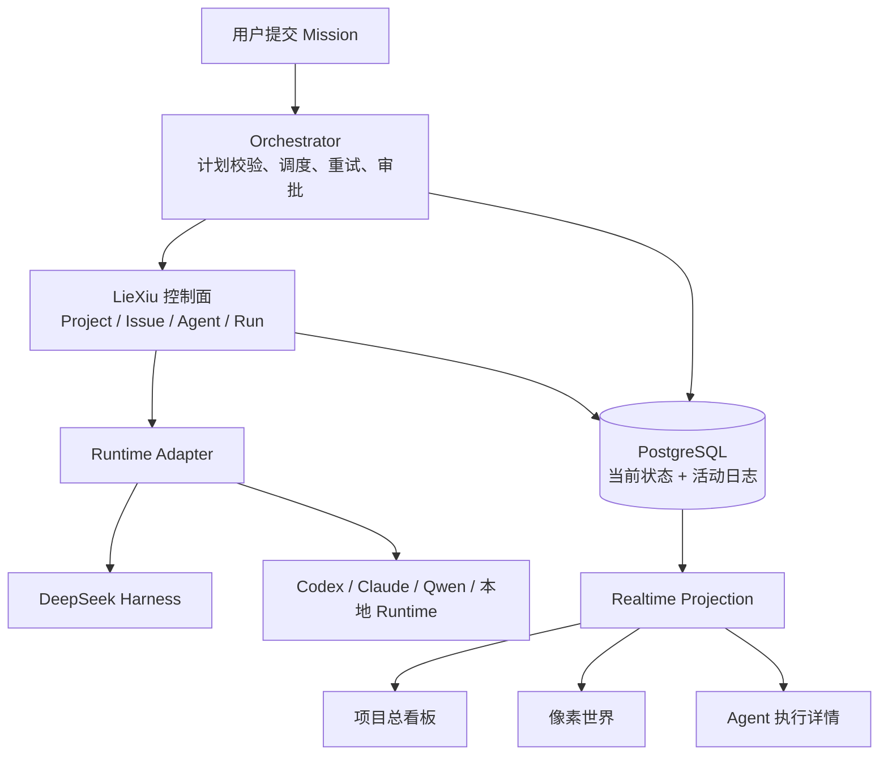

# 可视化多智能体项目管理工具 DIY 结论与架构基线

## 1. 文档定位

本文记录列宿 · LieXiu 自用产品的稳定结论，作为后续产品设计、领域建模和实现取舍的共同基线。
详细技术调研、候选项目与阶段性论证见
[可视化多 AI Agent 项目管理工具个人 DIY 深度技术调研与架构方案](../调研/01-可视化多AIAgent项目管理工具个人DIY深度技术调研与架构方案.md)。

本文描述目标系统应如何成立，不维护调研过程、临时进度和一次性验证结果。实现固定以上游 Multica
`v0.4.26` 为起始基线；后续按阶段主动吸收上游变更，不要求开发分支持续逐提交追随上游。

## 2. 产品目标

目标产品是一个自托管、厂商中立、可深度定制的多 AI Agent 项目操作系统，而不是多 Agent 聊天室。

用户提交一个初始目标后，系统应形成以下闭环：

1. Planner 提出结构化任务图和验收标准。
2. Orchestrator 校验任务图、权限、预算、依赖、并发和运行环境。
3. Scheduler 将就绪任务派发给不同角色和不同厂商的 Agent runtime。
4. Executor 在隔离工作区内执行并提交结构化 Artifact。
5. Reviewer 依据验收标准批准、拒绝或要求返工。
6. Integrator 只集成已批准成果，处理交付级冲突并形成最终结果。
7. 用户可在总看板、像素世界和 Agent 执行详情中观察同一业务事实，并可暂停、干预、审计和回放。

产品的核心价值是可控协作、可替换运行时和可验证交付。游戏化表现是重要交互层，但不拥有业务状态。

## 3. 总体决策

采用以 LieXiu 为主权边界、复用上游 Multica 执行内核的模块化深度 Fork：

- LieXiu 继续拥有 Workspace、Project、Issue、Agent、Squad、AgentTask、Runtime、执行日志、Review、
  Token 统计、权限、WebSocket、daemon 和本地工作区。
- 在 LieXiu Go server 内新增 Orchestration 领域，而不是首版另建控制面 sidecar。
- 在现有共享前端包内新增项目总览、任务图、像素世界和增强执行详情，而不是首版另建独立前端产品。
- DeepSeek Harness 是可插拔 Agent runtime 和 runtime 扩展生态，不是项目管理事实源或总调度器。
- PostgreSQL 关系状态保存当前权威事实，append-only activity 保存审计和回放输入，outbox 保证状态与
  事件发布的一致性。
- WebSocket 负责实时传输；断线恢复必须回查权威状态和持久活动，不依赖客户端收到每个实时事件。



## 4. 事实所有权与最小领域模型

不另建一套与 LieXiu 平行的完整项目管理模型。优先复用现有对象，只补真正缺失的业务语义。

| 目标概念 | 权威映射 | 说明 |
| --- | --- | --- |
| 项目 | LieXiu Project | 聚合任务、代码库、文档和团队 |
| Mission | 根 Issue | 用户提交的长生命周期目标 |
| TaskNode | 子 Issue | 一个可交付、可验收的业务子任务 |
| Assignment | Issue assignee + 编排记录 | 谁在什么角色下承担任务 |
| Run / Attempt | 新增业务 Run + AgentTask 执行载体 | 一次业务尝试与一次物理执行分层、一一桥接 |
| Agent 实例 | LieXiu Agent | 绑定 runtime、model、skills 和身份 |
| Runtime | LieXiu Runtime / profile | 具体执行协议和运行设备 |
| 代码隔离 | Project resource worktree mode | 每个并行任务使用独立 worktree/branch |
| 可读协作记录 | Issue comment / task message | 面向用户的进展与沟通 |
| Artifact | 新增结构化引用 | 代码分支、PR、文档、文件、测试收据等 |
| ReviewVerdict | 新增结构化对象 | Reviewer 的结论、证据和返工要求 |

首批新增领域对象保持最小：

- `PlanVersion`：Planner 提案及其批准版本。
- `TaskDependency`：激活并收紧现有 `issue_dependency`，作为 TaskNode 之间的有向依赖；不平行新建表。
- `RolePolicy`：角色模板、工具权限、交付结构、预算和验收策略。
- `OrchestrationAssignment`：业务角色、任务和具体 Agent 实例的绑定及历史。
- `Artifact`：执行结果的结构化引用和版本。
- `ReviewVerdict`：批准、拒绝、返工及其证据。
- `Activity`：项目级规范化活动。
- `OutboxMessage`：仅在出现跨进程可靠消费者后增加，不进入首个 Walking Skeleton。

`TaskNode`、`Assignment` 和 `Run` 必须保持分离。业务任务没有完成，不等于某次 Run 失败；一次 Run
成功，也不等于成果已经通过 Review。

## 5. 角色与控制边界

Role 是可复用策略模板，Agent 是绑定模型和 runtime 的执行实例。不能用一个字符串同时表达角色、实例、
厂商和运行状态。

每个 RolePolicy 至少声明：

- 目标与责任边界；
- 允许的任务类型；
- 可用工具和读写范围；
- 输入上下文选择策略；
- 期望输出 schema；
- Artifact 类型；
- 验收和升级策略；
- Token、时间、并发、重试和委派预算；
- 是否需要人工审批。

角色职责：

- Planner 生成和修订计划，不直接决定系统调度事实。
- Orchestrator 是确定性控制器，拥有状态转移、校验、调度、恢复和补偿。
- Executor 只对分配的工作项和写入范围负责。
- Reviewer 输出结构化 verdict 和证据，不绕过 Orchestrator 直接修改业务状态。
- Integrator 只接收已批准 Artifact，并是合并、冲突处理和最终交付的唯一 owner。
- Human Gate 保留暂停、批准高风险动作、修改计划和终止 Mission 的能力。

## 6. Planner 与确定性调度

Planner 输出的是候选计划，不是可直接执行的自然语言指令。计划至少包含节点、依赖、角色、交付物和验收
条件。Orchestrator 在接纳计划前必须校验：

- 节点和依赖引用完整，DAG 无环；
- 节点数、委派深度和并发不超过 Mission 上限；
- 每个节点都有交付物和可验证的验收条件；
- 角色拥有所需能力、runtime 和权限；
- 写入范围不存在未经隔离的并发冲突；
- 预算、超时、重试和 Review 轮次有上限；
- Integrator 的前置 Artifact 已批准且版本明确。

任务调度由确定性规则驱动。LLM 可以建议优先级、角色和拆分方式，但不能自行绕开依赖、权限、预算、
人工 Gate 或并发隔离。

## 7. 业务状态、运行状态与恢复

业务状态和 runtime 状态分层：

```text
business_state:
  draft | ready | assigned | running | review | rework | approved |
  integrating | blocked | done | failed | cancelled

runtime_state:
  deferred | queued | dispatched | waiting_local_directory | running |
  completed | failed | cancelled
```

以上是架构阶段的状态分层示意，不作为 MVP 枚举来源；MVP v0.1 的精确状态和转移矩阵以 07 文档为准。

业务状态表达交付进度；runtime 状态表达一次 AgentTask 的执行事实。两者只能通过明确的领域规则关联，
不能把 runtime `completed` 直接解释成 TaskNode `done`。

恢复合同：

- 服务重启后，从关系状态恢复当前 Mission 和等待调度的节点。
- MVP 通过持久 Activity 和 HTTP Projection 恢复；出现跨进程可靠消费者后，再增加至少一次发布的 Outbox。
- WebSocket 丢失不改变业务事实，重连后重新拉取当前投影。
- Retry 创建新的 Run，保留 `retry_of` / `rerun_of` 关系，不覆盖旧运行。
- Review 返工生成新的 Assignment/Run，不回写历史 Artifact。
- 超时、取消、runtime 离线和依赖失败分别进入可解释的恢复路径。

## 8. Agent 通信合同

Agent 之间不共享无限聊天历史，也不通过自由文本暗中修改项目状态。协作消息至少分为：

- `delegation_proposed`
- `question`
- `answer`
- `blocker_raised`
- `artifact_ready`
- `review_requested`
- `review_verdict`
- `integration_result`

每条消息关联 Mission、TaskNode、Run、发送者、接收者、因果活动和可选 Artifact。重要业务结果必须成为
结构化对象；自由文本只承担解释和上下文，不承担完成证明。

MCP 用于 Agent 到工具的能力边界。A2A 仅在未来接入外部独立 Agent 服务时作为北向协议，不作为首版
内部调度协议。

## 9. Runtime 厂商中立合同

厂商中立不意味着所有模型能力完全相同，而是业务层不依赖某家产品的 session、状态枚举或专属事件。

统一 Runtime Adapter 至少提供：

- capability discovery；
- model catalog；
- start / cancel / resume / send_input；
- 规范化 text、tool call、tool result、usage、status 和 terminal result；
- 原始 provider event 的可选留存；
- timeout、resume rejection、runtime offline 和 protocol error 的明确分类。

项目、角色、任务、Artifact、Review 和 UI 投影只读取规范化合同。`provider/model` 是可替换配置，不进入
业务主键或状态机分支。更换某个 Executor 的模型或 runtime 时，不应修改任务图和项目数据模型。

## 10. DeepSeek Harness 的使用边界

DeepSeek Harness 作为现有 LieXiu runtime 先直接使用。只有在基本闭环稳定且现有事件精度不足时，才开发
定制插件。

推荐的 dsh 插件用途：

- 新模型 provider adapter；
- 角色专属工具和 prompt section；
- shell、filesystem、network 权限与审批；
- sandbox 和后台 job；
- structured result / artifact emitter；
- 更细粒度的 runtime telemetry。

不放入 dsh 插件的能力：

- Mission 和 Project 生命周期；
- DAG Scheduler；
- Kanban 和项目级资源调度；
- Reviewer/Integrator 业务状态机；
- 项目级 Activity 和事实存储；
- 像素世界权威状态。

DeepSeek Harness 插件 API 发生变化时，只影响 runtime adapter 和对应插件，不应迫使项目管理领域迁移。

## 11. 三个可视化面

三个界面是同一事实的不同投影，不各自维护项目状态。

### 11.1 项目总看板

总看板回答“整体是否按计划交付”：

- Mission 摘要、计划版本和 Human Gate；
- DAG、依赖、关键路径和阻塞传播；
- Kanban、角色泳道和当前并发；
- Artifact/Review/Integration 状态；
- 成本、耗时、重试和失败分布；
- 暂停、恢复、修改计划、重新分配和取消。

### 11.2 像素世界

像素世界回答“团队现在在做什么、谁在等谁”。业务事件先映射为世界意图，再由本地视觉系统完成寻路和
动画：

```text
task.assigned        -> agent.walk_to(workstation)
run.started          -> agent.work
dependency.waiting   -> agent.wait(dependency_area)
review.requested     -> agent.walk_to(review_room)
review.rejected      -> agent.rework
integration.started  -> agent.walk_to(integration_room)
mission.completed    -> team.gather(delivery_area)
```

首版使用 PixiJS + Tiled、一张地图和每个角色一个有限状态机。不要求完整 ECS、物理引擎、角色编辑器或
LLM 控制坐标。持久化业务事件和目标区域，不持久化每帧位置；回放时确定性重建移动和动画。

### 11.3 Agent 执行详情

执行详情回答“这次运行为什么这样做、产生了什么证据”：

- 触发原因和输入上下文；
- 结构化进展与状态摘要；
- 工具调用、命令、结果和错误；
- 修改文件、diff、分支、PR 和其他 Artifact；
- Token、模型、耗时和重试关系；
- Review verdict、人工审批和因果时间线。

界面不依赖或展示模型私有思维链。可观察性建立在结构化状态、工具证据、决策摘要和交付物上。

## 12. 前后端实现边界

首版保持现有 monorepo 和部署拓扑：

```text
server/internal/service/orchestration/  业务控制器与状态转移
server/internal/handler/                HTTP / WebSocket 边界
server/pkg/                             可复用且不依赖私有业务的稳定协议
packages/core/orchestration/            API 类型、schema、query 和 mutation
packages/views/orchestration/           共享业务页面与三种投影
packages/ui/                             无业务依赖的视觉原语
apps/web/                                Next.js 路由和平台接线
apps/desktop/                            仅作为未来可选薄壳，不进入 MVP v0.1 交付
```

不为目录整齐提前拆微服务。Orchestrator、Activity 和现有 Issue/Task 在同一数据库事务边界内有明显收益。
未来只有在独立扩缩容、独立失败域或外部公共 API 成为真实需求时，才将 runtime event ingestion 或
orchestration 拆成服务。

MVP v0.1 的字段、状态、Command、Projection 和 Walking Skeleton 以
[07-MVP v0.1 领域合同与 Walking Skeleton 设计](./07-MVP%20v0.1领域合同与Walking%20Skeleton设计.md)为准。

## 13. 深度 Fork 与上游同步策略

这是面向自用产品的深度 Fork，不把“始终无冲突跟随上游”作为首要目标。仍应主动控制分叉成本：

- 以上游 Multica `v0.4.26` 建立起始基线，开发阶段固定基线，不在功能切片中途追逐每日更新。
- 上游变化按里程碑批量评估和吸收，不对私有领域做长期双写或兼容层。
- 新领域尽量集中在独立 package/service/view，避免把编排语义散布到所有 handler 和组件。
- 必须修改现有 Issue/Task 状态时，先冻结完整状态转移和恢复合同。
- 新 UI 替代旧入口时直接删除旧入口，不长期维护两套产品语义。
- 保留 Runtime Adapter 边界，使新增厂商和升级 dsh 不影响项目领域。

产品允许最终采用自己的名称、视觉语言和角色形象。品牌替换与美术资源迁移不应改变领域对象、事件协议
和运行时合同。

## 14. 首个黄金场景与完成标准

首个垂直切片只实现一个可证伪的黄金场景：

1. 用户创建一个根 Mission。
2. Planner 生成三个受约束的 TaskNode 和依赖关系。
3. 两个 Executor 使用不同 provider，在 worktree 中并行执行。
4. Reviewer 批准一个 Artifact，打回另一个。
5. 被打回任务生成新 Run，旧 Run 和旧 Artifact 保持可查。
6. Reviewer 批准返工成果。
7. Integrator 只集成两个已批准 Artifact 并形成最终交付。
8. 总看板、像素世界和 Agent 详情对同一状态给出一致解释。
9. 中途重启 server 或断开 WebSocket 后，系统能恢复当前任务和时间线。
10. 将一个 Executor 切换到另一 runtime，不修改 Mission、DAG、Artifact 和 Review 数据模型。

这个场景通过后，再扩展动态再规划、更多角色、跨项目协作、A2A、长期记忆、复杂地图和多人使用。

## 15. 首版明确不做

- 不做无限层级的 Agent 自主派生。
- 不让 LLM 直接修改业务状态或控制像素坐标。
- 不共享所有 Agent 的完整聊天历史。
- 不把 TaskNode、Assignment、Run、Artifact 和 Review 合并成一个对象。
- 不建立 Kafka、NATS、Redis Streams 或每 Agent 一个服务的拓扑。
- 不做全量事件溯源和所有状态重建。
- 不做完整 A2A server/client 体系。
- 不做复杂 ECS、物理系统、开放世界、角色编辑器和多人同步。
- 不做模型微调；优先改进角色合同、上下文选择、工具和验收。
- 不用兼容上游 Multica 的所有产品能力作为首个垂直切片的完成条件。

## 16. 阶段路线

1. 基线：跑通 LieXiu、两个不同 CLI runtime、dsh、worktree、Review 和执行日志。
2. 编排：根 Issue、Planner 结构化计划、DAG 校验、子 Issue 和确定性派发。
3. 角色：RolePolicy、权限、预算、结构化通信、Review/Rework/Integration。
4. 观测：Activity/Projection、项目时间线、Agent 详情、断线和重启恢复；外部可靠消费出现后再加 Outbox。
5. 总览：DAG、Kanban、角色泳道、阻塞和成本。
6. 世界：PixiJS/Tiled 地图、角色状态机、事件映射和回放。
7. 硬化：幂等、失败矩阵、安全审批、provider 切换和长期运行。

6～8 周适合形成可完整演示的垂直原型；稳定、顺手、可长期自用的版本应按持续演进产品对待。

## 17. 决策原则

后续设计冲突按以下优先级裁决：

1. 业务事实可解释、可恢复、可审计。
2. Runtime 和模型可替换。
3. 权限、写入范围和人工 Gate 不可绕过。
4. 三个可视化面保持一致。
5. 先完成真实垂直闭环，再增加角色数量和视觉复杂度。
6. 新抽象必须减少真实变化成本；没有第二个实现或变化证据时不制造框架。
