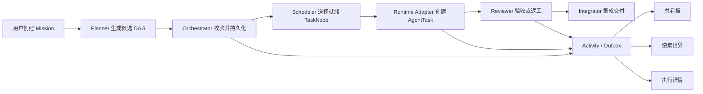

# 上游 Multica v0.4.26 功能边界与 LieXiu 减法设计

## 1. 文档定位

本文记录以上游 Multica `v0.4.26` 为基线，面向个人自用的 LieXiu 可视化多 AI Agent 项目管理工具所采用的
产品减法和代码收缩边界。它回答四个问题：哪些能力直接保留，哪些能力改造成目标领域，哪些能力删除，
以及按什么顺序删除才能持续得到可运行、可验证的系统。

目标产品、核心领域模型和总体架构见
[可视化多智能体项目管理工具 DIY 结论与架构基线](02-可视化多智能体项目管理工具 DIY结论与架构基线.md)。
本文不记录一次性扫描结果、实施进度或某次测试收据；后续若改变产品边界，应直接更新本文的当前结论。

## 2. 基线与约束

- 研发基线固定为上游 Multica `v0.4.26`，不滚动追随上游主线。
- 这是面向个人自用产品的深度 Fork，不以完整保留上游功能和持续无冲突同步为目标。
- 第一产品界面是 Web；Go server 与 daemon 继续承担控制面和执行面职责。
- 首版按单所有者、单内部 Workspace、本地或自托管运行设计，但仍保留必要的会话、CSRF、daemon token
  和 API token 安全边界。
- 删除功能时同时删除入口、路由、后台任务、事件、配置、数据访问、测试和依赖，不能只隐藏菜单。
- 先建立黄金场景保护，再进行代码和数据库收缩；不在没有回归边界时大面积删除。

当前 tag 处于 detached HEAD 是 Git tag 的正常状态。正式研发应从该 tag 新建长期开发分支；本文不规定
分支名称，也不替代实际的分支操作。

## 3. 减法的判断原则

每个既有能力按以下顺序判断：

1. 它是否直接服务“目标拆解—调度执行—审查返工—集成交付—全程可视化”的主链？
2. 它是否拥有无法由更小机制替代的执行可靠性或安全价值？
3. 它是否会形成第二套任务事实、第二个调度器或第二种用户心智？
4. 个人自用场景是否真实需要它的多租户、商业化、增长或外部协作复杂度？
5. 删除后，未来是否可以通过清晰的 Adapter 或 Trigger 边界重新接入？

直接支撑主链或执行可靠性的能力保留；语义接近但所有权错误的能力改造；商业 SaaS、通用协作、增长分发
和重复控制面的能力删除。未来可能有用，不构成当前保留理由。

## 4. 总体取舍

### 4.1 直接保留的执行内核

以下能力是目标产品的有效地基，应先稳定其公共合同，而不是重写：

- Web 应用、Go server、daemon 和 PostgreSQL 的基本部署结构。
- Project，以及可映射为根 Mission 和 TaskNode 的父子 Issue。
- Agent、Runtime、Provider Adapter、custom runtime profile 和 dsh runtime。
- AgentTask 的创建、领取、租约、日志、取消、重试、恢复和异常清理能力。
- 本地代码仓库、隔离 worktree、命令执行和交付产物收集。
- WebSocket 实时更新，以及断线后通过数据库权威状态恢复的机制。
- 评论、附件和运行会话中可转化为任务消息与交付证据的最小部分。
- Skills 的本地配置和复用能力。
- 原始 token、调用量、耗时和成本数据；它们用于预算与审计，不保留商业计费语义。
- 现有 `issue_dependency` 的数据基础；将其规范化并激活为任务 DAG，不另建重复依赖表。

保留不等于维持原样。公共合同应围绕 Mission、TaskNode、AgentTask、Artifact、Review 和 Activity 收窄，
原有对象只承担一个明确领域角色。

### 4.2 改造而非删除的能力

| 上游 Multica v0.4.26 能力 | LieXiu 目标形态 | 改造原则 |
| --- | --- | --- |
| Project + 父子 Issue | Project + Mission + TaskNode | 根 Issue 表达 Mission，子 Issue 表达任务节点，补充验收、依赖、角色和产物语义 |
| `issue_dependency` | Task DAG | 统一方向和约束，增加环检测、就绪计算和状态转移保护 |
| AgentTask | 一次 Agent Run | 只表达执行实例，不承担项目任务本身的长期状态 |
| Squad | AgentTeam + RolePolicy | 保留成员组合，删除其独立自治派发与第二套编排语义 |
| Inbox | Human Gate | 只显示待批准计划、阻塞、预算越界、失败升级和最终验收 |
| Comment/Chat 消息 | TaskMessage/RunMessage | 消息必须挂到 Mission、TaskNode 或 Run，不保留独立聊天产品 |
| Usage | Budget + 审计数据 | 保留原始用量，删除账单、套餐、额度售卖和复杂商业聚合 |
| Status/Label/Priority | 有限任务字段 | 固化主链状态，标签只作轻量检索，不成为可编程工作流 |
| WebSocket 事件 | Activity 实时投影 | 先持久化权威事实与 activity，再向三个视图推送同一事件 |
| Autopilot 的触发价值 | 后续 MissionTrigger | 若以后需要定时或 webhook，只允许创建 Mission，不拥有调度逻辑 |

### 4.3 硬删除的产品域

以下能力与个人多 Agent 项目操作系统无直接关系，应从产品和代码中删除：

- `../../apps/mobile` 及移动端专属导航、状态和发布链。
- `../../apps/docs` 文档站。项目设计文档统一维护在仓库根 `docs`，不运行独立内容产品。
- 公共落地页、About、Use Cases、Download、Contact Sales、Changelog 等营销站点。
- Billing、Subscription、Stripe、Cloud Credits、商业配额和 SaaS 套餐管理。
- 邀请、成员席位、离开 Workspace、公开注册、邮箱验证、Google OAuth 等团队增长流程。
- PostHog、产品反馈和客户端使用分析。运行审计与 Agent 用量不在此删除范围内。
- Slack、Lark、DingTalk、WeCom、通用 Channel 引擎及其媒体代理。
- Composio 集成。外部工具以后由明确的 Runtime Tool/MCP Adapter 接入。
- Helm/Kubernetes 发行物。首版保留本地开发和 Docker Compose，自用部署成熟后再决定。
- 多语言产品体系，首版只保留简体中文文案与必要的开发者英文标识。

这些领域应优先删除，因为它们位于主链叶子，能尽早缩小依赖、配置、安全面和回归范围。

### 4.4 删除或延后的通用协作产品

- 删除全局 Chat、Floating Chat、Mika 和通用 AI Agent Builder。用户入口是 Mission，不是开放式聊天室。
- 删除当前 Autopilot 的调度、投递、webhook、协作者和后台状态机，避免它与 Orchestrator 并存。
- 删除 Squad leader 自治分发、`squad-evaluated` 等重复决策链；Team 只描述角色和候选 Agent。
- 将 Inbox 从团队通知中心收缩为 Human Gate；删除订阅、关注、提及噪声和社交式通知。
- 删除 reaction、subscriber、pin、saved view、任意 custom property/metadata 等通用协作扩展。
- 删除复杂的通用表格分组、facet、自定义视图和批量编辑；项目总看板由固定业务投影提供。
- 删除可自由编排的状态目录，使用有限、可验证的任务状态机。
- 将富文本编辑器收缩为 Markdown 源文和安全渲染，附件作为显式 Artifact 或证据。
- 延后远程 GitHub webhook、checks 和 PR 自动化；首版保留本地 Git/worktree，未来通过 VCS Adapter 恢复。

任务详情中的通信、执行日志、审查意见和交付证据必须保留。这些是项目事实，不属于被删除的“聊天产品”。

### 4.5 插件、Skills 与 MCP 的边界

`v0.4.26` 已包含插件目录、安装、升级、启停、回滚等分发体系，也包含 Composio 相关的 MCP 应用集成；
但它不应被视为已经具备后续主线中的直接 Workspace/Agent 远程 MCP 管理能力。因此本基线采用以下决策：

- 删除插件市场、目录同步、签名、安装、升级、回滚和第三方分发产品。
- 保留本地 Skills，作为角色能力包、提示和标准操作流程的轻量复用机制。
- 删除 Composio，不让工具供应商成为控制面依赖。
- 首版优先使用各 Runtime 原生的工具/MCP 配置。
- 确需控制面统一管理时，再实现一个很小的 MCP Server 配置模型，并将引用归属 Agent 或 RolePolicy。
- MCP 只提供工具发现和调用，不拥有任务拆解、派发、审查、项目状态或事件历史。

因此，不推荐基于 deepseek-harness 的“插件生态”来实现整个产品。dsh 应是一个一等 Runtime Adapter；其
原生工具、MCP、上下文和执行能力可以被使用，但项目编排与三种可视化由 LieXiu 控制面拥有。

### 4.6 Web、Desktop 与展示面的选择

首个可用版本只把 Web 作为产品界面：

- 总看板、任务 DAG、像素世界和 Agent 执行详情都在同一个 Web 应用内实现。
- `../../packages/views` 保留真正跨展示面的业务组件，但先删除不再存在的产品域组件。
- `../../packages/ui` 保留无业务语义的视觉原语，像素世界使用独立渲染层读取 Activity/Projection。
- Desktop 不作为首阶段交付面；待 Web 黄金场景稳定后再决定保留薄壳还是删除。
- Mobile 直接删除，不维护三端对等能力。

这可避免同一领域改造同时在 Web、Electron 和移动端重复实施，也能让游戏化视图先验证信息价值。

## 5. 单用户模式的边界

个人自用不等于取消安全，也不等于立刻从所有表删除 `workspace_id`。首阶段采用兼容性较好的收缩方式：

- 系统首次启动创建唯一 owner 和内部 Workspace。
- UI 不显示邀请、成员、席位和 Workspace 切换。
- 浏览器保留安全会话与 CSRF；daemon 使用专用 token；CLI/API 使用可撤销 token。
- 服务端仍以内部 Workspace 作为数据隔离和查询边界，避免一次性重写全部 schema。
- 当核心领域稳定且确认永远不支持多用户后，再评估物理删除 membership 与 tenant 字段。

不采用仅隐藏团队菜单的“个人模式”。被判定删除的能力最终必须从可执行代码和数据模型中退出。

## 6. 数据库与迁移减法

`v0.4.26` 已积累大量迁移和通用产品表。数据库收缩分两步进行：

1. 功能删除阶段先以向前迁移停用和清除引用，保持每个删除波次可运行、可回退代码。
2. 产品边界稳定后，如果没有必须保留的生产数据，将现存 schema 压缩为新的个人版 v1 基线；如果已有
   数据，则编写显式迁移，不用重建数据库代替升级路径。

进一步约束如下：

- 任务 DAG 复用并规范化 `issue_dependency`，补唯一性、方向、环检测与删除规则。
- 当前状态保存在关系表；Activity 使用 append-only 记录审计和视图回放输入；outbox 保证发布一致性。
- 用量首版保留逐 Run 明细，最多增加一个按日聚合，不保留多套商业 rollup。
- 首版使用普通 PostgreSQL。只有长期记忆或语义搜索形成明确查询合同后才引入 pgvector。
- 删除领域的表、枚举和索引必须在其读写路径清零后再移除，不跨波次混删。

## 7. 控制面的唯一性

目标系统只能有一个任务派发权威：Orchestrator。

只有 Orchestrator 和显式人工操作可以创建 AgentTask。Autopilot、Squad leader、聊天入口、channel webhook
和 Runtime 都不得绕过它直接改变项目任务状态。若未来新增定时器或外部 webhook，它们只能创建 Mission
或提交命令，由 Orchestrator 决定后续动作。

## 8. 代码结构的收缩方向

删除功能后再做内部拆分，避免为即将消失的代码设计抽象。重点处理下列集中点：

- daemon 按连接与 runtime inventory、claim/lease、workspace/worktree、agent execution、recovery/GC
  分离内部边界，但保持一个进程，暂不拆微服务。
- Issue handler/service 先移除协作型字段和分支，再将 Mission、TaskNode、Dependency、Review API 分域。
- 前端 API client 在产品域删除后按 orchestration、runtime、activity、settings 等真实消费者拆分。
- 巨型 issue detail 和 table view 不做原地继续堆叠；由固定的 Mission 概览、DAG、Run、Artifact、Review
  组件替代。
- 新增 Orchestration 领域只依赖窄接口访问 Issue、AgentTask、Runtime 和 Activity，防止循环所有权。
- 三个视图共享 Projection/ViewModel，不允许像素世界另建一套状态机。

每次拆分都应有最小公共测试接口。内部结构清晰是删除后的结果，不是先造一层通用框架的理由。

## 9. 分波实施顺序

早期方案把叶子产品删除放在统一编排之前。执行主链分析完成后，实施顺序已经收敛为“先建立最小替代控制面，
再迁移旁路，最后按依赖闭包删除”。这样可以避免删除旧入口时没有 Mission/Run/Review 承接业务能力。

当前状态、完成比例和证据入口统一维护在
[08-Wave 实施路线与进度总览](./08-Wave%20实施路线与进度总览.md)，本文只维护稳定的产品边界和波次顺序。

### Wave 0：冻结基线、保护面和 MVP 合同

- 从 `v0.4.26` 创建开发分支并固定本地研发入口。
- 固定启动、owner、Project/Issue、AgentTask、日志、取消/恢复、worktree 和 fake runtime 行为。
- 梳理 AgentTask 生产者、状态写入口、后台恢复和待删域依赖。
- 冻结 Mission、TaskNode、Assignment、Run、Artifact、Review、Activity 和 Projection 合同。

### Wave 1A：建立最小编排 Walking Skeleton

- 激活 TaskNode DAG 的确定性校验和就绪计算。
- 建立 Orchestrator Command、业务状态机、Activity 和幂等边界。
- 用 `orchestration_run_id` 接入现有 AgentTask、daemon 和 Runtime Adapter，不重写执行内核。
- 用 fake runtime 跑通 A、B 并行、Review 返工、C 集成和恢复场景。
- 暴露一个最小 Projection/API/占位页面，证明三种展示面可共享同一事实。

### Wave 1B：迁移自动派发旁路

- 先迁移 Issue assignee、Quick Create 和 retry policy 的直接 AgentTask 创建。
- 再以 Role + Assignment 替代 Squad leader 分派，以 Human Gate 替代 Inbox 决策入口。
- 停止 Autopilot、Channel 等后台生产者产生新的 AgentTask。
- 持续收缩 AgentTask 创建白名单，直到 Orchestrator 成为唯一自动派发入口。

### Wave 1C：按依赖闭包执行产品减法

先删除低耦合叶子域：

- Mobile、独立文档站和公共营销页面；
- PostHog/Feedback、Helm/Kubernetes 发行物；
- Channel 集成、Composio、Billing/Subscription/Stripe；
- 插件分发体系，保留本地 Skills、MCP 和 Runtime Adapter。

再收缩深耦合产品域：

- 建立本地 owner bootstrap 与唯一内部 Workspace；
- 删除邀请、席位、公开注册和 Workspace 切换产品；
- 删除全局 Chat、Floating Chat、Mika、通用 Agent Builder 和相关 onboarding；
- 在生产者迁移和替代能力完成后删除 Autopilot、Squad 和旧 Inbox 产品语义。

每个删除单元都必须覆盖页面、API、service、后台任务、数据库、配置、依赖、测试和文档，不能只隐藏菜单。

### Wave 2：收缩任务产品并建立三种正式视图

- 删除通用 Issue 协作字段、任意属性、复杂 saved views 和富文本负担。
- 建立固定的项目总看板、任务 DAG、像素世界和 Agent 执行详情。
- 三种视图只消费同一 Projection，验证刷新、断线恢复和历史回放一致性。
- 保留可暂停、取消、重试、人工批准、预算干预和最终验收入口。

### Wave 3：清理内部实现、数据库和产品身份

- 删除已无引用的 handler、service、query、event、background job、配置、测试、依赖和表。
- 重新生成数据访问代码，并按收缩后的领域拆分超大文件。
- 若满足数据条件，压缩迁移为个人版 v1 schema。
- 运行完整黄金场景和目标领域回归，再进行品牌、名称和正式像素美术替换。

不得在 Wave 1A 完成前大规模删除深耦合任务域，也不得在 Wave 1B 完成后继续保留新的自动派发旁路。

## 10. 每个删除波次的完成标准

一个功能只有同时满足以下条件才算删除完成：

- 用户导航、页面、API 路由和公开类型中没有该功能入口。
- server/daemon 没有该功能的后台任务、事件订阅、定时器或隐式副作用。
- 环境变量、secret、权限、镜像、CI 和部署清单中没有相关配置。
- 数据库不再有活跃读写；待迁移表有明确删除计划。
- 前后端依赖和生成代码已更新，不以 dead code 或 feature flag 长期保留。
- 受影响的黄金场景和 Runtime Adapter 合同继续通过。
- 文档不再把被删能力描述为当前产品能力。

对于被“改造”的能力，还必须证明旧入口无法形成第二事实源或绕过 Orchestrator。

## 11. 必须长期保护的最小测试合同

- Mission 可生成结构化 Task DAG；非法依赖、循环依赖和缺失验收标准会被拒绝。
- 仅依赖已满足且 admission 通过的 TaskNode 可被派发。
- AgentTask 可取消、超时、重试，并在 server/daemon 重启后恢复为确定状态。
- Provider 或 dsh runtime 可互换，项目领域不读取供应商私有响应来决定状态。
- Reviewer 拒绝会生成有界返工，不能无限自循环；Integrator 只接受已批准 Artifact。
- 同一 Activity 在总看板、像素世界和执行详情中映射为一致状态。
- WebSocket 丢失或页面刷新后可从权威状态恢复，不产生幽灵角色或重复任务。
- 预算、权限和人工 Gate 能阻止新的运行，并留下可审计原因。
- 单 owner 登录、daemon token 和 API token 仍满足基本安全边界。

## 12. 明确延后的能力

以下内容不是首版目标，不能以“以后可能需要”为由保留当前复杂实现：

- 多用户、多租户、组织权限和外部客户协作。
- A2A 等 Agent 间通用协议；首版通过控制面 TaskMessage 和 Artifact 通信。
- 完整事件溯源。Activity 用于审计和投影，关系状态仍是当前事实。
- 复杂 ECS、物理模拟或开放世界。像素世界首先是业务状态投影。
- Desktop 打包与自动更新、Mobile 客户端。
- 远程 VCS/PR、GitHub checks 和外部 CI 编排。
- 定时任务、外部 webhook 和主动推送；未来以薄 `MissionTrigger` 接入。
- 长期记忆、向量数据库和自动知识图谱。
- 插件市场、插件商业生态和兼容任意第三方插件格式。
- Kubernetes、多节点调度和云端商业化运维。

## 13. 两种改造路线的比较与选择

| 路线 | 优点 | 代价 | 结论 |
| --- | --- | --- | --- |
| A：个人模式，仅隐藏通用功能 | 初期改动小，短期更容易跟随上游 | 代码、依赖、数据和安全面仍存在；多套心智继续演化 | 只可作为很短的过渡保护，不作为目标架构 |
| B：分波收缩为新产品 | 最终领域清晰，维护和测试面显著缩小，品牌与体验一致 | 初期需要严格清点、迁移和回归保护 | 采用此路线 |

选择 B 不意味着立即大爆炸式删除。正确方式是以黄金场景为护栏，从叶子域向控制面逐波收缩，每一波都
保持可启动、可执行、可恢复，并在产品边界稳定后再压缩数据库与内部结构。

## 14. 最终保留下来的产品形态

完成减法后，用户看到的不是“精简版通用协作 SaaS”，而是一个目标明确的个人 Agent 项目操作系统：

1. 用户只需创建 Mission、选择约束与预算。
2. Planner 产生候选任务图，Orchestrator 是唯一校验和派发权威。
3. 多厂商 Agent 通过 Runtime Adapter 执行，dsh 是其中一个一等实现。
4. Reviewer 与 Integrator 形成可验证的返工和交付闭环。
5. 总看板、像素世界和执行详情展示同一组 Mission、TaskNode、Run、Artifact、Review 和 Activity 事实。
6. 用户只在 Human Gate、异常、预算和最终验收处被打扰。
7. 系统可以换品牌、换角色美术、换模型厂商，而不会改变核心领域和执行协议。

这个边界既最大程度复用了上游 Multica `v0.4.26` 已有的执行可靠性，又主动舍弃了与个人多 Agent 项目管理
无关的 SaaS、协作、增长和分发负担，是后续深度 DIY 的正式减法基线。
