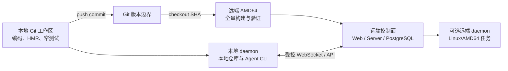

# 本地开发与远端验证运行环境设计

## 1. 文档定位

本文记录 LieXiu 个人 DIY 项目的开发、构建、验证和长期运行环境决策，承接
[04-下一阶段优先级与 Wave 0 实施设计](04-下一阶段优先级与Wave%200实施设计.md)。

本文回答以下问题：

- 日常编码和调试应在本地还是远端进行；
- 本地 Mac 与远端 `10.10.10.69` 分别承担什么职责；
- 源码、配置、数据库、Agent 凭据和构建结果如何隔离；
- ARM64 本地开发与 AMD64 远端验证如何形成互补；
- 系统成熟后，控制面和 daemon 应如何分布。

本文维护稳定的环境职责、准入条件和工作流，不记录临时命令输出、一次测试结果或短期故障。机器资源和
工具版本发生变化时，应按本文的准入条件重新校准，而不是改变环境职责边界。

## 2. 总体决策

采用“本地开发为主、远端验证与长期运行为辅”的混合模式：

- 本地 Mac 是主要源码工作区、快速开发环境、浏览器调试环境和本地 Agent daemon 节点。
- 远端 `10.10.10.69` 是 AMD64 干净构建、全量验证、长时间运行和未来自托管控制面的候选节点。
- 日常代码修改不通过 SCP 或 rsync 覆盖远端工作目录；远端只构建明确 Git commit。
- 默认自动化测试使用 fake runtime；真实 Codex、dsh 或其他厂商 runtime 只在显式 smoke 中运行。
- Wave 0 先在本地跑通上游 Multica `v0.4.26`，再建设远端验证节点，不让远端环境准备阻塞核心代码理解。
- 系统稳定后，控制面可以长期运行在远端，而访问本地代码的任务由本地 daemon 执行。



## 3. 决策依据

### 3.1 本地开发反馈链更短

LieXiu 的日常改造同时涉及 Next.js、Go server、PostgreSQL、WebSocket、daemon、Agent runtime 和 Git
worktree。本地开发可以直接完成以下闭环：

- 修改源码后立即获得 Web HMR 和 Go 测试反馈；
- 直接使用本地浏览器调试项目总看板、执行详情和像素世界；
- daemon 可以访问当前 Git 仓库、未提交改动、worktree 和本地文件系统；
- 可以复用本机已经安装并登录的 Agent CLI；
- 不需要同步 `.env`、数据库、`node_modules`、生成文件和 Agent 凭据；
- UI、PixiJS、动画、输入和窗口交互的视觉验证更自然。

如果把每次修改先传到远端再编译运行，开发反馈链会增加同步、SSH、端口访问、远程日志和凭据配置等环节。
这些环节不会提高领域正确性，只会延长日常循环。

### 3.2 daemon 应尽量靠近被操作的代码

LieXiu daemon 承担 runtime 调用、命令执行、worktree 和本地项目访问。Agent 需要修改本地仓库时，daemon
运行在本机最自然：

- 文件权限和 Git 身份保持一致；
- 不需要把私人代码和未提交现场复制到远端；
- Codex、dsh 等 CLI 的认证状态不必重复迁移；
- worktree 的创建、取消后现场保留和人工检查都在同一文件系统；
- 本地工具、SDK 和项目依赖可以被 Agent 直接使用。

将控制面放到远端不要求所有 daemon 也放到远端。控制面与执行面通过稳定协议连接，允许本地和远端同时
注册不同能力的 daemon。

### 3.3 远端提供 AMD64 和更宽裕的持续资源

本地 Mac 是 ARM64，远端是 Linux AMD64。两种架构都验证能够降低以下风险：

- 本地 ARM64 正常但 Linux AMD64 构建失败；
- 平台相关的二进制依赖、shell 行为或容器镜像不兼容；
- Docker 构建在本地资源限制下失败，但并非代码错误；
- 本地交互测试通过，但长时间运行、并发和重启恢复存在问题。

远端具备更多可供 Docker 使用的内存和 CPU，适合完整 Compose 构建、Playwright、Go race test、多进程集成
以及长时间 soak test。它更接近未来自托管 Linux 环境，也更接近仓库 CI 的 AMD64 运行形态。

### 3.4 单一远端开发环境会制造隐性状态

直接把远端目录作为唯一开发现场，容易积累以下不可追踪状态：

- 编辑器或 SCP 留下的未提交文件；
- 远端与本地不同的 `.env`、依赖缓存和生成产物；
- 无法关联到 commit 的构建结果；
- 以 root 创建的文件和容器卷；
- 远端 Agent CLI 登录态、SSH key 和第三方 token；
- 长期数据库数据对测试结果的影响。

因此远端必须被视为“从 commit 重建的验证或运行环境”，而不是一个靠人工同步维持的第二主工作区。

## 4. 环境职责矩阵

| 场景 | 首选环境 | 原因 |
| --- | --- | --- |
| 日常编码、重构、窄测试 | 本地 | 反馈最快，源码和编辑器同机 |
| Next.js HMR、浏览器和像素世界调试 | 本地 | 视觉与交互调试链最短 |
| Go/TypeScript 单元测试 | 本地 | 高频、确定性、无需远端排队 |
| fake runtime 黄金场景 | 本地 | 无账号依赖，问题容易归因 |
| 使用本机已登录的 Codex/dsh | 本地 daemon | 直接访问本地凭据和仓库 |
| 完整 `make check` | 本地可运行，远端作为合并前权威补充 | 同时覆盖 ARM64 和 AMD64 |
| Linux/AMD64 构建兼容性 | 远端 | 与未来自托管环境更接近 |
| Docker self-host 镜像构建 | 优先远端 | Docker 可用资源更充足 |
| Playwright 和多进程集成 | 远端 | 环境稳定，不阻塞本机交互 |
| server/daemon 重启恢复 | 远端 | 便于独立控制进程和观察持久状态 |
| 多 runtime 并发与长时间 soak | 远端 | 可持续占用资源，不影响本机 |
| 7×24 小时个人控制面 | 远端 | 稳定在线，浏览器可随时访问 |
| 只能在 macOS 运行的工具任务 | 本地 daemon | 远端 Linux 无法替代 |
| 只能在 Linux/AMD64 运行的工具任务 | 远端 daemon | 利用远端平台能力 |

## 5. 本地主开发环境合同

### 5.1 工具链

本地开发工具链与仓库 CI 主版本对齐：

- Node.js 固定为 22，而不是长期使用比 CI 更新多个大版本的 Node。
- pnpm 固定为仓库声明的 `10.28.x`。
- Go 使用 `1.26.x`。
- Docker 与 Compose 使用受支持的稳定版本。
- Git、浏览器和本地 Agent CLI 由开发者环境维护。

锁定工具链可以通过版本管理器或仓库脚本实现，但不把本机绝对路径写入项目配置。

### 5.2 Docker 资源

本机 Docker 主要承载 PostgreSQL、Compose 服务和必要的镜像构建。对于完整本地构建，建议给 Docker 分配
至少 12GB 内存；若不希望扩大本机 Docker 资源，则将完整镜像构建和重型集成测试移到远端。

本地日常开发不要求所有服务容器化。应继续使用仓库已有 `make dev` 路径，让 Go server 和 Web 保持快速
反馈，只把适合的基础设施放入 Docker。

### 5.3 数据与端口隔离

- 主 checkout 使用自己的本地数据库和端口。
- 每个 Git worktree 使用 `.env.worktree`、独立数据库名和独立应用端口。
- 不把 `.env` 复制进 worktree。
- 不让测试数据库连接远端长期数据。
- 不用 destructive reset 处理目标不明的数据库。
- 本地数据库是开发数据，不作为唯一长期业务数据来源。

### 5.4 本地完成条件

- `make dev` 可以重复启动 Web、server 和数据库。
- daemon 可以连接控制面并访问本地仓库。
- fake runtime 测试不依赖真实 Agent CLI。
- 窄 Go、TypeScript 和视图测试可以快速运行。
- 页面刷新和 WebSocket 重连可从权威状态恢复。
- 本地变更在推送远端前已经形成明确 commit 边界。

## 6. 远端验证节点合同

### 6.1 节点定位

`10.10.10.69` 首先是 AMD64 验证节点，其次才是长期运行节点。在工具链、用户、目录、网络和 secrets 边界
建立前，不直接把它当成正式控制面。

### 6.2 工具链准入

远端进入可用状态前，应安装并固定：

- Node.js 22；
- pnpm `10.28.x`；
- Go `1.26.x`；
- Git；
- Docker Engine 与 Compose plugin；
- Playwright 所需的 Linux 依赖，仅在适用测试需要时安装。

版本安装应可重复，不依赖交互式 shell 的偶然环境。工具链版本必须在验证输出中可见。

### 6.3 用户和目录

- 不以 root 作为长期应用用户或构建用户。
- 建立专用普通用户、源码目录、缓存目录和持久数据目录。
- 应用用户只拥有这些目标目录和必要 Docker 权限。
- 构建目录可以重建，PostgreSQL 数据、Artifact 和 secrets 使用独立持久目录。
- 远端 checkout 不保存人工编辑的未提交源码。
- 每个验证任务使用明确 commit，必要时使用独立 worktree 或干净 checkout。

### 6.4 网络与访问

- PostgreSQL 默认不向办公网或公网开放，只允许本机容器网络或 loopback 访问。
- Web/server 端口只开放给需要访问的可信网络，优先通过反向代理或 SSH tunnel。
- metrics、debug、pprof 和内部 daemon 接口不直接暴露。
- 防火墙按最小端口集配置，不以“内网环境”代替访问控制。
- WebSocket 反向代理需要明确超时、upgrade header 和连接保持策略。

### 6.5 secrets

- `.env` 不通过 Git、SCP 工作区同步或聊天内容分发。
- JWT、daemon token、Agent provider key 和 VCS secret 分开管理。
- 远端 daemon 只获得它执行任务所需的凭据。
- 本地 CLI 登录态不复制到远端；确需远端 Agent 时单独授权。
- 日志、测试收据和 Activity 不输出 token、cookie 或密钥。

### 6.6 远端完成条件

- 普通用户可以从明确 commit 完成依赖安装和构建。
- AMD64 全量验证不依赖 root shell 的隐式 PATH。
- 每次构建结果可以关联到 commit SHA、工具链版本和目标架构。
- 数据库、缓存和 checkout 的生命周期互相独立。
- 未授权端口不监听，secrets 不进入源码目录和日志。
- 验证失败可以通过删除目标 checkout 或测试数据库恢复，不影响长期数据。

## 7. Git 与源码同步策略

### 7.1 单一版本事实

Git commit 是本地与远端之间唯一源码事实。远端验证必须记录 commit SHA，不能只记录分支名称，因为分支
可以移动。

推荐流程：

1. 本地完成一个有界修改和窄测试。
2. 本地形成原子 commit。
3. 将 commit 推送到远端可访问的 Git remote。
4. 远端获取该 commit，并在干净 checkout 或专用 worktree 中构建。
5. 验证结果关联 commit SHA，不修改远端源码来“临时修一下”。
6. 问题修复回到本地主工作区完成，再产生新 commit。

### 7.2 Git remote 选择

可以使用现有 Git 托管，也可以在自有远端建立只通过 SSH 访问的 bare repository。无论采用哪种方式，都应
满足：

- 远端构建用户只有必要读写权限；
- 不把 `.env`、数据库、`node_modules` 和构建产物纳入 Git；
- 不用共享 root 目录作为 Git remote；
- 不允许远端验证脚本将生成物反向覆盖本地工作区。

### 7.3 禁止的同步方式

- 不使用 SCP 覆盖整个远端 checkout。
- 不使用 rsync 同步带有 `.git`、`.env`、`node_modules` 或 worktree 的活动目录。
- 不在本地和远端之间双向同步数据库卷。
- 不把本机 Agent 认证目录整体复制到远端。
- 不以压缩包文件名代替 commit 和版本标识。

## 8. 构建与验证分层

### 8.1 本地快速反馈层

每次修改运行与影响范围匹配的最窄检查：

- Go 领域和 handler 使用目标 package 测试；
- `packages/core`、`packages/views` 或 `apps/web` 使用对应 typecheck/test；
- 数据库修改运行 sqlc、迁移和目标事务测试；
- UI 修改在本地真实浏览器验证入口和状态恢复；
- runtime 修改先用 fake executable 验证协议和失败分类。

本地快速层的目标是尽快发现确定性问题，不要求每次修改都执行完整仓库验证。

### 8.2 本地完整检查层

功能切片冻结后，本地可以运行仓库 `make check`。本地完整检查证明 ARM64 开发环境没有明显回归，但不
替代远端 AMD64 验证。

### 8.3 远端 AMD64 验证层

准备合并一个高风险或跨层切片时，在远端从明确 commit 执行：

- 依赖锁定安装；
- Go/TypeScript 构建和测试；
- migration 和 sqlc 一致性检查；
- Playwright 关键 E2E；
- Docker self-host 镜像构建；
- 适用的 server/daemon 重启恢复测试。

远端验证失败后不在远端直接编辑修复。失败证据返回本地，修复形成新 commit 后重跑。

### 8.4 长时间验证层

以下验证只在关键里程碑运行，不进入每次提交：

- 多 daemon 或多 runtime 并发；
- 断网、runtime 离线、server/daemon 重启；
- WebSocket 长连接与重连；
- 队列租约、重试和重复领取保护；
- 运行数小时或更长时间的 Mission soak；
- 资源和数据库增长观测。

长时间验证必须设置超时、资源上限和清理目标，不能无限运行。

## 9. Runtime 与 daemon 拓扑

### 9.1 开发期

Wave 0 默认采用本地全栈：

```text
本地 Web + 本地 server + 本地 PostgreSQL + 本地 daemon + fake/真实 runtime
```

它最适合建立原始运行基线和 Walking Skeleton，问题归因也最简单。

### 9.2 集成期

远端控制面准备完成后，可以验证分布式执行：

```text
远端 Web/server/PostgreSQL
├── 本地 daemon：访问本地仓库、macOS 工具和本地 Agent CLI
└── 远端 daemon：访问 Linux/AMD64 仓库、容器工具和远端 Agent CLI
```

Orchestrator 根据 capability、平台、工具权限和资源选择 daemon/runtime，不根据 IP 或主机名硬编码业务分支。

### 9.3 长期自用期

远端控制面保持在线，本地 daemon 可以按需上线。用户即使关闭本地 Mac，仍可查看项目历史、Mission、
Activity 和远端任务；需要本地代码或 macOS 工具的任务保持等待，直到具备能力的 daemon 上线。

远端 daemon 不是本地 daemon 的隐式故障回退。任务只能被满足其代码位置、平台、权限和工具合同的节点
领取，不能为了继续运行而把写入目标迁移到另一台机器。

## 10. 数据、Artifact 与恢复边界

- 开发数据库与长期自用数据库分离。
- 远端验证使用独立测试数据库，不复用长期控制面数据。
- 数据库 migration 先在一次性验证库执行，再进入长期环境。
- Artifact 必须记录产生它的 Mission、TaskNode、Run、commit 和 daemon/runtime。
- 本地 worktree 产生的 Artifact 不假设远端文件路径可访问；应通过 Git commit、对象存储或显式上传形成
  可移植引用。
- 取消或失败后保留的本地现场只对对应 daemon 可见，控制面保存结构化引用和说明。
- 远端重建不依赖构建目录中的临时文件。

## 11. 安全边界

- SSH 免密登录只解决连接便利，不代表应用应以 root 身份运行。
- 远端应用、构建、数据库和 daemon 使用不同或最小权限身份。
- daemon 是高权限执行面，应限制可操作仓库、命令、网络和凭据。
- 控制面与 daemon 使用可撤销 token，不复用浏览器会话或 SSH key。
- 本地与远端都不把 secrets 写入长期文档、Git、Activity 或测试快照。
- 对外访问使用 TLS 或可信内网加 SSH tunnel；不能明文暴露含 token 的控制接口。
- 真实 Agent smoke 必须显式授权，设置工作目录、写入范围、超时和额度上限。
- 远端验证脚本不得删除目标不明的数据库、volume、checkout 或 Artifact。

## 12. 何时可以选择远端优先开发

默认仍是本地主开发。只有满足以下一种真实条件时，才考虑让某个任务远端优先：

- 任务只能在 Linux/AMD64 重现或运行；
- 本机 Docker 资源不足以完成目标构建；
- 测试需要长时间占用 CPU、内存或网络，严重影响本机工作；
- 需要多进程、多 daemon 或固定网络拓扑；
- 需要验证远端持久卷、重启或反向代理行为；
- 目标 Agent 工具只安装和授权在远端。

即使远端优先，源码事实仍来自 Git commit；不把远端临时编辑变成新的主开发方式。

## 13. 分阶段建设顺序

### 阶段一：本地 Wave 0

- 固定 Node 22、pnpm 10.28.x 和 Go 1.26.x。
- 通过 `make dev` 跑通基于上游 Multica `v0.4.26` 的 LieXiu 基线。
- 验证本地 daemon、AgentTask、worktree 和 fake runtime。
- 建立本地窄测试和完整检查入口。
- 完成 MVP 领域合同和 Walking Skeleton。

### 阶段二：远端验证节点

- 创建普通构建/应用用户和目标目录。
- 安装固定工具链。
- 建立 Git commit 获取和干净 checkout 流程。
- 建立独立测试数据库和端口。
- 运行 AMD64 全量检查、关键 E2E 和 Docker 构建。
- 验证失败只回传证据，不在远端直接修源码。

### 阶段三：远端长期控制面

- 将 Web、server 和 PostgreSQL 迁入受控长期目录或容器。
- 配置反向代理、WebSocket、TLS/可信访问和备份。
- 连接本地 daemon，验证本地代码任务的完整闭环。
- 按需增加远端 daemon，声明 Linux/AMD64 能力。
- 验证重启恢复、数据备份、token 轮换和长时间运行。

阶段二通过不自动授权阶段三。长期控制面涉及持久数据、端口、secrets 和服务管理，应单独设计和实施。

## 14. 环境准备完成标准

环境设计真正成立需要满足：

- 本地是唯一人工编辑的主要源码工作区。
- 本地工具链与仓库 CI 主版本对齐。
- 本地可以完成 Web、server、数据库、daemon 和 fake runtime 的快速闭环。
- 远端可以由普通用户从明确 commit 重建和验证。
- ARM64 本地检查与 AMD64 远端检查互补，结果均关联 commit SHA。
- `.env`、数据库、Agent 凭据和构建产物不通过工作区同步。
- 远端全量验证不依赖 root 的交互式环境。
- 本地和远端 daemon 都通过能力合同注册，不在业务逻辑中硬编码机器。
- 远端控制面与验证数据库、checkout 和构建缓存具有独立生命周期。
- 真实 Agent smoke、长期运行和远端写操作都有显式范围、超时和资源上限。

## 15. 后续直接行动建议

按照 [04-下一阶段优先级与 Wave 0 实施设计](04-下一阶段优先级与Wave%200实施设计.md)，首先完成本地
W0.1～W0.3：基线治理、原始运行验收和核心代码地图。此时远端只需保留已验证的 SSH 与 Docker 能力，
不急于安装完整工具链或部署长期服务。

当本地 `v0.4.26` 原始执行链和保护面明确后，再把远端建设成固定 Node 22、pnpm 10.28.x、Go 1.26.x 的
AMD64 验证节点。这样远端承担真正有价值的跨架构和长时间验证，而不会成为日常开发反馈链上的额外负担。
