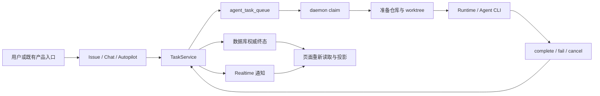
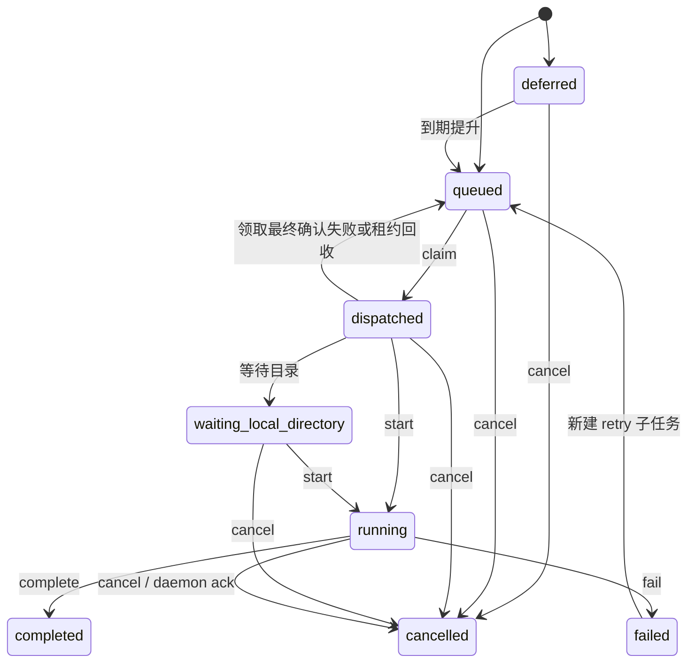
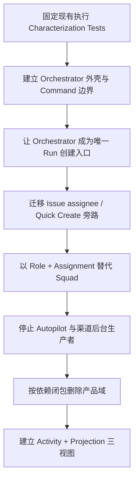

# 上游 Multica v0.4.26 执行主链与 LieXiu 改造保护面

## 1. 文档定位

本文承接以下两份实施设计：

- [04-下一阶段优先级与 Wave 0 实施设计](04-下一阶段优先级与Wave%200实施设计.md)
- [05-本地开发与远端验证运行环境设计](05-本地开发与远端验证运行环境设计.md)

本文把上游 Multica `v0.4.26` 中分散在 Issue、AgentTask、daemon、runtime、worktree、Realtime 和后台任务里的
执行语义整理成一张改造地图，回答三个问题：

1. 原始 Issue → AgentTask → daemon → runtime → result 主链如何工作；
2. 哪些写入口、状态转移、恢复路径和跨域副作用在减法前必须受到保护；
3. 目标 Orchestrator 应接管哪些控制权，哪些现有能力继续作为执行内核复用。

本文维护 `v0.4.26` 的稳定代码事实和改造边界，不记录某次启动耗时、临时进程、测试通过次数或本机绝对配置。
动态环境证据和命令收据进入 `.work`。

当前 Wave 状态和下一关键路径统一见
[08-Wave 实施路线与进度总览](./08-Wave%20实施路线与进度总览.md)。

## 2. 总体结论

上游 Multica `v0.4.26` 可以作为个人多 Agent 项目管理工具的执行基座，但现有 `AgentTask` 是面向多个既有产品域的
共享任务队列，不是目标产品所需的业务编排器。

正确的复用边界是：

- 保留 daemon、runtime 发现与适配、任务领取、租约、取消、终态上报、worktree 隔离和失败恢复；
- 将 `AgentTask` 逐步收缩为一次 `Run` 的执行载体，而不是 Project、Mission 或 TaskNode 的业务事实源；
- 新建单一 Orchestrator，统一拥有依赖就绪计算、角色分派、Review 返工、Human Gate、预算和自动创建 Run 的权限；
- 在 Orchestrator 接管前，不能直接删除 Chat、Squad 或 Autopilot，因为这些域包含真实的任务创建旁路和后台副作用；
- Realtime 只承担通知和增量刷新，数据库中的状态与 Activity 才能承担恢复、回放和三个视图的一致事实。



## 3. 现有执行拓扑与事实所有权

### 3.1 核心实现位置

| 职责 | 主要实现 | 当前所有权 |
| --- | --- | --- |
| AgentTask 创建、领取、状态转移、取消和重试 | `server/internal/service/task.go` | `TaskService` |
| AgentTask 持久化语义 | `server/pkg/db/queries/agent.sql`、`chat.sql`、`autopilot.sql` | PostgreSQL + sqlc 查询 |
| daemon HTTP/API 边界 | `server/internal/handler/daemon.go` | server handler |
| daemon 轮询、执行、取消观察和结果上报 | `server/internal/daemon/daemon.go` | daemon |
| 仓库缓存与 worktree | `server/internal/daemon/repocache/cache.go`、`execenv/git.go` | daemon |
| API 路由 | `server/cmd/server/router.go` | server |
| 失联 runtime 与过期任务恢复 | `server/cmd/server/runtime_sweeper.go` | server 后台循环 |
| daemon 启动时孤儿任务恢复 | `server/internal/handler/task_lifecycle.go` | server handler |
| Issue 创建和分派触发 | `server/internal/service/issue.go` | `IssueService` |
| Autopilot 创建和失败节奏 | `server/internal/service/autopilot.go` | `AutopilotService` |
| Realtime 事件类型 | `server/pkg/protocol/events.go` | 协议层 |

### 3.2 当前主链

1. v0.4.26 基线中，Issue 创建、Agent assignee、评论提及、Chat、Quick Create、Squad 或 Autopilot 等入口会调用 `TaskService`；Wave 1B 已停止这些产品入口的新任务生产。
2. `TaskService` 以事务和查询约束写入 `agent_task_queue`，初始状态为 `queued` 或 `deferred`。
3. server 发布 `task:queued`，并唤醒可能接单的 daemon；事件本身不替代数据库事实。
4. daemon 按 runtime 能力和容量批量领取任务，server 将任务从 `queued` 原子转为 `dispatched` 并发布
   `task:dispatch`。
5. daemon 准备执行目录。需要隔离时从缓存仓库创建任务 worktree；本地目录任务遵循不同的目录保护语义。
6. daemon 调用 start API，任务进入 `running`，然后启动目标 runtime/Agent CLI 并持续上报进度和用量。
7. runtime 的显式成功映射为 complete；其他非取消异常默认 fail closed，不根据文本猜测成功。
8. server 持久化终态，执行重试、Issue/Agent 状态协调、通知和 Realtime 广播。
9. 页面收到事件后刷新投影；页面刷新、断线或重启后必须重新读取数据库权威状态。

### 3.3 目标架构中的重新归属

| 现有对象或能力 | 目标归属 | 处理方式 |
| --- | --- | --- |
| Project / Workspace | 项目控制面 | 收缩后保留 |
| Issue | Mission / TaskNode 的迁移来源 | 分阶段演进，不直接承担 runtime 状态 |
| AgentTask | Run 执行载体 | 保留内核并收窄职责 |
| Agent assignee / Squad leader 自动触发 | Orchestrator Command | 移除旁路后统一接管 |
| daemon | Execution Plane | 保留并建立稳定 Adapter 合同 |
| runtime 私有状态 | Runtime Adapter 内部 | 规范化后才进入 Run/Activity |
| WebSocket 事件 | 通知层 | 保留，但不作为事实源 |
| worktree | Run 执行环境与 Artifact 来源 | 保留并增强可追踪性 |
| Usage | Run 观测与预算事实 | 与 Billing 产品域解耦后保留 |

## 4. AgentTask 状态机

### 4.1 当前状态

`v0.4.26` 的主要任务状态为：

- `deferred`：等待到期或等待条件满足；
- `queued`：可以被 daemon 领取；
- `dispatched`：已经授予某 runtime，尚未正式开始；
- `waiting_local_directory`：已领取，但等待本地目录条件；
- `running`：runtime 正在执行；
- `completed`、`failed`、`cancelled`：终态。



### 4.2 必须保持的状态约束

- claim 必须是带容量约束的原子操作，不能由 UI 先选中再异步占位；
- start 只能接受已领取或等待本地目录的任务；
- complete/fail/cancel 必须幂等处理已经终结的竞争，不产生第二个相互矛盾的终态；
- retry 是新任务并保留 `retry_of_task_id` 血缘，不能把历史失败原地改回 queued；
- manual rerun 通过 `rerun_of_task_id` 保留来源，并明确 fresh/resume 选择；
- 领取最终确认失败必须及时回队，不能遗留无 daemon 所有的 `dispatched`；
- runtime 失联、租约过期和 server 重启后必须有可解释的回收路径；
- 自动化层不得把 Realtime 丢包解释为任务停滞或成功。

### 4.3 当前事件边界

协议层已有的主要任务事件为：

- `task:queued`
- `task:dispatch`
- `task:progress`
- `task:completed`
- `task:failed`
- `task:cancelled`

当前没有与每个业务状态一一对应的持久 Activity。例如 `running` 可以从数据库状态读取，但不应假定存在持久的
`task:started` 领域事件。目标产品需要新增可回放 Activity，并通过 Projection 同时服务总看板、执行详情和
像素世界；不能让三个视图各自消费瞬时 WebSocket 消息拼装状态。

## 5. AgentTask 创建入口与控制权旁路

### 5.1 SQL 级创建入口

当前生产路径中的直接插入查询包括：

| 查询 | 来源语义 | 目标处置 |
| --- | --- | --- |
| `CreateAgentTask` | Issue、提及、Squad leader 等通用任务 | 迁移到 Orchestrator 发起 Run |
| `CreateDeferredChannelIssueTask` | 渠道 Issue 延迟任务 | 生产调用已归零；低层兼容实现随 Channel 删除闭包移除 |
| `CreateQuickCreateTask` | Quick Create | 生产调用已归零；HTTP/Slack 路径已改为 Quick Create Mission Command，低层兼容实现随 Wave 1C 清理 |
| `CreateDeferredAgentTask` | assignee fallback | 由 Orchestrator 的就绪/恢复策略替代 |
| `CreateRetryTask` | 失败重试 | 保留机制，策略权归 Orchestrator |
| `CreateChatTask` | Chat 直接执行 | 目标 MVP 删除或改为显式 Mission 入口 |
| `CreateAutopilotTask` | Autopilot 周期执行 | 首版删除；未来作为触发器重新设计 |

所有 SQL 插入最终应只允许一个应用服务调用。仅在 UI 上隐藏入口并不能消除控制权旁路。

### 5.2 服务级入口

需要在改造中逐个迁移、封装或删除的 `TaskService` 公共入口包括：

- Issue 主链：`EnqueueTaskForIssue`、`EnqueueTaskForIssueWithHandoff`；
- 评论与协作链：`EnqueueTaskForMention`、`EnqueueTaskForThreadParent`；
- Squad 链：`EnqueueTaskForSquadLeader`、`EnqueueTaskForSquadLeaderWithHandoff`；
- 延迟与 fallback：`EnqueueDeferredChannelIssueTask`、`EnqueueDeferredAssigneeFallback`；
- 快速入口：`EnqueueQuickCreateTask`；
- Chat：`EnqueueChatTask`、`SendDirectChatMessage`；
- 生命周期：claim、start、complete、fail、cancel、retry、rerun 和 stale recovery。

这些是 v0.4.26 基线中“创建业务对象后直接启动执行”的主要旁路；Wave 1B 已将生产入口收敛为：

```text
用户动作 -> Command -> Orchestrator -> TaskNode 就绪判定 -> Assignment -> Run -> AgentTask
```

Quick Create 的长期合同是上述链路中的便捷 Mission 入口，而不是旧的 AgentTask 快速派发入口。过渡期可以继续
保留 `/api/issues/quick-create` 这一路径及其 handler 位置，但路径语义已经改变：它必须接收
`command_id`（UUID）、`prompt` 和可选 `project_id`，并在一个幂等流程中先执行 `CreateMission`，再执行
`SubmitPlan`。`SubmitPlan` 生成固定的两节点计划 `executor -> integrator`，成功响应为 `status=ready`。
该入口不得自动执行 `StartMission` 或 `AdvanceMission`，不得选择 Agent 或 Squad，也不得接受 `priority`、
`due`、`parent` 或 `attachments` 字段；因此成功返回时只能有 draft Mission 转为 ready 的业务状态，不得已经
创建 Assignment、Run 或 AgentTask。

同一 `command_id` 在 workspace 内重放必须返回第一次创建的同一 Mission 和同一 ready 结果，不得创建第二个
Mission、计划版本或节点。若第一次请求在 `CreateMission` 已成功、但 `SubmitPlan` 尚未完成时中断，重试仍须
沿同一 `command_id` 找回该 Mission 并补交固定计划；不能因为中断而重新创建 Mission。Quick Create 的旧
`CreateQuickCreateTask` 查询和历史完成处理可以在迁移期保留以读取旧任务，但所有生产调用必须归零；它不能改头换面
成为新 Mission 的实现细节。新入口只调用 Orchestrator Mission Command，旧 SQL 与 enqueue API 在 W1B.6 白名单
最终收缩时删除。

### 5.3 生产调用方

| 调用域 | 典型文件 | 风险 |
| --- | --- | --- |
| Issue 创建/分派 | `server/internal/service/issue.go` | Agent assignee 会自动创建任务，是第二控制中心 |
| Autopilot | `server/internal/service/autopilot.go` | 自有调度与失败节奏，删除页面后仍可能运行 |
| 评论/提及 | `server/internal/handler/comment.go` | 编辑、删除、合并评论会取消和重排任务 |
| 子 Issue 完成 | `server/internal/handler/issue_child_done.go` | 可能继续唤醒父线程或 Squad leader |
| Quick Create | `server/internal/handler/issue.go`、Slack slash command | 过渡路径可保留，但必须转为固定计划的 Mission Command；不得绕过 Orchestrator |
| Chat/渠道 | `server/internal/integrations/channel/engine/router.go` | 直接产生 Chat task |
| 手工 rerun | `server/internal/handler/task_lifecycle.go` | 必须保留血缘和 fresh/resume 语义 |

Wave 1B 已让上述产品入口的“直接创建 AgentTask”生产调用归零，并由静态边界与全包回归保护；低层不可达兼容实现按 Wave 1C 删除闭包继续物理移除。

## 6. daemon、runtime 与 worktree 执行语义

### 6.1 daemon 启动和领取

daemon 运行时会启动 workspace 同步、任务唤醒、heartbeat、垃圾回收、自动更新和 token 续期等循环。任务既可由
WebSocket 唤醒，也可由 HTTP 轮询兜底；批量领取支持多个 runtime 和容量限制。

这些循环共同构成 Execution Plane，不能因删除某个产品页面而随意拆散。目标 Runtime Adapter 应封装供应商
差异，但继续复用 daemon 对容量、取消、终态回报和环境隔离的成熟处理。

### 6.2 worktree 所有权

- worktree 能力通过 runtime capability 协商；
- daemon 的 repo cache 负责缓存仓库和创建任务 worktree；
- 创建过程使用 `git worktree add -b` 形成任务分支；
- worktree 任务可以绕开共享目录互斥，从而实现仓库内并行执行；
- 任务每个退出路径都会尝试 finalize；未提交修改会被保存，分支信息随终态上报；
- finalize 或清理失败时优先保留现场，不能为了“干净”删除潜在交付物；
- 本地目录任务与托管 worktree 的回收规则不同，垃圾回收不得越过该边界。

目标 Artifact 模型不应复制整个 worktree，而应记录 Run、repo、base/ref、task branch、commit、diff、文件和
审批关系。worktree 是执行现场，Artifact 才是可版本化交付事实。

### 6.3 runtime 结果归一化

daemon 当前采取 fail closed：只有明确完成状态调用 complete，其余异常调用 fail；取消需要结合 server 权威状态
和 daemon ack 协调。目标 Adapter 应继续维持该原则，并输出统一的：

- normalized status；
- progress / log / tool activity；
- usage；
- artifact references；
- failure class 与 retryability；
- session/resume capability；
- branch/worktree metadata。

业务 Orchestrator 不读取 Codex、dsh 或其他厂商 CLI 的私有状态字符串来决定 Mission 成败。

Agent 的 `custom_env` 不能覆盖平台保留的 `LIEXIU_*` 身份与控制变量；daemon 会跳过这类键。这是必须保留的
安全边界。fake runtime 和测试注入应使用明确的非保留前缀，不能通过伪造 `LIEXIU_TASK_ID`、token、runtime
或 daemon 上下文来控制测试。

## 7. 失败、重试与恢复路径

### 7.1 server 恢复职责

`runtime_sweeper` 负责识别失联 runtime、处理 stale tasks、过期 queued tasks，并调用集中失败处理。
`RecoverOrphanedTasks` 在 daemon 重新注册时修复遗留任务。TaskService 还会回收过期的 dispatched 领取。

`HandleFailedTasks` 是当前失败收敛中心，包含：

- 重试资格判断和新任务创建；
- `task:failed` 通知；
- Agent 运行状态协调；
- Issue 状态恢复或重置；
- 后续通知和副作用。

目标改造时，应把其中的产品策略迁入 Orchestrator，但保留任务终态幂等、领取回收和 runtime 失联处理。不能先
删除 Issue/Agent 协调代码，再期待失败主链自然保持完整。

### 7.2 重试所有权

当前通用任务和 Autopilot 并不共享完全相同的重试节奏，Autopilot 拥有自己的 cadence。目标首版应只有一套
Run retry policy：

- Execution Plane 只报告 failure class、retryable 建议和执行事实；
- Orchestrator 结合 TaskNode、Review、预算、尝试次数和人工策略决定是否重试；
- 每次重试创建新 Run/AgentTask，保留 causation 与 retry lineage；
- Review 驳回应创建新的返工 Run，不伪装成底层网络重试；
- timeout、runtime offline、用户 cancel、依赖失败和 review rejection 必须是不同原因。

当前 Issue execution history API 主要返回展示所需的任务状态和结果，不应假定它已经完整暴露
`retry_of_task_id`、`rerun_of_task_id`、`force_fresh_session` 等持久化血缘。目标 Run 详情与 Activity Projection
必须显式提供这些关系，不能要求前端根据时间和 attempt 猜测。

Wave 1B.4 已把上述目标落实为明确边界：带 `orchestration_run_id` 的 AgentTask 不进入 TaskService 的自动 retry，
也不能通过旧 Issue rerun 入口重跑；stale/offline sweeper 只报告和广播执行终态，不重置 TaskNode 的兼容 Issue。
Orchestrator 按 `failure_kind` 和 Mission 尝试预算决定下一步：`runtime_offline`、`dispatch_timeout` 可在预算内技术
重试、耗尽后 blocked；`timeout`、`provider_network`、`skill_bundle_unavailable` 可在预算内重试、耗尽后 failed；
`protocol_error`、`worktree_error`、`agent_error` 和 unknown fail closed。每次技术重试仍在同一 Assignment 下创建
带 `retry_of_id` 的新 Run。

人工恢复只允许 owner 对 blocked TaskNode 发出幂等 `RetryTaskNode` Command，并同时校验 Mission/TaskNode revision；
该事务将 Mission 恢复为 running、TaskNode 清回 pending，记录 `task.retry_requested` Activity，再调用普通
`AdvanceMission` 重新计算依赖和派发。failed 终态不被重新打开，需要重做时创建新 Mission。

## 8. 跨域耦合与减法风险

| 待减域 | 不可只删 UI 的原因 | 删除前必须迁移或证明 |
| --- | --- | --- |
| Chat | 有独立 `CreateChatTask`、直接消息、会话和 GC 语义 | 关闭所有创建旁路；保留需要的 transcript 能力并重新归属 |
| Autopilot | 有 `CreateAutopilotTask`、调度器、失败监控和自有重试 cadence | 停止后台生产者；删除状态、查询和 scheduler 注册 |
| Squad | leader 分派、handoff、父子完成都会创建任务 | 用 Role + Assignment + Orchestrator 替代后再删 |
| 外部渠道 | Slack 命令、渠道 router、延迟任务会创建 AgentTask | 首版移除注册、路由、配置、查询和回调，不只隐藏菜单 |
| Billing/商业化 | Usage 与执行观测、预算事实交叉 | 删除计费产品，保留 Run usage 与成本估算 |
| Desktop/Mobile | 可能共享 packages、路由与构建脚本 | Web-only 合同稳定后按依赖闭包删除 |
| Onboarding/Quick Create | 能直接创建 Issue 和 AgentTask | 以单 owner bootstrap 和正式 Mission Command 替换 |

服务启动时还会注册 usage rollup 和 Autopilot failure monitor 等后台工作。减法验收必须检查“是否仍有后台生产者
和副作用”，不能只检查导航菜单是否消失。

## 9. `issue_dependency` 的现状与激活策略

`issue_dependency` 已存在于初始迁移，表达 `issue_id`、`depends_on_issue_id` 和 `blocks | blocked_by | related`
等关系，后续迁移补充了索引。但是 `v0.4.26` 的正常业务路径中没有形成完整的依赖 CRUD、环检测、就绪计算和
调度语义；它目前更接近休眠 schema，而不是可直接复用的 DAG scheduler。

因此：

- 可以将它作为 TaskNode dependency 的迁移起点，避免无依据重建一套平行关系；
- 必须先固定唯一方向，例如 `task_node_id depends_on prerequisite_task_node_id`；
- 写入时在应用层做唯一性、自依赖和环检测；
- Orchestrator 依据所有前置 TaskNode 的权威业务终态计算 ready；
- dependency 只连接业务 TaskNode，不连接一次性的 AgentTask/Run；
- 删除、失败传播、人工跳过和重新打开必须有明确规则；
- 不把现存索引或表名误认为已经存在可靠的调度实现。

## 10. Wave 0 保护面

### 10.1 P0 characterization tests

进入大规模减法前，至少固定以下行为：

| 编号 | 行为 | 最小断言 |
| --- | --- | --- |
| CT-01 | enqueue + duplicate protection | 同一幂等来源不会产生两个活动任务 |
| CT-02 | claim capacity | 并发 claim 不超过 runtime capacity，同一任务只授予一次 |
| CT-03 | claim finalize failure | token/receipt 回滚且任务及时回到 queued |
| CT-04 | start + terminal race | complete/fail/cancel 竞争只有一个权威终态 |
| CT-05 | retry lineage | 新任务保留来源，旧失败历史不被覆盖 |
| CT-06 | rerun lineage | 手工 rerun 保留来源和 fresh/resume 决策 |
| CT-07 | daemon result reporting | completed 走 complete；非 completed fail closed |
| CT-08 | cancellation observation | server 取消能唤醒并停止目标执行，重复通知幂等 |
| CT-09 | worktree isolation | 并行任务目录和分支隔离，异常时保留可定位现场 |
| CT-10 | stale recovery | runtime/lease 失联后任务进入可解释终态或回队 |
| CT-11 | Realtime recovery | 丢事件或刷新后从数据库恢复同一状态 |
| CT-12 | no real Agent by default | 默认测试不发现、不登录、不调用真实厂商 CLI |

优先复用和重命名现有测试，不为了追求测试数量复制实现细节。新增测试应围绕目标行为，而不是 Chat、Squad、
Autopilot 等待删页面。

### 10.2 创建入口保护

建议增加一个静态保护，维护允许调用 AgentTask 插入查询的文件白名单。过渡期白名单记录上述现有入口；每迁移
一个域就缩小一次，最终只允许 Orchestrator/Run service 调用。这样可以防止后续功能重新绕过调度器。

### 10.3 数据与迁移保护

- 不重写已经发布的 `v0.4.26` 历史迁移；
- 新增字段、索引和表使用向前迁移；
- 删除表或列晚于代码停止读写至少一个阶段；
- 先停止后台生产者，再删除查询和 schema；
- AgentTask 历史、retry/rerun 血缘和 Artifact 引用在迁移期间保持可查询；
- 数据库约束与应用层状态机测试共同保护并发语义。

## 11. 推荐改造顺序



具体分波建议：

1. **W0.4：保护执行内核。** 复用现有测试形成 P0 矩阵，补缺失的状态恢复和创建入口静态保护。
2. **W0.5：冻结 MVP 合同。** 定义 Mission、TaskNode、Run、Review、Activity、Command 和 Runtime Adapter。
3. **Wave 1A：最小编排骨架。** 使用确定性计划创建 TaskNode DAG，由单一 Orchestrator 产生 Run。
4. **Wave 1B：迁移旁路。** 先迁移 Issue assignee、Quick Create 和 retry policy，再触碰 Squad/Autopilot。Quick Create
   的路径可暂时不变，但必须完成从直写 AgentTask 到幂等 CreateMission/SubmitPlan、返回 ready 且不自动启动的语义迁移。
5. **Wave 1C：产品减法。** 逐域停止路由、后台任务、写入口、查询和 schema，最后删除 UI 与代码。
6. **Wave 2：三个视图。** 先建立 Activity/Projection，再将同一 ViewModel 映射到总看板、详情和像素世界。

W0.5 的权威实现合同见
[07-MVP v0.1 领域合同与 Walking Skeleton 设计](./07-MVP%20v0.1领域合同与Walking%20Skeleton设计.md)。

## 12. Wave 0 当前边界

从 `v0.4.26` 开始推进时，首轮本地基线应确认依赖安装、PostgreSQL、全部历史迁移、server health 和 Web
入口能够启动。以下行为仍是进入大规模减法前的硬门槛，不能被基础页面可访问所替代：

- 完成本地 owner 登录与最小 Workspace/Project/Issue 操作；
- 注册 daemon，并观察 server 的 runtime inventory；
- 使用 fake runtime 跑通一个 AgentTask 的 queued → dispatched → running → terminal；
- 验证 cancel、fail、retry、worktree 和断线/重启恢复；
- 跑完本节 P0 保护矩阵的适用子集；
- 仅在显式授权后运行可能消耗额度的真实 Agent smoke。

本地工具链应继续按 05 文档对齐 CI 的 Node.js 22。使用更高 Node 主版本可以用于发现兼容性，但不能成为
权威研发基线；相关警告和首编译性能属于动态收据，不写成产品架构结论。

## 13. 本文形成的实施约束

- 在 Orchestrator 成为唯一写入口前，不进行 AgentTask 创建 API 的大规模删除或重命名。
- 在 P0 characterization tests 建立前，不删除 daemon、TaskService 生命周期或 worktree 路径。
- 不把 AgentTask 直接改名为 TaskNode；二者分别代表业务工作和一次执行。
- 不让前端或像素世界直接推导调度就绪条件。
- 不让瞬时 WebSocket 消息成为 Activity 历史或三个视图的唯一来源。
- 不让 deepseek-harness、Codex 或任一厂商 runtime 获得项目控制面的状态所有权。
- 删除 Chat、Squad、Autopilot、渠道或 Billing 时，按“生产者 → 后台任务 → 服务入口 → 查询 → schema → UI”
  的依赖闭包推进，并在每一波后运行保护矩阵。
