# Wave 1C 产品减法删除闭包与实施顺序

## 1. 文档定位与执行合同

本文是 Wave 1C.1 的可执行权威闭包。它把 08 中的 1C.2–1C.13 固化为可独立派发、可集成、可回退的删除单元；08 仍是 Wave 状态入口，03 是产品保留/删除边界，06 是执行主链保护面，09 是多会话协同规则。本文不记录动态 pass/fail、token、临时 ID、命令流水或一次性收据。

目标产品是 Web-first、单 owner、唯一内部 Workspace 的本地/自托管项目执行系统。Mission/TaskNode/Assignment/Run/Artifact/Review/Activity 与 Orchestrator 是业务控制面；Go server、daemon、Runtime Adapter、本地代码仓库/worktree 和 Docker Compose 是运行基础。任何删除都不得重新引入第二任务事实源、第二调度器或隐式 AgentTask 生产者。

### 1.1 不可删除的共享保留面

以下能力不是 C1/C2 的删除对象：

- 本地 Skills、MCP 配置与 Runtime Adapter；MCP 只负责工具发现/调用，Runtime Adapter 负责供应商状态归一化，二者不拥有 Mission 或任务状态。
- AgentTask 的 claim/start/complete/fail/cancel、lease、容量、超时、断线恢复、daemon wakeup、runtime inventory、worktree 隔离和回收；这些属于 Execution Plane。
- Usage 的逐 Run 原始模型、token、耗时、成本和预算/审计事实；删除 Billing 不得删除执行用量或阻止预算 Gate。
- Mission/TaskNode/Run/Artifact/Review/Activity、Projection、WebSocket 重拉和 Orchestrator 的唯一派发权；普通 Issue、Chat、Squad、Autopilot、Channel 不得绕过它创建 AgentTask。
- Web、Go server、PostgreSQL、daemon 的基本本地启动结构与 `docker-compose.yml`、`docker-compose.selfhost*.yml`；首版不以 Helm/Kubernetes 替代 Docker Compose。

### 1.2 所有单元共同的删除闭包

每个单元必须按同一条闭包核对，并在集成时留下可复核的路径清单：

`页面/导航 → API/公开类型 → handler/service/background → DB/migration/query/generated → 配置/依赖/CI → 测试/文档`

“删除”包含删除注册、调用方、读写、定时器、事件订阅、环境变量、secret、镜像、依赖、测试夹具和当前文档描述；仅隐藏菜单、停止构建某页面或保留 feature flag 均不算完成。历史迁移不得改写；先停读写，再以向前迁移移除对象。生成代码只能由对应 query/schema 变更后重新生成，不手改生成文件。

每个单元同时提交以下共同证明：共享写集合没有越界；Orchestrator 仍是唯一 AgentTask 业务生产者；默认测试不发现或调用真实 Agent CLI；受影响的导航/API/后台/数据库/配置/依赖/测试/文档无残留；失败时可恢复到该单元前的可启动、可执行、可恢复状态。

## 2. 依赖图与实施顺序

```mermaid
flowchart LR
    P["1C.1 闭包与写集合冻结"] --> M["1C.2 Mobile"]
    M --> D["1C.3 Docs/Marketing"]
    D --> H["1C.4 PostHog/Feedback"]
    H --> K["1C.5 Helm/Kubernetes"]
    K --> C["1C.6 Channel/Composio"]
    C --> B["1C.7 Billing/Subscription/Stripe/Cloud Credits"]
    B --> PL["1C.8 插件分发"]
    PL --> O["1C.9 local owner bootstrap"]
    O --> I["1C.10 identity/chat/autopilot/squad prerequisites"]
    I --> CH["1C.11 Chat/onboarding/Agent Builder"]
    CH --> A["1C.12 Autopilot"]
    A --> S["1C.13 Squad/旧 Inbox"]
```

### 2.1 C1 叶子域顺序

C1 固定为：`Mobile → Docs/Marketing → PostHog/Feedback → Helm/Kubernetes → Channel/Composio → Billing → Plugin`。前一单元退出门槛满足后才进入后一单元；同一单元内可由 Luna 做只读审计或互不重叠的局部实现，但共享入口、迁移序列、生成代码和最终文档由主会话集成。

### 2.2 C2 身份与深耦合顺序

C2 固定从 `local owner bootstrap → identity/chat/autopilot/squad` 收敛：先建立单 owner 与唯一内部 Workspace 的替代入口，再移除邀请/成员/公开注册/Workspace 切换；随后删除 Chat/Floating Chat/Mika/Agent Builder/onboarding，再停删 Autopilot，最后以 Role + Assignment 和 Human Gate 收缩 Squad/旧 Inbox。C2 必须串行，不把共享 auth、workspace、TaskService、handler 装配或数据库迁移交给并发写会话。

## 3. 单元闭包

下面每个单元的“共享写集合”既是允许修改的边界，也是 Luna 独立任务的边界；未列出的共享文件一律只读。Luna 任务必须回传路径、行为合同、最小验证、未验证项和集成前提，不得 stage、commit、push、改 08 或扩大范围。

### 1C.2 Mobile

- **保留/删除边界：** 删除 `apps/mobile` 产品、导航、状态、API 适配、发布和 CI；保留 Web-first 产品、`@liexiu/core` 中仍被 Web/desktop 使用的纯类型/函数，以及 server 的执行与 Projection 合同。不得为了 Mobile 兼容保留移动端专属业务语义。
- **页面/导航 → API → handler/service/background：** 删除 Expo 路由、auth/app 导航、chat/inbox/issue/project/workspace 页面和 Mobile realtime/query/mutation 入口；确认它们不是 server 端唯一调用者，再删除 Mobile 专属适配，不改 server 的 Mission/Run/daemon handler。
- **DB/migration/query/generated：** Mobile 不应拥有专属表；扫描其 API 使用者和 schema 类型，删除仅供 Mobile 的 query/type 生成物，保留共享 Usage、Runtime、Mission 等查询。若无专属 DB 对象，不新增迁移。
- **配置/依赖/CI：** 删除 `apps/mobile/package.json`、Expo 配置、mobile env、原生资源和 `mobile-verify.yml` 及其 workflow 依赖；不得删除根 pnpm workspace 中仍被其他包使用的依赖。
- **测试/文档闭包：** 删除 Mobile unit/e2e/发布测试与移动端说明；补一项 workspace/package/CI 残留检查，更新当前文档对 Web-only 的描述。
- **共享写集合与前置：** 仅 `apps/mobile/**`、移动 CI/根 workspace 必要配置和明确只被 Mobile 使用的共享导出；前置为 1C.1、Web/desktop 核心消费者已识别，不能触碰 `packages/core` 共享状态、Execution Plane 或 `docs/diy/08`。
- **Luna 独立任务边界：** 只读列出 Mobile import/export、CI、依赖和 server API 消费者，或在上述 Mobile 集合内完成删除；不得改 shared core、迁移、导航公共适配器。
- **最小验证/退出门槛：** `pnpm install --lockfile-only` 不适用时仅做 workspace 解析；运行受影响包类型检查/测试和 Web 构建入口静态检查；退出时无 Mobile workspace、路由、CI、依赖和当前文档残留，Web/server/daemon 本地入口仍成立。
- **失败回退：** 保留本单元前的 Mobile 文件和 workspace 注册，恢复到 Web/server 可启动的提交点；不得用删除 shared export 的方式掩盖未识别消费者。

### 1C.3 Docs/Marketing

- **保留/删除边界：** 删除 `apps/docs` 独立文档产品、公开 landing/marketing/About/Use Cases/Download/Contact Sales/Changelog 页面；保留根 `docs/` DIY/设计/运行文档与必要的根 README、开发者约定。
- **页面/导航 → API → handler/service/background：** 删除 `apps/docs` 路由、搜索/API、营销导航和 web landing feature；检查登录、Mission 和运行入口不再链接这些页面。删除仅为公开内容服务的 handler/service，不触碰核心 API。
- **DB/migration/query/generated：** 删除 docs/marketing 专属反馈、waitlist、lead 或内容查询；确认没有迁移/查询/生成物仍被核心页面使用，专属对象按停读写后向前迁移移除。
- **配置/依赖/CI：** 删除 docs 构建、部署域名、SEO/analytics/营销 secret、独立包依赖和 docs workflow；保留根 docs 的静态链接、`pnpm` 文档约定和 Docker Compose 入口。
- **测试/文档闭包：** 删除 docs/marketing 专属测试与快照；更新 README/设计文档中的产品入口，保留 docs 目录作为权威设计文档而不是运行中的内容站。
- **共享写集合与前置：** `apps/docs/**`、`apps/web` landing/marketing 目录、专属 CI/config、仅被其使用的 server 入口；前置为 1C.2 结束且公开入口与核心 Web 导航已分离。
- **Luna 独立任务边界：** 只审计链接图、内容路由、依赖、workflow 和唯一消费者；可在 docs/marketing 集合内删除，不能改根 `docs/diy/08`、03/04/06/09 或核心 API。
- **最小验证/退出门槛：** Web 登录、workspace、Mission 页面静态路由检查和受影响构建/类型测试通过；无独立 docs/marketing 注册、域名、依赖、CI、server 读写。
- **失败回退：** 恢复 docs/marketing 路由与构建注册，不回滚核心 Mission/Runtime 改动；若内容归属不明，先保留根 docs 文件并只回退站点删除。

### 1C.4 PostHog/Feedback

- **保留/删除边界：** 删除产品分析、PostHog SDK、Feedback 产品和用户反馈入口；保留 Run Usage、预算、审计 Activity、错误日志和本地诊断事实，不把它们误删为 analytics。
- **页面/导航 → API → handler/service/background：** 删除反馈按钮、反馈页、analytics provider、事件埋点调用、feedback handler/service、批处理和上传后台任务；保留核心错误处理与 Execution Activity。
- **DB/migration/query/generated：** 停止 feedback、PostHog event、客户端使用分析表的读写，删除专属 query/generated 和迁移对象；保留 `client_usage`/`task_usage`/`runtime_usage` 中用于 Run 观测和预算的事实，并区分商业 rollup。
- **配置/依赖/CI：** 删除 `POSTHOG_*`、feedback secret、SDK/网络上报依赖、分析 CI 检查和外部回调；保留本地日志、Usage 预算配置和默认无外传的 Docker Compose 行为。
- **测试/文档闭包：** 删除 analytics/feedback 测试和 mock；补 usage/预算保留断言，更新隐私/运行文档为本地审计事实，不描述 PostHog/Feedback 为当前能力。
- **共享写集合与前置：** `packages/core/analytics`、`packages/core/feedback`、对应 views/server analytics/feedback 文件、配置/依赖/专属迁移；前置为 1C.3 公开内容和反馈入口已分离。
- **Luna 独立任务边界：** 只审计 SDK 初始化、事件调用、反馈 API、后台任务和表消费者；可删除叶子目录及其专属配置，不得删 Usage、Budget、Activity、Runtime Adapter。
- **最小验证/退出门槛：** 运行 core/views/server 受影响测试，静态确认无 PostHog import、feedback route、上报 job；Run usage/预算查询和默认本地执行仍可用。
- **失败回退：** 恢复 SDK/反馈入口及专属配置，保留 Usage/预算改动；不得通过重新开启外部上报来修复本地测试。

### 1C.5 Helm/Kubernetes

- **保留/删除边界：** 删除 Helm chart、Kubernetes manifest、发行和 chart 文档；保留 Dockerfile、`docker-compose.yml`、selfhost compose、server/daemon/Web 本地与自托管启动链。
- **页面/导航 → API → handler/service/background：** 无产品页面；删除只为 chart health/install/upgrade 服务的入口与脚本，保留 HTTP health、daemon 注册和 Docker Compose 所需的启动检查。
- **DB/migration/query/generated：** 无专属 DB 对象；检查 chart 注入的 DB/secret/config 名称是否被 Compose 或 server 使用，迁移与 generated 代码不得因发行物删除而改写。
- **配置/依赖/CI：** 删除 `deploy/helm/**`、K8s values/templates、Helm release workflow、chart lint 和 registry 配置；保留 Docker Compose、镜像构建、`.env.example`、server health 和本地数据库脚本。
- **测试/文档闭包：** 删除 Helm/chart 测试和部署说明，补 Compose 自托管启动/health 文档引用；不把 Helm 缺失写成执行能力缺失。
- **共享写集合与前置：** Helm/K8s 目录、部署 workflow、仅 chart 使用的脚本/依赖/文档；前置为 1C.4 完成，且 Compose 的 env/health 事实已识别。
- **Luna 独立任务边界：** 只读审计 chart 对镜像、env、迁移、health 的引用；可删除 chart 与专属 CI，不改 Dockerfile、Compose、server 配置或生产资源。
- **最小验证/退出门槛：** Compose 配置解析、镜像/health 静态检查和受影响 shell 测试通过；无 Helm/K8s 注册和依赖，Compose 仍能启动 Web/server/DB/daemon。
- **失败回退：** 恢复 chart、workflow 和专属依赖；若 Compose 依赖被误判，优先恢复其配置映射而非扩大删除。

### 1C.6 Channel/Composio

- **保留/删除边界：** 删除 Slack、Lark、DingTalk、WeCom、通用 Channel engine、媒体代理和 Composio；保留本地 Skills、MCP、Runtime Adapter 与显式 Mission API，不保留外部渠道作为任务生产者。
- **页面/导航 → API → handler/service/background：** 删除 channel routes、slash/callback/webhook、channel router/replier、媒体 reconciler、Composio callback/tools/session API 和后台任务；确认所有路径不再创建 AgentTask、Chat task 或 Issue。
- **DB/migration/query/generated：** 停止 channel message/media/delivery、Composio account/session/toolkit/webhook 表读写，删除专属 queries/generated 和向前迁移；保留 Issue/Artifact/Run 的本地附件与执行证据。
- **配置/依赖/CI：** 删除 Slack/Lark/DingTalk/WeCom/Composio env、secret、SDK、callback 公网配置、集成 CI；保留 MCP/Runtime 配置和 Docker Compose 的本地网络边界。
- **测试/文档闭包：** 删除 channel/composio handler、replier、媒体和 webhook 测试；补静态 AgentTask producer 白名单检查，更新 API/部署文档为本地 Mission 入口。
- **共享写集合与前置：** `server/internal/integrations/**`、`server/pkg/composio/**`、channel handler/service/query/migration/generated、对应 core/views/CLI/config/CI；前置为 1C.5 且 Wave 1B.6 已停止生产者。
- **Luna 独立任务边界：** 只审计外部集成注册、回调、直接 enqueue、表和 env；可在 channel/composio 集合内删除，不得改 Orchestrator、TaskService 生命周期、MCP 或 Runtime Adapter。
- **最小验证/退出门槛：** server 受影响测试与静态 producer 白名单通过；启动不注册外部 channel/composio，Mission→Run→Execution Plane、Usage 和本地 MCP/runtime 仍可用。
- **失败回退：** 恢复集成注册、回调和表读路径；若发现仍有必要的外部工具能力，先转为明确 MCP/Runtime Adapter 需求，不复活第二派发入口。

### 1C.7 Billing/Subscription/Stripe/Cloud Credits

- **保留/删除边界：** 删除 Billing、套餐、订阅、Stripe、Cloud Credits、商业配额和 SaaS 账单；保留逐 Run Usage、token/成本估算、预算上限、审计和人工 Budget Gate。
- **页面/导航 → API → handler/service/background：** 删除 billing/subscription 页面、portal/checkout/webhook/entitlement handler、invoice/credit service 和账单后台任务；预算 API 归入本地设置/Orchestrator Gate，不接受支付状态作为运行权限事实。
- **DB/migration/query/generated：** 停止 subscription/customer/price/invoice/payment/credit ledger 读写；删除专属 query/generated 和向前迁移，保留 run/task/runtime usage 与预算字段，必要时将商业引用迁为本地配置引用。
- **配置/依赖/CI：** 删除 Stripe key/webhook、billing secret、商业 provider SDK、付费环境和 billing CI；保留 Usage 预算配置、成本估算和 Docker Compose 本地运行。
- **测试/文档闭包：** 删除 billing/payment/entitlement 测试，补预算超限阻止 Run、Usage 可审计和 owner 调整预算的最小测试；文档说明“Usage 是执行事实，不是账单”。
- **共享写集合与前置：** `packages/core/views/billing`、server billing/subscription/stripe/credits、queries/migrations/generated、env/deps/CI；前置为 1C.6 后无外部渠道商业入口。
- **Luna 独立任务边界：** 只审计支付/订阅/额度调用、表、secret 和后台任务；可删除商业域，不得删除 Usage、Budget、ExecutionGateway 或 Run 状态。
- **最小验证/退出门槛：** 核心 Usage/预算测试、Orchestrator admission/预算 Gate 和 server 构建通过；无支付入口、webhook、商业依赖，超预算仍能 fail closed。
- **失败回退：** 恢复商业页面/API/表读写与专属配置；预算事实和运行安全边界不能回退为支付 entitlement。

### 1C.8 插件分发（保留本地 Skills/MCP/Runtime Adapter）

- **保留/删除边界：** 删除插件市场、目录同步、签名、第三方安装/升级/回滚和插件分发产品；明确保留本地 Skills、MCP 配置、Runtime Adapter、runtime profile 和本地 skill bundle 校验。
- **页面/导航 → API → handler/service/background：** 删除 plugin marketplace/catalog/install/update/rollback 页面、API、同步任务和远端 registry；保留本地 Skills 管理、Runtime/MCP 配置和执行时只读加载。
- **DB/migration/query/generated：** 删除仅供市场/分发的 plugin catalog/version/install/session 表读写；保留本地 skill/profile/runtime 配置所需对象，向前迁移移除孤立商业对象，不能删除 Run 对 Skill/MCP/Runtime 的引用事实。
- **配置/依赖/CI：** 删除 registry URL、签名服务、市场 token、远端插件 SDK、分发 CI；保留 `server/pkg/skillbundle`、本地 Skills 目录、MCP/Runtime 配置和默认 fake runtime 测试。
- **测试/文档闭包：** 删除市场/安装/升级/回滚测试；保留 skill bundle hash、MCP 配置、Runtime Adapter 归一化和自定义环境变量保留键测试，更新文档为本地能力包。
- **共享写集合与前置：** plugin marketplace 目录/API/queries/migrations/generated/config/deps/CI；前置为 1C.7 完成，且必须先列出 plugin 与 Skills/MCP/Runtime 的真实消费者。
- **Luna 独立任务边界：** 只审计分发 registry 与本地能力加载边界；可删除远端分发集合，不得改 `server/pkg/skillbundle`、Runtime Adapter、Execution Plane 或 `LIEXIU_*` 环境保护。
- **最小验证/退出门槛：** 本地 Skills/MCP/Runtime Adapter 测试、fake runtime 和 server 启动检查通过；无远端分发入口/配置/依赖，运行时仍可加载本地能力并归一化 usage/artifact/failure。
- **失败回退：** 恢复市场注册和分发对象；若本地能力加载受损，只恢复最小本地 adapter/skill 依赖，不恢复商业市场。

### 1C.9 local owner bootstrap 与唯一内部 Workspace

- **权威合同：** 具体数据、凭据、并发、旧库选择、会话和验收语义只在 [11-本地实例身份与唯一工作区合同](./11-本地实例身份与唯一工作区合同.md) 维护。
- **保留/删除边界：** 建立显式、幂等、事务化的 owner bootstrap 和 canonical 内部 Workspace；保留 CSRF、PAT、daemon 兼容注册和 workspace scope。旧注册/OAuth/成员/多 Workspace 路径在本单元只作回退桥，物理删除属于 1C.10。
- **页面/导航 → API → handler/service/background：** 新增 bootstrap status/setup 与本地 owner 登录首屏，成功后直接进入 canonical Workspace 的 Mission 入口；不创建 Agent、Chat、Mika、AgentTask 或其他后台副作用。
- **DB/migration/query/generated：** 新增一行 singleton 绑定事实；空库创建四个最小关联对象，已有库只复用显式 owner/Workspace 关系，歧义 fail closed。不物理删除 `workspace_id`，不合并或改写 Mission/Run 分区。
- **配置/依赖/CI：** 新增无默认值的 owner bootstrap secret，生产环境强制显式 JWT secret；旧注册/OAuth/email 配置的删除留到 1C.10；CI 使用固定本地 owner fixture。
- **测试/文档闭包：** 增加首次启动、重复/并发请求、会话/CSRF、workspace scope、PAT/JWT daemon 兼容注册和 owner 权限测试；文档将本地 bootstrap 作为唯一产品入口，不记录动态账号或 token。
- **共享写集合与前置：** auth/workspace/onboarding handler/service/query/migration/generated、Web auth/navigation、bootstrap config/test fixture；前置为全部 C1 完成，尤其插件/Usage/Runtime 保留边界已冻结。
- **Luna 独立任务边界：** C2 从本单元起仅允许只读审计或经主会话明确分配的 bootstrap 集合；不得并发修改 auth/workspace schema、Orchestrator 或 server router。
- **最小验证/退出门槛：** 空库/已有库启动、重复与并发 bootstrap、歧义旧库 fail closed、owner 登录、CSRF、workspace scope、PAT/JWT daemon 注册和 Mission 创建通过；bootstrap 不会创建第二 owner/workspace。
- **失败回退：** 保留原登录/onboarding 与 workspace 创建路径，禁用新 bootstrap 写入，恢复旧 schema 读写；不得删除已有 workspace 数据作为回退。

### 1C.10 邀请、成员、席位、公开注册与 Workspace 切换

- **权威合同：** canonical Workspace 读取、公开身份退出、成员 roster 保留和非破坏性历史数据策略只在 [12-单Owner身份与Canonical Workspace产品闭包合同](./12-单Owner身份与Canonical Workspace产品闭包合同.md) 维护。
- **保留/删除边界：** 删除邀请、成员管理、席位、leave workspace、公开注册、邮箱验证、Google OAuth 和 Workspace 切换产品；保留唯一 owner、内部 workspace scope 与服务账户/daemon 安全身份。
- **页面/导航 → API → handler/service/background：** 删除 members/invitations/workspaces switcher、invite accept、seat and OAuth routes/actions；导航改为固定内部 workspace，不能靠 UI 隐藏继续暴露 API。
- **DB/migration/query/generated：** 停止 invitation/member-seat/oauth/provider/notification preference 的产品读写；确认 membership 仍作为 owner scope 的安全事实后再决定物理压缩，删除孤立 query/generated 并用向前迁移收缩对象。
- **配置/依赖/CI：** 删除 OAuth client、邮件/邀请 provider、seat/billing 相关依赖与 CI secret；保留 session、CSRF、owner authorization、daemon token 和 Compose 本地 auth 配置。
- **测试/文档闭包：** 删除邀请/成员/seat/公开注册测试；保留未授权、跨 workspace、owner-only、token 撤销和 bootstrap 回归，更新文档为单 owner 模式。
- **共享写集合与前置：** 仅在 1C.9 bootstrap 稳定后修改 auth/workspace/member/invite 路径、queries/migrations/generated/config/CI；不得触碰 Mission/Run 的 workspace_id 查询。
- **Luna 独立任务边界：** 只读审计 identity/API/导航/DB consumer；实现任务只能限定在成员/邀请/注册集合，不能修改 owner bootstrap、TaskService 或公共 session contract。
- **最小验证/退出门槛：** 访问控制、owner 登录、固定 workspace 导航、daemon 与 Mission API 通过；无邀请/成员/seat/OAuth/切换入口、路由、后台任务或配置。
- **失败回退：** 恢复成员/邀请/注册 API 与导航，保留唯一 workspace bootstrap 和安全会话；不得以放开 workspace scope 解决失败。

### 1C.11 全局 Chat、Floating Chat、Mika、Agent Builder、onboarding

- **保留/删除边界：** 删除通用聊天产品、Floating Chat、Mika、通用 Agent Builder 和旧 onboarding；保留挂在 Mission/TaskNode/Run 的 TaskMessage、执行 transcript、Artifact、Review 意见和显式 Mission Command。
- **页面/导航 → API → handler/service/background：** 删除 chat/floating chat routes、chat session/message API、Mika bootstrap、builder 和 onboarding 向导；关闭 `CreateChatTask`/`EnqueueChatTask` 及其 GC/后台生产者，保留任务详情中的受限消息与证据入口。
- **DB/migration/query/generated：** 停止 chat session/message/pin/draft/agent-builder/onboarding 状态的独立读写；迁移 transcript/必要消息到 Mission/TaskNode/Run 归属后再删除孤立 query/generated/表对象，历史 Run 可查询。
- **配置/依赖/CI：** 删除 chat provider、Mika/agent builder 专属配置、组件依赖和测试 workflow；保留 Markdown 安全渲染、Skills/MCP/Runtime 配置和 fake runtime。
- **测试/文档闭包：** 删除 chat/onboarding/builder/floating tests；新增显式 Mission Command、不产生旁路 AgentTask、Run transcript/Review/Artifact 可读和刷新恢复测试；文档不把 Chat 作为产品入口。
- **共享写集合与前置：** C2 主集成集合：web/views/core chat/onboarding/agents、server chat/onboarding/handler/service/query/migration/generated、router/config；前置为 1C.10 完成，且 Orchestrator 已是唯一生产者。
- **Luna 独立任务边界：** 只做 Chat/UI/API/DB 的依赖审计或局部删除；不得并发改 TaskService、Orchestrator、Run/Activity 状态机、共享导航适配器或迁移序列。
- **最小验证/退出门槛：** Mission 创建→Plan→Run、TaskMessage/transcript/Review/Artifact、刷新/断线恢复和默认 fake runtime 通过；无全局/Floating/Mika/Builder/onboarding 生产入口及 Chat task 旁路。
- **失败回退：** 恢复 chat/onboarding 页面与读写，但保持其不得创建 AgentTask；若 transcript 迁移不完整，保留旧表只读并暂停删除迁移。

### 1C.12 Autopilot 产品域

- **保留/删除边界：** 删除 Autopilot scheduler、webhook、failure monitor、subscriber、投递和独立 retry cadence；未来若需要只通过薄 MissionTrigger 重新设计，当前不保留第二调度器。
- **页面/导航 → API → handler/service/background：** 删除 autopilot 页面、CRUD/run-now/webhook routes、listeners、schedule jobs、failure monitor、subscriber 和 `CreateAutopilotTask`；任何周期或失败事件不得直接创建 AgentTask。
- **DB/migration/query/generated：** 停止 autopilot/schedule/run/subscriber/webhook/delivery 表读写，删除专属 query/generated 和向前迁移；保留 Orchestrator Run retry lineage、Activity、Usage 和预算事实。
- **配置/依赖/CI：** 删除 cron/webhook secret、scheduler provider、Autopilot SDK、failure-monitor 注册和专属 CI；保留 server 启动、runtime sweeper、Orchestrator reconciler、Compose 和本地 health。
- **测试/文档闭包：** 删除 autopilot/schedule/webhook/listener 测试；补静态 producer 白名单、server restart/reconcile、预算和 Run failure policy 测试；文档说明 Mission 是唯一执行入口。
- **共享写集合与前置：** server autopilot handler/service/jobs/queries/migrations/generated、core/views/autopilot、router/config/CI；前置为 1C.11 已关闭 Chat/Onboarding 生产旁路，且 1B.6 producer 收敛完成。
- **Luna 独立任务边界：** 只读审计后台注册、直接 enqueue、失败重试和 DB/config consumers；实现只能在 Autopilot 集合内，不能改 runtime sweeper、TaskService lifecycle 或 Orchestrator retry policy。
- **最小验证/退出门槛：** server 启动不注册 Autopilot job，producer 白名单只剩 Orchestrator/Run bridge；Mission 的技术重试、offline/stale recovery、预算 Gate 和 Usage 仍通过。
- **失败回退：** 恢复 scheduler/listener/表读写与配置，但不允许恢复 AgentTask 直接生产；以关闭新调度、保留历史只读作为中间回退。

### 1C.13 Squad 与旧 Inbox 产品语义

- **保留/删除边界：** 删除 Squad leader 自治派发、handoff、`squad-evaluated`、社交通知 Inbox、subscriber/follow/mention 噪声；保留最小 AgentTeam/RolePolicy/Assignment 候选和 Human Gate（批准、阻塞、预算、失败升级、最终验收）。
- **页面/导航 → API → handler/service/background：** 删除 Squad 管理/leader/handoff 页面及旧 Inbox feed/订阅导航；将可保留的角色选择改由 Mission Plan/Assignment，Inbox 只成为固定 Human Gate projection，不保留独立通知事实源。
- **DB/migration/query/generated：** 停止 squad leader/evaluation/handoff/subscriber/pin/notification feed 的读写，删除专属 query/generated/对象；保留 Agent、RolePolicy、Assignment、Review、Activity 与 Human Gate 投影对象。
- **配置/依赖/CI：** 删除 Squad/Inbox 专属后台监听、通知 provider、订阅配置和依赖；保留 WebSocket Activity、Orchestrator、Usage/Budget、Runtime Adapter 和 Compose。
- **测试/文档闭包：** 删除自治分派、handoff、社交 Inbox 测试；补 Role + Assignment 替代、Human Gate、重复命令幂等、依赖传播和无 AgentTask 旁路测试；文档不再把 Squad/Inbox 描述为第二控制面。
- **共享写集合与前置：** 最后一个 C2 集合：core/views/server squad/inbox/comment/issue-child-done/handler/service/query/migration/generated、router/config；前置为 1C.12 完成、Wave 1B.5 producer 停产、Chat/Autopilot 替代路径稳定。
- **Luna 独立任务边界：** 只读审计 Squad/Inbox producer、角色/订阅/通知表和页面；可在非共享叶子集合内删除，不能并发修改 Role/Assignment/Orchestrator 状态机、Issue dependency 或 Human Gate 合同。
- **最小验证/退出门槛：** Mission Plan→Assignment→Run、Review/Human Gate、失败升级、取消/重试和 Activity Projection 通过；Squad leader/handoff/mention/child-done/旧 Inbox 不再生产 AgentTask 或维护第二状态。
- **失败回退：** 恢复 Squad/Inbox UI 和只读历史，先恢复必要的角色/通知查询；不得恢复自治派发，回退仍必须经 Orchestrator Command。

## 4. 跨单元集成门禁与回退策略

### 4.1 单元完成门禁

主会话在每个单元进入下一单元前确认：

1. 页面、导航、公开类型和 API 入口已删除或完成明确改造；
2. handler/service/background、事件、定时器和直接 SQL 写入口已归零；
3. DB/query/generated/migration、配置、secret、依赖、镜像和 CI 已闭合；
4. 测试覆盖保留边界、失败回退和 Execution Plane，默认不调用真实 Agent CLI；
5. Docker Compose、Web/server/daemon、Mission/Run/Projection、Usage/预算、Skills/MCP/Runtime Adapter 仍成立；
6. 文档只描述当前合同，没有本轮动态结果；
7. 共享写集合未越界，失败时仍能回到该单元前的可启动状态。

### 4.2 跨单元共享写集合

以下集合由主会话单一 owner 串行修改：`server/cmd/server/router.go` 与启动装配、`server/internal/service/task*`、`server/internal/service/orchestration/**`、Run/AgentTask bridge、`server/pkg/db/queries/orchestration.sql` 与迁移序列、`server/pkg/db/generated/**`、Workspace/Auth 公共 schema、Activity/Projection、daemon/runtime recovery、根 pnpm workspace 和 Wave 文档。Luna 只能读取这些路径，或拿到针对单个文件的明确授权；不得将 C1 的叶子删除扩展到这些共享集合。

### 4.3 失败回退原则

每个单元以“停生产者→停读写→删除消费者→删除对象/依赖→验证”为顺序推进。验证失败时只恢复最近单元的注册、读写、配置和测试夹具，保留已证明无关的删除；数据库优先回到只读兼容或保留历史对象，不做破坏性 drop，不 reset/checkout，不清理用户现场。若发现共享集合归属不明，暂停该单元并回到只读审计，不能以 feature flag 或兼容别名掩盖未闭合的第二事实源。

## 5. 未决高风险点

以下事项是进入对应单元前必须形成证据或决策的风险，不在本文臆造结论：

- `packages/core` 与 `packages/views` 是否仍由 desktop、Web、CLI 或测试共享 Mobile/Chat/Workspace 导出；误删会扩大到非目标展示面。
- 公开注册、OAuth、邀请、成员表与本地 owner bootstrap 的现有数据迁移方式；不能用唯一 owner 假设直接破坏已有 workspace scope。
- Chat transcript、评论、附件、Artifact、Review 和 Usage 的数据归属；删除 Chat 表前必须证明执行证据已可查询且不复制第二事实。
- Channel/Composio 是否仍有生产环境回调或历史任务需要只读迁移；停 webhook 必须先确认无在途 AgentTask 生产者。
- Usage 表中商业 rollup 与 Run 预算事实的边界；Billing 删除不能删掉 `token/cost/duration` 或预算拒绝原因。
- 插件目录与本地 Skills/MCP/Runtime Adapter 的共享接口；必须证明删除的是分发产品，而不是执行能力。
- Helm values 与 Docker Compose、server env、health/secret 名称是否存在隐式耦合；Helm 删除前必须确认 Compose 可独立启动。
- Autopilot、Squad、Channel、Comment、child-done 的历史后台任务与重试血缘；停产不等于可以立即删除历史读取和恢复逻辑。
- `issue_dependency`、Workspace scope、Mission Projection、Activity 和生成代码的迁移顺序；C2 最后删除不得破坏 DAG、回放、重启恢复或 Run/Artifact lineage。
- 当前共享工作区已有未提交改动与 `.work/` 收据可能跨越本闭包；实施会话必须按路径确认归属，不覆盖或清理用户现场。

## 6. 稳定维护规则

本文只维护 1C.1 的稳定闭包、顺序、写集合、门禁和风险。动态命令、测试输出、临时失败、会话 ID 和 token 进入 `.work/tasks/`；Wave 状态只更新 08；若删除边界改变，先更新 03/正式设计，再同步本文，不在本文件制造第二套产品合同。
