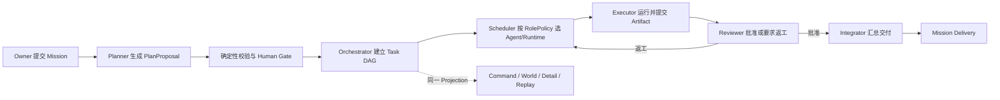

# LieXiu 产品边界与总体架构

## 1. 产品定义

列宿 · LieXiu 是一个本地优先、可自托管、厂商中立的多 AI Agent 项目操作系统。用户提交一个 Mission 后，
系统组织规划者、执行者、审查者和集成者形成可控团队，完成计划拆解、依赖调度、运行、协作、审核返工和
集成交付，并把同一套执行事实投影为项目指挥中心、像素世界和角色执行详情。

LieXiu 不是多 Agent 聊天室、通用 IM、Agent 社交网络或某一模型厂商的外壳。它拥有自己的项目语义、确定性
编排、审计事实和可视化；Codex、Claude Code、DeepSeek Harness、Cursor、Kimi、OpenCode 等只是可替换的
Runtime 或模型能力。

## 2. 产品原则

1. **一个控制面：** 只有 LieXiu Orchestrator 可以自动派发业务执行和推进 Mission 状态。
2. **一个事实源：** PostgreSQL 保存关系当前态和追加式 Activity；WebSocket 只通知刷新，不是事实源。
3. **三种投影：** 看板、像素世界和执行详情消费同一个 `MissionProjection`，不维护平行状态。
4. **建议与裁决分离：** LLM 可以提出 Plan、Review 和决策建议；依赖、预算、权限、并发、状态迁移由确定性代码裁决。
5. **角色与实例分离：** `Duty`/`RoleProfile` 描述职责和策略，`Agent` 表示某个可用执行实例。
6. **厂商能力可替换：** 领域层只依赖 Runtime 合同，不包含 provider 专属业务分支。
7. **失败可恢复：** 运行事实持久化，进程重启、Runtime 离线和前端断线不能破坏 Mission 真相。
8. **个人版优先：** 单 Owner、唯一 Canonical Workspace、自托管和本地开发优先于 SaaS 多租户能力。

## 3. 目标业务链

## 4. 总体分层

| 层 | 职责 | 不拥有 |
| --- | --- | --- |
| Web / Desktop | Command Center、Board、World、Run Detail、Owner Command | 业务真相、独立状态机 |
| Go Control Plane | Mission 命令、计划校验、状态机、调度、审查、预算、Projection | Runtime 工具实现 |
| Execution Plane | AgentTask、daemon claim、worktree、Runtime 启停和运行事实 | 业务重试、DAG 推进 |
| Runtime Adapter | 标准化 prompt、工具、事件、终态和用量 | Mission/TaskNode 状态写入 |
| PostgreSQL | 当前关系事实、Activity、执行 lineage | UI 临时坐标、动画状态 |
| WebSocket | 变更通知、游标提示 | 可恢复的持久事实 |

保留现有 Next.js/React、Electron、Go server/daemon/CLI、PostgreSQL、Issue/Project 标识、AgentTask 执行载体、
worktree、日志、Usage 与 Git 能力。Desktop 是共享 Web 视图和本地能力的薄壳，不发展独立产品语义。

## 5. 核心领域所有权

| 概念 | 当前设计 |
| --- | --- |
| Project | 项目容器和查询范围 |
| Mission | 用户目标与编排根；复用 root Issue 标识 |
| TaskNode | Plan DAG 节点；复用 child Issue 标识 |
| Planning | Mission 级计划生成过程，不伪装为普通 TaskNode |
| Assignment | 某职责在某一 scope 上的一次不可变分配 |
| Run | Assignment 的一次执行尝试；技术重试和返工都创建新 Run |
| Agent / Runtime | 可用执行实例及其启动适配器 |
| Artifact | 版本化交付物和 lineage 事实 |
| ReviewVerdict | 对 Artifact 的批准、拒绝或返工裁决 |
| Activity | Mission 范围的追加式审计与 Projection 增量 |
| Human Gate | Owner 对计划、风险动作和最终交付的显式裁决点 |

Issue/Project 可以继续承载标识、标题和基础项目关系，但不得重新成为自动派发控制面。Assignment、Run、Artifact、
Review、预算与协作语义属于 Orchestration 领域。

## 6. 正式减法边界

个人版已经退出并不得以“兼容”为由隐式恢复以下产品域：

- Mobile、公共营销站、云发行和 Helm/Kubernetes 发行物；
- Billing、Subscription、Stripe、Cloud Credits、Seat；
- 公开注册、OAuth、邀请、多 Workspace 创建/切换和成员写入；
- PostHog、Feedback、Channel/Composio；
- 全局 Chat、Floating Chat、Mika、Agent Builder、Onboarding；
- Autopilot、Squad 自动派发、旧 Inbox 产品、Saved View、Custom Property；
- 插件市场、分发商业化和供应商绑定控制面。

本地 Skills、MCP 和 Runtime Adapter 可以保留，但必须服务于明确的 Mission/Run 合同。需要恢复某项已删能力时，
必须先证明真实消费者，再通过薄适配器接入；不得同时恢复旧页面、后台生产者和第二套业务状态。

## 7. 上游和品牌策略

LieXiu 以上游 Multica v0.4.26 为历史基线，当前定位是独立深度产品分支。上游只作为选择性代码来源：逐项比较、
摘取可证明有价值的修复，不进行无边界的大版本合并。历史 Git、LICENSE、NOTICE 和不可变 migration 保留来源；
活跃 UI、包、CLI、配置、Compose 和产品文档统一使用 LieXiu。

## 8. 明确非目标

- 不允许无限递归委派或 LLM 直接写业务状态；
- 不建设第二个 Orchestrator、第二个事件存储或 provider 专属项目能力；
- 不恢复全员聊天记录作为协作核心；结构化协作只围绕 Mission/Run/Artifact；
- 当前不引入 Kafka/NATS、全量 Event Sourcing、A2A 社交协议、复杂评分学习系统；
- 像素世界不保存业务坐标，不建设 3D 开放世界、物理仿真或独立游戏后端；
- 当前不做模型训练、长期记忆平台和面向公众的多租户 SaaS。
