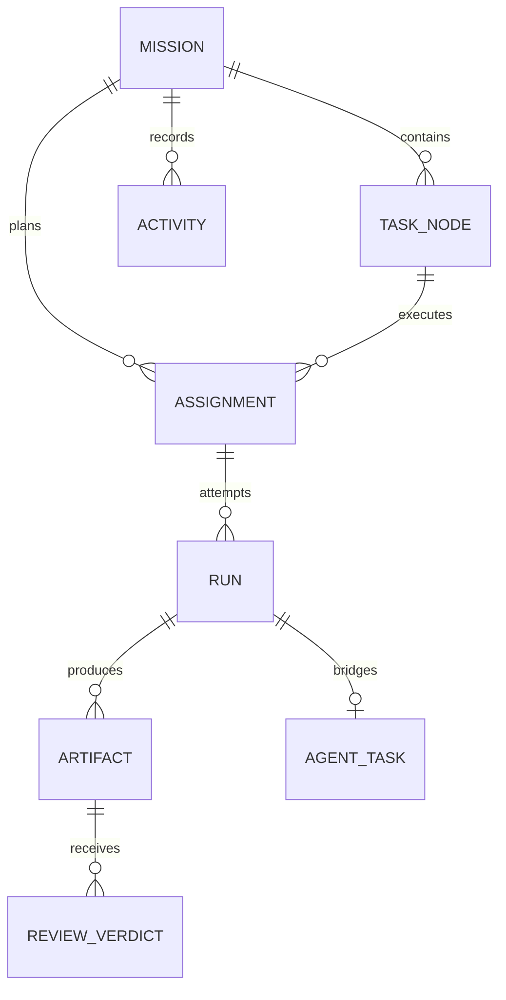

# LieXiu 编排领域与执行平面设计

## 1. 设计目标

编排领域负责把一个 Mission 可靠地推进为可审计的交付；执行平面负责在具体 Agent/Runtime 中完成一次运行。
两者通过窄接口连接：Orchestrator 决定“为什么、由谁、何时执行”，Execution Plane 只报告“这次运行发生了什么”。

## 2. 领域模型

- `Mission` 与 `TaskNode` 分别复用 root/child Issue ID；`issue_dependency` 的规范方向是 `blocked_by`。
- `Assignment` 的 scope 可以是 Mission 或 TaskNode。Mission scope 用于 Planning，TaskNode scope 用于执行、审查和集成。
- 一个 Assignment 可以有多个 Run，但一次 Run 只能桥接一个 AgentTask；技术重试、返工和人工重试均追加历史。
- Run 到 AgentTask 的唯一关联存放在 AgentTask 的 `orchestration_run_id`，不建立相互覆盖的双向事实。
- 关系表保存当前态，`orchestration_activity` 以 Mission 内单调 sequence 保存审计与增量读取事实。

## 3. Duty、RoleProfile 与策略快照

系统固定四种业务职责 `Duty`：`planner`、`executor`、`reviewer`、`integrator`。Duty 是状态机可理解的稳定语义，
不允许用户任意改变其业务含义。

`RoleProfile` 是可配置的人格与能力模板，例如“Go 后端工程师”“安全审查员”“技术总编”。它可以定义提示词、
required capabilities、Runtime/模型偏好、工具权限、预算、超时和并发限制，但不能发明新的状态机分支。

4B.1 固定以下领域与持久化边界：

- Plan、TaskNode/Assignment 投影和 Web wire contract 统一使用 `duty`；底层 `task_node.role`、
  `orchestration_assignment.role` 列暂保留物理列名，只承载上述四个固定值，不再对应独立的 Go `Role` 枚举；
- `role_profile` 按 `(workspace_id, profile_key, version)` 追加不可变版本。每个版本固定一个 Duty，并保存 name、description、
  instructions、required capabilities、allowed/preferred Runtime、provider/model 偏好、工具/路径权限、token/cost/rework/
  technical-retry 预算、timeout 和 max concurrency；
- 新版本写入是 Owner-only 显式 Command；同 `command_id` 同 payload 重放返回原版本，不同 payload fail closed。
  同一 profile key 的并发写通过事务锁串行分配连续版本；读取默认只返回每个 key 的最新版本；
- `GET /api/workspaces/{workspace_id}/role-profiles` 对 workspace member 只读，
  `POST /api/workspaces/{workspace_id}/role-profiles` 仅 Owner 可创建新版本；自定义名称只存在于 RoleProfile，不能成为 Duty；
- 4B.1 不把 RoleProfile 直接接入候选选择。Mission 启动时的版本冻结由 4B.2 拥有，确定性过滤、淘汰原因和 Assignment
  选择由 4B.4 拥有，因此全局 profile 的后续修改不会通过 4B.1 暗改运行中 Mission。

Mission 的策略按 Duty 冻结为追加不可变的 `RolePolicySnapshot`。Owner 必须显式提交 `profile_key + version`，系统不得按
latest、创建时间或字典序猜测；可选的 Mission 级 Agent binding 与该 Duty 同时冻结。冻结分为两个既有事务边界：

- `RequestPlan` 在建立 planner Assignment/Run 前冻结 planner；同一 Mission 后续重规划只能复用完全相同的 planner 快照；
- `StartMission` 在进入 running 和首批 TaskNode ready 前冻结 executor、reviewer、integrator。人工或固定模板计划不要求
  planner 快照，但仍必须显式绑定执行、审查和集成 profile；
- 每个 `(workspace_id, mission_id, duty)` 只能有一行。相同 command/payload 重放复用原事实，不同 command 若尝试更换已冻结
  profile/version/Agent 则 fail closed；全局 RoleProfile 后续新版本不影响既有 Mission；
- 4B.2 只冻结策略并暴露快照，不改变候选选择。4B.4 才按快照过滤 Agent/Runtime、记录淘汰原因并在无候选时 blocked。

每个快照至少包含：

- schema version、content hash、duty 与 role profile id/key/version；
- required capabilities 和显式 Agent binding；
- allowed/preferred runtimes、provider/model；
- 工具与路径权限；
- token/cost/time/rework/technical-retry 预算。

快照复制规范化后的完整 RoleProfile 配置，而不是运行时再 join 当前版本；因此修改全局配置不会悄悄改变既有 Mission。
HTTP wire 固定使用 `{duty, profile_key, version, agent_id?}`：`RequestPlan.role_policy_binding` 只接受 planner，
`StartMission.role_policy_bindings` 必须完整且无重复地包含 executor/reviewer/integrator。profile 不存在、跨 workspace、Duty 不匹配、
Agent 不存在或跨 workspace、缺项、重复项和已冻结后换绑均返回结构化校验/冲突，且不得留下部分快照或状态变化。

4B.3 在既有 Mission 页面内提供只读 Agent/Runtime 诊断面板，但不产生新的业务事实源。面板组合既有、已按当前成员权限
过滤的 Agent 列表、Runtime 列表和 workspace AgentTask snapshot，显示 Agent 是否绑定 Runtime、Runtime online/heartbeat、
当前任务负载与 Agent 容量、daemon 上报的 Runtime capabilities、Agent invocation permission 和 Runtime visibility。能力缺失按
`unknown` 展示，不把 Agent skills、permission mode 或 Runtime visibility 互相冒充为 capability。容量是观测快照，必须标明
`used / limit`，不能承诺下一次调度仍有空位。

该面板只回答“当前有哪些对本成员可见的配置与运行事实”；其 `available` 只表示未归档、已绑定 Runtime、Runtime 当前在线且
观测负载未达 Agent 上限，不表示满足任一 RolePolicy。4B.3 不读取 current/latest RoleProfile 重新推断 Mission 合同，不输出
`eligible`、RolePolicy 淘汰原因或最终 selected Agent，也不写 Assignment/Activity、改变 blocked 状态或触发调度。刷新、重连和
WebSocket 事件只使这些既有只读查询失效；Mission、Board、World 的业务状态仍只来自 `MissionProjection`。冻结快照驱动的能力、
工具/路径、模型、显式 binding、职责分离和稳定 preference 判定仍全部由 4B.4 拥有。

## 4. 真实 Planner 合同

Planner 是 Mission 级能力，不是 DAG 内的普通前置 TaskNode。流程如下：

1. `CreateMission` 保存目标、上下文、交付标准和预算；
2. Orchestrator 建立 Mission-scope Planning Assignment/Run，并通过统一 ExecutionGateway 执行；
3. Planner 产出版本化 `PlanProposal` Artifact，而不是直接写 TaskNode；
4. Go 校验器验证 schema、唯一键、DAG 无环、依赖存在、角色合法、预算、权限和规模上限；
5. Owner 可以编辑、拒绝或批准 PlanProposal；批准后由 `SubmitPlan` 原子建立 TaskNode/DAG；
6. 现有固定 `execute -> integrate` QuickCreate 仅作为确定性降级路径，不能伪装成智能规划；接受计划的既有
   `mission.plan_accepted` Activity 以 `plan_source=manual|proposal|fixed_template` 记录来源，Projection 和 Owner 入口显式展示。

同一个校验器服务于 LLM Planner、人工编辑和固定模板，保证厂商切换不改变领域规则。

### 4.1 Planning scope 与状态合同

`Mission` 始终是 Planning scope 的事实 owner。Assignment 与 Run 继续保存非空 `mission_id`，以可空
`task_node_id` 作为唯一 scope 判别：空值表示 Mission scope，非空表示 TaskNode scope；领域接口必须暴露明确的
scope kind，不允许调用方自行组合 role、purpose 或空值猜测。数据库和 repository 同时保证以下一致性：

- Mission-scope Assignment 只能使用 `planner` Duty，对应 Run purpose 只能是 `plan`；
- TaskNode-scope Assignment/Run 保留 executor/reviewer/integrator 与 execute/review/integrate；
- Run 与所属 Assignment 的 Mission、TaskNode scope、Agent 和 Runtime 必须一致；
- 同一 Mission 同时最多一个 active Planning Assignment，技术重试只追加 Run，不复制 Assignment；
- 现有 TaskNode 行保持 `task_node_id` 非空，不新增持久化 `scope_type` 或第二套 Planning 表。

Planning 复用 Assignment/Run 状态机和 Run→AgentTask 唯一桥接。TaskService 在桥接边界把 Mission-scope Run 的
AgentTask `issue_id` 设为 Mission root Issue，把 TaskNode-scope Run 继续设为 TaskNode Issue；两者都只通过
`orchestration_run_id` 回报运行事实。Planner 无权通过 AgentTask 直接创建或修改 TaskNode。

Planning 的最小状态表面如下：

| 入口/事实 | 原状态 | 原子结果 | 失败与恢复 owner |
| --- | --- | --- | --- |
| `RequestPlan` | Mission `draft`，无 active Planning Assignment | 同事务建立 Assignment、queued Run 和 Activity；Mission 保持 `draft` | command 重放返回原结果；enqueue 失败保留 queued Run，由 RunReconciler 重试或转 blocked/failure fact |
| Planning Run 终态 | queued/dispatched/running | 沿用标准 Run 终态；成功只允许产出 Proposal Artifact | 重启、迟到终态、取消竞态和技术重试继续由 RunReconciler、预算与 deadline 收敛 |
| Proposal 拒绝或重规划 | Mission `draft` | 旧 Proposal/Run 不可变；旧 Assignment superseded/revoked 后才可建立下一 sequence | revision 冲突 fail closed，不产生部分新链 |
| `SubmitPlan` | Mission `draft` 且 Proposal/人工/fallback Plan 已通过同一校验器 | 同事务物化完整 TaskNode/DAG 并进入 `ready` | 任一校验或写入失败保持 `draft`，不得留下部分 DAG |
| `CancelMission` | Mission `draft` 且 Planning 在途 | Mission cancelled、Assignment revoked，并取消已桥接 AgentTask | 重放幂等；terminal 竞争由行锁/revision 下首个合法终态获胜 |

`StartMission` 仍只接受已经物化 DAG 的 `ready` Mission。Start 的状态提交与后续 `AdvanceMission` 派发属于同一业务
操作的两个可恢复 checkpoint：若 Start 已提交而首次 Advance/Enqueue 失败，`running` 且暂时没有 active Run 是合法的
短暂恢复态，由幂等 Advance/RunReconciler 继续收敛；API 不得把它伪装成整个 Start 已回滚，也不能另建补偿执行链。

### 4.2 迁移与 API 兼容边界

- 数据库按 expand–migrate–contract 推进：先放宽 Assignment/Run `task_node_id` 并扩充 planner/plan 检查，再增加
  Mission-scope active/sequence 唯一索引；每个新索引继续使用独立的 concurrent migration。现有非空行无需 dual write。
- Run enqueue query 扩展为同时校验 Mission root Issue 与 TaskNode Issue，但保留现有
  `agent_task_queue.orchestration_run_id` 单向唯一事实、TaskService lease 和 daemon 协议。
- 当前基线的 `POST /api/issues/quick-create` Mission request/response、Mission Projection、Start/Cancel/Budget/Retry
  入口保持兼容；固定模板继续直接走 `SubmitPlan`。后续 Planning/Proposal API 只做 additive 扩展，不改变当前字段语义。
- 新 Command 均携带 `command_id` 与 `expected_revision`；响应保留 revision/replayed，Core 继续用 schema fallback 解析，
  使当前 Web/Desktop 客户端可以连接更新后的 server。
- 本冻结不定义 PlanProposal 的完整 payload、Owner 编辑协议或 RolePolicySnapshot；它们分别由 4A.2、4A.5 和 4B.2 拥有。

### 4.3 PlanProposal Artifact schema

Planner 成功输出保存为 `plan_proposal` Artifact。Artifact 行拥有 `mission_id`、空 `task_node_id`、Planning Run lineage、
不可变 `version`、URI 和 content hash；payload 不复制 Artifact version，只用 `schema_version` 管理格式演进。v1 payload 固定为：

| 字段 | 合同 |
| --- | --- |
| `schema_version` | 当前只接受 `1`；未知版本 fail closed |
| `mission_id` / `proposal_key` | 必须匹配目标 Mission；key 非空且不超过 255 bytes |
| `input.objective` | 本次规划的目标快照，非空且最大 32 KiB |
| `input.context_refs[]` | 有界的 `kind/uri/content_hash?` 引用；只引用输入事实，不内嵌无限上下文 |
| `input.delivery_criteria[]` | Mission 交付标准快照，至少一项且每项非空 |
| `limits` | 并发、attempt、rework 和可选 token/cost Gate，复用 Plan limits |
| `nodes[]` | `key/title/description/duty/acceptance_criteria/artifact_kinds/depends_on/budget_estimate` |

TaskNode proposal 的 Duty 只允许 executor 或 integrator；planner 是生成 proposal 的 Mission-scope Assignment Duty，reviewer
由后续 Artifact Review Gate 建立，不作为普通 DAG 节点。节点 key、唯一性、依赖存在、DAG、深度、规模、预算、验收标准
和 integrator final-delivery 规则复用同一个确定性 Plan validator。

解码拒绝未知字段、多个 JSON value 和畸形类型；所有解码或领域错误统一返回有序的
`[{path, code, message}]`，保留原 Proposal 原文/Artifact 供审计，不产生 TaskNode。结构体编码是 canonical payload；Artifact
content hash 基于该编码计算，Runtime、人工编辑和固定模板不得各自维护另一套 schema。

标准 daemon 完成回调的 `output` 是 Planner 唯一输出入口。RunReconciler 在 Run 终态事务内提取该 JSON，校验 Mission、冻结
input/limits 和 Proposal schema；合法输出以 `agent-task://<task-id>/plan-proposal` 指向不可变执行结果，canonical payload 保存为
Artifact metadata 并计算 `sha256` content hash。缺失、畸形、越界或篡改冻结输入的输出把 Run 收敛为
`invalid_plan_proposal`，failure message 保存有界结构化错误，且不得产生 Artifact 或 TaskNode。

`SubmitPlanProposal` 是 Proposal 到既有 `SubmitPlan` 的受信适配入口，不是第二条提交链。Service 先验证 Owner、Artifact scope
和 payload，随后把 executor/integrator Duty 唯一映射为既有 Plan Duty；SubmitPlan 事务再次校验 Artifact 的成功 Planning Run、
active planner Assignment、canonical content hash 和转换后 Plan 一致性，再原子物化完整 DAG。成功时 planner Assignment 变为
fulfilled，`mission.plan_accepted` payload 记录 `source_artifact_id` 和 `plan_source=proposal`；人工提交记录 `manual`，QuickCreate
固定模板记录 `fixed_template`。旧 Activity 按非空且非全零的 `source_artifact_id` 和冻结的 `quick-create-v1` plan key 确定性恢复来源；任一检查或
写入失败，Mission 仍为 draft 且不得留下部分节点。

### 4.4 Owner PlanProposal Gate

Owner Gate 只比较同一 Mission 的不可变 Proposal 版本。Projection 以 Mission scope 暴露 Planning Assignment、Run 和按 version
排序的 Proposal；`pending / superseded / rejected / approved` 是 Artifact 与 Activity 推导出的投影状态，不在 Artifact 增加可变
status，也不放宽 TaskNode-only `ReviewVerdict`。

- `EditPlanProposal` 接收完整 canonical payload、base Artifact、`command_id` 和 `expected_revision`；`mission_id`、`input`、
  `limits` 必须与 base 保持一致，只允许修改 proposal key 与 nodes。成功新增 owner-edit Artifact/version 和 Activity，旧版本变为
  superseded 投影，Mission 保持 draft 且 revision 递增；禁止原地 UPDATE Artifact。
- `RejectPlanProposal` 要求非空 reason 和当前 pending Artifact；同事务记录 Activity、撤销 active planner Assignment、递增 Mission
  revision。Mission 保持 draft，可显式再次 `RequestPlan`；旧 Run/Artifact 不删除。
- `ApprovePlanProposal` 是 Owner-facing 命令名，内部直接复用 `SubmitPlanProposal`/`SubmitPlan` 的唯一 DAG 事务；成功结果即 Mission
  ready、source Artifact approved、planner Assignment fulfilled。不存在“先 approved、再另点 submit”的第二个业务 checkpoint。
- 所有 Gate Command 都要求 Owner、`command_id`、`expected_revision`，Mission 行锁后重查 dedupe；陈旧版本、已决 Artifact、跨
  Mission Artifact 或重复的新 command fail closed，同 command 重放返回原结果。

Web 在现有 Mission 页面内增加 Planning Gate 面板，不重构 Wave 5 页面壳。面板可选择同 Mission 两个版本并排比较、编辑当前
pending 版本、填写拒绝理由或批准；结构化校验按 `path/code/message` 展示。成功后仍刷新同一 MissionProjection，Activity cursor
只作为 invalidation signal。

## 5. 确定性 Agent/Runtime 选择

候选选择顺序固定为：

1. Mission/TaskNode 显式 binding；
2. RoleProfile 允许的 Agent 候选；
3. Runtime 在线且与平台架构可用；
4. capabilities、工具/路径权限和模型约束匹配；
5. 容量、并发与预算可用；
6. Reviewer 与被审查 Artifact 的 producer 满足分离约束；
7. 按稳定 preference、负载和 ID 次序决胜。

选择结果和淘汰原因写入 Assignment/Activity，便于解释“为什么是这个 Agent”。第一阶段不引入自学习权重、黑盒评分
或不可复现的随机负载均衡。

4B.4 的 v1 选择只读取目标 Mission/Duty 的 `RolePolicySnapshot`，不得重新读取 current/latest RoleProfile。显式 Agent binding
只缩小候选集合，不能绕过归档、Runtime、权限、能力、在线和容量检查。`required_capabilities` 与 daemon 注册时写入
`agent_runtime.metadata.capabilities` 的规范字符串集合做精确子集匹配；字段缺失或畸形按 capability unknown fail closed，
Agent skills、MCP、permission mode 和 Runtime visibility 均不得冒充能力。

候选权限以 Mission Owner 为有效调用者，复用 Agent owner / `permission_mode` / invocation targets 的唯一服务端谓词；workspace
admin 不获得调用他人 private Agent 的旁路。Runtime 必须有 owner，provider/model/allowed Runtime 精确匹配；容量上限取 Agent
上限与 RolePolicy `max_concurrency` 的更严格值。`preferred_runtime_ids` 是保序去重的优先级列表，数组位置就是稳定 rank，不能按
UUID 重新排序。通过硬过滤的候选依次按 preferred Runtime rank、当前负载、Agent created-at 和 Agent ID 决胜。Reviewer 在 4B.4
只把 producer 排到最后并留下分离证据；4B.5 才把同一 Agent 变为硬淘汰并建立无独立
Reviewer 时的 blocked/Human Gate。

4B.5 起 Reviewer/Producer 分离是硬约束：Reviewer 快照即使显式绑定 producer 也以稳定
`reviewer_is_producer` 原因淘汰，不能由 preference、负载或 Owner 的普通 retry 绕过。Agent invocation permission 与 Runtime
access 是两道独立门；Runtime 必须有 owner，且只有 Mission Owner 自有 Runtime 或 owner 显式设为 `public` 的 Runtime 可被选择，
跨 owner 的 private Runtime 以 `runtime_permission_denied` fail closed，workspace admin 无旁路。

无独立 Reviewer 时不创建 Reviewer Assignment/Run，而是把当前 TaskNode 置为 blocked，并原子创建 task-scoped
`orchestration_human_gate(kind=reviewer_unavailable)` 与 `human_gate.required` Activity。Review `changes_requested` 达到自动返工上限时
同样进入 `rework_limit_exceeded` Gate，而不是把可由 Owner 决策的事实伪装成 terminal failed。每个 TaskNode 同时最多一个 pending
Gate；已解决行和 Activity 保留历史，`MissionProjection.human_gates` 只暴露当前 pending Gate。并行节点仍可运行；只有整个 Mission
没有可运行工作时才归约为 Mission blocked。

4B.5 的 Owner 决策故意保持保守：专用 `ResolveHumanGate` Command 只接受 `retry`、Mission/Task/Gate 三重 revision 和幂等
`command_id`，解决后按 Gate kind 恢复 Review 或显式增加一次返工，再进入同一确定性 Advance。Owner 不能批准 producer 自审、不能
把人工动作写成 Agent `ReviewVerdict`，pending Gate 也拒绝通用 `RetryTaskNode`。若独立 Reviewer 仍不可用，新的 lineage Gate 会再次
打开；添加或恢复合规 Reviewer 后才创建独立 Review Run。

当前 daemon 尚无可信的工具清单、路径清单或统一 provider enforcement 回执，因此 v1 不得静默忽略非空
`allowed_tools`/`allowed_paths`：二者分别以 `tool_policy_unsupported` / `path_policy_unsupported` fail closed。后续只有在版本化 daemon
wire 与 Adapter 执行回执同时冻结后才能放开。`instructions`、预算、timeout、rework/retry 属于选中后的 RunSpec/admission 合同，
不作为 Agent 身份能力猜测。

选择证据使用稳定 reason code、snapshot content hash、selected Agent/Runtime、排序版本和候选证据 hash；普通 Mission 读者可见的
Activity 不暴露被淘汰 private Agent/Runtime 的原始 ID、metadata、路径或权限细节。Assignment 仍是最终选择事实，不新增第二份
可变 selection 状态。

4B.6 的多 Runtime 黄金场景分为两层且不能互相冒充。默认 Gate 使用至少两个 provider 身份的确定性 fixture、隔离 PostgreSQL 和真实
`TaskExecutionGateway`，贯穿 Planner、PlanProposal、Owner Gate、并行 Executor、独立 Reviewer、返工、Integrator 和最终 Projection；
它只向 AgentTask 写入与真实 daemon 相同的版本化终态输出，再由 `ReconcileRun` 原子建立 Artifact/ReviewVerdict，禁止测试直接调用
`RecordArtifact`/`RecordReviewVerdict` 代替 Runtime 结果，也禁止发现或启动宿主机 CLI。该层证明 provider/model 不进入 Mission 状态分支，
并证明 Runtime 离线只影响后续候选选择，不改写已存在的 Assignment、Run、Artifact 或 Review lineage。

4B.6 退出还必须有显式 real acceptance：至少两个已注册、在线且属于同一 Owner 或公开授权的真实 Runtime 在同一 Mission 中实际执行，
记录 server/daemon/CLI 版本、provider/model、capabilities、Runtime ownership/visibility、冻结 RolePolicy hash、预算/timeout、Assignment/Run
lineage 和最终 Artifact。真实 profile 必须使用隔离 worktree、空的或已由版本化 daemon 回执支持的工具/路径策略，并以显式开关启用；
默认测试、开发启动和普通 `go test` 不得扫描或误调用真实 CLI。Reviewer 独立性继续按 Agent identity 判定，不以 provider 不同代替。

仓库内唯一真实入口是 `realacceptance` build tag 下的 `TestMultiRuntimeRealAcceptance`，由
`make realacceptance-multi-runtime` 显式启动。入口同时要求 real Mission、Runtime 子进程、外部 quota 和专用 fixture cleanup 四个授权开关，
只接受 acceptance 前缀的专用数据库、两个不同 provider、显式绝对 executable/model、正预算和 hard timeout；缺任一条件时在 package
`TestMain` 连接数据库前清空 `DATABASE_URL` 并退出；有效配置也必须带精确 `-run`，由专用 TestMain 分支跳过共享 integration fixture，
验收自行创建 suffix-scoped user/workspace/token。provider executable 只能经与 provider identity 对应的
`LIEXIU_<PROVIDER>_PATH` 注入。launcher 只为当前源码构建临时 daemon 与 tagged test binary，跟踪并等待当前 child 后才清理临时根；
profile/token 与 workspaces 均位于测试临时根，daemon/Agent 子进程不得继承数据库、JWT、Redis 或服务端密钥。厂商凭据还要按
Runtime 隔离：每个 profile 只能经 `LIEXIU_REAL_PROVIDER_<A|B>_CREDENTIAL_ENVS` 显式列出最多八个
credential-like 环境名；未列出的 key/token/auth/password/secret、全部 acceptance/server 变量和其他 provider path 一律不进入该 daemon。
每个 daemon 还必须使用临时根内彼此独立的 `HOME` 与 XDG config/data/cache/state，并清除宿主 `OPENCODE_CONFIG*`、permission 和其他
OpenCode 控制变量；OpenCode profile 只注入 harness 自有的全工具 deny 配置，避免读取宿主全局配置、插件、MCP 或文件态 provider auth。
只有 Codex daemon 可以显式取得已校验的 shared `CODEX_HOME/auth.json` 来源，再由既有 task-local `CODEX_HOME`
机制隔离会话和配置。被允许的值及其中 JSON string secret 同时进入日志精确脱敏集合，配置只记录环境名，不记录值。成功输出只记录
无密钥的机器 JSON 收据，包括版本、provider/model、capability、RolePolicy hash、预算/timeout、七段路由、七个真实任务总数、实际
上报 usage 的任务数、token/cost（含未定价 token）、B Runtime UUID 复用、Reviewer
分离、最终 Artifact 存在性和 Projection 终态；数据库 URL、token、credential value、宿主 auth 路径和私有 fixture ID 均不得进入收据。
测试进程接管 INT/TERM 并进入有界 cleanup，daemon 统一走 SIGTERM、wait 和仅已知 PID 的 kill fallback，使 daemon 内部 provider process-tree
取消先于强杀。验收先经真实 register/claim/complete 获取 Runtime 输出，再用生产
`ReconcileRun -> AdvanceMission` 逐步驱动同一 Mission，以便因果化验证 B 在线、B offline、A fallback、B 同 UUID 恢复和最终独立 Review；
测试不得写 `task.result` 或调用 `RecordArtifact`/`RecordReviewVerdict` 制造结果。入口的存在不是通过收据，只有两个真实 Runtime 的实际
版本、路由、lineage、预算和终态证据全部闭合后才满足 4B.6 退出条件。

## 6. 命令与并发合同

业务写入必须经过显式 Command，包括 `CreateMission`、`RequestPlan`、`ApprovePlanProposal`、`SubmitPlan`、
`StartMission`、`CancelMission`、`Dispatch/Advance`、`ReconcileRun`、`RecordReviewVerdict`、`RetryTaskNode`。

- Command 携带 `command_id` 和 `expected_revision`；重放幂等，陈旧 revision 失败。
- 状态变化和对应 Activity 在同一数据库事务完成。
- Orchestrator 是 Mission、TaskNode、Assignment、Run、Artifact 与 Review 业务状态的唯一写入者。
- AgentTask 的成功只能使 TaskNode 进入 Review/等待裁决，不能绕过 Reviewer 直接完成。
- Review 要求返工时新建 Assignment/Run/Artifact，旧交付物保持不可变。
- 依赖只在所需 Artifact 被批准后放行；Mission 取消后不再启动后继节点。

## 7. 执行平面合同

`ExecutionGateway` 只暴露 `Enqueue` 和 `Cancel`。它把标准 RunSpec 转换为 AgentTask：prompt、上下文引用、
worktree、Runtime、模型、权限、超时和预算，随后由 daemon 完成 claim、start、日志流、终态和资源用量上报。

AgentTask 生命周期保留 `deferred / queued / dispatched / waiting_local_directory / running / completed / failed /
cancelled`。TaskService 管理 lease 和运行事实，不为编排 Run 自动重试，不推进 TaskNode，不创建后继任务。

编排 AgentTask 的 claim 必须由 daemon 显式声明 `orchestration-context-v1` capability；旧 daemon、缺失 Run、跨 workspace、Run/Task input
不一致或 TaskNode 映射不一致都在 claim 时失败关闭，不能回退到普通 issue prompt。成功 claim 只携带版本化、provider-neutral 的
`schema_version / run_id / purpose / input / result_contract`，其中 execute/integrate 还冻结允许的 Artifact kinds。daemon 只把 opaque input
和结果合同渲染给 Runtime，不选择 Mission 状态、不创建 Artifact/Review，也不把 Duty 逻辑下沉到厂商 Adapter。

Planner 继续输出 canonical `PlanProposal`。execute/integrate 输出
`{"schema_version":1,"artifact":{"kind":"...","uri":"...","content_hash":"...","summary":"...","metadata":{}}}`；Reviewer 输出
`{"schema_version":1,"decision":"approved|changes_requested|rejected","evidence":{},"requested_changes":[]}`。Runtime 最终 stdout 只能包含一个
无 Markdown 包装的 JSON 值；TaskService 仍只保存 provider-neutral `output`，只有 Orchestrator 在 reconciliation 中解释该值。外层 daemon
终态 envelope 可前向增加运行字段，业务 receipt 自身则拒绝未知字段、多值、超长文本、非法 Artifact kind、非法 decision 和缺失返工说明。

有效 work receipt 与 Run succeeded、TaskNode review、Artifact 和 Activity 在同一事务提交；有效 review receipt 与 Run succeeded、
ReviewVerdict、TaskNode/Assignment/Human Gate 和 Activity 在同一事务提交，Artifact ID 只能来自冻结的 Review Run input。重复 reconcile
只读取首次合法结果。缺失或非法 receipt 归约为 `protocol_error` 并抑制 TaskNode 进入 Review，按既有失败矩阵默认不自动重试。显式
`RecordArtifact`/`RecordReviewVerdict` Command 继续复用同一事务内核，但不是 Runtime 在进程退出前后绕过终态顺序的第二条协议。

Runtime Adapter 负责：

- 将标准 RunSpec 转换为厂商 CLI/协议；
- 归一化 stdout/stderr、结构化事件、工具调用、usage 和终态；
- fail closed 地报告 protocol、permission、worktree 和未知错误；
- 不知道 Mission DAG、Review Gate 或像素世界。

DeepSeek Harness 当前通过 `dsh` Runtime Adapter 接入。只有当跨 Runtime 的结构化工具合同稳定且真实需要出现时，
才增加薄 `liexiu-bridge` 插件；相同能力必须也能经 MCP/Skill 暴露给其他 Runtime。

## 8. 结构化协作 Mailbox

Agent 协作采用 Mission-scoped 异步 Mailbox，不恢复全局 Chat。消息类型限定为：

- `context_request` / `context_response`；
- `handoff`、`artifact_notice`；
- `review_feedback`、`blocker`、`decision_request`。

每条消息包含 Mission、可选 TaskNode/Run/Artifact、sender、recipient、状态、幂等键、TTL 和 hops。接收者在下一次
Run 的上下文构建阶段读取有界消息，不能通过消息直接改写业务状态。重要结果必须升级为 Artifact、ReviewVerdict、
Human Gate 或 Command；消息行为继续投影为 `orchestration_activity`，不新增第二套 AgentEvent 存储。

Mailbox v1 使用一个 provider-neutral envelope，不复用按 AgentTask/sequence 记录 provider 执行转录的 `task_message`，也不恢复
已删除的全局 inbox/subscriber/reaction 产品。envelope 固定包含：`schema_version=1`、message/workspace/mission UUID、可选
task_node/run/artifact/reply_to UUID、`type`、`sender`、`recipient`、`status`、`dedupe_key`、`created_at`、`expires_at`、
`hops`、`payload_version=1` 和 JSON object payload。actor 只允许 member/agent/orchestrator；member/agent 必须有 UUID，
orchestrator 只可作为无 UUID sender，recipient 只允许 member/agent。状态只允许 pending/consumed/expired/cancelled。

单条 payload 最多 16 KiB、顶层最多 64 项，dedupe key 为 1–128 字节，TTL 必须为正且不超过 7 天，hops 为 0–8。
只有 `context_response` 可携带 `reply_to_message_id`，且必须关联该字段并使 hops 大于 0；`artifact_notice` 与 `review_feedback` 必须关联
Artifact。UUID 是否属于同一 workspace/Mission、reply/type 是否匹配、recipient 权限、去重与状态迁移在 4C.2 Command
事务中校验；v1 纯 schema 校验不得查询数据库或修改 Mission/Task/Run/Artifact/Review/Human Gate 状态。

4C.2 使用追加的 `orchestration_mailbox_message` 表保存 envelope，不向 `task_message` 双写，也不建立第二套事件表。发送
Command 携带 `command_id`、Mission scope、sender/recipient、引用、语义 dedupe key、TTL、hops 和 payload；message ID、
`pending` 初态、created/expires 时间由服务端生成。同一 workspace/Mission/sender/dedupe 只允许一个语义消息：完全相同的
重放返回原消息，不同内容 fail closed；同一 command ID 改写 payload 同样冲突。

所有引用和权限在同一事务内校验：TaskNode、Run、Artifact 必须属于目标 workspace/Mission，若同时提供则 lineage 必须一致；
其中 `artifact_notice` 的 Artifact 必须由发送 Run 产生，`review_feedback` 则按定义引用同 TaskNode 下被审查的前序执行 Artifact，
不能错误地要求该 Artifact 由 Review Run 自己产生；
`context_response` 必须回复同 Mission 的 `context_request`，交换原 sender/recipient，并把 hops 精确递增 1；member actor ID 指用户 ID且必须是当前
workspace member，member 发送者必须等于已认证 actor。Agent 发送者只允许内部 Run-bound 路径，且 Run 的 Assignment Agent
必须匹配 sender；orchestrator sender 只允许内部编排路径。member recipient 必须仍是 workspace member，agent recipient 必须属于
workspace。上述内部身份不会由客户端布尔字段选择。

状态只允许 `pending -> consumed|expired|cancelled`，终态不可逆：recipient 才能 consume，sender 才能 cancel，expire 仅由到期后的
orchestrator 路径执行；每次合法变化递增 message revision。发送与每次状态变化都在同一事务追加
`orchestration_activity`，以 message 为 subject，并记录 causation/correlation、原/新状态和有界引用；Activity 不复制 payload 正文。
Mailbox Command 不递增 Mission revision，也不能直接改变 Mission、TaskNode、Run、Artifact、Review 或 Human Gate。

4C.3 在首个 Planning/Work/Review Run 创建事务内冻结可选的 `mailbox_context` v1；没有可交付消息时省略该字段，保持原 Run
input 合同。候选必须同时满足：同 workspace/Mission、recipient 为本次 Assignment Agent、`pending`、created 不晚于本次
observed time、尚未过期；Task-scoped Run 只读取 Mission-scoped 或同 TaskNode 消息，Mission-scoped Planning Run 只读取
Mission-scoped 消息。按 `created_at,id` 取最老前缀，最多 16 条且 canonical payload 合计最多 64 KiB，不跳过前缀中的大消息。

冻结项包含 message ID/revision/type、sender、可选 TaskNode/Run/Artifact/reply lineage、hops、created/expires、payload version、
canonical payload 和逐条 SHA-256；context 再对 schema、recipient 和有序消息计算整体 SHA-256。Run 行成功写入后，同一事务才把
这些消息从 pending 改为 consumed，并以目标 Agent 为 actor、目标 Run 为 causation 追加 Activity；任一步失败整体回滚。已有 Run
的 enqueue、server 重启和技术重试只复用持久化 input，绝不重新选择或再次消费 Mailbox。该 provider-neutral JSON 继续由现有
Run→AgentTask context→daemon frozen input 原样传递，不增加 provider/daemon 分支，也不允许消息直接改变业务状态。

4C.4 冻结一个跨 Runtime 的结构化工具请求 `RuntimeCollaborationToolRequestV1`。请求只允许携带 `schema_version=1`、operation、
command/dedupe key、显式 recipient、可选 Artifact/reply 引用、TTL seconds、hops 和一个 JSON object payload；不得携带或覆盖
workspace、Mission、TaskNode、Run、sender Agent 或 accountable human。服务端唯一入口
`POST /api/orchestration/collaboration/messages` 只接受 `mat_` AgentTask token，从认证中反解上述身份，并再次校验 Task 必须绑定
目标 workspace 内的 orchestration Run 且 Assignment Agent 与 token Agent 一致。普通 member/PAT 即使伪造 Agent/Task header 也拒绝。

operation 与 Mailbox 类型是一对一固定映射：`request_context -> context_request`、`respond_context -> context_response`、
`send_handoff -> handoff`、`notify_artifact -> artifact_notice`、`send_review_feedback -> review_feedback`、
`report_blocker -> blocker`、`request_decision -> decision_request`。相同请求由内置 `liexiu-collaborating` Skill 和
`liexiu collaborate send` CLI 暴露给所有能运行现有 LieXiu CLI 的 Runtime；CLI 复用 daemon 注入的 task token、Workspace/Agent/Task
环境、任务 workdir 和语义 dedupe，不保存新凭据，也不解释 Mission 状态。MCP Adapter 可以薄映射到同一 HTTP 请求，但不是
可用性的前置条件；缺少协作工具的 Runtime 仍按原 result contract 完成普通 Run。

4C.5 的 DSH 能力审计结论是**不新增 `liexiu-bridge`**。现有 `dsh` Adapter 已把 daemon 的 task-scoped 环境传给进程，
其中 LieXiu CLI 所在目录进入 PATH，`LIEXIU_TOKEN/WORKSPACE_ID/AGENT_ID/TASK_ID` 由同一执行边界注入；DSH 原生读取
任务 workdir 的 `AGENTS.md` 与 `.dsh/skills`，因此能直接发现 `liexiu-collaborating` 并调用同一 CLI。Adapter 也已把通用
MCP overlay 转换为 DSH 的 stdio 或 streamable-HTTP server 列表。结构化协作在身份、能力发现、调用和可选 MCP 四个层面
均不存在 Adapter-only 缺口；新增插件只会复制鉴权和消息映射，形成 DSH 独占领域分支。只有未来出现可复现、无法由现有
Skill+CLI 或 MCP overlay 表达的 DSH 原生能力缺口时，才重新开启薄 bridge 设计。

4C.6 把 Mailbox 到期回收并入现有 RunReconciler 的启动即执行、周期有界扫描，不建立第二个 worker 或事件源。扫描只选择
`pending AND expires_at <= observed_at`，按 `expires_at,id` 稳定排序并受统一 batch size 限制；每条过期命令由
message ID 与 revision 确定性派生 command ID，经原 `pending -> expired` 事务追加 `mailbox.message_expired` Activity。
并发或重启后的重复扫描复用相同命令，已发生其他终态迁移视为陈旧候选，不反向覆盖。到期索引只覆盖 pending 行。

UI 不读取 Mailbox payload，也不把 Mailbox 复制进 Projection。Command、World 与 Inspector 从同一
`MissionProjection.activities` 中筛选 `subject_type=mailbox_message` 的结构化摘要，只展示 sequence、类型、recipient、状态、TTL、
hops 和 TaskNode/Run 引用；畸形或未知事件 fail soft，同 sequence 重复事件只建立一个临时视图行。点击摘要通过 Run 引用进入
共享 Inspector，hop=8、expired/cancelled 使用显式告警。Web 重连、cursor gap 或 reset 继续走既有 Snapshot 重拉，不在浏览器维护
Mailbox 副本；Activity 永不包含消息正文。

## 9. 失败、恢复与预算

| 事实 | 归约 |
| --- | --- |
| Plan 非法 | 保留 Proposal 与拒绝原因，不部分建立 DAG |
| 无合格 Agent | Assignment/TaskNode blocked，并展示淘汰原因 |
| enqueue 暂时失败 | queued 到 dispatch deadline；到期 blocked |
| Runtime 离线/dispatch timeout | 预算内技术重试，超限 blocked |
| provider 网络/进程 timeout | 预算内新 Run，超限 failed |
| protocol/permission/worktree/unknown | fail closed，默认不自动重试 |
| Review changes requested | 自动预算内新返工 Assignment/Run；超限进入 `rework_limit_exceeded` Human Gate，由 Owner 显式 retry 或保持等待 |
| 重复终态 | 幂等忽略；保留首次合法终态 |
| cancel 与 terminal 竞争 | 行锁/revision 下首个合法终态获胜 |
| server 重启 | RunReconciler 扫描非终态并从 AgentTask 事实恢复 |
| WebSocket 丢失 | 客户端按 sequence 重拉 Projection |

预算至少覆盖 token、cost、wall time、技术重试次数和 review rework 次数。活动 Run 以冻结估算减去已上报用量形成 reservation；
终态 Run 有权威 usage 时按实际值计入 consumed，没有 usage 或权威价格时按冻结估算保守计入 consumed，终态不得残留 reservation。
收据必须区分真实任务总数与厂商 usage 上报覆盖数，不得把缺失计量伪装成零。自动动作必须同时满足权限、预算与 deadline；
超限时交给 Owner，而不是无限重试。

## 10. Projection 与验收不变量

`MissionProjection` 汇总 Mission、DAG、Role/Agent team、Assignment/Run、Artifact/Review、预算、Human Gate、Activity
和选中 Run 详情；Snapshot 与 sequence 增量必须可组合恢复。

最低验收场景包括：并行 A/B 后 C 集成、一次技术重试、一次审查返工、取消竞态、重复 Command、daemon 离线、
server 重启、WebSocket 漏事件、无候选 Agent、Planner 非法输出、多 Runtime 协作和 Reviewer/Producer 分离。
