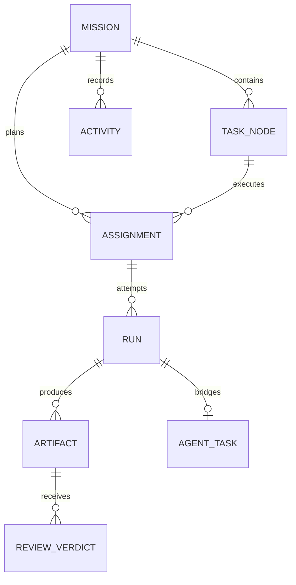

# LieXiu 编排领域与执行平面设计

## 1. 设计目标

编排领域负责把一个 Mission 可靠地推进为可审计的交付；执行平面负责在具体 Agent/Runtime 中完成一次运行。
两者通过窄接口连接：Orchestrator 决定“为什么、由谁、何时执行”，Execution Plane 只报告“这次运行发生了什么”。

## 2. 领域模型

- `Mission` 与 `TaskNode` 分别复用 root/child Issue ID；`issue_dependency` 的规范方向是 `blocked_by`。
- `Assignment` 的 scope 可以是 Mission 或 TaskNode。Mission scope 用于 Planning，TaskNode scope 用于执行、审查和集成。
- 一个 Assignment 可以有多个 Run，但一次 Run 只能桥接一个 AgentTask；技术重试、返工和人工重试均追加历史。
- Run 到 AgentTask 的唯一关联存放在 AgentTask 的 `orchestration_run_id`，不建立相互覆盖的双向事实。
- 关系表保存当前态，`orchestration_activity` 以 Mission 内单调 sequence 保存审计与增量读取事实。

## 3. Duty、RoleProfile 与策略快照

系统固定四种业务职责 `Duty`：`planner`、`executor`、`reviewer`、`integrator`。Duty 是状态机可理解的稳定语义，
不允许用户任意改变其业务含义。

`RoleProfile` 是可配置的人格与能力模板，例如“Go 后端工程师”“安全审查员”“技术总编”。它可以定义提示词、
required capabilities、Runtime/模型偏好、工具权限、预算、超时和并发限制，但不能发明新的状态机分支。

Mission 启动时冻结 `RolePolicySnapshot`，至少包含：

- duty 与 role profile 版本；
- required capabilities 和显式 Agent binding；
- allowed/preferred runtimes、provider/model；
- 工具与路径权限；
- token/cost/time/rework/technical-retry 预算。

快照保证运行中修改全局配置不会悄悄改变既有 Mission。

## 4. 真实 Planner 合同

Planner 是 Mission 级能力，不是 DAG 内的普通前置 TaskNode。流程如下：

1. `CreateMission` 保存目标、上下文、交付标准和预算；
2. Orchestrator 建立 Mission-scope Planning Assignment/Run，并通过统一 ExecutionGateway 执行；
3. Planner 产出版本化 `PlanProposal` Artifact，而不是直接写 TaskNode；
4. Go 校验器验证 schema、唯一键、DAG 无环、依赖存在、角色合法、预算、权限和规模上限；
5. Owner 可以编辑、拒绝或批准 PlanProposal；批准后由 `SubmitPlan` 原子建立 TaskNode/DAG；
6. 现有固定 `execute -> integrate` QuickCreate 仅作为确定性降级路径，不能伪装成智能规划。

同一个校验器服务于 LLM Planner、人工编辑和固定模板，保证厂商切换不改变领域规则。

## 5. 确定性 Agent/Runtime 选择

候选选择顺序固定为：

1. Mission/TaskNode 显式 binding；
2. RoleProfile 允许的 Agent 候选；
3. Runtime 在线且与平台架构可用；
4. capabilities、工具/路径权限和模型约束匹配；
5. 容量、并发与预算可用；
6. Reviewer 与被审查 Artifact 的 producer 满足分离约束；
7. 按稳定 preference、负载和 ID 次序决胜。

选择结果和淘汰原因写入 Assignment/Activity，便于解释“为什么是这个 Agent”。第一阶段不引入自学习权重、黑盒评分
或不可复现的随机负载均衡。

## 6. 命令与并发合同

业务写入必须经过显式 Command，包括 `CreateMission`、`RequestPlan`、`ApprovePlanProposal`、`SubmitPlan`、
`StartMission`、`CancelMission`、`Dispatch/Advance`、`ReconcileRun`、`RecordReviewVerdict`、`RetryTaskNode`。

- Command 携带 `command_id` 和 `expected_revision`；重放幂等，陈旧 revision 失败。
- 状态变化和对应 Activity 在同一数据库事务完成。
- Orchestrator 是 Mission、TaskNode、Assignment、Run、Artifact 与 Review 业务状态的唯一写入者。
- AgentTask 的成功只能使 TaskNode 进入 Review/等待裁决，不能绕过 Reviewer 直接完成。
- Review 要求返工时新建 Assignment/Run/Artifact，旧交付物保持不可变。
- 依赖只在所需 Artifact 被批准后放行；Mission 取消后不再启动后继节点。

## 7. 执行平面合同

`ExecutionGateway` 只暴露 `Enqueue` 和 `Cancel`。它把标准 RunSpec 转换为 AgentTask：prompt、上下文引用、
worktree、Runtime、模型、权限、超时和预算，随后由 daemon 完成 claim、start、日志流、终态和资源用量上报。

AgentTask 生命周期保留 `deferred / queued / dispatched / waiting_local_directory / running / completed / failed /
cancelled`。TaskService 管理 lease 和运行事实，不为编排 Run 自动重试，不推进 TaskNode，不创建后继任务。

Runtime Adapter 负责：

- 将标准 RunSpec 转换为厂商 CLI/协议；
- 归一化 stdout/stderr、结构化事件、工具调用、usage 和终态；
- fail closed 地报告 protocol、permission、worktree 和未知错误；
- 不知道 Mission DAG、Review Gate 或像素世界。

DeepSeek Harness 当前通过 `dsh` Runtime Adapter 接入。只有当跨 Runtime 的结构化工具合同稳定且真实需要出现时，
才增加薄 `liexiu-bridge` 插件；相同能力必须也能经 MCP/Skill 暴露给其他 Runtime。

## 8. 结构化协作 Mailbox

Agent 协作采用 Mission-scoped 异步 Mailbox，不恢复全局 Chat。消息类型限定为：

- `context_request` / `context_response`；
- `handoff`、`artifact_notice`；
- `review_feedback`、`blocker`、`decision_request`。

每条消息包含 Mission、可选 TaskNode/Run/Artifact、sender、recipient、状态、幂等键、TTL 和 hops。接收者在下一次
Run 的上下文构建阶段读取有界消息，不能通过消息直接改写业务状态。重要结果必须升级为 Artifact、ReviewVerdict、
Human Gate 或 Command；消息行为继续投影为 `orchestration_activity`，不新增第二套 AgentEvent 存储。

## 9. 失败、恢复与预算

| 事实 | 归约 |
| --- | --- |
| Plan 非法 | 保留 Proposal 与拒绝原因，不部分建立 DAG |
| 无合格 Agent | Assignment/TaskNode blocked，并展示淘汰原因 |
| enqueue 暂时失败 | queued 到 dispatch deadline；到期 blocked |
| Runtime 离线/dispatch timeout | 预算内技术重试，超限 blocked |
| provider 网络/进程 timeout | 预算内新 Run，超限 failed |
| protocol/permission/worktree/unknown | fail closed，默认不自动重试 |
| Review changes requested | 预算内新返工 Assignment/Run，超限进入 Human Gate |
| 重复终态 | 幂等忽略；保留首次合法终态 |
| cancel 与 terminal 竞争 | 行锁/revision 下首个合法终态获胜 |
| server 重启 | RunReconciler 扫描非终态并从 AgentTask 事实恢复 |
| WebSocket 丢失 | 客户端按 sequence 重拉 Projection |

预算至少覆盖 token、cost、wall time、技术重试次数和 review rework 次数。自动动作必须同时满足权限、预算与 deadline；
超限时交给 Owner，而不是无限重试。

## 10. Projection 与验收不变量

`MissionProjection` 汇总 Mission、DAG、Role/Agent team、Assignment/Run、Artifact/Review、预算、Human Gate、Activity
和选中 Run 详情；Snapshot 与 sequence 增量必须可组合恢复。

最低验收场景包括：并行 A/B 后 C 集成、一次技术重试、一次审查返工、取消竞态、重复 Command、daemon 离线、
server 重启、WebSocket 漏事件、无候选 Agent、Planner 非法输出、多 Runtime 协作和 Reviewer/Producer 分离。
