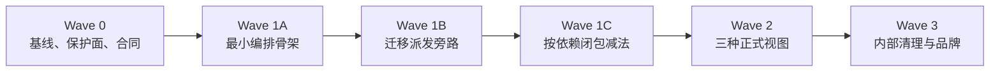

# Wave 0–3 实施路线与进度总览（已封板）

## 1. 文档定位

本文是 LieXiu Wave 0–3 的历史封板，用于回答三个问题：

1. 当前处于哪个 Wave；
2. 已完成、正在推进和尚未开始的工作分别是什么；
3. 进入下一 Wave 前还缺哪些硬门槛。

稳定产品和技术合同已经收敛到[正式设计](../正式设计/README.md)。Wave 4–6 的当前状态维护在
[14-Wave 4-6 实施路线与进度总览](14-Wave%204-6实施路线与进度总览.md)。本文只保留已完成阶段的执行顺序、
退出结论和证据链接，不再维护领域合同或未来进度。

命令、日志、临时 ID、动态测试输出和一次性问题进入 `../../../.work/tasks`，不复制到本文。

## 2. 状态口径

| 标记 | 含义 |
| --- | --- |
| ✅ | 已满足该工作项的完成证据和退出条件 |
| 🚧 | 正在推进，已有部分稳定产出 |
| ⬜ | 尚未开始，或只完成了不构成该工作项的前置分析 |
| ⛔ | 存在阻塞，必须先解决才能继续关键路径 |
| ⏸ | 明确延后，不在当前关键路径 |

“完成项/总工作项”只统计本表列出的可验证工作包，不代表工时百分比。工作量或边界变化时先更新工作包，再更新
计数，不能用主观百分比制造进度。

## 3. 总体路线

这一顺序是对 03 早期波次的实施收敛：叶子域和身份域的删除范围没有改变，但最小 Orchestrator 被前移到
所有大规模删除之前。原因是旧 AgentTask 生产者必须先有明确替代入口，才能安全移除。

## 4. 总体进度

| Wave | 状态 | 完成项 | 当前结论 |
| --- | --- | ---: | --- |
| Wave 0：基线、保护面、合同 | ✅ | 5 / 5 | v0.4.26 基线和 MVP 合同已形成 |
| Wave 1A：最小编排骨架 | ✅ | 10 / 10 | 三面 Projection 纵切与八个关键场景已收口 |
| Wave 1B：迁移派发旁路 | ✅ | 6 / 6 | 旧产品入口全部停产；Mission/Orchestrator 是唯一新业务执行入口 |
| Wave 1C：产品减法 | ✅ | 13 / 13 | 所有目标产品入口与旧派发副作用均已退出，历史兼容数据层转入 Wave 3 治理 |
| Wave 2：三种正式视图 | ✅ | 5 / 5 | 三面、生命周期、恢复合同及 Saved View/Property 全栈减法均已验收 |
| Wave 3：内部清理与品牌 | ✅ | 5 / 5 | 旧域消费者、query/generated、配置与数据库对象已收敛；个人版 schema 在隔离库和黄金场景验收通过 |

**Wave 1B、Wave 1C、Wave 2、Wave 3 已完成并封板。下一阶段进入真实 Planner、Role/Runtime 精确路由、结构化协作和 Phaser 像素世界，状态统一见新进度板。**

## 5. Wave 0：基线、保护面和合同

| 工作项 | 状态 | 完成证据 |
| --- | --- | --- |
| W0.1 固定 `v0.4.26`、开发分支和文档基线 | ✅ | 02、03、04 |
| W0.2 建立本地研发入口和远端使用边界 | ✅ | 05；本地 Web/server/PostgreSQL/daemon 可运行 |
| W0.3 梳理 Issue→AgentTask→daemon→runtime 主链 | ✅ | 06 |
| W0.4 建立创建入口保护和 fake runtime 恢复基线 | ✅ | `task_creation_boundary_test.go`；Wave 0 动态收据 |
| W0.5 冻结 MVP v0.1 领域合同 | ✅ | 07 |

Wave 0 完成只表示“可以安全开始最小编排实现”，不授权直接删除 Chat、Squad、Autopilot 或其他深耦合域。

## 6. Wave 1A：最小编排 Walking Skeleton

| 编号 | 工作项 | 状态 | 证据/退出条件 |
| --- | --- | --- | --- |
| 1A.1 | 新增 Mission、TaskNode、Assignment、Run、Artifact、Review、Activity schema | ✅ | migration 314–329 已建立 additive schema 和独立 concurrent indexes |
| 1A.2 | 实现 Plan v1 校验、DAG 就绪计算和纯状态机 | ✅ | `../../../server/internal/service/orchestration` 的目标测试 |
| 1A.3 | 完成 sqlc 生成、编排 queries 和 repository 事务入口 | ✅ | sqlc v1.31.1 固定；CreateMission/SubmitPlan、Activity、sequence、幂等和失败回滚通过本地 PostgreSQL 目标测试 |
| 1A.4 | 实现 CreateMission、SubmitPlan、StartMission、CancelMission | ✅ | owner 权限、完整 Plan 校验、陈旧 revision、首批 ready 计算和取消状态通过目标测试 |
| 1A.5 | 实现关系状态与 Activity 同事务写入 | ✅ | 四个 Command 串行/并发重放不重复写；Mission Activity sequence 连续单调 |
| 1A.6 | 建立 ExecutionGateway 和 Run→AgentTask 唯一桥接 | ✅ | 8 路并发及提交结果重放只产生一个 AgentTask；取消重放通过 TaskService 完整取消链 |
| 1A.7 | 实现 RunReconciler 和启动恢复 | ✅ | Mission 行锁下 success/fail/cancel/timeout/offline 幂等归一化；启动立即扫描、周期游标恢复和超时取消重试通过目标测试 |
| 1A.8 | 跑通 Artifact、Review、返工和 A/B→C 三节点闭环 | ✅ | 确定性 fake execution fixture 完成并行、一次技术重试、一次审查返工、批准依赖放行和最终集成；见 `../../../.work/tasks/wave1a-walking-skeleton/receipt.md` |
| 1A.9 | 暴露 MissionProjection 和最小 HTTP API | ✅ | workspace-scoped snapshot、Activity 增量和 Run 详情共用同一读模型；刷新、漏事件和超前游标均可恢复；见 `../../../.work/tasks/wave1a-projection-api/receipt.md` |
| 1A.10 | 建立三面占位 Web 页并通过八个关键场景 | ✅ | 看板、方块角色世界、Run 详情共用一个 Projection；见 `../../../.work/tasks/wave1a-three-view-web/receipt.md` |

### Wave 1A 退出门槛

- Orchestrator 是新 Mission 的唯一业务状态写入者。
- AgentTask 成功只使 TaskNode 进入 Review，不绕过批准直接完成。
- A、B 可以并行，C 不能在前置 Artifact 批准前运行。
- Review 驳回创建新 Assignment/Run/Artifact，不覆盖历史。
- 同一 Run 不会创建两个 AgentTask，取消和终态竞争只有一个权威结果。
- server 重启、daemon 离线或 WebSocket 丢失后能从数据库恢复。
- 默认测试只使用 fake runtime，不发现或调用用户安装的真实 Agent CLI。

## 7. Wave 1B：迁移自动派发旁路

| 编号 | 工作项 | 状态 | 退出条件 |
| --- | --- | --- | --- |
| 1B.1 | 固定所有 AgentTask 创建入口和允许调用白名单 | ✅ | 静态边界测试能发现新旁路和已消失入口 |
| 1B.2 | 将 Issue assignee 自动启动迁移为 Orchestrator Command | ✅ | 普通 Issue 的 agent assignee 只保留所有权元数据，create/update/batch/handoff 均不能直接产生执行；显式 Mission Command 是替代入口；见 `../../../.work/tasks/wave1b-issue-assignment/receipt.md` |
| 1B.3 | 将 Quick Create 迁移为 CreateMission/SubmitPlan | ✅ | Web/Slack Quick Create 只幂等建立 ready Mission 与固定计划，不创建 Run/AgentTask；见 `../../../.work/tasks/wave1b-quick-create/receipt.md` |
| 1B.4 | 将 retry/rerun policy 归还 Orchestrator | ✅ | TaskService 排除编排 Run；failure_kind、自动技术重试和 owner 手工解除 blocked 由 Orchestrator 决定；见 `../../../.work/tasks/wave1b-retry-policy/receipt.md` |
| 1B.5 | 用 Role + Assignment 替代 Squad leader 自动分派 | ✅ | Issue/Squad/handoff/comment/child-done 只保留元数据与业务事实，不再创建 AgentTask；见 `../../../.work/tasks/wave1b-producer-cutover/receipt.md` |
| 1B.6 | 停止 Autopilot/Channel 后台生产者并收缩白名单 | ✅ | Autopilot/Chat/Channel/Onboarding 入口与后台启动已停产，边界和全包回归通过；见 `../../../.work/tasks/wave1b-producer-cutover/receipt.md` |

Wave 1B 完成前不删除旧生产者代码；先停止入口和后台写入，确认无活跃读写后再进入 Wave 1C 删除闭包。

### Wave 1B producer 闭包

Wave 1B 的退出判定按真实生产链而非页面或产品域名称计算。以下入口必须全部停止直接创建 AgentTask：

| 入口闭包 | 当前归属 | 收敛工作项 |
| --- | --- | --- |
| Web/Slack Quick Create | `CreateMission` + `SubmitPlan`，停在 ready | 1B.3 |
| 自动 retry、人工 rerun、offline/stale 失败归约 | TaskService 保留执行事实，Orchestrator 唯一决定业务重试 | 1B.4 |
| Squad leader、handoff、评论 mention/thread parent、child-done 唤醒 | 显式 Command、Role + Assignment、依赖传播 | 1B.5 |
| Onboarding shim、Web/Mobile Chat、Channel Chat | 停止生产；需要保留的入口只能提交 Mission Command | 1B.6 / 1C |
| Autopilot scheduler、failure monitor、create-issue/webhook repair、直接 SQL | 全部停产并移出白名单 | 1B.6 / 1C |
| claim/start/complete/fail/cancel、lease、runtime recovery、daemon wakeup | 纯 Execution Plane，继续保留 | 不删除 |

最终静态白名单只允许 `Run -> ExecutionGateway -> TaskService -> AgentTask` 桥接及 Orchestrator 已决定的技术重试；
任何普通 Issue、Comment、Squad、Chat、Channel 或 Autopilot 入口都不得以兼容名义继续生产 AgentTask。

## 8. Wave 1C：按依赖闭包执行产品减法

### 8.1 C1 叶子域

| 编号 | 删除单元 | 状态 |
| --- | --- | --- |
| 1C.1 | 为每个删除单元建立页面→API→service→DB→配置→依赖→文档闭包 | ✅ |
| 1C.2 | Mobile | ✅ |
| 1C.3 | 独立文档站和公共营销页面 | ✅ |
| 1C.4 | PostHog 和 Feedback | ✅ |
| 1C.5 | Helm/Kubernetes 发行物 | ✅ |
| 1C.6 | Channel 集成和 Composio | ✅ |
| 1C.7 | Billing、Subscription、Stripe、Cloud Credits | ✅ |
| 1C.8 | 插件分发体系；保留本地 Skills、MCP、Runtime Adapter | ✅ |

### 8.2 C2 身份与深耦合产品域

| 编号 | 删除/改造单元 | 状态 |
| --- | --- | --- |
| 1C.9 | 本地 owner bootstrap 与唯一内部 Workspace | ✅ |
| 1C.10 | 邀请、成员、席位、公开注册和 Workspace 切换产品 | ✅ |
| 1C.11 | 全局 Chat、Floating Chat、Mika、Agent Builder、onboarding | ✅ |
| 1C.12 | Autopilot 产品域 | ✅ |
| 1C.13 | Squad 和旧 Inbox 产品语义 | ✅ |

每个单元只有在导航、API、后台任务、数据库读写、配置、依赖、测试和文档全部收敛后才标记完成。隐藏页面或
停止注册路由不算删除完成。

1C.9 的冻结合同见 11，生成、数据库、HTTP、真实 router、Daemon、前端和部署安全验证见
`../../../.work/tasks/wave1c-local-owner-bootstrap/receipt.md`。1C.10 采用非破坏性迁移：先停止公开身份和邀请/成员/Workspace
产品生产者，再删除消费者；历史表和已有 Workspace/Mission/Run 数据不在本波物理删除。实现与验证收据见
`../../../.work/tasks/wave1c-single-owner-cleanup/receipt.md`。1C.11 与 1C.13 的产品入口、隐式派发和共享 UI/Core/server 闭包见
`../../../.work/tasks/wave1c-chat-cleanup/receipt.md` 与 `../../../.work/tasks/wave1c-squad-inbox-cleanup/receipt.md`；历史兼容表、query/generated
和 teardown 统一转入 Wave 3 的非破坏治理 Gate。

## 9. Wave 2：三种正式视图

| 编号 | 工作项 | 状态 |
| --- | --- | --- |
| 2.1 | 固定 MissionProjection、Activity 增量和重拉合同 | ✅ |
| 2.2 | 项目总看板和 DAG 视图 | ✅ |
| 2.3 | Agent/Run 执行详情、Artifact、Review、lineage | ✅ |
| 2.4 | 像素世界正式状态映射、角色和地图基础 | ✅ |
| 2.5 | 刷新、断线、重启、历史回放一致性与任务产品减法验收 | ✅ |

Wave 1A 的方块角色页面只是 Projection 纵切证明，不等于 Wave 2 的正式游戏化产品完成。

Wave 2 的统一恢复、生命周期 HTTP、Quick Create 导航、DAG/Run/像素状态、Saved View/Property 全栈删除及任务产品
UI 减法证据见 `../../../.work/tasks/wave2-visual-surfaces/receipt.md`。

## 10. Wave 3：内部清理、数据库和品牌

| 编号 | 工作项 | 状态 |
| --- | --- | --- |
| 3.1 | 删除无引用 handler/service/query/event/background job | ✅ |
| 3.2 | 删除失效配置、依赖、镜像、CI 和数据库对象 | ✅ |
| 3.3 | 重新生成数据访问代码并拆分仍然超大的真实职责模块 | ✅ |
| 3.4 | 满足条件后压缩为个人版 v1 schema，完成黄金场景回归 | ✅ |
| 3.5 | 修改自有品牌、名称和正式像素美术 | ✅ |

3.4 已完成数据分类、两阶段授权清理、fail-closed migration 337–339、SQLC 幂等重生、隔离库 up/down/runner
验证与黄金场景回归，证据见 `../../../.work/tasks/wave3-data-schema/receipt.md`。用户 `liexiu` 库已在完整快照后由正式
runner 应用 336–339，并通过物理 schema 核验。活跃产品、包、CLI、Desktop、Compose 和数据库身份已统一为
“列宿 · LieXiu”；历史来源和不可变 migration 保留 Multica 名称。

## 11. 后续能力移交

以下能力已经从本历史板移交给 Wave 4–6 新进度板：

| 能力 | 新归属 |
| --- | --- |
| 真实 LLM Planner | Wave 4A |
| RoleProfile 与多 Runtime 路由 | Wave 4B |
| 结构化 Agent 协作 | Wave 4C |
| Phaser 像素世界与回放 | Wave 5 |
| 项目指挥中心和个人版 v1 | Wave 6 |
| 长期记忆、A2A、地图编辑器等扩展 | 新进度板“明确延后与止损线” |

## 12. 维护规则

1. 本文已封板，不再追加新工作项或动态状态。
2. 发现历史结论与实现不一致时，只做事实校准，不把未来路线重新写回本文。
3. 稳定合同维护在 `../正式设计`，当前进度维护在 `14-Wave 4-6实施路线与进度总览.md`。
4. 单次命令、重试、耗时和临时阻塞继续写入 `.work/tasks/<task>/receipt.md`。
