# LieXiu Wave 4–6 实施路线与进度总览

## 1. 文档定位

本文是 Wave 4–6 的唯一实施状态源。Wave 0–3 的历史结果已在
[08-Wave 实施路线与进度总览](08-Wave%20实施路线与进度总览.md)封板；稳定产品和技术合同以
[正式设计](../正式设计/README.md)为准。本文只维护依赖顺序、工作包、Gate、状态和稳定证据链接。

新主会话开始持续推进前，先按
[新会话接棒与多会话协同推进](15-新会话接棒与多会话协同推进.md)恢复仓库事实、建立任务合同并判断可并行 Lane；
该文档不改变本文的 Wave 状态和依赖顺序。

动态命令、日志、临时 ID、耗时、重试和单次测试输出进入 `.work/tasks/<task>/receipt.md`，不写入本文。

### 1.1 主会话与独立任务协同规范

Wave 5–6 是长链路专项，必须持续使用 `jusuan-installer/docs/平台开发联调部署规范.md` 第 2、3、5 节的会话
协同思想，并以[15-新会话接棒与多会话协同推进](15-新会话接棒与多会话协同推进.md)为 LieXiu 的落地约束。

> 为了节约 token 消耗的同时极大程度上加快推进效率和质量，需要参考 installer 项目里
> `docs/平台开发联调部署规范.md` 的会话协同思想；主会话负责分析、安排、调用创建 N 个
> Codex `gpt-5.6-luna` 独立会话去负责真正独立的工作，并统一完成逻辑分析、并行任务拆分、调度分配和进度跟踪。

执行时还必须同时满足：

- N 只由可单独验收的证据域或写集合决定，不为占满并发槽位拆任务；
- 独立任务显式使用 `gpt-5.6-luna` 和 `low`/`medium` reasoning，且必须声明目标、非目标、输入、写集合、
  禁止修改、完成条件和停止条件；
- 主会话独占公共 schema、migration、generated query、Projection、大型页面、正式设计、进度板、共享数据库、
  浏览器和发布 DAG，负责一次复核、统一集成和跨 Lane Gate；
- 独立任务不得自行创建下一层任务、扩大产品合同或修改本文状态；共享假设变化时立即回交主会话。

## 2. 状态口径

| 标记 | 含义 |
| --- | --- |
| ✅ | 合同、实现、目标门禁和运行事实均满足退出条件 |
| 🚧 | 正在推进，尚未满足完整退出条件 |
| ⬜ | 尚未开始 |
| ⛔ | 关键路径被明确阻塞 |
| ⏸ | 已有意延后，不计入当前关键路径 |

“完成项/总项”按下表的可验证工作包统计，不换算主观工时百分比。拆分或合并工作包时，先修订明细和总数。

## 3. 基线与目标差距

Wave 0–3 已具备 Mission、TaskNode、Assignment、Run、Artifact、Review、Activity、预算、恢复、统一
`MissionProjection`、三面 Web 纵切和 dsh Runtime Adapter。下一阶段需要补齐的不是另一套框架，而是让现有骨架变成
真正可配置、可协作、可游戏化的多 Agent 产品：

| 当前基线 | 目标能力 |
| --- | --- |
| QuickCreate 固定 `execute -> integrate` | Mission 级真实 Planner + 可审查 PlanProposal |
| 角色只有 executor/reviewer/integrator | 固定 Duty + 可配置 RoleProfile + Mission 策略快照 |
| Agent 选择主要按 online/capacity | 能力、权限、Runtime、预算、职责分离的确定性路由 |
| Activity/TaskMessage 已能表达运行事实 | 有界、结构化、可投影的协作 Mailbox |
| React 网格/CSS sprite 世界 | client-only Phaser、Tiled 地图、角色动画和共享选择 |
| Mission 级三列页面 | 项目级 Command Center、World、Replay 和统一 Inspector |

### 3.1 Pixel Agents 调研后的稳定决策

新调研不改变上述事实所有权。Pixel Agents 只作为像素表现层和工程实现参考，不整仓 fork，不引入它的
`AgentRuntime`、`AgentStateStore`、Claude HookProvider、server 或 WebSocket 协议。可在完成许可审计后借鉴或有界移植：

- Actor idle/walk/work 状态机、座位预留、网格寻路、气泡和生命周期；
- 像素整数缩放、Y 轴排序、相机跟随、素材 manifest、布局 schema 和视觉 E2E 经验；
- Core/Transport/UI 分层和外部素材来源、版本、许可的可追踪流程。

不新建统一 `AgentEvent` 数据库、持久化 `WorldActor` 或世界坐标，不把 `ReplaySnapshot.worldState` 变成新事实；
现有 Activity 仍是追加式事件事实，World 和 Replay 仍是 `MissionProjection` 的可重建投影。若回放需要加速，
只允许建立可删除、可重建的领域 Projection checkpoint。

### 3.2 Renderer 决策与 Wave 6B 校准

- 默认继续 Phaser，但在 5A.4 前使用同一份纯 `WorldModel`/`VisualEvent` 完成 1–2 日有界验证；只有 Tiled、
  相机、Actor 增量更新、client-only 生命周期、包体或泄漏指标出现可重复失败时，才在 Bridge 后改用
  PixiJS/Canvas；
- Wave 5 只交付一张固定 Tiled 地图和素材 manifest，布局编辑器、建造和经济系统仍延后；
- 首版 Duty 仍只是 planner/executor/reviewer/integrator；Researcher/Tester 等只可作为活动或场景语义，
  不扩张领域状态机；
- 4B.6 已完成 Codex 与 OpenCode/DeepSeek 异构真实验收；6B.1–6B.2 复用该 profile 和收据，把验收扩展到
  Command/World/Replay/Project Center，不重复消耗供应商配额；
- dsh 默认保持 Adapter-only；只有真实能力差距证明现有通用合同无法覆盖时，才重开薄 bridge 决策。

## 4. 总体路线

```mermaid
flowchart LR
    B["Wave 0–3 已封板"] --> P["Wave 4A<br/>真实 Planner"]
    P --> R["Wave 4B<br/>Role/Runtime 精确路由"]
    R --> M["Wave 4C<br/>结构化协作 Mailbox"]
    M --> S["Wave 5A<br/>视图拆分与 Phaser 壳"]
    S --> W["Wave 5B<br/>可交互像素世界"]
    W --> X["Wave 5C<br/>回放、一致性与可用性"]
    X --> C["Wave 6A<br/>项目级指挥中心"]
    C --> H["Wave 6B<br/>真实多 Runtime 验收"]
    H --> G["Wave 6C<br/>长期运行与个人版 v1 Gate"]
```

**当前 goal：持续推进并完成 Wave 5–6，直到个人版 v1 Gate 收敛。** Wave 4A 与 4B 已跨 Gate。4B.6 的默认 PostgreSQL Golden 和显式
`realacceptance` 均已闭合；真实 `codex/gpt-5.6-luna` 与 `opencode/deepseek-chat` 在同一 Mission 中完成七段
规划、执行、独立审查与集成，B 离线后回退到 A、重启复用原 Runtime，并以 `final_delivery`、completed/100%
Projection 和零终态预算预留收敛。4C.1–4C.4 已完成消息 schema、持久化/权限/终态、Planning/Work/Review Run 的
有界 context 冻结/消费/重试复用，以及 task-token 派生身份的跨 Runtime Skill+CLI 工具合同。4C.5 已确认 dsh 的 task 环境、
原生 Skill 和通用 MCP overlay 足以覆盖该合同，不新增重复的 bridge。4C.6 已使 Command、World、Inspector 从同一 Activity
摘要定位消息，并闭合 Snapshot 重拉、重复、后台过期回收、hop 上限、权限拒绝和 payload 隔离。Wave 5 已完成正式像素世界、
Replay、恢复、性能/降级、可访问性和资产治理；Wave 6A 已完成项目级只读聚合、Owner action 下钻和跨 Mission capacity。
Wave 6B 已复用 4B.6 的真实异构 Runtime 收据，并闭合项目/三面汇合、失败切换矩阵和 dsh Adapter-only 边界。
6C.3 已完成单 Owner、认证授权、secret redaction、worktree、Artifact、Runtime 和预算边界矩阵。
6C.4 已收敛正式设计入口、自托管升级/回退手册、已知限制和个人版 v1 发布清单。
当前关键路径是 6C.1 与 6C.2 的长期运行和部署 Gate。

## 5. 总体进度

| Wave | 状态 | 完成项 | 退出结论 |
| --- | --- | ---: | --- |
| Wave 4：真实异构 Agent 团队 | ✅ | 18 / 18 | Planner、Role/Runtime 路由和结构化协作闭环 |
| Wave 5：正式像素世界与回放 | ✅ | 16 / 16 | Replay、恢复、性能/降级、可访问性和资产流程均已跨 Gate |
| Wave 6：项目指挥中心与个人版 v1 | 🚧 | 11 / 13 | 项目级 Command Center、真实多 Runtime、安全边界和发布文档已完成；长期运行与部署 Gate 推进中 |
| **合计** | 🚧 | **45 / 47** | 当前 goal 是完成 Wave 5–6；Wave 6C.1 是关键路径 |

## 6. Wave 4：真实异构 Agent 团队

### 6.1 Wave 4A：Mission 级真实 Planner

| 编号 | 工作包 | 状态 | 退出条件 |
| --- | --- | --- | --- |
| 4A.1 | 冻结 Planning scope 与状态合同 | ✅ | Assignment/Run 可面向 Mission scope；不建立第二执行链；迁移和 API 兼容方案明确 |
| 4A.2 | 定义 `PlanProposal` Artifact schema | ✅ | 输入、节点、依赖、Duty、预算、验收标准和版本可序列化；非法输出有结构化原因 |
| 4A.3 | 经 ExecutionGateway 执行 Planner | ✅ | fake/真实 Planner 都走标准 Run→AgentTask 桥接；运行可取消、超时和恢复 |
| 4A.4 | 实现确定性 Plan 校验与提交 | ✅ | schema、唯一键、DAG、依赖、Duty、规模、预算和权限校验原子化；无部分 DAG |
| 4A.5 | 实现 Owner 计划 Gate | ✅ | Proposal 可比较、编辑、拒绝、批准；revision/command_id 并发安全；审计完整 |
| 4A.6 | 保留确定性降级并完成恢复验收 | ✅ | 固定模板 fallback 显式可见；非法输出、重复提交、重启、取消和预算超限场景通过 |

#### Wave 4A Gate

- Planner 不直接写 TaskNode，不绕过 `SubmitPlan`；
- Planning 使用现有 Assignment/Run/AgentTask/Reconciler，不复制 lifecycle；
- 同一 Proposal 可重放但不重复建立 DAG；
- 未批准计划不能启动 Mission；
- Planner 不可用时 Owner 仍能用人工或固定模板继续工作。

### 6.2 Wave 4B：RoleProfile 与 Runtime 精确路由

| 编号 | 工作包 | 状态 | 退出条件 |
| --- | --- | --- | --- |
| 4B.1 | 扩充固定 `Duty` 并建立 `RoleProfile` | ✅ | planner/executor/reviewer/integrator 语义固定；自定义角色不产生新状态机 |
| 4B.2 | 建立 `RolePolicySnapshot` | ✅ | Mission 冻结 capabilities、binding、Runtime/model、权限、预算和超时版本 |
| 4B.3 | 建立 Agent/Runtime 配置与只读诊断 UI | ✅ | Owner 能看到 online、capacity、capability、permission 和路由可用性 |
| 4B.4 | 实现确定性候选过滤和选择 | ✅ | 显式 binding→能力/权限→在线/容量→职责分离→稳定 preference；原因可解释 |
| 4B.5 | 强制 Reviewer/Producer 分离与 fail closed | ✅ | 无独立 Reviewer 时进入 blocked/Human Gate，不静默自审；越权 Runtime 被拒绝 |
| 4B.6 | 完成多厂商黄金场景 | ✅ | fixture Golden 与显式真实 harness 均通过；Codex/OpenCode+DeepSeek 分担规划/执行/审查/集成，离线回退与同 Runtime 恢复不改业务语义 |

#### Wave 4B Gate

- provider/model 只存在于策略和 Adapter，不进入 Mission 状态分支；
- 每次选择都可从快照、候选和淘汰原因复现；
- 运行中修改全局 RoleProfile 不影响既有 Mission；
- 无可用候选时 blocked，而不是回退到任意在线 Agent。

### 6.3 Wave 4C：结构化协作 Mailbox

| 编号 | 工作包 | 状态 | 退出条件 |
| --- | --- | --- | --- |
| 4C.1 | 冻结消息 schema 与类型 | ✅ | request/response、handoff、artifact_notice、review_feedback、blocker、decision_request 可版本化 |
| 4C.2 | 实现有界持久化与 Command | ✅ | Mission scope、recipient、dedup、TTL、hops、状态和权限同事务可审计 |
| 4C.3 | 把消息注入后继 Run context | ✅ | 只读取有权、有界、未过期消息；上下文 lineage 可追踪；不直接改业务状态 |
| 4C.4 | 统一 Runtime 工具合同 | ✅ | request_context/send_handoff/report_blocker 等经 MCP/Skill 可供不同 Runtime 使用 |
| 4C.5 | 评估并按需实现 dsh 薄 bridge | ✅ | 仅在通用合同稳定且 Adapter 无法覆盖真实能力时实施；没有 dsh 独占领域能力 |
| 4C.6 | 实现协作 UI 与恢复验收 | ✅ | Command/World/Inspector 可定位消息；断线、重复、过期、循环和权限拒绝通过 |

#### Wave 4C Gate

- Mailbox 不恢复全局 Chat，不允许无限广播、无限 hops 或自由修改任务；
- Artifact、Review、blocker 和 Owner 决策仍是权威业务事实；
- 消息事件进入现有 Activity sequence，不增加第二套事件存储；
- Runtime 不支持协作工具时仍可完成普通 Run。

## 7. Wave 5：正式像素世界与回放

### 7.1 Wave 5A：视图拆分和 Phaser Bridge

| 编号 | 工作包 | 状态 | 退出条件 |
| --- | --- | --- | --- |
| 5A.1 | 拆分 Mission page 产品壳 | ✅ | shell/board/run-detail/world 边界清晰；现有 Command/Detail 功能无回归 |
| 5A.2 | 固定纯 `WorldModel` | ✅ | Projection→zone/actor/state 映射无 Phaser 依赖且单测覆盖 |
| 5A.3 | 固定 sequence 化 `VisualEvent` | ✅ | Activity 有稳定映射、幂等键和未知事件 fallback |
| 5A.4 | 建立 client-only Phaser 生命周期 | ✅ | 动态加载、挂载、diff update、卸载；无 SSR、listener、ticker 和 canvas 泄漏 |
| 5A.5 | 打通共享 selection/Inspector | ✅ | React↔Phaser 只传领域 ID；刷新和 URL 深链保持同一 Run |

### 7.2 Wave 5B：第一张可交互项目世界

| 编号 | 工作包 | 状态 | 退出条件 |
| --- | --- | --- | --- |
| 5B.1 | 建立 Tiled 地图与六个语义 Zone | ✅ | 规划、执行、审查、集成、阻塞、交付区域可配置并有 debug overlay |
| 5B.2 | 建立角色资源与 AvatarController | ✅ | 四 Duty 可辨识；idle/walk/work/review/blocked/celebrate 动画可降级 |
| 5B.3 | 实现确定性入场、移动和增量同步 | ✅ | refresh/reconnect 可重建；Projection 更新不等待旧动画；不持久化坐标 |
| 5B.4 | 实现气泡、Artifact 与警告视觉 | ✅ | 协作、Review、blocked、offline、budget/Human Gate 可定位真实对象 |
| 5B.5 | 实现 Zone/Actor/Artifact 交互 | ✅ | 筛选、选择、Inspector 和 URL 同步；语义 Command 复用后端权限/并发合同 |
| 5B.6 | 完成第一张地图黄金场景 | ✅ | A/B 并行→返工→C 集成→交付，以及取消/离线/阻塞均可观察且状态一致 |

### 7.3 Wave 5C：Replay、一致性与可用性

| 编号 | 工作包 | 状态 | 退出条件 |
| --- | --- | --- | --- |
| 5C.1 | 建立 Snapshot + sequence Replay | ✅ | 播放、暂停、倍速、拖动和筛选不写业务状态 |
| 5C.2 | 建立断线/缺口/重复恢复 | ✅ | 连续增量与重拉 Snapshot 最终 WorldModel 一致；未知事件 fail soft |
| 5C.3 | 建立性能预算和降级 | ✅ | 实体上限、离屏裁剪、事件背压、低性能模式和按需资源加载可测 |
| 5C.4 | 建立可访问性和 reduced motion | ✅ | 键盘、文本替代、动画暂停、非颜色编码；World 关闭时全功能可用 |
| 5C.5 | 建立正式美术资产流程 | ✅ | 原创/许可明确、来源与版本可追踪，开发占位资产可替换且不耦合业务代码 |

#### Wave 5 Gate

- Phaser 是纯投影与交互层，不保存或推进 Mission 状态；
- Board、World、Replay、Inspector 对同一 sequence 得到一致领域对象；
- 世界不可用或低性能设备上，Owner 仍能完成所有管理动作；
- 页面往返、长时运行和 reconnect 不累积 scene 资源。

## 8. Wave 6：项目指挥中心与个人版 v1

### 8.1 Wave 6A：项目级 Command Center

| 编号 | 工作包 | 状态 | 退出条件 |
| --- | --- | --- | --- |
| 6A.1 | 定义 `ProjectCommandCenterProjection` | ✅ | 聚合多个 Mission 的状态、预算、风险、Gate 和 Agent capacity，不复制明细事实 |
| 6A.2 | 建立 Mission portfolio 与 attention queue | ✅ | blocked、超时、预算、Review、Planner/Human Gate 可排序、过滤和下钻 |
| 6A.3 | 收敛 Command/World/Replay 导航 | ✅ | 项目→Mission→Task/Run 深链、返回和 selection 一致 |
| 6A.4 | 建立显式 Owner action queue | ✅ | approve/reject/retry/reassign/cancel 具备 revision、权限、风险说明和反馈 |
| 6A.5 | 建立跨 Mission 资源观察 | ✅ | Agent/Runtime capacity、排队和预算可见，但不引入黑盒全局自动调度 |

6A 只新增 bounded read Projection 和 Project 页面投影，不新增表或第二状态机。Owner action 携带 Mission/Task/Gate revision、
`required_permission`、risk 与 reason；项目层只下钻到既有 Mission 命令面，未实现的 `reassign_task` 明确 fail closed。
动态/数据库/浏览器证据见 `../../../.work/tasks/wave5-6/receipt.md`。

### 8.2 Wave 6B：真实多 Runtime 端到端验收

| 编号 | 工作包 | 状态 | 退出条件 |
| --- | --- | --- | --- |
| 6B.1 | 固定两种以上真实 Runtime acceptance profile | ✅ | 复用 4B.6 已冻结的版本、capability、permission、模型和预算；默认测试仍不调用真实 CLI |
| 6B.2 | 验证异构角色团队完整交付 | ✅ | 复用 4B.6 真实 Mission 收据，验证 Command、World、Replay 和 Project Center 对同一交付事实收敛 |
| 6B.3 | 验证失败与切换 | ✅ | provider 错误、CLI 缺失、daemon 离线、timeout、权限拒绝、容量不足可恢复或 fail closed |
| 6B.4 | 冻结 dsh bridge 最终边界 | ✅ | 默认保持 Adapter-only；无真实能力差距则以“不发布 bridge”通过，有缺口时才实施跨 Runtime 等价薄 bridge |

6B 复用了真实 `codex/gpt-5.6-luna` 与 `opencode/deepseek-chat` 的七段路由、离线回退、同 UUID 重启、
RolePolicy、预算/usage 和 `final_delivery` lineage 收据，不重复消耗厂商配额。Command、World、Replay 与 Project Center
从同一 Projection/Activity/Run/Artifact/Review 事实汇合；provider/CLI/daemon/timeout/权限/容量及 PostgreSQL
Reconcile/Routing/Budget 矩阵通过。dsh 未出现通用 Adapter、task-token、Skill/CLI、MCP overlay 无法覆盖的能力缺口，
因此冻结为 Adapter-only，不发布 LieXiu 专用 bridge。动态证据见 `../../../.work/tasks/wave5-6/receipt.md`。

### 8.3 Wave 6C：长期运行、部署和个人版 v1 Gate

| 编号 | 工作包 | 状态 | 退出条件 |
| --- | --- | --- | --- |
| 6C.1 | 执行本地/远端 clean build 与升级验证 | ⬜ | 固定 commit、migration、备份恢复、版本回退和前后端/daemon 兼容明确 |
| 6C.2 | 执行长时 Mission 和重启恢复 | ⬜ | server/daemon/Web 重启、网络抖动、WS 缺口和过夜运行后事实收敛 |
| 6C.3 | 完成安全、隐私和资源边界验收 | ✅ | 单 Owner、CSRF/PAT、secret redaction、worktree、Artifact、Runtime 权限和预算通过 |
| 6C.4 | 收敛个人版 v1 文档与发布 Gate | ✅ | 正式设计、部署说明、已知限制、黄金场景和可恢复升级形成稳定入口 |

#### Wave 6 Gate

- 一个项目可以同时观察和管理多个 Mission，但领域事实仍归属于各自 Mission；
- 至少两种真实 Runtime 在同一 Mission 中协作，任一厂商退出不破坏控制面；
- Owner 的待办、风险、预算和交付可以从项目层直达证据；
- 本地开发、远端自托管、升级、失败恢复和数据保护形成可重复闭环。

## 9. 依赖与并行边界

| Lane | 主要写集合 | 前置 | 可并行边界 |
| --- | --- | --- | --- |
| Planner/Domain | `server/internal/service/orchestration`、migration、queries、core types | 4A 合同 | UI 可基于冻结 API mock 并行，不可自行发明字段 |
| Runtime/Router | Agent/Runtime repository、daemon/adapter、Role UI | 4A scope 稳定 | Adapter 验证可并行；调度 query 与 schema 需单 Owner |
| Mailbox | orchestration commands/repository/projection、runtime tools | 4B 策略合同 | UI 只在 message schema 冻结后并行 |
| World | `packages/views/orchestration/world`、地图和 sprite | 4C Projection 稳定 | 纯 WorldModel/资产可提前；业务 Command 不在 scene 实现 |
| Command Center | project projection、views、router | Wave 5 选择协议稳定 | 聚合查询与页面壳可并行，Mission 真相不复制 |
| Acceptance | fake fixtures、真实 Runtime profile、远端 receipts | 对应实现完成 | 验证只读/隔离运行，不与 schema 写并行 |

同一 migration、生成 query、公共 schema、Projection type 和大型页面文件不能由多个会话并发写。并行任务必须先声明
输入 commit、写集合、交付接口和禁止修改路径，再由主会话统一集成和执行适用门禁。

## 10. 明确延后与止损线

| 能力 | 状态 | 重新进入条件 |
| --- | --- | --- |
| dsh 专属深插件 | ⏸ | 通用 Runtime 工具合同稳定，且 Adapter-only 有被证实的能力缺口 |
| 自学习 Agent 评分/自动组织重构 | ⏸ | 确定性路由积累可解释数据且存在明确性能问题 |
| 长期记忆/RAG 平台 | ⏸ | Mission Artifact/Message 上下文无法满足真实重复场景 |
| A2A、开放 Agent 网络 | ⏸ | 本地团队合同稳定并出现外部互操作消费者 |
| 地图编辑器、建造、经济系统、3D 世界 | ⏸ | 第一张 Phaser 地图证明长期使用价值且不挤占控制面 |
| 多租户、云计费、插件市场 | ⏸ | 不属于个人版产品目标 |

以下情况立即停止扩展并回到当前工作包：出现第二业务状态机、provider 专属领域字段、LLM 直接写状态、像素坐标入库、
无限消息循环、默认测试误调用真实 CLI、或为了视觉效果绕过权限/预算/Human Gate。

## 11. 每个工作包的完成定义

1. 对应正式合同已明确；若合同变化，先更新 `../正式设计`；
2. 实现只修改声明的写集合，没有恢复已删除产品域；
3. 纯状态机/校验/映射具备单测，数据库并发和幂等具备目标集成测试；
4. UI 能从真实入口访问，Projection、URL、断线恢复和错误态符合合同；
5. Runtime 变更默认由 fake fixture 验证，真实 CLI 只在显式 acceptance profile 运行；
6. 适用门禁和运行事实写入 `.work` 收据，本文只更新状态和稳定链接；
7. 不存在未披露的 skip、基线失败、数据清理或远端写入。

## 12. 进度维护规则

1. 每次持续推进从“当前关键路径”的首个 ⬜ 项开始；开始标 🚧，完整退出才标 ✅。
2. Wave 内允许无写冲突的并行工作，但不能越过 Gate 把下游 mock 当作已完成能力。
3. 遇到阻塞标 ⛔，记录稳定原因和解除条件；动态重试过程只写 `.work`。
4. 需求变化先判断是否改变正式设计；只改变排期时仅更新本文。
5. Wave 4–6 完成后，本文件转为历史封板；下一阶段新建进度板，不持续膨胀本文件。
6. 新会话的接棒快照、任务拆分和多会话写集合维护在 15；本文仍是唯一 Wave 状态源。
