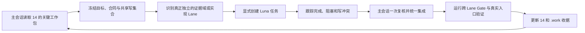

# LieXiu 新会话接棒与多会话协同推进

## 1. 文档定位

本文是新主会话接棒 Wave 4–6 的操作入口，解决“从哪里继续、哪些任务可以独立派发、如何统一回收”三个问题。
它不定义产品字段、状态机或技术方案，也不复制 Wave 状态：

- 稳定产品与技术合同以[正式设计](../正式设计/README.md)为准；
- 工作包顺序与完成状态以[Wave 4–6 进度板](14-Wave%204-6实施路线与进度总览.md)为准；
- 命令、日志、测试输出和临时阻塞进入 `.work/tasks/<task>/receipt.md`；
- Git 工作区、运行进程和数据库状态必须在新会话开始时重新只读取证，本文不把动态事实伪装为长期合同。

协同思想参照同级 `jusuan-installer` 仓库的 `docs/平台开发联调部署规范.md` 第 2、3、5 节；LieXiu 的任务边界、
共享写集合和接棒顺序以本文为准。

## 2. 新会话最小阅读顺序

新主会话不需要重读已清理的过程文档，按以下顺序建立上下文：

1. `docs/diy/正式设计/README.md`：确认四份权威设计各自的事实所有权；
2. `docs/diy/进度板/14-Wave 4-6实施路线与进度总览.md`：确认当前关键路径和 Gate；
3. 本文：确认接棒方式、并行边界和任务合同；
4. 只读取当前工作包直接拥有的正式设计正文；Wave 4A 默认读取正式设计 02；
5. 检查 `git status --short`、相对 `HEAD` 的目标 diff 和相关 `.work` 收据，再决定是否修改；
6. 只有归属不清时才扩读代码或历史封板，不重新进行全仓泛化调研。

## 3. 当前接棒基线

### 3.1 稳定基线

- `main` 已建立 LieXiu 个人版基线，Wave 0–3 已封板；
- Mission、TaskNode、Assignment、Run、Artifact、Review、Activity、预算、恢复和三面 Web 纵切已经存在；
- 个人版物理 schema 已应用，产品合同只允许一个 Owner、一个 canonical Workspace；
- 本地个人模式已形成稳定合同：非生产环境显式启用 `LIEXIU_AUTO_LOGIN=true` 后，localhost 浏览器可直接建立
  canonical Owner 会话，仍保留 JWT、CSRF、审计和 Workspace 边界；
- Wave 4–6 尚未开始计数，当前关键路径仍是 **4A.1 冻结 Planning scope 与状态合同**。

### 3.2 新会话必须重新确认的动态事实

新会话不得假设工作区干净，也不得丢弃已有改动。开始时至少确认：

```bash
git status --short
git log -1 --oneline --decorate
git diff --stat
git diff -- docs/diy/正式设计 docs/diy/进度板
```

当前交接批次包含正式设计收敛、过程文档清理和 localhost 个人免登录实现；在它们提交前，均属于需要保留并统一复核的
现有改动。是否已有开发服务、容器、临时备份或测试数据，应以当次只读检查为准，不能从旧会话描述推断。

## 4. 主会话职责

主会话是唯一集成与决策所有者，负责：

1. 从 14 的首个未完成关键工作包建立目标、非目标、完成条件和止损线；
2. 冻结跨 Lane 合同，决定哪些证据域或写集合真正独立；
3. 创建、跟踪和回收独立任务，处理任务间依赖与冲突；
4. 独占公共 schema、migration 顺序、生成代码、共享 API/DTO、Projection 和正式设计的最终修改权；
5. 对独立任务结果只做一次有针对性的复核与集成，不重新完整执行其分析；
6. 执行跨 Lane 门禁、真实入口验证和 Wave Gate，更新 14 的状态；
7. 披露基线失败、未验证项、授权外边界和剩余风险。

主会话不能把“创建了多个任务”视为进度；只有被集成、通过适用 Gate 并满足退出条件的结果才能更新 Wave 状态。

## 5. 独立 Luna 任务的准入条件

这里的“独立任务”是 Codex 侧边栏中用户可见、可单独跟进的独立会话，不是主会话内部不可见的角色模拟。独立任务
默认显式使用 `gpt-5.6-luna`，只承担边界明确的只读审计、机械修改、局部实现或目标验证；reasoning 按任务选择
`low` 或 `medium`。N 由可独立接受的 Lane 数决定，不能按可用并发槽位预先凑数。

同时满足以下条件才创建独立任务：

- 有独立的证据域或文件写集合，交付物可以单独判断正确；
- 输入合同已经冻结，不需要子任务自行发明共享字段或状态；
- 不与其他任务并发修改同一 migration、query/generated、公共 DTO、Projection 或大型页面；
- 不依赖尚未完成的数据库写、浏览器状态、构建产物或 Runtime 反馈；
- 主会话回收和复核成本明显低于并行收益；
- 任务失败不会破坏主链，停止条件明确。

以下情形不创建独立任务：只是文件很多、上下文很长、尚有空闲槽位，或者把同一设计人为拆成规划者/执行者/审查者
形式。跨领域方案、共享 schema、migration、生产或长期数据写由主会话或一个明确的单一 Owner 串行推进。

## 6. 每个独立任务的最小合同

主会话创建任务时必须写明以下字段，缺一则先不派发：

```text
模型：gpt-5.6-luna
Reasoning：low | medium
目标：一个可验证结果
非目标：明确不做什么
工作区与输入：仓库、基线 commit、允许读取的已有 diff
写集合：允许修改的精确目录/文件；只读任务写“无”
禁止修改：共享 schema、migration、generated、正式设计、进度板等
授权：只读 / 允许局部代码写；不含 stage、commit、push、数据清理和远端写
完成条件：目标测试、静态检查或证据清单
停止条件：合同缺失、发现写冲突、需要扩大数据/远端权限、两次重复失败
回传：结论、修改文件、验证、风险、建议下一步
```

独立任务不得自行创建下一层任务、扩大路径或修改进度板，除非主会话在任务合同中明确授权。

## 7. Wave 4A.1 的首轮协同建议

4A.1 是合同冻结工作，公共领域语义必须由主会话统一决策；可以并行收集三个互不替代的只读证据包：

| Lane | Luna 任务 | 允许范围 | 交付物 |
| --- | --- | --- | --- |
| Backend | 审计现有 Mission-scope Assignment/Run、Command、repository 与 migration 能力缺口 | `server/internal/service/orchestration`、相关 query/migration，只读 | 现状、缺口、最小迁移边界和测试入口 |
| API/Web | 审计当前 Mission API、core schema/client、QuickCreate 与计划 Gate UI 接点 | `server/internal/handler`、`packages/core`、相关 Web/View，只读 | 现有入口、兼容面、需要冻结的最小 API |
| Protection | 审计 Planning 相关测试、边界保护和已知基线失败 | 目标 tests、静态边界、`.work` 收据，只读 | 可复用保护、缺失场景和建议 Gate |

主会话汇总三份证据后，完成 4A.1 的唯一合同修改和实现拆分。进入代码实现后，再按实际写集合决定并行数；在 API
未冻结前，不派发前端实现，在 migration/query 未冻结前，不允许多个任务并发改数据库层。

## 8. 共享资源所有权

以下资源默认由主会话独占，除非某次任务合同显式移交给一个单一 Owner：

- `server/migrations` 与 migration 编号；
- `server/pkg/db/queries` 及对应 generated；
- `packages/core/types`、API schema/client 公共合同；
- `MissionProjection`、Activity sequence 与 Runtime 公共接口；
- Mission 主页面等跨模式大型文件；
- `docs/diy/正式设计`、14 和本文；
- 共享数据库、浏览器真实入口、开发服务和远端环境的写操作。

只读检查可以重叠，但不得把不同任务基于不同假设得出的 DTO 或迁移方案直接拼接。

## 9. 调度与回收循环



等待独立任务期间，主会话继续处理不与其写集合冲突的合同、集成或验证准备，不重复子任务正在进行的工作。发现共享
假设变化时先停止受影响任务，再更新合同；不能让多个任务各自修正公共接口。

## 10. 可直接用于新会话的启动指令

```text
请接棒 /Users/kailonyang/go/src/liexiu 的 Wave 4–6 持续推进。

先完整阅读：
1. docs/diy/正式设计/README.md
2. docs/diy/进度板/14-Wave 4-6实施路线与进度总览.md
3. docs/diy/进度板/15-新会话接棒与多会话协同推进.md
然后只按当前工作包读取对应正式设计和代码证据。

你作为主会话，先只读确认 git 状态、已有 diff、当前关键路径和动态运行事实，保护所有现有改动；不得 reset、覆盖、
stage、commit、push、清理数据或写远端，除非我另行明确授权。从 14 的首个未完成关键工作包继续，维护其状态和
.work 收据。

参考 jusuan-installer 的 docs/平台开发联调部署规范.md 第 2、3、5 节进行会话协同。只有存在真正独立且可单独验收的
证据域或写集合时，才创建 N 个独立任务；显式使用 gpt-5.6-luna 和 low/medium reasoning，并按 15 的最小任务合同
声明目标、非目标、输入、写集合、禁止修改、完成与停止条件。你负责统一分析、拆分、调度、进度跟踪、一次复核、
集成和跨 Lane Gate。N 由独立 Lane 决定，不为占满槽位而拆分任务。

先报告接棒审计和首轮任务 DAG，再直接开始安全范围内的推进；只有出现需要新增授权或会实质改变产品合同的选择时
才停下来询问。
```

## 11. 接棒充分性判定

满足以下条件即可新开主会话，无需依赖旧会话聊天记录：

1. 四份正式设计能回答产品边界、编排合同、身份/环境和三视图语义；
2. 14 能回答当前关键路径、依赖、Gate 和完成定义；
3. 本文能回答启动检查、协同准入、共享写集合和回收方式；
4. Git 与 `.work` 能回答未提交实现和动态验证事实；
5. 任何新增产品决策先回写正式设计，再进入实现。

若 Git 状态、14 和正式设计互相矛盾，新会话先做只读事实校准，不凭历史聊天记录选择其中一个，也不得擅自丢弃改动。
