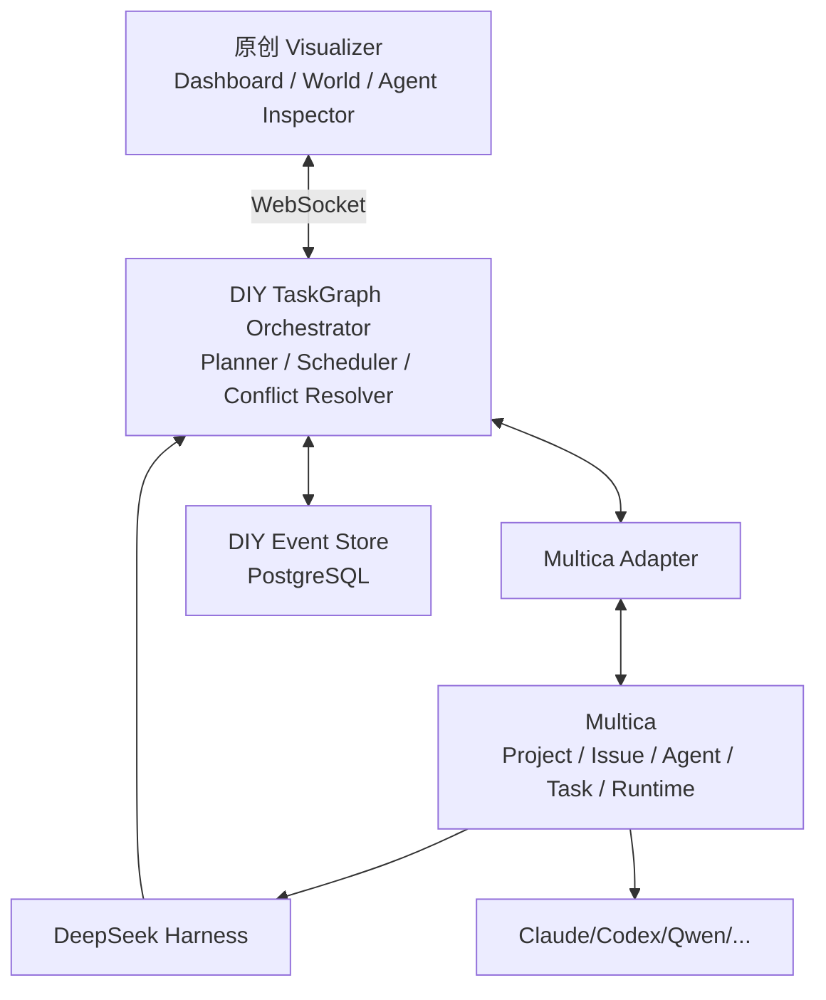
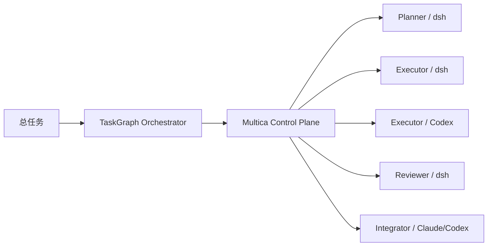
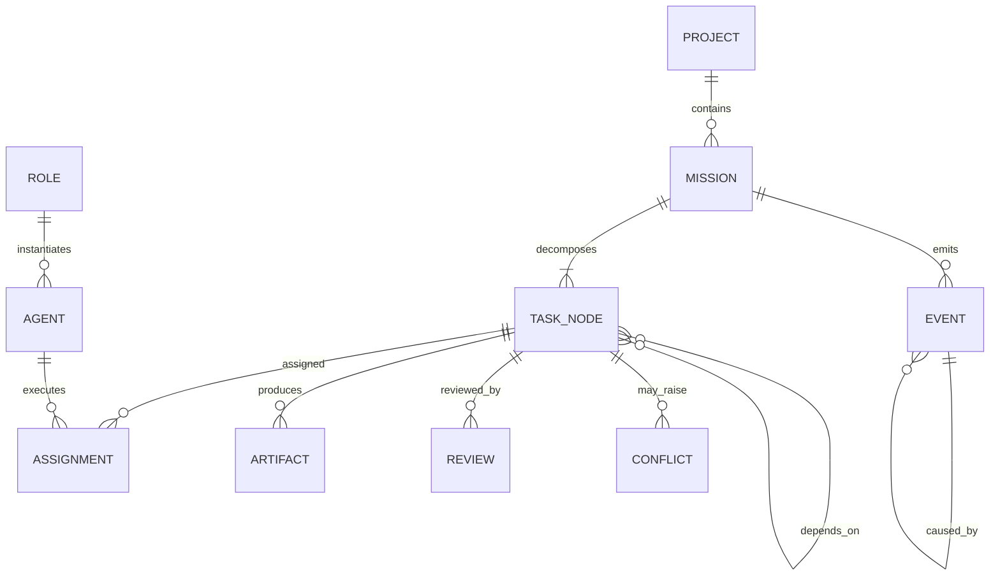
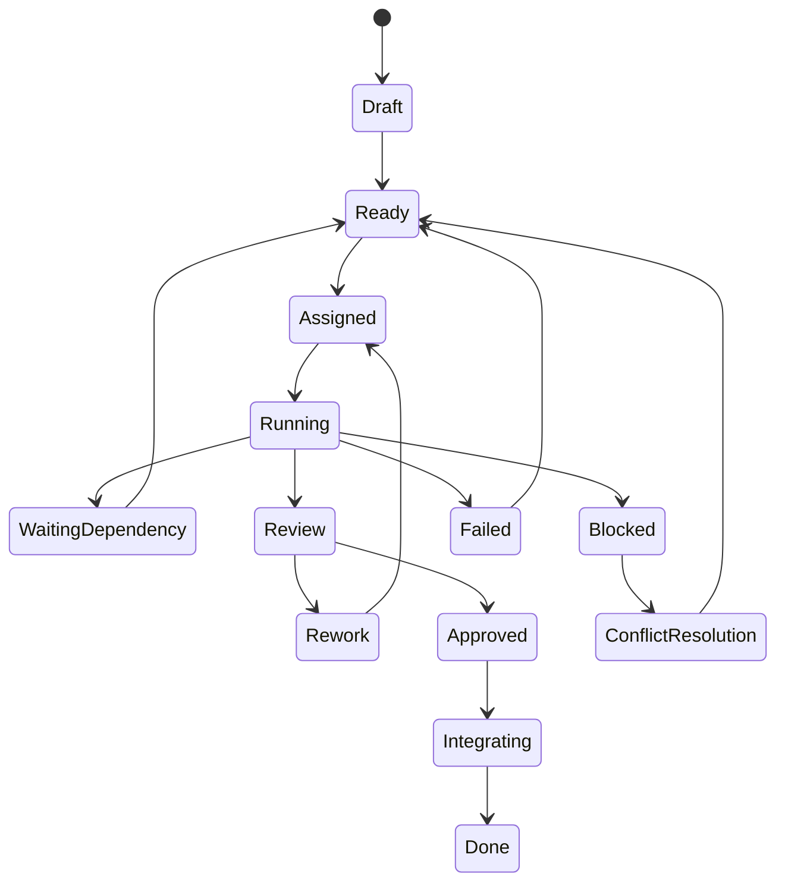
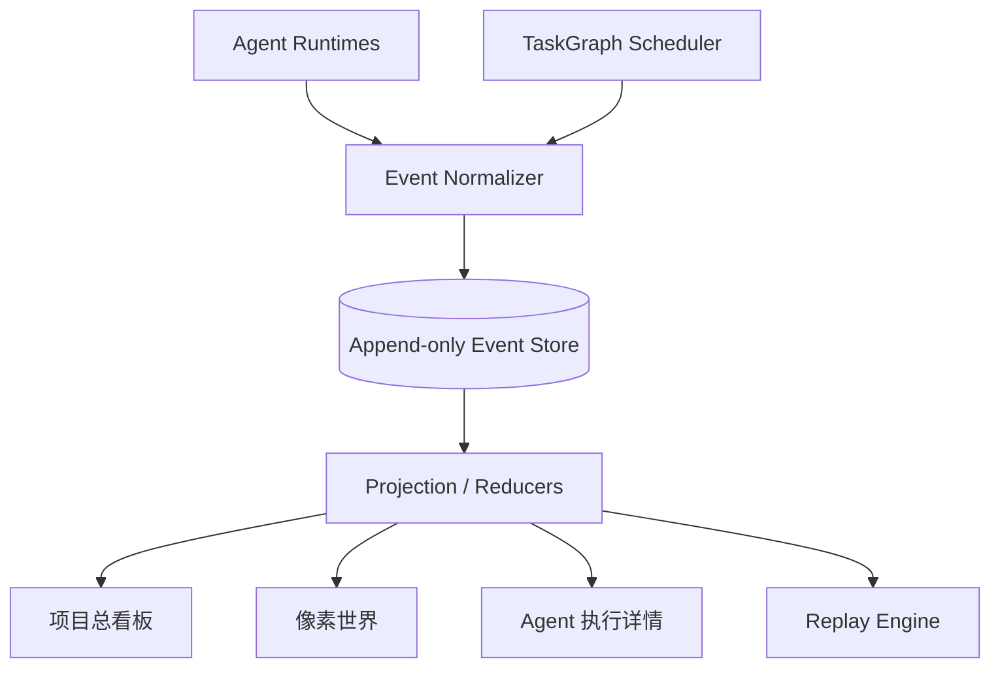
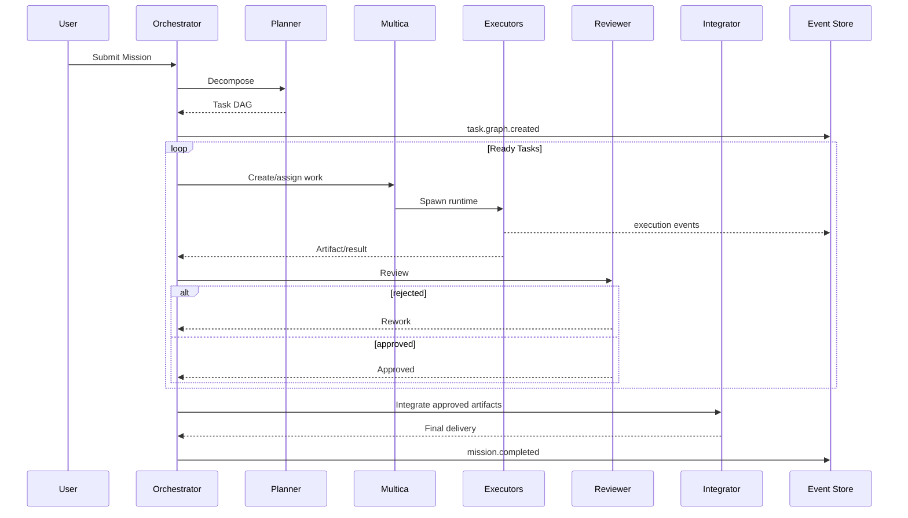
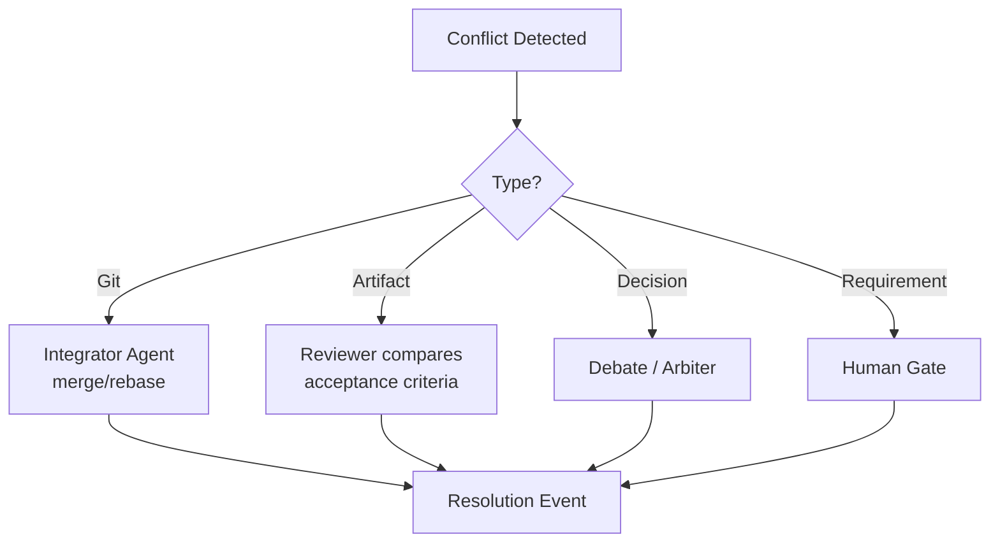
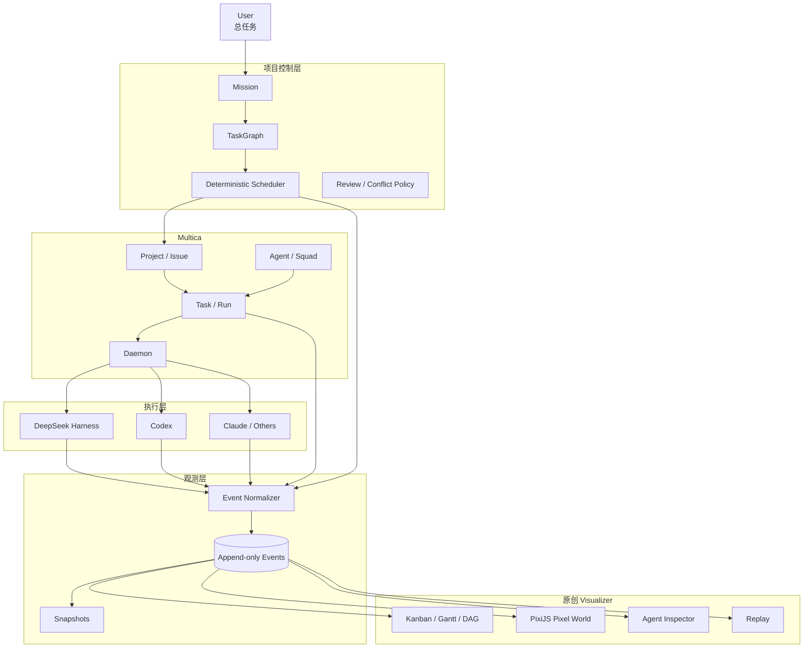

# 可视化多 AI Agent 项目管理工具：个人 DIY 深度技术调研与架构方案

## 执行摘要

你的目标并不是普通的“多 Agent 聊天室”，而更接近一个 **Agent-native 项目操作系统 + 可视化调度台 + 像素化数字孪生世界**：

> 用户下发总任务 → Planner 生成任务 DAG → Scheduler 根据角色、依赖和并发能力派发 → Executor 执行 → Reviewer 验收/打回 → Integrator 汇总 → 所有动作形成不可变事件流 → 同一份事件同时驱动项目看板、Agent 执行详情和像素世界 → 可暂停、追踪、审计、回放。

这是一个非常适合个人深度 DIY 的方向，但最关键的设计决定不是“选哪个 Agent 框架”，而是：

**不要把像素世界、项目管理状态和 Agent 运行时绑成一个系统。应当建立统一的任务图 + 事件日志作为事实源，三个可视化界面都只是这个事实源的不同投影。**

我的最终推荐是：

> **首选：Multica 作为项目/运行控制平面 + 自建 TaskGraph/Event Hub + DeepSeek Harness 作为可插拔执行 Runtime + 独立 Next.js/PixiJS 像素前端。**

而不是直接大改 Multica 内核，也不是把 DeepSeek Harness 当成整个项目管理系统。

原因非常关键：

Multica 本身已经非常接近你需要的“Agent 项目管理控制面”：它已有 Workspace、Project、Issue、Agent、Squad、Task、Runtime、执行日志、Review Gate、自动重试、自托管、WebSocket 和 PostgreSQL，而且其当前官方支持的 20 个 Agent CLI **已经直接包括 DeepSeek Harness 的 `dsh`**。也就是说，“Multica + DeepSeek Harness”并非需要自己发明的集成，而是官方已经留出了这条执行路径。citeturn19view0turn20view1turn20view2

但 Multica 的 `Task` 本质上是“一次 Agent run”，Agent 也是“被触发时才执行的配置”，现有官方概念里并没有完整暴露你所需要的 **任意 DAG 依赖、角色容量调度、冲突仲裁、Planner→Executor→Reviewer→Integrator 状态机**。因此不建议把这些强行塞进原有 `Task` 概念，而应该增加一个上层的 **TaskGraph Orchestrator**。这是根据 Multica 当前公开模型做出的架构判断。citeturn20view1turn20view3

DeepSeek Harness 则非常适合做底层“Agent 执行内核”：它明确采用 **Everything is a Plugin** 架构，模型适配器、工具注册、Session Log、Agent Loop 都是 Cordis 插件；持久 SessionEvent 是 append-only，UI、Replay、Fork、Resume、Telemetry 都可以从事件流派生。这几乎天然适合你的“执行详情 + 可视化审计 + 回放”。citeturn21view0

但 DeepSeek Harness 截至 **2026 年 8 月 16 日仍明确标注 Developer Preview，并警告会出现兼容性破坏性变化**，因此我不建议把八周 MVP 的“项目数据库、DAG 调度器、Kanban、Gantt、团队生命周期”全部建立在 Harness 内部插件 API 上。citeturn20view0

另外还有一个值得重点关注的新替代方案：**AgentScope 2.0**。截至 2026 年 8 月，AgentScope 已把事件系统、MCP、工具权限、沙箱、多 Agent/Agent Team、持久化和前端事件流做成较完整体系；官方中文资料也显示其 Java 2.0 已支持 `agent_spawn`、`agent_send`、子 Agent 实时事件转发、A2A/AG-UI、持久化与审计。若你最终觉得 Multica 的 License 或 Go/Next.js 改造负担过重，AgentScope 是我认为目前最值得迁移的第二基座。citeturn16search0turn16search4turn16search12

### 推荐程度总览

| 路线 | 适合程度 | 八周 MVP | 项目管理能力 | Agent 执行扩展 | 像素世界适配 | 长期维护 |
|---|---:|---:|---:|---:|---:|---:|
| **Multica + TaskGraph Sidecar + dsh + PixiJS** | **★★★★★** | **高** | ★★★★★ | ★★★★★ | ★★★★★ | ★★★★☆ |
| DeepSeek Harness 全插件化 | ★★★☆☆ | 中 | ★★☆☆☆ | ★★★★★ | ★★★★☆ | ★★☆☆☆ |
| AgentScope 2.0 + 自建 UI | ★★★★☆ | 高 | ★★★☆☆ | ★★★★★ | ★★★★★ | ★★★★★ |
| LangGraph/MAF + 全自建 | ★★★☆☆ | 中低 | ★★☆☆☆ | ★★★★★ | ★★★★★ | ★★★★☆ |
| 直接 Fork AI Town 改成项目管理器 | ★★☆☆☆ | 中 | ★☆☆☆☆ | ★★☆☆☆ | ★★★★★ | ★★★☆☆ |

其中最有价值的组合不是“选一个项目包打天下”，而是分别借鉴：

**Multica：控制平面；DeepSeek Harness：执行平面；AI Town：像素表现层；Generative Agents：空间行为设计；A2A：跨 Agent 边界协议；MCP：Agent→工具协议。**

## Multica 与 DeepSeek Harness 基座分析

### Multica 能否深度 DIY

答案是：**可以，而且非常值得，但建议“扩展其上层”而不是一开始侵入式重写内核。**

Multica 当前定位就是一个把 AI coding agents 当作团队成员来分派 Issue 的开源工作空间。一个 Issue 可以被指派给 Agent 或 Squad；Squad 有 Agent leader；每次触发 Agent 都生成单独 Task；运行发生在连接机器上的 daemon，由 daemon 调起本地 Agent CLI。运行进度再实时写回服务器。citeturn19view0turn20view1turn20view2

其当前主要技术栈是：

```text
Next.js 16
    │
    │ REST / WebSocket
    ▼
Go Backend
Chi + sqlc + gorilla/websocket
    │
    ▼
PostgreSQL 17 + pgvector
    │
 tasks over WebSocket
    ▼
Local Agent Daemon
    │
    ├── claude
    ├── codex
    ├── cursor-agent
    ├── qwen
    ├── dsh          ← DeepSeek Harness
    └── ...
```

这是官方仓库直接给出的架构；Web、Electron Desktop 和 Expo/React Native Mobile 都共享同一控制面。citeturn19view0

### Multica 分析表

| 能力/模块 | 当前 Multica | 与目标匹配度 | 建议 |
|---|---|---:|---|
| Workspace / Project | 已有 Workspace、Project、Issue | ★★★★★ | 直接复用 |
| Agent | 可配置名称、instructions、model、skills、runtime | ★★★★★ | 将你的 Role 与 Agent 分离，Role 是模板，Agent 是实例 |
| Squad | Agent + 人组成，由 Agent leader 协调 | ★★★★☆ | Planner Team 可映射 Squad，但不要把 DAG 完全委托给 LLM leader |
| Task | 一次具体 Agent run | ★★★☆☆ | 不要直接等价于你的“项目子任务” |
| Issue | 长生命周期工作单，可经历多个 run | ★★★★★ | 更适合映射你的业务 Task |
| Agent Runtime | daemon 调本机 Agent CLI | ★★★★★ | 极其适合本地 DIY |
| DeepSeek Harness | 官方 Runtime 表已有 `dsh` | ★★★★★ | 直接利用，而非重新发明适配 |
| 实时事件 | Go backend + WebSocket；运行进度实时返回 | ★★★★★ | 增加统一 Event Normalizer |
| 执行日志 | tool call、command、error、时间戳、Token 使用等 | ★★★★★ | 直接作为详情页第一版来源 |
| Replay | execution log 可回看运行过程 | ★★★★☆ | 再建立项目级跨 Agent Event Store |
| Review | Review gates | ★★★★☆ | Reviewer Agent 之外仍保留 Human Gate |
| Retry/Timeout | 已有自动 retry/timeout | ★★★★☆ | 与业务 retry policy 分层 |
| DAG 依赖 | 未见一等的通用 DAG Scheduler | ★★☆☆☆ | 自建 TaskGraph 层 |
| 并行容量调度 | Runtime 有队列，但不是项目资源调度器 | ★★★☆☆ | 增加 role capacity / concurrency |
| 冲突解决 | 可评论、交接，但不是确定性冲突协议 | ★★☆☆☆ | 自建 Conflict 对象 |
| 像素世界 | 无 | ☆☆☆☆☆ | 完全独立前端实现 |
| 插件式内核 | 有 `../../examples/plugins`，但不是 dsh 那种“所有内核均插件”设计 | ★★☆☆☆ | 关键扩展优先 Sidecar/API Adapter |
| 自托管 | Docker Compose / Helm | ★★★★★ | 个人本地优先 |
| License | Apache 2.0 文本 + Multica 额外条件 | ⚠️ | 个人使用仍须注意 Branding 与公开托管限制 |

Multica 对运行语义的定义尤其值得注意：**Agent 不是常驻进程**；它只有 assignment、mention、chat 或 Autopilot 等显式触发后才运行。Task 是一次 run，而 Issue 才是持续演进的工作对象。citeturn20view1turn20view2

因此你的数据模型最好定义成：

```text
Multica Project
      │
      └── DIY Mission
              │
              ├── TaskGraphNode A ─────→ Multica Issue A
              ├── TaskGraphNode B ─────→ Multica Issue B
              └── TaskGraphNode C ─────→ Multica Issue C
                                          │
                                          ├── Multica Task/run #1
                                          ├── Multica Task/run #2
                                          └── Multica Task/run #3
```

也就是说：

> **你的 TaskGraphNode ≈ 一个业务子任务；Multica Issue ≈ 工作载体；Multica Task ≈ 一次执行尝试。**

这是整个改造中最重要的数据建模决定之一。

Multica 已明确规定，同一个 Issue 可以产生多个 Task，而且历史 run 不会被覆盖；这对 Reviewer 打回、重新执行、模型切换、失败重试和完整审计都特别有价值。citeturn20view3

### Multica 的并行执行隐患

Multica 当前 Task 状态包括：

`deferred → queued → dispatched → waiting_local_directory → running → completed/failed/cancelled`

其中 `waiting_local_directory` 明确表示目标目录被其他运行持有锁。citeturn20view3

所以真正做多个 Coding Agent 并行时，**不能让所有 Executor 直接并发修改一个工作目录**。

建议：

```text
main workspace
│
├── worktrees/
│   ├── task-T001/
│   ├── task-T002/
│   └── task-T003/
│
├── integration/
└── artifacts/
```

每个任务：

```bash
git worktree add ./worktrees/T001 -b agent/T001 main
git worktree add ./worktrees/T002 -b agent/T002 main
```

Executor 独立工作，Reviewer 验收各自分支，最后 Integrator Agent 执行 merge/rebase/conflict resolution。

这样“像素世界里的三个程序员同时工作”才是真并发，而不是 UI 看起来三个人工作、后端实际上都在等目录锁。

### Multica License 对个人 DIY 的实际影响

这点不能忽略。

Multica 的 License 并不是纯 Apache-2.0；它是在完整 Apache 2.0 文本上添加额外条件。官方 License 明确限制：未经商业许可，不得把 Multica 源代码作为面向第三方的 hosted service；**即使免费，面向组织外用户公开可访问的实例也属于受限情形**。内部单一组织使用则不要求商业许可。citeturn22view0turn22view2

同时，若 UI 是从 Multica 的 `../../apps/web`、`../../apps/desktop`、`../../apps/mobile`、`../../packages/views`、`../../packages/ui` 等代码派生，则不得自行删除或修改其 Multica Logo、产品名和相关 attribution，除非取得 branding waiver。只使用 backend/daemon/CLI 则不受这一 UI branding 条款约束，但仍需保留相应 attribution。citeturn22view0turn22view2

因此，以你的“个人非商用 DIY”为前提，我更推荐：

```text
Multica backend / daemon / runtime
            │
            │ API / Adapter
            ▼
你原创的 DIY Visualizer UI
```

而不是：

```text
Fork apps/web
↓
删掉 Multica Logo
↓
改名为自己的产品
```

后者会直接进入其 branding 条款。

这不是法律意见；若未来公开提供第三方服务，应重新核对届时许可证。

### Multica 改造边界建议

建议把改造分成三层：



**第一阶段绝不修改 Multica server schema。**

先把所有新概念放进自己的 schema：

```text
diy_missions
diy_roles
diy_task_nodes
diy_task_edges
diy_agent_assignments
diy_conflicts
diy_artifacts
diy_events
diy_snapshots
```

然后用 Adapter 把它翻译成 Multica Issue / assignment / agent run。

等八周原型证明确实需要更深耦合，再考虑往 Multica `../../server/internal` 和 migration 中移。

Multica 自身目前明确提示其 `main` “most weekdays” 都在发布变化，因此维护一个侵入式大 Fork 的成本会明显高于 Adapter/Sidecar。citeturn19view0

### DeepSeek Harness 是否值得作为插件生态开发

**值得，但更适合“Agent Runtime 插件生态”，而不是第一阶段的“项目管理插件生态”。**

DeepSeek Harness 的架构比 Multica 更插件化。

官方架构文档明确指出，Cordis 允许插件向共享 Context 注入 service、typed event 和 reversible effect；模型 adapter、tool registry、session log、agent loop 本身全都是插件，因此不存在必须修改的 privileged core。citeturn21view0

核心结构可以抽象成：

```text
Cordis Context
│
├── ctx.sessions       append-only SessionEvent
├── ctx.systemPrompt
├── ctx.tools          scoped tool registry
├── ctx.agents         agent registry/events
├── ctx.agentLoop
├── ctx.llm            model adapters
├── ctx.fs
├── ctx.jobs
├── ctx.shell
├── ctx.goals
└── plugin-defined services...
```

其 Session Log 设计尤其适合你的需求：模型实际看到的信息必须能够从日志重构，`assistant/chunk` 等原始事件被保留，Fork、Resume、Transcript、Telemetry、Persistence 均可从此事件流派生。citeturn21view0

### DeepSeek Harness 分析表

| Harness 能力 | 对你项目的价值 | 推荐用途 |
|---|---:|---|
| Everything is a Plugin | ★★★★★ | 自定义 Agent 执行能力 |
| `ctx.tools` | ★★★★★ | Git、Shell、搜索、项目管理工具 |
| `ctx.agents` | ★★★★☆ | Agent 生命周期与消息适配 |
| append-only `SessionEvent` | ★★★★★ | Agent 详情、Replay、Audit |
| `session/event` | ★★★★★ | 实时推送视觉状态 |
| `agent/*` Events | ★★★★★ | Thinking/working/waiting/error 状态映射 |
| `tools/pre-execute` | ★★★★★ | 审批、安全、视觉动作 |
| `tools/post-execute` | ★★★★★ | 结果、指标、动画 |
| `ctx.jobs` | ★★★★☆ | 后台任务 |
| `ctx.sessions.fork` | ★★★★☆ | 分支尝试、Agent clone |
| per-Agent `agent.ctx` | ★★★★★ | 角色专属工具/策略 |
| Web UI extension | ★★★★☆ | Agent Inspector |
| Conversation Node | ★★★☆☆ | 特定业务卡片 |
| MIT | ★★★★★ | DIY 友好 |
| Developer Preview | ⚠️ | 当前最大风险 |
| 完整项目/DAG 管理 | ★★☆☆☆ | 需自行构建 |
| Gantt/Kanban | ☆☆☆☆☆ | 需自行构建 |
| 像素世界 | ☆☆☆☆☆ | 需自行构建 |

官方事件流本身已非常适合做 UI：

```text
turn/start
  step/start
  user/message
  agent/request
  llm/stream
  assistant/chunk*
  assistant/message
  tool/call*
    tools/pre-execute
    tools/execute
    tools/post-execute
  tool/result*
  step/end
turn/end
```

其中 turn、step、message、tool 等属于 durable SessionEvent，而 Agent 和工具 pipeline 中的其他事件可以作为实时扩展点。citeturn21view0

因此可建立一个 dsh 插件：

```text
@yourname/dsh-visual-events

session/event
    ↓
Normalizer
    ↓
POST /events
    ↓
DIY Event Hub
    ↓
WebSocket
    ├── Dashboard
    ├── Pixel World
    └── Agent Inspector
```

### 为什么不建议八周内完全基于 dsh 开发

DeepSeek Harness 当前官方仍明确标注为 Developer Preview，并直接警告存在 compatibility-breaking changes；开发仓库又有 Host/Client 两套 TypeScript project aggregate 和 Cordis plugin/profile/bundle 体系，因此学习和升级成本并不低。citeturn20view0turn21view1

你的项目管理层需要：

```text
Mission
Task DAG
Dependency
Assignment
Role Capacity
Conflict
Artifact
Review
Approval
Project Metrics
Critical Path
Timeline
```

而 Harness 核心解决的是：

```text
Session
Agent loop
LLM
Tools
Events
Context
Persistence
UI extension
```

两者不是同一层。

所以我的判断是：

> **开发 dsh 插件：推荐。**
>
> **把整个项目管理系统做成 dsh 插件：第一阶段不推荐。**

特别重要的是，Multica 当前官方 Runtime 列表里已经明确包含 `DeepSeek Harness | dsh`。citeturn19view0

因此最合理的结构其实已经出现了：



这里甚至没有理由要求所有角色使用同一个 Agent Runtime。

Planner 可以是 DeepSeek Harness，Executor A 可以是 Codex，Executor B 可以是 Claude Code，Reviewer 又可以是 dsh。

这反而真正实现了“多 AI Agent 团队”。

## 开源项目与论文案例对比

### 最值得研究的项目

| 项目/论文 | 多 Agent | 可视化方式 | 游戏化 | 技术/核心思想 | License | 个人 DIY 适合度 |
|---|---|---|---:|---|---|---:|
| **Multica** | Agent/Squad/Leader | Issue board、run log、Project | 无 | Next.js + Go + Postgres + daemon | Multica License | ★★★★★ |
| **DeepSeek Harness** | Agent/Subagent 能力 | Web UI、SessionEvent | 无 | TS + Cordis Plugin | MIT | ★★★★☆ |
| **AgentScope 2.0** | Agent Team、任务规划 | Web UI + Event System | 无 | Python Agent Service、MCP、Sandbox | Apache-2.0 | ★★★★★ |
| **AI Town** | 多角色 AI simulation | **2D 像素 Town** | **强** | TS/JS + Convex + PixiJS | MIT | ★★★★★ |
| **Generative Agents** | 25 个模拟 Agent | Smallville 2D 世界、Replay | **强** | Python + Django；memory/reflection/planning | Apache-2.0 | ★★★★☆ |
| **AgentVerse** | 动态多 Agent Group | Simulation GUI、H5 游戏案例 | 中 | Python；Task-solving + Simulation | Apache-2.0 | ★★★☆☆ |
| **MetaGPT** | PM/Architect/PM/Engineer 等 | 主要是过程/产物，不强调游戏 UI | 弱 | SOP 驱动角色协作 | MIT | ★★★★☆ |
| **AutoGen Studio** | 多 Agent conversation/workflow | Studio GUI | 弱 | Python/Core event runtime + AgentChat | MIT | ★★★☆☆ |

### AI Town：像素世界最佳工程参考

AI Town 是我认为你应该重点“抄思想和表现层”的项目。

官方项目定位就是一个 AI characters 在虚拟 Town 中生活、聊天、社交的可部署 starter kit；后端提供共享全局状态、事务和 simulation engine。官方仓库明确采用 PixiJS 渲染，并使用 JS/TS 技术路线，License 为 MIT。citeturn16search1

因此你可以把：

```text
AI Town

Character walks to another character
Character chats
Character idles
Character goes somewhere
```

重新定义为：

```text
你的 Pixel Office

Planner walks to planning room
Planner creates cards on whiteboard
Executor walks to computer
Executor types
Reviewer walks to review table
Reviewer rejects task
Executor receives red ! bubble
Integrator collects artifacts
Team walks to release area
```

也就是：

> 不复制 AI Town 的“Agent 决策逻辑”，只借鉴其“世界模型 + Sprite + Spatial interaction”。

这会大幅降低工作量。

### Generative Agents：行为层最佳论文参考

Generative Agents 的论文建立了一个 25-Agent 的交互式 Smallville 环境，Agent 会形成观察、记忆、reflection、planning，再由这些状态产生空间中的生活行为。消融实验也指出 observation、planning、reflection 对其可信行为都有贡献。citeturn17search0

但你的项目不要完全照搬其“模拟人类生活”的架构。

更适合转换成：

```text
LLM Action                Visual Behavior
──────────────────────────────────────────
task_received             walk_to_desk
planning                  walk_to_whiteboard
tool_call(shell)          type_at_terminal
tool_call(search)         walk_to_library
message.send              walk_to_agent / speech bubble
blocked                   confused animation
reviewing                 inspect_document
review_rejected           exclamation animation
waiting_dependency        coffee / idle
integration               carry_files_to_release_room
done                      celebrate
```

这样，**像素世界表达的是 Agent 的工作状态，而不负责决定 Agent 做什么。**

这一原则非常重要。

### AgentScope：从零构建时最强替代项之一

AgentScope 2.0 当前官方列出的 building blocks 已包含：ReAct、顺序/并行 Tool Acting、MCP 和 Skill、统一 Event System、Permission/HITL、Memory、Workspace/Sandbox；其 Agent Service 方向又包括服务化、Web UI、多 Session 以及 Agent Team/任务规划。citeturn16search0turn16search4

尤其是其 Event System 会把 reasoning、tool calls 和多模态输出流向前端，这与你的 Agent Inspector / Pixel World 需求高度吻合。citeturn16search4

因此：

> 如果不想受 Multica License 和现有数据模型影响，我会优先考虑 AgentScope，而不是从 LangChain 最底层自己重做一套。

### AgentVerse

AgentVerse 同时提供 Task-solving 和 Simulation 两类框架。Task-solving 面向多 Agent 协作完成软件开发、咨询等任务，Simulation 则允许建立自定义环境观察多 Agent 行为；官方甚至提供过 NLP Classroom、Prisoner’s Dilemma、Software Design、DBA 与 H5 Pokémon Game 等案例。citeturn16search3

对应论文的核心思想是：Agent group 可以动态调整成员构成，并研究协作中出现的正负社会行为。citeturn17search1

对你的价值主要在“动态 Agent Team”思想，而不是直接作为现代工程基座，因为其官方仓库也明确提示 simulation 部分经历过重构，并让需要稳定版本的用户使用旧 release 分支。citeturn16search3

### MetaGPT

MetaGPT 的角色建模与你的想法非常接近：官方定义里已有 Product Manager、Architect、Project Manager、Engineer 等角色，一行需求可经过 SOP 化工作流产生需求、设计、API、代码等成果。citeturn12search1turn12search4

论文中的核心思想是把人类标准化工作流程编码为 SOP，并采用类似 assembly line 的多角色协作方式，将复杂目标拆成由不同角色负责的子任务。citeturn12search6

因此可借鉴其：

```text
Role
Responsibility
Input
Output
Acceptance criteria
SOP
```

而不要直接采用固定的软件公司角色。

你的角色定义最好是数据：

```yaml
role:
  id: reviewer
  display_name: 审查者
  responsibilities:
    - verify_acceptance_criteria
    - inspect_artifacts
    - challenge_assumptions
  can_assign:
    - executor
  can_approve:
    - implementation
  max_concurrency: 2
```

### AutoGen 与 Microsoft Agent Framework

AutoGen 曾经是最典型的消息驱动多 Agent 框架，Core API 提供 message passing、event-driven agent 和本地/分布式 runtime，AgentChat 提供更高层多 Agent pattern，AutoGen Studio 提供 GUI。citeturn12search0

但截至目前官方已经明确表示 AutoGen 进入 maintenance mode，并建议新项目采用 Microsoft Agent Framework；AutoGen Studio 本身也明确被定位为快速原型工具而非生产应用。citeturn12search0

Microsoft Agent Framework 则已经支持 graph-based sequential、concurrent、handoff、group collaboration、checkpointing、streaming、HITL 和 time-travel 等能力。citeturn15search0

因此现在从头做时：

> Microsoft Agent Framework > 新建 AutoGen 项目。

### 一个值得采用的协议组合

2026 年的协议生态已经比早期 Multi-Agent 项目清晰很多。

A2A 目前已是 Linux Foundation 下的开源 Agent2Agent 协议，目标就是 Agent 间发现能力、通信、任务委托和协作；官方 Python SDK 已实现 A2A 1.0，并支持 JSON-RPC、HTTP+JSON/REST 和 gRPC。citeturn13search0turn13search2turn13search4

官方文档也明确区分：

> MCP 用于连接 Agent 与工具/数据；A2A 用于 Agent 与 Agent。citeturn13search1turn13search20

MCP 本身的官方 specification/schema/doc repo 为 MIT License，并持续维护版本化规范。citeturn14search0turn14search1

所以长期建议：

```text
Agent <------- A2A -------> Agent
  │
 MCP
  │
 Tool / DB / Git / Browser / Search
```

但八周个人 MVP 不需要把内部所有消息都升级成完整 A2A Server。

内部先用简单 Event Envelope，框架边界再加 A2A Adapter 即可。

## 目标架构与可行技术路线

### 推荐的领域模型

不要一开始拿“聊天记录”做核心数据结构。

应该明确建立：



核心对象至少包括：

```text
Project
Mission
TaskNode
TaskEdge
Role
Agent
Assignment
Run
Message
Artifact
Review
Conflict
Event
Snapshot
```

其中三个概念必须区分：

```text
TaskNode = 要完成什么
Assignment = 谁负责
Run = 某 Agent 的一次实际执行
```

否则 Reviewer 打回以后，很容易出现：

```text
任务到底失败了？
还是 Run 失败？
还是成果验收失败？
还是已经重试？
```

全部混在一个 `status` 里的问题。

### 推荐状态机



进一步用两个状态而非一个状态：

```text
business_state:
  ready | running | review | blocked | done

runtime_state:
  queued | dispatched | tool_running | waiting | completed | failed
```

这会使 UI 和审计清晰很多。

### 三个可视化面应共享一个事实源



特别强调：

**Pixel World 不能是核心业务状态的保存地。**

错误架构：

```text
角色走到会议室
↓
系统判断他开始 review
```

正确架构：

```text
task.review.started
↓
World Reducer
↓
角色走到 review room
```

游戏只是工作状态的视觉投影。

### 路线：Multica-first 混合架构

这是首选方案。

#### 模块

```text
apps/
  visualizer/
    dashboard/
    world/
    inspector/
    replay/

services/
  orchestrator/
    planner/
    scheduler/
    review/
    conflicts/
    integration/
  event-hub/
  multica-adapter/

plugins/
  dsh-visual-events/

db/
  schema/
```

#### 数据流



#### 通信

内部：

```text
HTTP commands + WebSocket events
```

Agent 互操作边界：

```text
A2A Adapter，可后置
```

Agent→Tools：

```text
MCP / native tool adapters
```

A2A 的官方目标即在异构 Agent 之间实现 discovery、delegation、structured task communication，而 MCP 更适合作为 Tool/Context 层。citeturn13search1turn13search20turn14search0

#### 持久化

```text
PostgreSQL

Multica schema
+
DIY schema

diy_event
diy_task_node
diy_task_edge
diy_agent
diy_artifact
diy_snapshot
```

首版不需要 Kafka、Redis Streams、NATS。

一个人的系统：

> PostgreSQL + Outbox + WebSocket 足够。

#### 难度与时间

假设每周约 **10–15 小时个人开发**：

| 项目 | 估算 |
|---|---:|
| 可演示 MVP | 6–8 周 |
| 很好玩的 Alpha | 10–14 周 |
| 较稳定个人工具 | 4–6 个月 |
| 完整“Agent Jira + Stardew” | 长期项目 |

**优点：**

已有大量基础设施；可以立即获得 Agent runtime、Issue、Project、Log、自托管、Git 集成；dsh 已是官方 runtime；能最快看到成果。citeturn19view0

**缺点：**

Multica License 需要遵守；Go + TS + dsh TS 横跨多个技术栈；深 Fork 的升级成本高。citeturn22view0turn21view1

### 路线：DeepSeek Harness Plugin-first

架构：

```text
dsh
│
├── project-model plugin
├── planner plugin
├── scheduler plugin
├── communication plugin
├── audit plugin
├── permission plugin
└── visual-events plugin
       │
       ▼
Postgres
       │
       ▼
React / PixiJS
```

DeepSeek Harness 原生支持通过 plugin 挂载 tool、event、service、UI integration，durable business state 也可通过扩展 SessionEventMap 被重放，因此这一方案架构上非常干净。citeturn21view0

例如可以定义：

```text
ctx.project
ctx.taskGraph
ctx.team
ctx.communication
ctx.audit
```

然后：

```text
Planner plugin
      ↓
ctx.taskGraph.addNodes()

Scheduler plugin
      ↓
ctx.agents

Audit plugin
      ↓
SessionEventMap extension

UI plugin
      ↓
session/event
```

**难度：8/10**

**八周结果：** 可以做出很酷的原型，但项目管理成熟度大概率低于 Multica-first。

主要风险依旧是开发预览阶段 API churn。citeturn20view0

### 路线：AgentScope-first

架构：

```text
AgentScope 2.0
│
├── Planner Agent
├── Executor Team
├── Reviewer
├── Integrator
├── MCP tools
├── Event System
└── Agent Service/FastAPI
         │
         ▼
    PostgreSQL
         │
         ▼
Next.js + PixiJS
```

AgentScope 已具备 unified Event System、concurrent tool execution、MCP、HITL、sandbox 等构件，非常适合作为后端 Agent engine。citeturn16search4

而且 License 为 Apache-2.0。citeturn16search0

**最大的区别是：**

Multica 路线：

> 已有 Jira-like PM，需要补 Agent DAG。

AgentScope 路线：

> 已有 Agent framework，需要补 Jira-like PM。

如果你最喜欢的是“项目管理器”，选 Multica。

如果你最喜欢的是“自己构建 Agent 系统”，选 AgentScope。

难度约 **7/10**，个人 MVP **7–10 周**。

### 路线：完全自建 Graph Runtime

可选：

```text
Microsoft Agent Framework / LangGraph
FastAPI
Postgres
Next.js
PixiJS
```

LangGraph 当前核心优势包括 durable execution、human-in-the-loop 和持久 memory。citeturn12search2

Microsoft Agent Framework 则提供 graph-based sequential/concurrent/handoff/group collaboration，以及 checkpointing、streaming、HITL/time-travel。citeturn15search0

这种架构自由度最高：

```text
MissionGraph
  ├── planner
  ├── scheduler
  ├── executors
  ├── reviewer
  └── integrator
```

但意味着以下内容全都要自己写：

```text
Project
Issue
Kanban
Gantt
Agent registry
Assignment
Retry policy
Audit
Replay
Token metrics
Git integration
Permissions
```

难度约 **9/10**，个人完整 MVP 更现实的估计是 **10–16 周**。

### 路线比较

| 维度 | Multica Hybrid | dsh Plugin | AgentScope | 从零 Graph |
|---|---:|---:|---:|---:|
| PM 基础 | ★★★★★ | ★☆☆☆☆ | ★★☆☆☆ | ★☆☆☆☆ |
| Agent 编排自由度 | ★★★★☆ | ★★★★★ | ★★★★★ | ★★★★★ |
| Replay | ★★★★☆ | ★★★★★ | ★★★★☆ | 取决于自己 |
| 像素世界 | ★★★★★ | ★★★★★ | ★★★★★ | ★★★★★ |
| Runtime 多样性 | ★★★★★ | ★★★☆☆ | ★★★★☆ | ★★★★★ |
| License 简单程度 | ★★★☆☆ | ★★★★★ | ★★★★★ | ★★★★★ |
| 8 周 MVP | ★★★★★ | ★★★☆☆ | ★★★★☆ | ★★☆☆☆ |
| DIY 深度 | ★★★★★ | ★★★★★ | ★★★★★ | ★★★★★ |
| 推荐度 | **★★★★★** | ★★★☆☆ | **★★★★☆** | ★★★☆☆ |

## 关键技术与游戏化实现细节

### Agent Communication Protocol

八周 MVP 不建议先实现完整 A2A。

内部建立一个足够稳定的 Domain Event Envelope：

```json
{
  "schema_version": 1,
  "event_id": "evt_01JXYZ",
  "project_id": "proj_demo",
  "mission_id": "mission_001",
  "task_id": "task_backend_api",
  "run_id": "run_003",
  "agent_id": "agent_executor_02",
  "role": "executor",
  "type": "task.progress",
  "timestamp": "2026-08-16T10:15:31.413Z",
  "correlation_id": "mission_001",
  "causation_id": "evt_01JXYA",
  "sequence": 1842,
  "visibility": "team",
  "payload": {
    "progress": 0.63,
    "summary": "API endpoint implemented",
    "artifact_ids": ["artifact_102"],
    "visual_hint": {
      "activity": "coding",
      "location": "engineering"
    }
  }
}
```

`event_id` 保证幂等。

`correlation_id` 串起整个 Mission。

`causation_id` 表示因果链。

`sequence` 解决 Replay 顺序。

`visual_hint` **只是建议**，世界状态仍应通过 reducer 得出。

Agent-to-Agent 的业务 Message：

```json
{
  "message_id": "msg_482",
  "from": "agent_reviewer",
  "to": ["agent_executor_02"],
  "task_id": "task_backend_api",
  "kind": "review_rejection",
  "priority": "high",
  "body": {
    "reason": "Missing validation for empty project_id",
    "required_actions": [
      "add request validation",
      "add regression test"
    ]
  }
}
```

将来若你希望 Multica/dsh/AgentScope/远程 Agent 跨框架通信，则把这个 domain model 映射到 A2A，而不是反过来让整个数据库完全服从 A2A。A2A 1.0 已提供跨 Agent 的 Task/Message 与多种 Transport，而 MCP 则继续处理工具能力。citeturn13search2turn13search4turn14search0

### Task Decomposition 不应完全相信 Planner

不要：

```text
LLM 返回 15 个任务
↓
直接全部执行
```

建议：

```text
LLM proposal
↓
Schema Validation
↓
Graph Validation
↓
Policy Validation
↓
Budget Validation
↓
Scheduler
```

伪代码：

```python
def plan_mission(mission, team):
    proposal = planner.generate_structured_plan(
        goal=mission.goal,
        available_roles=team.roles,
        constraints=mission.constraints,
    )

    tasks = validate_schema(proposal.tasks)

    # Structural checks
    assert unique_ids(tasks)
    assert all_dependencies_exist(tasks)
    assert is_directed_acyclic_graph(tasks)

    for task in tasks:
        assert task.role in team.roles
        assert task.acceptance_criteria
        assert task.expected_artifacts
        assert task.estimated_effort <= mission.max_task_effort

    # Add implicit workflow stages
    for implementation_task in implementation_tasks(tasks):
        ensure_review_node(implementation_task)

    ensure_final_integrator(tasks)

    calculate_critical_path(tasks)

    return tasks
```

调度器不要再调用 LLM 来决定“现在谁能执行”。

这部分应该是确定性的：

```python
def schedule(graph, agents):
    ready = [
        task for task in graph.tasks
        if task.state == "ready"
        and all(graph[d].state == "approved"
                for d in task.dependencies)
    ]

    ready.sort(
        key=lambda task: (
            -task.priority,
            -task.critical_path_score,
            task.created_at,
        )
    )

    for task in ready:
        candidates = [
            agent for agent in agents
            if task.role in agent.roles
            and agent.active_runs < agent.max_concurrency
            and agent.has_required_tools(task)
        ]

        if not candidates:
            continue

        agent = min(
            candidates,
            key=lambda a: (
                a.active_runs,
                a.recent_failure_rate,
                a.estimated_cost,
            )
        )

        dispatch(task, agent)
```

这就是：

> **LLM 负责语义规划，普通算法负责可靠调度。**

不要让 Planner 每隔 30 秒问一次：

> “现在应该执行哪个任务？”

否则成本、不可重复性和调试难度都会快速失控。

### 冲突解决建议

冲突至少分四类：

```text
Artifact Conflict
Git Conflict
Decision Conflict
Requirement Conflict
```

对应策略：



两个 Agent 对技术方案意见不一致时，不建议无限互聊。

采用有限轮：

```text
Executor A proposal
Executor B proposal

Reviewer:
  compare against:
    - acceptance criteria
    - tests
    - constraints
    - benchmark

max debate rounds = 2

still unresolved?
→ Human Gate
```

否则很容易产生“Agent 会议无限循环”。

### Pixel World 状态设计

不要让一个 Agent 只有：

```text
idle
working
done
```

而应设计为视觉状态机：

```text
OFFLINE
SPAWNING
IDLE
WALKING
PLANNING
READING
CODING
SEARCHING
COMMUNICATING
WAITING_DEPENDENCY
REVIEWING
BLOCKED
INTEGRATING
ERROR
CELEBRATING
```

映射表：

| Domain Event | Pixel Action | 地点 |
|---|---|---|
| `mission.created` | Planner 起身 | HQ |
| `task.decomposing` | 写白板 | Planning Room |
| `task.assigned` | 接收信封 | Desk |
| `tool.shell.started` | 打字 | Computer |
| `tool.search.started` | 翻书/查资料 | Library |
| `message.sent` | 对话气泡 | 当前区域 |
| `task.waiting_dependency` | 喝咖啡 | Lounge |
| `review.started` | 查看文件 | Review Room |
| `review.rejected` | 红色 `!` | Review Room |
| `conflict.created` | 两角色争论 | Meeting Room |
| `integration.started` | 搬文件 | Release Room |
| `mission.completed` | 团队庆祝 | Plaza |

### Pixel World 地图不是装饰，而是“空间化状态机”

我建议设计：

```text
┌──────────────────────────────────────────────┐
│ Planning Room            Review Room         │
│  🧠 Planner              🔍 Reviewer          │
│                                              │
│ ──────────────────────────────────────────── │
│                                              │
│ Engineering                                 │
│ 💻 Executor A   💻 Executor B   💻 Executor C │
│                                              │
│ ───────────────       ────────────────────── │
│ Library               Meeting Room           │
│ 📚 research           🗣 conflict            │
│                                              │
│ ──────────────────────────────────────────── │
│ Integration / Release                         │
│ 📦 Integrator → 🚀                            │
└──────────────────────────────────────────────┘
```

这样用户在不读任何日志的情况下，就可以看到：

```text
Planner 还在规划；
两个 Executor 并行工作；
Reviewer 正在验收；
另一个 Executor 在咖啡区等待依赖；
Integrator 尚未启动。
```

这才真正有信息价值。

AI Town 已证明 PixiJS + JS/TS + simulation state 非常适合这类 2D AI 世界，而 Generative Agents 则证明空间、行为和记忆投影能够显著提升 Agent simulation 的可理解性。citeturn16search1turn17search0

### 推荐前端技术栈

```text
Next.js / React
│
├── Dashboard
│   ├── Kanban
│   ├── Task DAG
│   ├── Timeline/Gantt
│   └── Metrics
│
├── Agent Inspector
│   ├── event timeline
│   ├── tool calls
│   ├── messages
│   ├── artifacts
│   └── context
│
└── Pixel World
    └── PixiJS Canvas
```

游戏层优先 **PixiJS 而不是完整 Phaser 游戏框架**。

原因是你的系统本质上仍是 Web 应用：

```text
80% 管理 UI
20% 2D visualization
```

而不是：

```text
80% RPG
20% dashboard
```

AI Town 已选择 PixiJS 作为浏览器 2D 表现层，这也是很强的实践参考。citeturn16search1

Pixel art pipeline 可以采用：

```text
Aseprite / LibreSprite
       ↓
sprite sheet PNG
       ↓
metadata JSON
       ↓
PixiJS AnimatedSprite
```

地图：

```text
LDtk / Tiled
   ↓
JSON
   ↓
World loader
```

建议固定角色 Sprite 规格：

```text
32×32 或 48×48 logical pixels

idle        4 frames
walk        6 frames × 4 directions
type        6 frames
read        4 frames
talk        4 frames
review      4 frames
blocked     2 frames
celebrate   6 frames
```

不要八周内做：

```text
实时 AI 生成 sprite
动态骨骼
procedural map
复杂寻路
物理碰撞
多人在线
```

这些全都会偏离真正目标。

### 一个简单 ECS 示例

安装：

```bash
npm install pixi.js
```

示意 TypeScript：

```ts
import { Application, Graphics } from "pixi.js";

type Activity =
  | "idle"
  | "planning"
  | "coding"
  | "reviewing"
  | "blocked"
  | "integrating";

interface Position {
  x: number;
  y: number;
}

interface AgentEntity {
  id: string;
  name: string;
  position: Position;
  target?: Position;
  speed: number;
  activity: Activity;
  view: Graphics;
}

const app = new Application();

await app.init({
  width: 960,
  height: 540,
  antialias: false,
});

document.body.appendChild(app.canvas);

const plannerView = new Graphics()
  .rect(0, 0, 24, 24)
  .fill(0xffffff);

app.stage.addChild(plannerView);

const planner: AgentEntity = {
  id: "planner-01",
  name: "Planner",
  position: { x: 100, y: 200 },
  speed: 100,
  activity: "idle",
  view: plannerView,
};

planner.view.position.set(
  planner.position.x,
  planner.position.y,
);

function moveTo(entity: AgentEntity, x: number, y: number): void {
  entity.target = { x, y };
}

function updateMovement(entity: AgentEntity, deltaSeconds: number): void {
  if (!entity.target) return;

  const dx = entity.target.x - entity.position.x;
  const dy = entity.target.y - entity.position.y;
  const distance = Math.hypot(dx, dy);

  if (distance < 2) {
    entity.position = entity.target;
    entity.target = undefined;
    entity.activity = "planning";
  } else {
    const step = Math.min(entity.speed * deltaSeconds, distance);
    entity.position.x += (dx / distance) * step;
    entity.position.y += (dy / distance) * step;
  }

  entity.view.position.set(
    Math.round(entity.position.x),
    Math.round(entity.position.y),
  );
}

// Example: task.planning.started -> go to whiteboard.
moveTo(planner, 400, 120);

app.ticker.add((ticker) => {
  updateMovement(planner, ticker.deltaMS / 1000);
});
```

这只是 ECS 思想的最小版本。真正实现时把：

```text
Position
Movement
Activity
Sprite
SpeechBubble
TaskBinding
AgentBinding
```

拆成 Component。

### Replay 数据结构

最推荐的是 Event Sourcing 风格，而不是每秒录屏。

```ts
export interface AuditEvent {
  id: string;
  seq: number;

  projectId: string;
  missionId: string;

  taskId?: string;
  agentId?: string;
  runId?: string;

  type: string;
  timestamp: string;

  correlationId: string;
  causationId?: string;

  payload: unknown;
}

export interface WorldSnapshot {
  seq: number;
  timestamp: string;

  agents: Record<
    string,
    {
      x: number;
      y: number;
      activity: string;
      taskId?: string;
    }
  >;

  tasks: Record<
    string,
    {
      state: string;
      progress: number;
    }
  >;
}
```

Replay：

```text
snapshot seq=5000
+
events 5001..5734
↓
Reducer
↓
world state at seq=5734
```

拖进度条：

```text
00:00 ───────────────●──────────── 31:48

                seq = 5734
```

再以用户选定速度重放：

```text
0.25×
0.5×
1×
2×
10×
```

这比录视频强得多，因为可以：

```text
过滤 Agent
过滤 Task
过滤 tool_call
查看 causation
跳到错误
跳到 review
重新渲染 UI
计算指标
```

DeepSeek Harness 自己同样把 append-only SessionEvent 作为 replay、fork、resume、UI fidelity 的基础，这与这里的项目级 Event Store 思路高度一致。citeturn21view0

### 三个可视化面的具体布局

建议主界面：

```text
┌────────────────────────────────────────────────────────────┐
│ Project / Mission                       Cost  Time  Agents  │
├────────────────────────────────────────────────────────────┤
│ [Board] [Graph] [Timeline] [World] [Replay]                │
├───────────────────────────────┬────────────────────────────┤
│                               │ Agent Detail               │
│      Main Visualization       │                            │
│                               │ 🤖 Executor-02             │
│                               │ coding                     │
│                               │ task: API                  │
│                               │                            │
│                               │ Tool Calls                 │
│                               │ Messages                   │
│                               │ Context                    │
│                               │ Artifacts                  │
│                               │ Decisions                  │
└───────────────────────────────┴────────────────────────────┘
```

不要把 World 做成完全独立页面。

最佳体验是：

```text
点击像素 Agent
↓
打开 Agent Inspector

点击 Task Card
↓
世界中高亮对应 Agent

点击 DAG Edge
↓
世界高亮等待该依赖的角色

Replay 拖动
↓
Dashboard + World + Inspector 同步回到那个时间点
```

这样三个面才是真正统一的。

## 开发部署、模型策略、风险与最佳实践

### 本地部署优先

因为你的前提是“个人非商用 DIY”，首阶段推荐：

```text
个人电脑

Docker
├── PostgreSQL
├── Multica server
└── DIY orchestrator

Host
├── Multica daemon
├── dsh
├── Codex/Claude/Qwen CLI
└── Git worktrees

Browser
└── Visualizer
```

Multica 官方就是“server 记录和协调，连接机器执行”；代码目录、Agent CLI credentials 和实际命令执行都留在 connected computer，server 保存工作区、Issue、Agent 配置和 task/run 记录。citeturn20view2

这非常适合个人环境。

不过官方也特别警告：Agent 的 `custom_env` 会存储在 Multica Server 上，所以不应该把要求绝不离开本机的秘密放进该字段。citeturn20view2

你的 Event Store 同样必须做脱敏。

例如：

```text
tool.call

BAD:
curl -H "Authorization: Bearer sk-123456"

GOOD:
curl -H "Authorization: Bearer [REDACTED]"
```

### 资源需求

若 Agent 主要调用云模型，控制平面的资源需求并不高。作为个人工程估算，一个普通现代开发机即可运行：

```text
Multica
PostgreSQL
Next.js
Orchestrator
Pixel Canvas
多个 Agent CLI
```

真正的资源瓶颈通常是：

```text
本地模型推理
并行 code sandbox
大型 repo index
多个浏览器/测试进程
```

而不是像素世界。

若使用本地模型，应该根据具体模型量化版本的实际权重、KV cache 和上下文长度来规划显存，不建议把架构绑定在某一个固定显存数字上。

### 模型不要“一视同仁”

推荐角色模型策略：

| Role | 模型特性 |
|---|---|
| Planner | 强推理、长上下文、结构化输出 |
| Executor | 强工具/代码能力，速度优先 |
| Reviewer | 强推理、批判性、低迎合 |
| Integrator | 强代码理解、长上下文 |
| Summary/Logger | 便宜快速模型 |
| World Narrator | 最便宜模型甚至不用 LLM |

例如不应该：

```text
Pixel character wants to walk to coffee machine
→ call expensive reasoning model
```

而是：

```python
if task.state == WAITING_DEPENDENCY:
    world.set_activity(agent, "coffee_idle")
```

世界的大多数行为都应该是确定性 reducer。

### 最重要的成本优化

最大的成本不是“Agent 数量”本身，而是：

```text
Agent × 对话轮次 × 重复上下文 × 工具反馈
```

所以优先做：

**结构化 Artifact 交接。**

不要：

```text
Reviewer:
“请阅读 Executor 前面完整 40,000 token 对话”
```

而应该：

```json
{
  "task": "T-14",
  "artifact": "branch agent/T-14",
  "summary": "...",
  "files_changed": [
    "server/api/foo.py",
    "tests/test_foo.py"
  ],
  "acceptance_criteria": [
    "..."
  ],
  "tests": {
    "command": "pytest tests/test_foo.py",
    "result": "passed"
  }
}
```

Reviewer 先看 Artifact，再按需请求 Context。

### 不建议一开始微调

第一阶段优先顺序应该是：

```text
Role prompt
↓
structured outputs
↓
tools
↓
skills/SOP
↓
acceptance criteria
↓
evaluation dataset
↓
routing
↓
memory/context strategy
↓
必要时才 fine-tuning
```

MetaGPT 的经验同样说明，把稳定 SOP 编码进协作流程本身就是一种强大的多 Agent 约束机制。citeturn12search6

个人 DIY 在早期最缺的通常不是模型权重，而是稳定的：

```text
任务协议
输出 schema
验收标准
工具规范
失败样本
```

### Human-in-the-loop 必须保留

即使 Reviewer 是 Agent，也建议：

```text
low risk:
auto approve

medium:
Reviewer Agent

high risk:
Reviewer + Human

irreversible:
Human required
```

特别是：

```text
delete
git push
deploy
database migration
send email/message
purchase
public publishing
credentials
```

DeepSeek Harness 提供工具执行 pipeline 和拦截点，AgentScope 也提供 Permission/HITL，这说明权限层应该是 Agent runtime 的正式组成，而不是 prompt 里的“请小心”。citeturn21view0turn16search4

### 观测“决策链”时不要依赖隐藏推理

你要求“每个角色执行详情：日志、决策链、工具调用、上下文”。

这里最好把“决策链”定义成 **可审计决策记录**：

```json
{
  "decision": "use PostgreSQL rather than SQLite",
  "reasons": [
    "existing Multica stack already uses PostgreSQL",
    "event concurrency required",
    "single storage engine simplifies deployment"
  ],
  "evidence": [
    "architecture constraint C-2"
  ],
  "alternatives": [
    "SQLite"
  ]
}
```

而不是企图保存模型私有的逐 token 隐式思维过程。

UI 展示：

```text
Decision
Evidence
Alternative
Tool Calls
Artifacts
Messages
Outcome
```

反而更容易审计。

### 主要风险矩阵

| 风险 | 概率 | 影响 | 对策 |
|---|---:|---:|---|
| Planner 拆错任务 | 高 | 高 | schema + DAG validation + Human edit |
| Agent 无限递归派发 | 中高 | 高 | max depth / max nodes / token budget |
| Agent 互聊死循环 | 高 | 中 | message quota / debate rounds |
| 多 Agent 修改同目录 | 高 | 高 | git worktree |
| Reviewer 迎合 Executor | 中 | 高 | acceptance criteria + tests |
| 日志泄露 secret | 中 | 高 | redact pipeline |
| Replay 顺序错乱 | 中 | 高 | global sequence + causation |
| dsh API breaking change | 高 | 中高 | Adapter layer |
| Multica 大 Fork 难升级 | 高 | 高 | Sidecar-first |
| Multica License 误用 | 中 | 高 | 保留 branding / 不公开第三方托管 |
| 像素世界拖慢主项目 | **很高** | 中 | 世界只做 projection |
| Token 成本失控 | 高 | 中高 | budgets + cheap executors + summaries |
| “很多 Agent 看起来很酷但效果下降” | 高 | 高 | 小团队、明确 SOP、评测 |

多 Agent 并不是越多越好。MetaGPT、AgentVerse 等研究的价值恰好在于强调角色、流程和协作机制，而不是简单复制多个聊天机器人；AgentVerse 还专门研究了协作过程中出现的正负 emergent behaviors。citeturn12search6turn17search1

### 最适合 MVP 的 Agent 团队

第一版不要做：

```text
20 Agents
```

做：

```text
Planner × 1
Executor × 2
Reviewer × 1
Integrator × 1
```

即五个角色实例。

其中 Executor 两个足以展示真实并行。

再定义最大层级：

```yaml
limits:
  max_task_depth: 3
  max_task_nodes: 20
  max_parallel_runs: 3
  max_retries_per_task: 2
  max_review_rounds: 2
  max_agent_messages_per_task: 10
```

### 像素世界应采用“事件 → 行为”，不是“LLM → 坐标”

这是我最强烈建议遵循的游戏化原则：

```text
不要：

LLM:
"Move to x=412,y=93"

而是：

Domain:
task.review.started

World Policy:
reviewing → review_room

Pathfinding:
review_room → x/y

Animation:
walk → review
```

这样可以做到：

```text
稳定
可重放
低 Token
可测试
可换地图
可换美术
```

而且 Replay 完全确定。

### 可视化审计应该成为一等公民

Event Timeline：

```text
10:02 Mission created
10:03 Planner started
10:05 DAG created
10:06 T1 assigned Executor-A
10:06 T2 assigned Executor-B
10:08 A shell.run
10:09 B search
10:15 T1 review
10:17 T1 rejected
10:18 T1 rework
10:26 T1 approved
10:28 T2 approved
10:29 Integration started
10:33 Mission completed
```

旁边实时同步：

```text
Task Graph
Pixel World
Agent Inspector
Cost chart
```

这才是该项目真正有差异化的地方。

### 不要做的几个架构选择

不建议：

```text
❌ Kafka + Kubernetes + microservices 起步
❌ 每个 Agent 一个 Docker Service
❌ 每次世界动作都让 LLM 决策
❌ 所有 Agent 共享完整聊天历史
❌ Task/Run/Issue 全部一个概念
❌ 用聊天内容推断项目状态
❌ 前端自己猜 Agent 状态
❌ 无限层级 delegation
❌ 20 Agent MVP
❌ 第一周做像素角色编辑器
❌ 第一周改 Multica Go 内核
```

应该：

```text
✅ PostgreSQL
✅ 单 Orchestrator
✅ append-only Event Store
✅ deterministic Scheduler
✅ adapter-based runtime
✅ 5 Agent
✅ one map
✅ one mission
✅ one replay timeline
```

## 首选方案与八周开发路线

### 最终推荐架构

综合项目成熟度、DIY 趣味、开发时间、未来扩展、License、DeepSeek Harness 当前成熟阶段，我推荐：

> **Multica Control Plane + DIY TaskGraph Orchestrator + DIY Event Store + DeepSeek Harness Runtime Plugin + Next.js/PixiJS Visualizer。**

具体职责：



这一方案最好的一点是：

**以后可以替换几乎每一层，而不推倒其他部分。**

例如：

```text
Multica → AgentScope
```

Pixel World 不动。

```text
DeepSeek Harness → Claude Code
```

Dashboard 不动。

```text
PixiJS → Phaser
```

TaskGraph 不动。

```text
内部 Event → A2A
```

Project data 不动。

这就是长期 DIY 项目最值得追求的结构。

### 推荐目录

```text
agent-world/
├── apps/
│   └── visualizer/
│       ├── app/
│       │   ├── dashboard/
│       │   ├── world/
│       │   ├── agents/
│       │   └── replay/
│       └── src/
│
├── services/
│   ├── orchestrator/
│   │   ├── planner/
│   │   ├── scheduler/
│   │   ├── reviewer/
│   │   ├── integrator/
│   │   └── conflicts/
│   │
│   └── event-hub/
│
├── adapters/
│   ├── multica/
│   ├── dsh/
│   └── a2a/
│
├── packages/
│   ├── protocol/
│   ├── task-graph/
│   ├── event-schema/
│   └── world-model/
│
├── plugins/
│   └── dsh-visual-events/
│
├── assets/
│   ├── characters/
│   ├── maps/
│   └── animations/
│
├── db/
│   └── migrations/
│
└── docker-compose.yml
```

### 最小本地实验环境

Multica 官方当前从源码开发要求 Node.js 20+、pnpm 10.28+、Go 1.26+、Docker，并提供 `make dev`；DeepSeek Harness 当前开发文档则要求 Node.js 22.19+ 或 24+ 且仓库固定 pnpm 11.7.0，因此不要强行把两个源码仓库合并成一个 monorepo dependency graph。citeturn19view0turn21view1

建议分别运行：

```bash
# Multica
git clone https://github.com/multica-ai/multica.git
cd multica
make dev
```

DeepSeek Harness：

```bash
git clone https://github.com/deepseek-ai/deepseek-harness.git
cd deepseek-harness

corepack enable
pnpm install
pnpm run typecheck
pnpm run build
pnpm dsh web
```

也可以直接尝试官方 npm 启动方式：

```bash
npx @deepseek-ai/dsh web
```

Harness 默认会启动 Web UI；这些命令来自其当前官方仓库。citeturn20view0turn21view1

而 Multica 当前官方 runtime 列表已经识别 `dsh`，因此下一步不是“开发 dsh Runtime Adapter”，而是先验证 Multica 是否能够正确发现本机 `dsh`。citeturn19view0

### 八周个人开发里程碑

以下按 **每周约 10–15 小时**设计。目标不是八周做完“AI Stardew Jira”，而是在第八周形成一个真正能从总任务自动运行、可观察、可回放的垂直切片。

| 周 | 核心目标 | 开发内容 | 周末交付物 |
|---|---|---|---|
| **第 1 周** | 跑通基座 | Self-host Multica；跑 dsh；配置 Planner/Executor/Reviewer/Integrator；验证 Multica→dsh | **一个 Issue 可从 Multica 派发给 dsh 并返回日志** |
| **第 2 周** | 建立项目领域模型 | Mission、TaskNode、TaskEdge、Role、Assignment、Artifact；Postgres migration；Task DAG API | **总任务可以生成/编辑一张 DAG** |
| **第 3 周** | 自动调度 | Ready detection、dependency、role matching、parallel capacity、retry；映射 Multica Issue | **Planner 拆解后两个 Executor 真正并发执行** |
| **第 4 周** | 事件与 Agent Inspector | Event Envelope、Event Store、WebSocket、tool/message/run normalization；Agent 详情页 | **能实时查看每个 Agent 的 Run/Tool/Message/Artifact** |
| **第 5 周** | 项目总看板 | Kanban、DAG、Timeline/简化 Gantt、Agent 状态、Token/时长指标 | **一个任务从 Planning→Running→Review→Done 全程可视** |
| **第 6 周** | Pixel World MVP | PixiJS；一张办公室地图；5 个角色；状态→地点→动画；点击 Agent 打开 Inspector | **像素角色能根据真实执行状态自动移动/工作** |
| **第 7 周** | Reviewer、Conflict、Replay | Reviewer reject/rework；Integrator；conflict object；event reducer；snapshot；时间轴 | **可把一次多 Agent 执行从头完整回放** |
| **第 8 周** | 打磨完整 Demo | Human gate、错误/重试、worktrees、secret redaction、成本限制、角色配置 UI、Demo Mission | **输入一个真实总任务 → 团队协作 → 像素实时演示 → Review → 最终交付 → Replay** |

### 每周验收标准

#### 第一周

目标只有一个：

> **证明 Multica + dsh 这条链路成立。**

验收：

```text
Multica
  ↓
Issue
  ↓
Agent=dsh
  ↓
daemon
  ↓
DeepSeek Harness
  ↓
tool calls
  ↓
result
  ↓
Multica execution log
```

Multica 当前公开支持 dsh，而且 execution log 本身已经能记录工具、命令、错误及执行信息，因此这是最该先验证的技术假设。citeturn19view0

**第一周绝对不要开始画农场地图。**

#### 第二周

创建：

```json
{
  "mission": {
    "id": "M1",
    "goal": "Build a REST API"
  },
  "tasks": [
    {
      "id": "T1",
      "role": "planner",
      "dependencies": []
    },
    {
      "id": "T2",
      "role": "executor",
      "dependencies": ["T1"]
    },
    {
      "id": "T3",
      "role": "reviewer",
      "dependencies": ["T2"]
    }
  ]
}
```

UI 用最丑的 JSON/DAG 都没关系。

关键是 Domain Model 正确。

#### 第三周

实现：

```text
READY(T)
=
all dependencies approved
AND role capacity available
AND budget available
AND not blocked
```

做到：

```text
         T1
       /    \
     T2      T3
       \    /
         T4
```

其中 T2/T3 真并行。

这周是整个项目真正“多 Agent 化”的节点。

#### 第四周

统一事件类型至少：

```text
mission.created
plan.started
plan.completed

task.created
task.ready
task.assigned
task.started
task.progress
task.blocked
task.completed

agent.status.changed
agent.message.sent

tool.started
tool.completed
tool.failed

artifact.created

review.started
review.approved
review.rejected

conflict.created
conflict.resolved

integration.started
integration.completed

mission.completed
```

再做一个 Inspector：

```text
Executor-02

Status      CODING
Task        T-12 API
Duration    09:42
Tokens      ...
Branch      agent/T-12

Timeline
─────────────────
10:12 agent.started
10:13 tool.read
10:14 tool.shell
10:16 tool.edit
10:17 tool.shell
...
```

#### 第五周

看板页面形成：

```text
Mission Progress           63%

Backlog       Running       Review        Done
────────────────────────────────────────────
T8            T3             T2            T1
T9            T4

Agents
Planner      idle
Executor A   coding
Executor B   coding
Reviewer     reviewing
Integrator   waiting

Critical Path
T1 → T2 → T5 → T9
```

先实现简化 Timeline，不要浪费两周造专业 Project Gantt。

#### 第六周

这是奖励周。

开始实现“星露谷感”。

但第一版只有：

```text
1 map
5 agents
8 activities
speech bubbles
task icons
walking
```

点击角色：

```text
Pixel Agent
↓
Agent Inspector
```

此时你第一次会看到这个项目真正产生“wow effect”。

#### 第七周

做：

```text
review reject
↓
Executor receives rework
↓
walks back to desk
↓
executes
↓
review again
↓
approved
```

以及：

```text
Replay slider
↓
Event reducer
↓
三张 UI 同步回到历史时刻
```

这周完成后，项目已经不只是“有动画的 Agent UI”，而是一个真正有审计能力的 Agent 管理器。

#### 第八周

最后做一个完整真实 Demo，例如：

> “开发一个带 SQLite/PostgreSQL 数据层、REST API、测试与 README 的 Todo 服务。”

Planner：

```text
requirements
backend
database
tests
docs
integration
```

两个 Executor 并行。

Reviewer 打回一个任务。

Integrator 合并。

最终：

```text
Mission completed

Duration: 31m
Agents: 5
Runs: 11
Retries: 1
Review rejects: 1
Artifacts: 8
```

然后拖 Replay：

```text
00:00 ──────────●──────────── 31:00
```

五个像素 Agent 回到 12 分钟时的世界状态。

这就是最有价值的第一版。

### 八周之后的自然演进

完成上述垂直切片后，再按价值逐步增加：

```text
Phase A
角色编辑器
自定义 Agent 数量
自定义 sprite
任务模板

Phase B
A2A Adapter
跨框架 Agent
AgentScope Remote Agents

Phase C
动态图 DAG replan
Agent recruitment
动态角色生成

Phase D
World Editor
多个办公室
角色关系
更多行为动画

Phase E
Evaluation
Agent score
review pass rate
cost/quality comparison
model routing

Phase F
Branching Replay
从历史节点 Fork Mission
“What if?” simulation
```

其中一个特别值得长期开发的功能是：

```text
Replay at t=12:34
        │
        ├── Continue original
        │
        └── Fork
              │
              ├── replace Executor model
              ├── modify task
              └── rerun
```

DeepSeek Harness 本身已有 Session Fork 思想，而 Microsoft Agent Framework 也提供 time-travel 类能力，这说明“Agent 执行历史可分叉”会是非常自然的下一阶段能力。citeturn21view0turn15search0

最终你可以得到的不是简单的：

> “几个 AI 小人在办公室走来走去。”

而是一个更有技术价值的系统：

> **项目任务 DAG 是计划层，Agent Runtime 是执行层，Event Store 是事实层，Multica 是控制层，Pixel World 是空间化观测层，Replay 是时间维观测层。**

这五层彼此解耦后，“项目总看板 + 类星露谷像素世界 + Agent 执行详情”三个视觉面会真正共享同一套 Agent 工作事实，而不是三个各自拼凑的 Demo。

**因此首选结论保持不变：先以 Multica 为控制平面，不侵入式大 Fork；自行增加 TaskGraph/Event Hub；把 DeepSeek Harness 当作最值得重点开发插件的执行 Runtime；借鉴 AI Town 的 PixiJS 世界表现与 Generative Agents 的空间行为思想。** Multica 当前已经具备 dsh runtime、Squad、Issue/Task、实时日志与自托管等关键基础，而 dsh 的 append-only SessionEvent 和插件化工具/Agent/UI 扩展机制恰好补足底层可观测性。citeturn19view0turn20view1turn21view0

在个人非商用 DIY 的约束下，这条路线能把最昂贵、最无趣的基础设施工作交给现有项目，同时把你的开发时间集中到真正独特的部分：**多 Agent 项目调度模型、事件驱动可视化、像素化团队世界以及可回放的协作审计。**