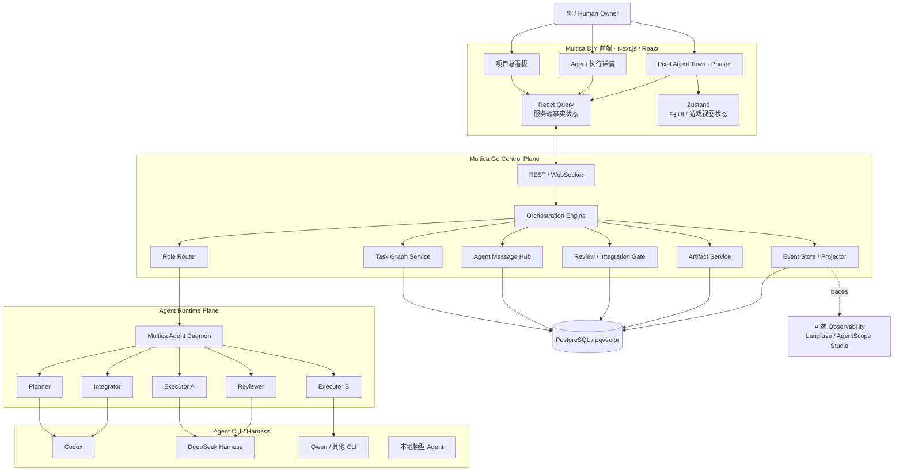
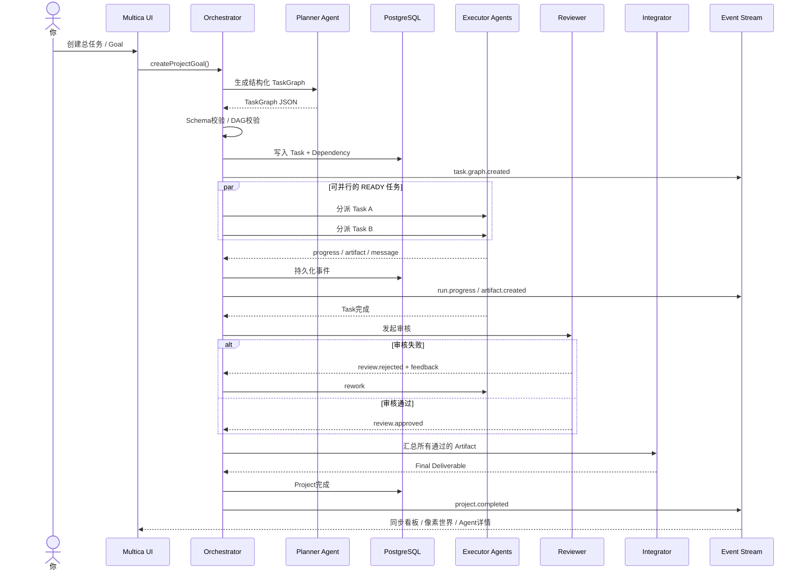
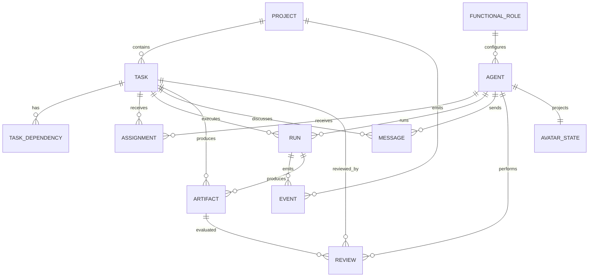
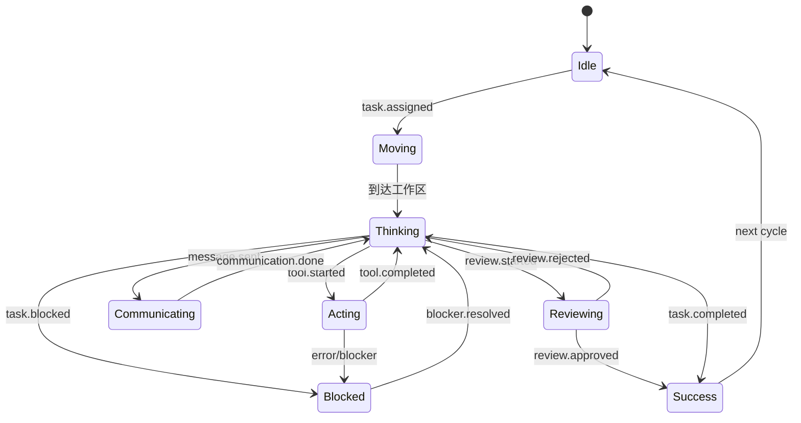

# 基于 Multica 深度 DIY 的可视化多 AI Agent 项目管理工具：开源调研、架构设计与实现路线报告

## 执行摘要与最终结论

你的目标并不是再造一个“通用商业 Agent 平台”，而是做一个**长期自用、可随意折腾、低成本、本地优先、视觉上有明显个人风格的 AI Agent 工作室**。在这个前提下，我的结论非常明确：

> **推荐以 Multica 作为项目管理控制面与 Agent Runtime 调度底座，采用“薄 Fork + 独立 Orchestration 层 + Phaser 像素世界模块”的方式深度 DIY；DeepSeek Harness 不建议成为整个产品的主框架，而非常适合成为 Multica 下的一种 Agent Runtime，以及承担 Agent 内部工具、Hook、技能与实验性 UI 扩展。**

Multica 与你的目标天然接近：它已经把 AI Agent 当成“团队成员”，支持把 Issue 分配给 Agent、Agent 自动执行、汇报进度、产生执行日志、进入 Review Gate，还具备 Projects、Squads、Skills、Inbox、重试/超时、自托管和本地 daemon；官方架构本身就是 **Next.js → Go Backend/WS → PostgreSQL → 本地 Agent Daemon → 多种 Agent CLI**。目前官方列出的 Runtime 中已经直接包含 `dsh`，即 DeepSeek Harness。citeturn18view0turn18view1turn18view2

但 Multica **还不是你描述的完整“Planner → Executor → Reviewer → Integrator”显式任务 DAG 编排平台**。它的 Squad Leader 可以路由工作，但你想要的“总任务自动结构化拆解、依赖关系、角色级派发、Agent 间通信、审核退回、最终集成”最好增加一层你自己掌控的 **Orchestration Domain**，而不是把大量业务逻辑塞进 prompt。citeturn18view0

同时有一个非常重要的命名问题：Multica 当前所谓的 `Roles` 指的是 `owner/admin/member` 一类访问权限，而你的 Planner / Executor / Reviewer / Integrator 是**业务 Agent 角色**。这两者不能混用，建议你的数据库和代码里称为 `AgentArchetype`、`FunctionalRole` 或 `CapabilityProfile`。citeturn18view1

对于三视图，我建议这样理解：

| 视图 | 本质 | 是否保存独立业务状态 |
|---|---|---:|
| 项目总看板 | Task Graph 的管理视图 | 否 |
| 像素世界 | 同一 Task/Agent/Event 状态的“游戏化投影” | **否** |
| Agent 执行详情 | Run/Event/Message/Artifact 的审计视图 | 否 |

也就是说，**不能做三个各自维护状态的系统**。服务端 PostgreSQL 中的 Project / Task / Assignment / Run / Event 才是唯一事实源，三种 UI 只是三个不同的 projection。Multica 自己的前端架构规则也非常适合这种做法：官方明确规定 React Query 管理服务端状态，Zustand 只管理客户端/视图状态，而 WebSocket 事件应更新 React Query，而不是把服务端数据复制一份到 Zustand。citeturn20view0

综合个人 DIY 的时间、维护成本和乐趣，推荐路线是：

**Multica 薄 Fork**
→ **新增 Role + TaskGraph + MessageBus + Review/Integration Orchestrator**
→ **复用原看板与 Run Detail**
→ **Phaser 实现 Agent Town / Pixel Office**
→ **统一 Event Stream 驱动三个界面**
→ **DeepSeek Harness 作为可选 Runtime/插件实验层**
→ **后续再按需要接 Langfuse / AgentScope Studio 等观测组件。**

我对几种总体路线的评分如下：

| 路线 | DIY 首版速度 | 长期可维护性 | 游戏化自由度 | 推荐度 |
|---|---:|---:|---:|---:|
| Multica 薄 Fork + Phaser | ★★★★★ | ★★★★☆ | ★★★★★ | **首选** |
| Multica Backend/Daemon + 自写完整前端 | ★★★☆☆ | ★★★★★ | ★★★★★ | 中后期可迁移 |
| Multica + DeepSeek Harness 混合 | ★★★★☆ | ★★★★☆ | ★★★★☆ | **推荐作为增强** |
| DeepSeek Harness 单独做整个产品 | ★★☆☆☆ | ★★☆☆☆ | ★★★★☆ | 当前不推荐 |
| 从 LangGraph/AgentScope 从零搭 PM 平台 | ★★☆☆☆ | ★★★★☆ | ★★★★★ | 只有强编排需求时考虑 |

**一句话版本：不是“在 DeepSeek Harness 里做一个 Multica”，而是“把 Multica 做成你的 AI Agent Town，让 DeepSeek Harness 成为 Town 里一种很强的 Agent 运行环境”。**

另外需要说明一个调研范围问题：你在要求里写了“我列出的 7 个 repo”，但当前对话中实际可见并明确给出的仓库链接只有 **Multica** 和 **DeepSeek Harness** 两个。为了不虚构另外五个项目，下面对这两个进行重点分析，并用我额外检索出的官方开源项目补充比较。

## Multica 深度二开的可行性与边界

### 为什么它是非常合适的起点

Multica 当前源码结构对二开很友好。官方 `AGENTS.md` 明确描述为 Go 后端加 pnpm/Turborepo 前端 monorepo：

- `server/`：Go、Chi、sqlc、gorilla/websocket；
- `apps/web/`：Next.js；
- `apps/desktop/`：Electron；
- `packages/core/`：headless 业务逻辑、Zustand、React Query、API client；
- `packages/ui/`：原子 UI；
- `packages/views/`：业务页面与共享组件。citeturn20view0

官方 README 当前进一步列明 Web 使用 Next.js 16 App Router，Backend 使用 Go + Chi + sqlc + gorilla/websocket，数据库为 PostgreSQL 17 + pgvector，本地 Agent daemon 负责在代码所在机器启动各种 Agent CLI。citeturn18view2

这意味着你的三类页面完全没有必要换技术栈。

建议保持：

```text
apps/web
packages/core
packages/ui
packages/views
server
PostgreSQL
Multica daemon
```

新增：

```text
packages/core/agent-town/           # 新：业务状态/selector/event adapter
packages/views/agent-town/          # 新：像素世界页面
packages/views/orchestration/       # 新：任务图、通信/编排 UI

server/.../orchestration/           # 新：Planner/Router/Review/Integrator
server/.../agentmessages/           # 新：结构化 Agent 消息
server/.../taskevents/              # 新：统一事件
server/.../artifacts/               # 新：交付物/审核对象
```

上面新增目录名是本报告的建议设计，不是 Multica 当前已有路径；已有路径结构则来自官方源码说明。citeturn20view0

### Multica 已经能复用什么

你想做的系统并不是从 0 开始。Multica 已经提供：

| 你的需求 | Multica 当前能力 | 二开程度 |
|---|---|---:|
| Agent 成员 | Agent 可作为 teammate 存在 | 很低 |
| Agent 对应 Runtime | 支持多种 CLI | 很低 |
| 项目 | Projects | 很低 |
| 总任务/子任务 | Issue 基础模型可以承载 | 中 |
| 团队 | Squads + leader routing | 中 |
| 自动运行 | 分配 Issue 后 Agent 工作 | 很低 |
| 执行详情 | Execution log | 很低 |
| Tool/command/error 时间线 | 已有 | 很低 |
| Token 使用量 | 已有 | 很低 |
| 人工审核 | Review gates | 很低 |
| 阻塞提醒 | Inbox | 很低 |
| 重试/超时 | 已有 | 很低 |
| 自动拆 DAG | **需要增强** | 高 |
| Planner/Executor/Reviewer/Integrator | **需要新增业务角色层** | 中高 |
| Agent-Agent 结构化通信 | **需要新增** | 高 |
| 像素世界 | **需要新增** | 高 |
| 三视图同步 | 在现有 WS/Query 架构上扩展 | 中 |

Multica 官方本来就把“Issue → Agent → Run → Review”看成核心流程，Execution Log 可以回放工具调用、命令和错误，因此 Agent Detail 页的大部分底层数据无需自己重新发明。citeturn18view0turn18view1

真正应该投入精力的是中间这一段：

```text
“给某个 Agent 一个 Issue”
              ↓
升级为
              ↓
“给 Planner 一个目标”
              ↓
结构化 TaskGraph
              ↓
Role Router
              ↓
多个 Executor 并行
              ↓
Reviewer 审核 / Rework
              ↓
Integrator 汇总
              ↓
最终 Deliverable
```

### 不建议把自动编排全部交给 Agent 自己

一个很容易走偏的设计是：

> Planner Agent 看完目标以后，自己通过聊天去找 Executor，再让 Executor 找 Reviewer……

这会非常难调试。

推荐让 **LLM 做决策，让确定性代码执行状态转换**。

例如 Planner 只负责输出：

```json
{
  "objective": "完成一个本地知识库应用",
  "tasks": [
    {
      "id": "T1",
      "title": "调研技术方案",
      "role": "researcher",
      "depends_on": [],
      "acceptance": ["输出技术比较报告"]
    },
    {
      "id": "T2",
      "title": "实现后端",
      "role": "executor_backend",
      "depends_on": ["T1"],
      "acceptance": ["API 测试通过"]
    },
    {
      "id": "T3",
      "title": "审查实现",
      "role": "reviewer",
      "depends_on": ["T2"]
    }
  ]
}
```

由 Go Orchestrator：

1. 验证 Schema；
2. 创建 Task；
3. 写 Dependency；
4. 计算 Ready Task；
5. 根据 FunctionalRole 选择 Agent；
6. 派发；
7. 等 Run Event；
8. 自动进入 Review；
9. Review 不通过则创建 Rework；
10. 全部通过后才触发 Integrator。

这会比让 Agent 自己维护一个“脑内项目状态”可靠得多。

### 个人 DIY 场景下的许可证影响

这一点值得认真看。

Multica 目前并不是纯 Apache-2.0，而是完整 Apache-2.0 文本加额外条件组成的 **Multica License**。官方条款明确：未经商业许可，不得把 Multica 源码用于向第三方提供托管服务，也不能嵌入商业分发产品；即使第三方免费访问公开托管实例，也属于受限场景。单一组织内部使用则无需商业许可。citeturn19view0

你的目标是**个人、本地、非商业 DIY**，所以最主要的 SaaS/商业限制基本不是当前障碍。

但有一个很容易忽略的条款：如果 UI 是从 Multica 的 UI 代码派生，未经书面 branding waiver，不能移除或修改 Multica Logo、产品名及相关 attribution。官方还明确把 `apps/web/`、`apps/desktop/`、`apps/mobile/`、`packages/views/`、`packages/ui/` 等列入这一 UI 定义，而且代码即使被移动、重命名、抽取，仍可能属于其定义下的派生 UI。citeturn19view0

所以你的个人版完全可以做成：

> **Multica / Agent Town – Personal Edition**

保留 Multica attribution，再加自己的名称和像素风格。

若未来你完全自己编写一个独立 UI，仅通过 Multica 后端/daemon/API 连接，许可文本明确说 branding UI 条件不适用于不运行 Multica UI 的场景，但 backend/daemon/CLI 的 attribution 条款仍需遵守。citeturn19view0

这不是法律意见；对个人 DIY 来说最省心的原则就是：**不对外提供服务、不删 Multica attribution、不直接拷贝第三方游戏素材。**

### Fork 策略比“重写”更重要

Multica 官方自己写明其 `main` 更新很快，并称大多数工作日都会 release。citeturn18view2

所以不要到处魔改核心代码。

推荐结构：

```text
upstream/main
      │
      │ periodically merge/rebase
      ▼
your-fork/main
      │
      ├── feature/agent-orchestration
      ├── feature/agent-town
      ├── feature/role-system
      └── feature/event-projection
```

核心原则：

> **尽可能新增模块，尽量不要把自己的业务散落在 Multica 原模块几十处。**

甚至可以做 Feature Flag：

```env
MULTICA_AGENT_TOWN=true
MULTICA_ROLE_ORCHESTRATION=true
```

这样上游 merge 的痛苦会小很多。

Multica 目前也已经出现官方插件示例目录，包括 `exa-search`、`incident-triage`、`mobbin`、`remote-mcp-fixture`；同时 2026 年 8 月仍能看到 Plugin V1 和 Agent Plugin import 相关功能在快速开发。citeturn20view1turn16search0

因此我目前**不建议把“整个像素世界 UI”押在 Multica Plugin API 上**。Agent skill/tool 做插件很合适，但项目的核心 UI 和 Orchestration，现阶段直接作为 fork 内的一等模块更稳。

## 开源项目调研与可复用组件清单

下面先给出当前对话中你实际指定的两个仓库，再加入与 agent-monitor、agent-orchestration、可视化、游戏化高度相关的开源项目。

| 项目 | 功能与价值 | 推荐复用内容 | 复用难度 | 许可 |
|---|---|---|---:|---|
| [Multica](https://github.com/multica-ai/multica) | AI Agent teammate、Issue、Projects、Squads、Run Log、Review、WS、daemon、多 CLI Runtime。citeturn18view0turn18view1 | `server/`、`packages/core/`、`packages/views/`、`packages/ui/`、现有 Board/Run/Agent/WS 模型 | ★★☆☆☆ | Multica License，Apache-2.0 + 额外限制。citeturn19view0 |
| [DeepSeek Harness](https://github.com/deepseek-ai/deepseek-harness) | “Everything is a plugin”的 Agent Harness；有 Web UI、client plugin、slot/service architecture。citeturn17view1turn22search0turn22search1 | Runtime、Agent tools/hooks、角色专属插件、实验 UI slot | ★★★★☆ | MIT。citeturn21view1 |
| [AgentScope](https://github.com/agentscope-ai/agentscope) / AgentScope Studio | 多 Agent workflow、handoff、routing、并行 Agent，同时 Studio 提供 Run/Trace/可视化。官方 Studio 使用 React/Vite、tRPC/HTTP+WebSocket、Node/Express、TypeORM/SQLite。citeturn6search0turn6search3turn6search16 | **重点借鉴 Agent 运行详情、Trace UI、Realtime UI**；不必引入整个框架 | ★★★☆☆ | Apache-2.0。citeturn6search1 |
| [ChatDev](https://github.com/OpenBMB/ChatDev) | 2.0 已演变为可配置 Agent / Workflow / Task 的多 Agent 编排平台；1.0 的虚拟软件公司有 CEO/CTO/Programmer 等角色协作模型。citeturn23search0 | **重点借鉴角色组织、任务流、Agent Communication 模型** | ★★★☆☆ | Apache-2.0。citeturn23search0 |
| [MetaGPT](https://github.com/FoundationAgents/MetaGPT) | 将 Product Manager、Architect 等角色组织为 SOP 式多 Agent“软件公司”。官方有中文 README。citeturn16search4 | Role/Action/SOP 思想、Planner/Integrator prompt contract | ★★★☆☆ | MIT。citeturn16search4 |
| [LangGraph](https://github.com/langchain-ai/langgraph) | 面向长运行、有状态 Agent 的低层 graph orchestration，包含 durable execution、HITL 和持久状态能力。citeturn23search1 | **未来复杂 DAG、checkpoint、暂停/恢复**；适合作为 Python sidecar 而非首版核心 | ★★★★☆ | MIT。citeturn23search1 |
| [AutoGen](https://github.com/microsoft/autogen) | 经典 event-driven/message-passing 多 Agent 框架以及 AutoGen Studio。当前官方已经进入 maintenance mode，并建议新项目转向 Microsoft Agent Framework。citeturn23search2 | 只建议研究 Studio、message bus、多 Agent UX，不建议新项目重依赖 | ★★☆☆☆ | MIT。citeturn23search4 |
| [Langfuse](https://github.com/langfuse/langfuse) | LLM/Agent tracing、观测、评估、自托管。citeturn5search3turn5search15 | 不自己重新造所有 trace 分析功能；后期通过 OTel/adapter 接入 | ★★☆☆☆ | Core 主要为 MIT，仓库含单独企业功能目录，复用前应逐目录检查。citeturn5search7 |
| [WorkAdventure](https://github.com/workadventure/workadventure) | 一个真正以 16-bit RPG 形式实现的协作虚拟空间，支持 avatar、自建地图、Docker/Helm。citeturn17view0 | **强烈推荐研究其 Tiled 地图工作流、Zone、空间交互，而不是 Fork 整套系统** | ★★★★☆ | 组件较多，实际拷贝前需逐模块检查当前许可证 |
| [Phaser](https://github.com/phaserjs/phaser) | 浏览器 2D 游戏框架，适合 sprites、tilemap、camera、input、Canvas/WebGL。citeturn7search0turn7search12 | **直接作为 Pixel World 引擎** | ★★☆☆☆ | MIT。citeturn7search0 |
| [PixiJS](https://github.com/pixijs/pixijs) | 高性能 2D WebGL renderer，更偏渲染层而非完整 game framework。citeturn7search1 | 若最终 Pixel World 很轻，可替换 Phaser | ★★★☆☆ | MIT。citeturn7search1 |
| [AG-UI](https://github.com/ag-ui-protocol/ag-ui) | Agent ↔ Frontend 的开放事件协议，MIT；重点在 typed event 和 agent frontend integration。citeturn15search3 | **非常值得借鉴你的内部 `AgentEvent` 协议设计**，不一定全量采用 | ★★☆☆☆ | MIT。citeturn15search3 |

其中我尤其推荐你“读源码而不一定引依赖”的四个项目：

**ChatDev / MetaGPT**：学“组织”。

**AgentScope Studio / Langfuse**：学“如何看 Agent 在干什么”。

**WorkAdventure**：学“像素空间如何成为 UI”。

**AG-UI**：学“后端 Agent Event 怎样映射到前端”。

这四类能力正好分别对应你系统缺少的四块。

一个有意思的变化是：AutoGen 曾经会是这类调研的首要对象，但到当前官方仓库已经明确处于 maintenance mode，并把新项目引向 Microsoft Agent Framework。因此你可以阅读它的交互设计，却没必要在 2026 年的新 DIY 项目里再把它当核心依赖。citeturn23search2

## 推荐目标架构、任务模型与数据流

### 推荐总体架构

我建议把整个项目理解为五层。



这个架构保留 Multica 官方已有的 Next.js → Go/WS → PostgreSQL → daemon → CLI 结构，只在 Go Control Plane 中增加一个明确的 orchestration domain。citeturn18view2turn20view0

最大的原则是：

> **Pixel World 不直接控制 Agent Runtime；Pixel World 只读/写项目 Domain API。**

否则后面会出现“角色已经跑到 Review Room，但 Task 仍然 Running”这种游戏状态与业务状态不一致的问题。

### 数据流

建议完整流程是：



这里 LLM 负责“计划、执行、审查、整合”；Orchestrator 负责“状态机、校验、依赖、派发、重试”。

这样就把概率系统和确定性系统分开了。

### 推荐数据实体



这里最值得新增的数据不是 Avatar，而是：

```text
FUNCTIONAL_ROLE
TASK_DEPENDENCY
MESSAGE
ARTIFACT
REVIEW
EVENT
```

Avatar 反而应该极薄。

### 推荐 Task 状态机

```text
DRAFT
  ↓
PLANNED
  ↓
READY
  ↓
ASSIGNED
  ↓
RUNNING
  ↓
REVIEWING
  ├──────────────→ REWORK ──→ READY
  ├──────────────→ BLOCKED
  ↓
APPROVED
  ↓
INTEGRATING
  ↓
DONE
```

其中“Task 状态”和“Agent 动画状态”是两套东西。

不要写成：

```text
agent.state = task.state
```

应该是：

```text
TaskState  -> VisualProjector -> AvatarAnimationState
```

例如：

```text
RUNNING + tool_call.started
        ↓
ACTING

RUNNING + no event 5 sec
        ↓
THINKING

REVIEWING + reviewer assigned
        ↓
REVIEWING

BLOCKED
        ↓
BLOCKED

DONE
        ↓
CELEBRATING
```

### Agent 通信模型

Agent-Agent 通信也建议**结构化**，而不是所有 Agent 在一个无限群聊里聊天。

推荐：

```ts
type AgentMessage = {
  id: string;
  projectId: string;
  taskId?: string;
  runId?: string;

  fromAgentId: string;
  toAgentId?: string;
  toRole?: FunctionalRole;

  kind:
    | "context_request"
    | "context_response"
    | "handoff"
    | "review_feedback"
    | "blocker"
    | "artifact_notice"
    | "coordination";

  summary: string;
  payload?: unknown;
  createdAt: string;
};
```

Planner 只给 Executor 发任务上下文；Executor 可以请求另一个 Agent 的 Artifact；Reviewer 发 `review_feedback`；Integrator只消费已批准 Artifact。

这会让 Pixel World 中“角色交流”的表现也非常自然：Agent A 走到 Agent B 附近出现一个小气泡，并不需要把上千 token 对话全部塞进画面。

### Event 应成为整个游戏化系统的核心协议

我甚至认为你的项目最值得自己设计好的不是 Task API，而是：

```ts
type AgentEvent = {
  id: string;
  seq: number;
  version: 1;

  projectId: string;
  taskId?: string;
  agentId?: string;
  runId?: string;

  kind:
    | "task.created"
    | "task.assigned"
    | "run.started"
    | "run.progress"
    | "tool.started"
    | "tool.completed"
    | "message.sent"
    | "artifact.created"
    | "review.started"
    | "review.rejected"
    | "review.approved"
    | "task.blocked"
    | "task.completed"
    | "project.completed";

  summary: string;
  timestamp: string;
  data?: unknown;
};
```

AG-UI 本身也是围绕 Agent 与前端之间的 typed events 来组织交互，因此非常值得作为协议设计参考，但你无需为了它重写 Multica 已有 WebSocket transport。citeturn15search3

有了事件后，你还会自然获得一个极有意思的个人 DIY 功能：

> **“回放昨天 Agent 团队工作的一天。”**

选择时间点：

```text
09:00 Planner 进入会议室
09:02 产生 7 个 Task
09:03 两个 Executor 各走向工位
09:18 Executor A 遇到 blocker
09:20 Planner/Executor 交流
09:40 Reviewer 开始审阅
10:12 Integrator 汇总
10:16 Project Done
```

此时 Pixel World 已经从装饰性页面变成真正的 **Agent Execution Replay UI**。

## 像素世界与三视图交互设计

### 游戏引擎建议：Phaser 优先

对“类星露谷的俯视 2D 像素办公室”，我的选择顺序是：

| 方案 | 适合度 | 判断 |
|---|---:|---|
| **Phaser** | ★★★★★ | **首选**。Sprite、Tilemap、Input、Camera、动画、Canvas/WebGL 都现成。citeturn7search0turn7search12 |
| PixiJS | ★★★★☆ | 如果只是动态图，没有路径/地图/game mechanics，可以更轻。citeturn7search1 |
| 原生 Canvas | ★★☆☆☆ | 首版似乎简单，后面很快会重新发明 scene graph、hit test、camera、animation |
| Three.js | ★★☆☆☆ | 你的目标是 2D 像素空间，3D 没带来核心价值 |
| Unity WebGL | ★★☆☆☆ | 对个人 Web Dashboard 工具链太重；React 状态同步和 build/deploy 成本也更高 |

不要因为“这是游戏化 UI”就直接上 Unity。

你的项目本质仍然是 Web App：

```text
Next.js 页面
 ├── React UI
 ├── Board
 ├── Detail
 └── <AgentTownCanvas />
        └── Phaser.Game
```

Phaser 应该是一块 React 管理生命周期的 Canvas，而不是整个 Web App。

### 地图不是装饰，而应该表示流程

最推荐的空间布局：

```text
┌─────────────────────────────────────────────┐
│                PROJECT TOWN                 │
│                                             │
│  🧠 Planning Room       📚 Research Library │
│    Planner                    Researcher    │
│                                             │
│  💻 Dev Zone             🧪 Review Lab      │
│  Executor A/B/C              Reviewer       │
│                                             │
│  💬 Meeting Area         🚧 Blocked Corner  │
│                                             │
│             🧩 Integration Lab              │
│                 Integrator                  │
│                                             │
│               🎉 Done Plaza                 │
└─────────────────────────────────────────────┘
```

WorkAdventure 是很好的视觉参考：它本身就是一个以 16-bit RPG 形式呈现的协作虚拟空间，并提供自定义地图体系；其官方生态也强调地图构建流程。你的项目不需要引入它的整个平台，但很值得参考 **Tiled Map → Map JSON → Zone Script** 的工作方式。citeturn17view0

于是业务事件可以直接变成“空间变化”：

```text
Task assigned
→ Agent 从 lounge 走到自己的工位

Agent asks another Agent
→ 走向 Meeting Area

Review started
→ Reviewer 进入 Review Lab
→ Executor 可以走过去等待

Task blocked
→ Agent 头顶红色感叹号
→ 或走到 Blocked Corner

Integration started
→ 所有 approved artifact 图标飞向 Integration Lab

Project completed
→ 所有角色去 Done Plaza
→ 2 秒庆祝动画
```

### 像素 Agent 状态机



Sprite 动画不需要特别复杂：

| 状态 | 动画 |
|---|---|
| Idle | 呼吸、看四周 |
| Moving | 四方向走路 |
| Thinking | 头顶 `...`、书/灯泡 |
| Acting | 敲键盘、翻资料 |
| Communicating | 对话气泡 |
| Reviewing | 放大镜/文档翻页 |
| Integrating | 拼图/工具箱 |
| Blocked | 感叹号、抓头 |
| Success | 跳一下/小星星 |

角色可以通过服装和道具区分，而不是只有颜色：

```text
Planner       → clipboard / whiteboard
Executor      → laptop / wrench
Reviewer      → magnifier / red pen
Integrator    → toolbox / puzzle
Researcher    → book / telescope
```

视觉风格可以借鉴“16-bit top-down farming RPG”的空间语言，但不应直接拷贝《星露谷物语》的角色、贴图或原始游戏素材；做原创 sprite 或使用许可明确的素材包更适合个人项目长期维护。

### 三视图应该如何联动

推荐一个全局：

```ts
selectedEntity = {
  type: "agent" | "task" | "run" | "artifact",
  id: string
}
```

然后：

**在看板点击 Task**

```text
Board Task T-23
        ↓
selectedEntity = task:T-23
        ↓
Pixel World:
  镜头移动到正在执行 T-23 的 Agent
  Agent 周围出现选中框

Detail:
  自动切换为 T-23 / current run
```

**在像素世界点击 Agent**

```text
Avatar Click
   ↓
selectedEntity = agent:A7
   ↓
Board:
  高亮 A7 的全部任务

Detail:
  打开 A7 执行详情
```

**在详情页点击 Artifact**

```text
Artifact
  ↓
Board:
  高亮对应 Task

World:
  在 Agent 工位显示交付物图标
```

这就是三视图真正“统一”的关键。

### Agent Detail 页应该显示什么

建议左到右依次是：

```text
Agent Identity
Functional Role
Model / Runtime
Current Task
Queue
-----------------
Live Run Timeline
Tool Calls
Commands
Errors
Messages
Artifacts
Review Feedback
Diff / Files
Token / Cost
-----------------
Past Runs
```

Multica 已经拥有 Execution Log、Token Usage、Review Gate，因此你主要是把它们重新编排成更适合“AI 员工档案页”的视觉结构。citeturn18view0

一个重要的产品原则：

> 执行详情展示**可观察执行事实**，而不是试图展示模型不可控的“隐藏思维链”。

可以展示：

```text
正在调用什么工具
执行了什么命令
读/写了哪些文件
Agent 发给其他 Agent 的消息
产生了什么 Artifact
Reviewer 的反馈
Planner 输出的显式 Decision Summary
```

不要把“内部 Chain-of-Thought”作为产品模型。

### 实时同步推荐方式

Multica 已经有 gorilla/websocket，因此**没有必要为了这个项目再引入 Socket.IO**。官方前端约束也已经规定 WS 事件更新 React Query。citeturn18view2turn20view0

推荐：

```text
Server Mutation
    ↓
DB Transaction
    ↓
AgentEvent
    ↓
WebSocket
    ↓
React Query cache update / invalidate
    ├── Board selector
    ├── Detail selector
    └── VisualEventAdapter
            ↓
         Phaser
```

只有像素人物坐标、camera、hover、animation frame 等**纯视觉状态**放 Zustand/Phaser 自己。

例如：

```text
Server:
agent = RUNNING

Client Projection:
agent business status = RUNNING
avatar animation = THINKING
avatar x/y = 345 / 512
camera target = ...
```

网络断开恢复时：

```text
WS reconnect
   ↓
GET project snapshot
   ↓
compare latest event seq
   ↓
补齐 missing events
   ↓
重建 projection
```

推荐让 Event 带递增 `seq` 或 aggregate `version`，做到 idempotent。

Pixel World 也没有必要按 LLM token 流逐字更新。把大量 token delta 直接送进游戏循环既没视觉价值，又增加消息压力；浏览器标准 WebSocket 本身并不提供类似流式 backpressure 的高级控制，因此更应该做事件分级和节流。citeturn3search3turn3search20

建议：

```text
重要状态事件：立即发
tool call：立即发
message：立即发
日志行：批量 250~500ms
token stream：Detail 页需要时显示
Pixel World：只消费语义事件
```

轮询只做 fallback：

```text
正常：WebSocket
WS 断开：15~30 秒 snapshot polling
WS 恢复：停止 polling + refetch
```

## 技术选型、DeepSeek Harness 定位与关键接口

### 核心技术选型

| 维度 | 候选 | 推荐 | 理由 |
|---|---|---|---|
| Web 前端 | React / Vue / Svelte | **React + Next.js** | Multica 本身就是 Next.js，切 Vue/Svelte 等于主动丢弃大量复用价值。citeturn18view2turn20view0 |
| Server State | React Query / 自写 store | **React Query** | 与 Multica 官方架构一致。citeturn20view0 |
| Client State | Zustand / Redux | **Zustand** | Multica 已用；只存 view/game state。citeturn20view0 |
| Pixel Engine | Phaser / Pixi / Canvas / Unity | **Phaser** | 最匹配 2D tile/sprite/game interaction。citeturn7search0 |
| 后端 | Go / Python / Node | **保留 Go** | 最大化 Multica server 复用。citeturn18view2 |
| 高级编排 | 自写 Go / LangGraph | **首版 Go；复杂后再加 LangGraph sidecar** | LangGraph擅长长运行、持久 state workflow，但首版引 Python 会增加双栈维护。citeturn23search1 |
| 实时通信 | WebSocket / Socket.IO / SSE | **Multica 现有 WS** | 已有完整实时通道，不建立第二套协议。citeturn18view2 |
| 数据库 | PostgreSQL / SQLite | **保持 PostgreSQL** | Multica 本身使用 PostgreSQL + pgvector。citeturn18view2 |
| Agent Runtime | Codex / DSH / Qwen / 其他 | **统一经 Multica daemon** | Multica 当前支持 20 类 Agent CLI，包含 `dsh`。citeturn18view1 |
| 云 LLM | OpenAI 等 | **作为 Runtime 或 Provider Adapter** | OpenAI 当前官方 API 以 Responses 等接口提供模型和工具能力。citeturn24search0turn24search3 |
| 本地 LLM | Ollama | **个人 DIY 首选之一** | Ollama 官方提供本地 REST API 和 streaming API。citeturn24search1turn24search4 |
| Agent Trace | 自己做 / Langfuse / AgentScope Studio | **基础自己做，深度分析可外挂** | Multica已有 run log；AgentScope/Langfuse 可补观测。citeturn18view0turn6search1turn5search3 |

所以，不建议：

```text
Vue + Node + Socket.IO + MongoDB + Unity
```

因为这些技术并不是不好，而是：

> 你选 Multica 做底座以后，再把 Multica 的技术栈全部换掉，就失去基于 Multica 二开的意义了。

### DeepSeek Harness 到底该不该用

答案是：

> **推荐用，但不要让它成为项目管理系统本身。**

DeepSeek Harness 的优点很明显。

官方现在的定位就是一个开源 Agent Harness，并明确采用“一切皆插件”的架构，由 Cordis 驱动；它有 Web UI、插件发现机制，包结构强调 extension plugin 依赖 Service Definition 而不是 concrete provider，并且 UI/tool/hook 也被纳入插件体系。citeturn17view1turn22search1

其最新 client architecture 还明确发展出了 plugin tree、slot system，以及 client plugin loading model，所以如果你想玩“Agent Harness 的可插拔前端/工具生态”，它确实很有意思。citeturn22search0turn22search7

但官方中文 README 同样明确警告：

> 当前仍然是 **Developer Preview**，快速迭代，并预告会发生破坏兼容性的变化。citeturn21view1

这意味着：

### 不推荐的架构

```text
DeepSeek Harness
   ├── 项目管理
   ├── Board
   ├── Task DB
   ├── Pixel World
   ├── Planner
   ├── Reviewer
   └── 所有 Agent
```

一旦 DSH plugin API 改动，你整个产品跟着改。

更重要的是，这样 Pixel World 天然只围绕 DSH 设计，反而会损失 Multica 对 Codex、Cursor、Qwen、Kimi 等多 Runtime 的统一抽象。Multica 当前已经直接支持 DeepSeek Harness 的 `dsh` Runtime。citeturn18view1

### 推荐的架构

```text
             Multica
         Project Control Plane
                 │
        ┌────────┼─────────┐
        │        │         │
      Codex     dsh       Qwen
                 │
          DeepSeek Harness
                 │
       ┌─────────┼──────────┐
       │         │          │
     Tools     Hooks      Plugins
```

可以把这称为：

> **外层 Multica Control Plane + 内层 DSH Agent Harness**

我给 DSH 的具体推荐评分：

| 用法 | 推荐 |
|---|---:|
| 取代 Multica 做整个项目管理系统 | ★★☆☆☆ |
| 作为 Multica 的 Agent Runtime | **★★★★★** |
| 做 Planner/Executor 专属工具插件 | **★★★★☆** |
| 做 Hook / Tool / MCP 实验 | **★★★★★** |
| 做整个 Pixel World UI 插件 | ★★☆☆☆ |
| 做某个 Agent 的 Runtime Inspector | ★★★★☆ |
| 把项目/Task 唯一状态存进 DSH | ★☆☆☆☆ |

### 最有价值的 DSH 插件方向

比如可以做：

```text
dsh-plugin-structured-handoff
```

Agent 内提供：

```text
handoff_task()
request_context()
submit_artifact()
request_review()
report_blocker()
```

Agent 并不直接改数据库，而是调用 Multica Bridge。

概念接口：

```ts
// 伪代码：表达插件职责，不对应当前 DSH 稳定 API

export function structuredHandoffPlugin(ctx) {
  ctx.tools.register("submit_artifact", async (input) => {
    return multicaBridge.post("/agent-events", {
      kind: "artifact.created",
      taskId: input.taskId,
      artifact: input.artifact
    });
  });

  ctx.tools.register("request_review", async (input) => {
    return multicaBridge.post("/agent-events", {
      kind: "review.requested",
      taskId: input.taskId
    });
  });

  ctx.hooks.on("tool:started", (event) => {
    eventBridge.emit({
      kind: "tool.started",
      summary: event.toolName
    });
  });
}
```

之所以写成伪代码而不是声称它是当前可编译 API，是因为 DSH 官方明确仍处于兼容性可能破坏的 developer preview 阶段。citeturn21view1turn22search1

### Orchestrator 的关键接口建议

Go 侧可以保持非常朴素：

```go
type TaskPlan struct {
	ID         string   `json:"id"`
	Title      string   `json:"title"`
	Role       string   `json:"role"`
	DependsOn []string `json:"depends_on"`
	Acceptance []string `json:"acceptance"`
}

type ProjectPlan struct {
	Objective string     `json:"objective"`
	Tasks     []TaskPlan `json:"tasks"`
}

func (s *Orchestrator) AcceptPlannerResult(
	ctx context.Context,
	projectID string,
	raw []byte,
) error {
	plan, err := ParseAndValidatePlan(raw)
	if err != nil {
		return fmt.Errorf("invalid planner result: %w", err)
	}

	if err := ValidateDAG(plan.Tasks); err != nil {
		return fmt.Errorf("invalid task graph: %w", err)
	}

	return s.db.WithTx(ctx, func(tx Tx) error {
		if err := s.tasks.CreateFromPlan(ctx, tx, projectID, plan); err != nil {
			return err
		}

		if err := s.events.Append(ctx, tx, ProjectEvent{
			ProjectID: projectID,
			Kind:      "task.graph.created",
		}); err != nil {
			return err
		}

		return nil
	})
}
```

Multica 官方对数据库事务、包边界、server/client state 分工都有严格约束，因此二开时最好遵守原仓库的工程习惯，而不是在 `packages/views` 中直接放 fetch/database-like logic。citeturn20view0

然后：

```go
func (s *Scheduler) Tick(ctx context.Context, projectID string) error {
	ready, err := s.tasks.FindReadyTasks(ctx, projectID)
	if err != nil {
		return err
	}

	for _, task := range ready {
		agent, err := s.router.SelectAgent(ctx, task.FunctionalRole)
		if err != nil {
			continue
		}

		if err := s.dispatch.Assign(ctx, task.ID, agent.ID); err != nil {
			return err
		}
	}

	return nil
}
```

后面升级时再考虑：

```text
capacity
skill matching
cost
model capability
runtime availability
historical success rate
```

而不是首版就做复杂优化器。

### React 与 Phaser 的边界

建议做一个很薄的 Event Bridge：

```ts
export type VisualEvent =
  | { type: "AGENT_ASSIGNED"; agentId: string; taskId: string }
  | { type: "AGENT_THINKING"; agentId: string }
  | { type: "AGENT_ACTING"; agentId: string; label?: string }
  | { type: "AGENT_BLOCKED"; agentId: string; reason?: string }
  | { type: "AGENT_REVIEWING"; agentId: string }
  | { type: "AGENT_DONE"; agentId: string };

export function projectToVisualEvent(event: AgentEvent): VisualEvent | null {
  switch (event.kind) {
    case "task.assigned":
      return {
        type: "AGENT_ASSIGNED",
        agentId: event.agentId!,
        taskId: event.taskId!,
      };

    case "tool.started":
      return {
        type: "AGENT_ACTING",
        agentId: event.agentId!,
        label: event.summary,
      };

    case "task.blocked":
      return {
        type: "AGENT_BLOCKED",
        agentId: event.agentId!,
        reason: event.summary,
      };

    case "task.completed":
      return {
        type: "AGENT_DONE",
        agentId: event.agentId!,
      };

    default:
      return null;
  }
}
```

然后：

```text
WebSocket
→ React Query
→ domain event
→ projectToVisualEvent()
→ Phaser EventEmitter
→ AvatarController
```

这样 Phaser 不知道数据库，也不知道 Multica Issue API。

以后哪怕你把 Phaser 换成 PixiJS，Orchestration 完全不受影响。

### OpenAI 与本地模型怎么接

Multica 的一个重要特点是它本身**不把某个特定模型作为系统核心**，而是驱动你机器上已经安装和认证的 Agent CLI，因此你的模型抽象最好也延续这一思路。citeturn18view1

推荐分两条线。

**Agent Execution：**

```text
Multica Runtime Adapter
    ├── Codex
    ├── DeepSeek Harness
    ├── Qwen
    └── ...
```

**你自己新增的 Planner Model Adapter：**

```text
PlannerModel
   ├── CloudAdapter
   │      └── OpenAI
   └── LocalAdapter
          └── Ollama
```

OpenAI 当前官方 API 已以 Responses 等接口作为主要开发 API，而 Ollama 官方提供本地 REST / streaming API，因此做成 provider-neutral adapter 很容易。citeturn24search0turn24search3turn24search1

例如：

```ts
interface PlanningModel {
  generateTaskGraph(input: {
    objective: string;
    context: string;
  }): Promise<ProjectPlan>;
}
```

这样 Pixel World 和 TaskGraph 永远不知道背后是哪个模型。

对你的“个人、本地、低成本”场景：

```text
轻量任务 / 隐私数据
→ Ollama / local

复杂 Planner / Reviewer
→ 云端强模型

Coding
→ Codex / dsh / Qwen CLI

Integrator
→ 可按项目动态选
```

比“全员统一用一个模型”更有 DIY 乐趣，也更符合 Multica 的多 Runtime 思想。citeturn18view1

## 实施路线、开发成本、风险与替代方案

### 最推荐的实现顺序

千万不要先画完整像素小镇。

最容易发生的情况是：

> 小人能跑了，但 Agent 根本没有可靠的 TaskGraph，最后整个项目变成一个漂亮的 Dashboard Demo。

推荐按“业务闭环 → 可观测 → 游戏化”的顺序。

| 里程碑 | 内容 | 预计工时 | 难度 |
|---|---|---:|---:|
| 基线跑通 | Fork Multica、local self-host、跑通 Agent → Issue → Review | 12–20h | ★★ |
| 角色模型 | `FunctionalRole`、Planner/Executor/Reviewer/Integrator 配置 | 15–25h | ★★ |
| Task Graph | Task dependency、READY calculation、Planner JSON schema | 25–40h | ★★★ |
| 自动派发 | Role Router、Agent assignment、parallel execution | 20–35h | ★★★ |
| 审核闭环 | Reviewer、reject/rework、Integrator | 25–45h | ★★★★ |
| Message/Event | Agent Message Hub、统一 AgentEvent、event cursor | 20–35h | ★★★ |
| 三视图同步 | Board + Agent Detail + shared selection | 15–30h | ★★★ |
| Pixel World MVP | Tilemap、Avatar、状态机、Agent click | 35–60h | ★★★ |
| 游戏化增强 | 路径、房间、气泡、Artifact、庆祝、replay | 30–60h | ★★★ |
| 本地安全/测试 | secret、权限、错误恢复、reconnect、migration tests | 20–35h | ★★★ |
| DSH 插件实验 | structured handoff/tool/hook | 20–40h | ★★★★ |

**真正可用的个人 MVP：约 180–280 小时。**

**比较精致、你会愿意天天打开的版本：约 300–450 小时。**

这是工程复杂度估算，不是上游项目给出的官方工期。

以个人业余开发节奏估算：

```text
每周 10 小时
→ MVP 大约 4~7 个月

每周 15 小时
→ MVP 大约 3~5 个月

集中每周 25 小时
→ 大约 2~3 个月
```

如果你接受第一个版本的 Pixel World 只是“一张静态办公室地图 + Agent 状态动画”，而不是完整路径规划、家具交互、天气、昼夜等游戏系统，可以把第一版压缩到大约 **100–160 小时**。

### 我会怎么定义 MVP

第一版只做：

```text
创建总任务
    ↓
Planner 自动拆 3~6 个子任务
    ↓
Executor 自动领取
    ↓
Reviewer 自动审核
    ↓
失败自动 Rework
    ↓
Integrator 汇总
    ↓
看板实时变化
    ↓
Pixel Avatar 在 4 个工作区之间移动
    ↓
点击 Avatar 看实时 Run
```

这个闭环一旦成立，你已经有一个非常独特的工具。

家具、换装、地图编辑器、昼夜系统、成就、Agent 好感度、等级之类，都属于 V2 之后。

### 很适合个人 DIY 的后续游戏化

一旦核心完成，个人使用其实很适合做一些商业产品不敢做的“有趣功能”：

```text
Agent 经验等级
“完成 50 个 Review”成就
Agent 工作统计
项目完成烟花
任务困难度对应不同建筑
不同模型对应不同角色皮肤
失败次数产生“疲劳”视觉状态
每天工作结束自动生成 Town Chronicle
历史事件回放
Agent 之间的关系图
Artifact 展览室
```

但这里建议把“经验、疲劳、关系值”等都当成**可视化/统计投影**，不要真的因此随意改变模型行为，除非你明确做实验。

### 安全和本地私有化

Multica 本身支持 self-host，可通过 Docker Compose 或 Helm 运行。citeturn18view0turn18view1

个人本地模式建议：

```text
Browser
  ↓ localhost/LAN
Multica Server
  ↓
PostgreSQL
  ↓
Agent Daemon
  ↓
隔离 Worktree / Project Workspace
```

重点不是传统多人 RBAC，而是 **Agent 工具权限**。

至少区分：

```text
Planner
  read project
  write task plan
  禁止 shell destructive commands

Researcher
  read/web
  limited file write

Executor
  project worktree read/write
  shell permitted

Reviewer
  read code/artifacts/tests
  limited write

Integrator
  approved artifacts + integration worktree
```

不要让所有 Agent 都默认拥有：

```text
整个 home 目录
SSH key
所有 git credential
所有 API key
Docker socket
任意 shell
```

即使完全个人使用也一样，因为 Agent 的攻击面更多来自 prompt injection、错误 tool call 和第三方数据，而不是“另一个人登录了系统”。

同时注意：Multica daemon 在你的机器上执行 Agent CLI，并不意味着使用云端 Agent 时所有内容必然不离开本机；CLI 与模型服务之间的数据处理仍取决于对应 provider。因此对于真正敏感的任务，可以把相关角色切换到本地模型。

### 主要风险与解决方案

| 风险 | 概率 | 影响 | 建议 |
|---|---:|---:|---|
| Multica 上游迭代太快 | 高 | 中高 | **薄 Fork、新模块优先、减少核心 patch**。官方当前说明 main 更新很频繁。citeturn18view2 |
| Multica Plugin API 仍演化 | 高 | 中 | 不把核心 Pixel/Orchestration 建在 plugin API 上；插件只做外围能力。citeturn16search0turn20view1 |
| DSH breaking change | 高 | 中高 | Runtime adapter 隔离；不要把 Task DB 放进 DSH。官方明确仍是 developer preview。citeturn21view1 |
| 三个视图状态不一致 | 高 | 高 | Server Single Source of Truth + Event Projection |
| Planner 生成错误 DAG | 高 | 高 | JSON Schema + cycle detection + max task limit + human override |
| Agent 无限互聊 | 中高 | 高 | Structured Message、预算、TTL、max hops |
| Reviewer/Executor 循环 | 中 | 高 | `max_rework_count`，超过后进入 human gate |
| LLM/API 成本失控 | 中 | 中 | per-project/run budget、并行上限、Token Dashboard |
| Pixel World 消息太密 | 高 | 中 | 只消费语义 Event，不消费逐 token 流 |
| Agent shell 权限过大 | 中 | 高 | worktree、权限 profile、命令策略 |
| Multica Branding 条款被忽略 | 中 | 中 | 个人 Fork 保留 attribution/Multica branding。citeturn19view0 |
| 项目演变成“做游戏” | **很高** | 高 | 核心 workflow 完成前不做家具/天气/装饰系统 |

### 三个替代架构

如果日后发现 Multica Fork 合并越来越痛，可以演化，而不用推倒重来。

**薄 Fork，当前推荐**

```text
Multica
 ├── 原 Board
 ├── 原 Agent/Run
 ├── 新 Orchestrator
 └── 新 Agent Town
```

优点是最快。

**Headless Multica + 自有 Agent Town UI**

```text
Your React App
 ├── Board
 ├── Pixel World
 └── Detail
       │
       ▼
Multica API / WS
       │
Multica server + daemon
```

初始成本高一些，但长期完全掌握 UI。Multica 许可也明确区分了使用其 UI 派生代码和仅使用 server/daemon/CLI 的情形；后一种仍需要相应 attribution。citeturn19view0

**Multica + Python Orchestration Sidecar**

```text
React/Multica
      ↓
Go backend
      ↓
Orchestration Adapter
      ↓
LangGraph
      ↓
Agents
```

只有当你未来真的需要：

```text
复杂 checkpoint
几十节点动态 graph
long-running resume
conditional branch
大量 human interrupt
```

再值得引入。LangGraph 当前的核心定位正是长运行、有状态、durable workflow。citeturn23search1

对现在的个人 DIY 来说，Go 里一个 500~1500 行左右的明确 Orchestration Domain 很可能比一开始引第二个完整 Agent 框架更好维护。

### 最终推荐的软件组成

如果让我直接为这个项目定一版技术栈，会是：

```text
┌──────────────────────────────────────────────┐
│                  Desktop/Web                 │
│                                              │
│ Next.js + React                              │
│ ├── Multica Board                            │
│ ├── Agent Detail                             │
│ └── Phaser Agent Town                        │
│                                              │
│ React Query = Server State                   │
│ Zustand     = View/Game State                │
└──────────────────┬───────────────────────────┘
                   │ REST + WebSocket
                   ▼
┌──────────────────────────────────────────────┐
│                 Multica Go                   │
│                                              │
│ Existing                                     │
│ ├── Project / Issue                          │
│ ├── Agent / Runtime                          │
│ ├── Run / Log                                │
│ └── Review                                   │
│                                              │
│ DIY                                          │
│ ├── FunctionalRole                           │
│ ├── TaskGraph                                │
│ ├── Orchestrator                             │
│ ├── RoleRouter                               │
│ ├── MessageHub                               │
│ ├── Artifact / Review Contract               │
│ └── AgentEvent                               │
└──────────────────┬───────────────────────────┘
                   │
                   ▼
              PostgreSQL
                   │
                   ▼
          Multica Agent Daemon
           ┌───────┼────────┐
           │       │        │
         Codex    dsh      Qwen
                   │
            DeepSeek Harness
             optional plugins

Optional:
AgentEvent / OTel
       ↓
Langfuse / AgentScope Studio
```

这套组合最大程度利用了 Multica 已有的 Board、Agent、Run、Review、WebSocket、daemon 和多 CLI Runtime，而只把你的开发时间花在真正独特的部分。Multica 的当前架构和运行时列表与这种组合天然一致，DeepSeek Harness 也已经是其官方列出的 Runtime 之一。citeturn18view1turn18view2

**最终建议优先级：**

> **第一优先级：Multica 薄 Fork。**\
> 保留 React/Next.js + Go + PostgreSQL + WebSocket + daemon，不换主技术栈。citeturn18view2turn20view0
>
> **第二优先级：先做 Orchestration Domain，再做游戏。**\
> Planner 输出结构化 TaskGraph；代码负责派发、依赖、审核和重试。
>
> **第三优先级：Phaser 像素世界必须是业务状态的投影，而不是第二套状态系统。**
>
> **第四优先级：DeepSeek Harness 要用，但定位为 Agent Runtime / Plugin Sandbox，而不是整个项目管理平台。**它的插件架构很有潜力，但官方当前仍明确处于会发生破坏性兼容变更的 Developer Preview。citeturn21view1turn22search1
>
> **第五优先级：把统一 AgentEvent 做好。**\
> 一旦事件协议稳定，看板、角色详情、像素世界、通知、回放、统计甚至未来移动端都会自然接上。
>
> **第六优先级：个人 DIY 不追求“大而全”。**\
> 你的优势恰恰是可以把精力花在“我每天打开它会不会觉得 AI 团队真的在自己的小镇里工作”这一点，而不是商业平台必需的租户、计费、企业 SSO、审计合规和 Kubernetes 扩容。

如果从“做出来之后是否真的会很好玩、很好用”来看，这个方向并不是给现有 Agent Dashboard 加一张游戏皮肤，而是可以进一步形成一种很有意思的交互范式：

> **Task Graph 是逻辑世界，Agent Runtime 是执行世界，Pixel Town 是空间世界；三者通过同一条事件流保持同步。**

这也是最值得你在 Multica 基础上深度 DIY 的部分。
