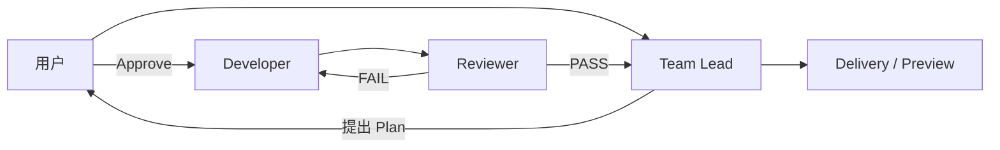
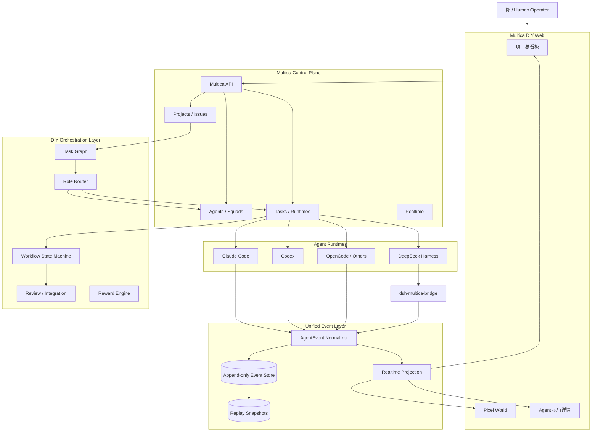
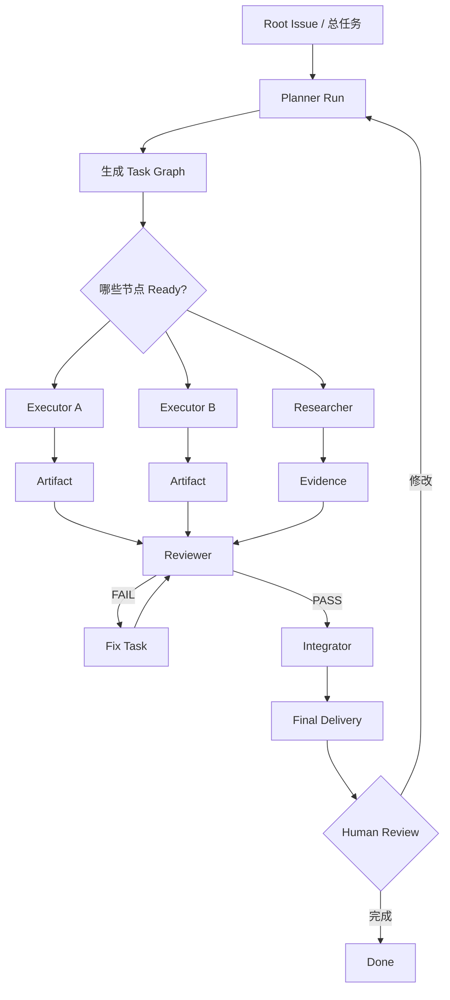
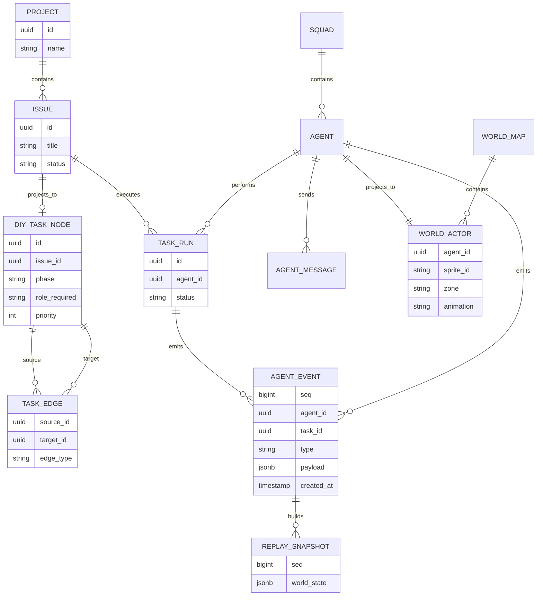

# 基于 Multica 深度 DIY 的“像素世界多 AI Agent 项目管理系统”开源调研与实现方案

## 执行摘要

基于截至 **2026 年 8 月 19 日** 对 Multica、DeepSeek Harness、OpenOffice、Star-Office-UI、ClawLibrary、AgentMonitor、OpenClaw Control Center、OpenClaw-Admin、Pixel Agents 等项目的源码结构、README、官方文档与相关实现的调研，我的核心结论是：

**你的设想完全可以做，而且 Multica 是一个相当不错的“业务/控制平面基座”，但不建议把“像素世界、多 Agent 编排、回放系统”硬塞进 Multica 原有逻辑里。最合适的是“Multica 薄 Fork + DIY Orchestrator + Event Projection + Pixel World”架构。**

Multica 已经解决了最麻烦的一半：Workspace、Project、Issue、Agent、Squad、Runtime、Task、Agent 执行记录、Token 使用、Review、Retry、Realtime 等；它的 Squad 甚至已经实现了“Leader 接任务 → 根据角色选择成员 → `@mention` 派发 → 成员反馈后重新唤醒 Leader → 再派发/评审”的协作闭环。一个 Issue 可以对应多次 Agent Task，每次运行都有独立历史、Transcript、工具调用和错误记录，这与未来的“三视图共享同一运行真相”非常契合。citeturn16view3turn17view0turn17view1

尤其值得注意的是，Multica 的 Squad 已经相当接近你最初描述的“规划者/执行者/审查者/集成者层层派发”：Squad Leader 被唤醒后并不自己执行，而是根据 roster 和 role descriptions，通过 `@mention` 把任务派给成员；成员汇报结果后 Leader 会重新被触发，继续决定下一步、升级问题或把父任务推进到 review。Multica 还做了重复触发去重和防止 Leader 自触发死循环。citeturn17view0

但 Multica 目前的核心抽象仍然是 **Issue + Run + Squad 路由**，而不是你想要的完整 **DAG 任务图 + 显式 Planner/Executor/Reviewer/Integrator 工作流 + 游戏世界状态机**。所以，我建议保留 Multica 作为“项目和运行事实源”，在其上增加一层很薄但非常关键的 **DIY Orchestrator**：负责 Task Graph、Dependency、Delegation、Handoff、Review Loop、Integration Barrier、奖励与 World Event，而不是另起炉灶重写整个 Agent 平台。

对于 DeepSeek Harness，我的结论不是“拿它替代 Multica”，而是：

> **强烈推荐把 DeepSeek Harness 作为“Agent Runtime / 插件宿主 / 深度可观测运行时”之一，而不是整个系统的中心。**

DeepSeek Harness 的核心理念是“Everything is a Plugin”，模型适配器、Tool Registry、Session Log、Agent Loop 都是 Cordis 插件；它还明确提供 durable `SessionEvent`、live `agent/*` events、`tools/*` 事件、session fork/resume/replay 等机制，非常适合做你的“角色执行详情”和调试回放。问题是其官方截至当前仍明确标记 **Developer Preview，并警告会有 compatibility-breaking changes**。citeturn18view0turn18view1

因此最佳组合是：

**Multica = 项目/任务/团队/Agent Control Plane**

**DIY Orchestrator = 任务图与多角色工作流**

**DeepSeek Harness = 可选的高可观测 Agent Runtime / Plugin Host**

**Pixel World = 项目状态的游戏化 Projection，而不是另一套任务系统**

另外，本次调研范围内，**没有发现一个开源项目“完美、开箱即用”覆盖你的全部目标**。但有三个项目尤其接近：

| 项目 | 我对其定位 | 与目标接近度 |
|---|---|---:|
| **OpenOffice** | “多 Agent 编排 + 像素办公室”一体化参考 | **★★★★★** |
| **agent-monitor** | “Dashboard + Office + Agent Detail”三视图骨架几乎现成 | **★★★★★** |
| **OpenClaw-Admin** | 管理后台 + 多 Agent Office + MyWorld | **★★★★☆** |
| Multica | 最强的项目/Issue/Run/Agent Control Plane 基础之一 | **★★★★★（基座）** |
| Pixel Agents | 最值得借鉴的角色动画、布局编辑、Agent→人物映射 | **★★★★★（像素层）** |
| Star-Office-UI | 很成熟的状态→区域→角色移动视觉范式 | **★★★★☆** |
| ClawLibrary | 场景语义、地图房间、资源空间化极有价值 | **★★★★☆** |
| OpenClaw Control Center | 协作大厅、交接、review/evidence 模型很好 | **★★★★☆** |
| ccperdst-lab/openclaw-monitor | 3D 游戏化可视化概念优秀，但和你的 2D 路线不同 | **★★★☆☆** |

其中 **OpenOffice 是我认为目前最接近“如果不限制必须基于 Multica，我会先认真考虑直接 Fork 它”的项目**。它已经有 Leader/Developer/Reviewer、多 Agent delegation、review loop、worktree isolation、token tracking、持久记忆、PixiJS 像素办公室和 typed event contract。其 orchestrator 还是一个不处理 HTTP/IO/持久化的纯逻辑库，这一点特别值得借鉴。citeturn12view0turn13view0turn13view1

但既然你明确希望 **基于 Multica 深度 DIY，而且是个人、非商用、自用**，我的最终推荐不是转投 OpenOffice，而是：

> **用 Multica 做“骨架”，用 OpenOffice 学“脑”，用 agent-monitor 学“三视图”，用 Pixel Agents + Star-Office-UI + ClawLibrary 学“身体和世界”，用 OpenClaw Control Center 学“协作大厅”，DeepSeek Harness 则成为“可插拔运行时神经系统”。**

这条路线的代码复用率和完成度会远高于从零开始。

你的个人非商用性质也显著降低了许可证方面的阻力。Multica 使用的是“Apache 2.0 文本 + Part I 附加条件”组成的 **Multica License**，不能简单称为标准 Apache 2.0；其条款明确指出组织内部使用无需商业许可，同时对于派生自 Multica UI 的界面还有品牌/归属保留要求。作为个人本地 DIY 基本符合其内部/自用方向，但仍应保留许可证、NOTICE、品牌及相关 attribution，尤其如果未来公开 Fork。citeturn20view0turn20view2

## Multica 与 DeepSeek Harness 的基座判断

**先给一个明确判断：Multica 值得二开，而且相比“重新造 Agent 项目管理平台”，更应该在 Multica 上加一层。**

Multica 自己对产品的定义就是让 Agent “show up on the board”：将 AI Coding Agents 当作工作区成员，把 Issue 派给 Agent，Agent 自动接取，在自己控制的 Runtime 中执行，持续反馈进度、阻塞，最终回到 review；目前官方 README 还强调 self-host、多个 Agent CLI、execution log、token usage、review gates、retry/timeout 等能力。citeturn16view3

Multica 的 Agent 并不是常驻进程，而是“身份 + 能力 + Runtime 配置”。真正执行时生成 Task；Agent 可以持有 Issue、被评论 `@mention`、直接 Chat，也可以成为 Project Lead、Squad Leader 或 Squad Member。Agent 配置中已有 instructions、skills、runtime/model、concurrency、环境变量、MCP 等。citeturn17view2

这恰好适合你的“游戏角色”抽象：

```text
Multica Agent
   │
   ├── identity / avatar
   ├── instructions
   ├── skills
   ├── model/runtime
   └── tasks/runs
          │
          ▼
DIY WorldActor
   ├── sprite
   ├── role
   ├── mood
   ├── animation
   ├── current room
   └── current activity
```

也就是说，**不要让像素角色本身成为另一套 Agent 对象**。WorldActor 应该只是 Multica Agent 的视觉投影。

Multica 对 Issue 与 Task 的区分也特别适合作为你的数据基础：Issue 代表长期存在的“工作目标/讨论/负责人/最终状态”，Task 代表一次具体 Agent Run；同一个 Issue 可以发生多次 Run，历史 Run 不会被覆盖。Execution Log 会实时显示运行状态，并能查看 transcript、Agent 消息、tool calls 和 error output。citeturn17view1

因此三视图实际上应该共享一个核心 ID 体系：

```text
Project
  └── Issue
       ├── Task Run A
       │    ├── Agent
       │    ├── Events
       │    ├── Tool Calls
       │    └── Token Usage
       │
       └── Task Run B
            └── ...

同一批数据投影到：

项目总看板
像素世界
Agent 执行详情
```

**Multica 已经具备相当好的 Squad 编排基础。** Squad 包含一个 Leader 和多个 Agent/成员，role descriptions 提供能力描述；把 Issue 分给 Squad 后，Multica 首先唤醒 Leader，而不是同时启动所有 Agent。Leader 根据内容选择成员，然后通过 `@mention` 实际触发成员 Task；成员结果回来后 Leader 被重新唤醒，再决定继续派发、升级或进入 review。citeturn17view0

所以你的 Planner 可以先直接对应：

```text
Squad Leader = Planner / Team Lead

成员：
├── Frontend Executor
├── Backend Executor
├── Research Executor
├── Reviewer
└── Integrator
```

但这里存在一个重要边界：Multica Squad 当前主要解决的是 **“工作该路由给谁”**，官方文档也明确说明 Squad 不等于把多个 Agent 合成一个 Agent，也不会因为建立 Squad 就自动提升并行度。citeturn17view0

你的目标比这个更进一步，需要：

```text
Root Task
├── Research
│   ├── R1
│   └── R2
├── Backend ───────┐
├── Frontend ──────┼── Integration
└── Tests ─────────┘
                    │
                    ▼
                  Review
                    │
             FAIL ──┴──> Fix
                    │
                  PASS
                    ▼
                Delivery
```

所以我会在 Multica 上增加 **TaskGraph/Workflow 层**，而不是试图仅靠 `@mention` Comment 承载所有关系。

从源码结构看，Multica 也是适合深度二开的 monorepo。仓库目前包含 desktop、docs、mobile、web 应用，Go server 则已经拆出了 `daemon`、`daemonws`、`dispatch`、`events`、`metrics`、`pluginbundled`、`realtime`、`runtimeapps`、`scheduler`、`service`、`storage` 等内部模块。citeturn19view0turn19view2

这意味着最自然的新模块可以是：

```text
server/internal/
├── ...
├── dispatch/
├── events/
├── realtime/
├── storage/
│
├── diyorchestrator/      ← 新增
├── taskgraph/            ← 新增
├── worldprojection/      ← 新增
└── replay/               ← 新增
```

前端则不要破坏原来的 Board，可以增加：

```text
apps/web/
└── ...

packages/
├── core/
├── views/
└── world/                ← 新增 Pixel World package
```

或者直接在 Web App 增加：

```text
/project/:projectId/board
/project/:projectId/world
/agent/:agentId/run/:runId
```

我反而**不建议第一阶段直接重写 Multica 的 dispatch/scheduler 核心**。你的 DIY Patch 应当尽量只依赖“Issue/Agent/Task/Realtime”这样的稳定业务概念，而不是绑定底层调度细节。这样未来同步 Multica upstream 的难度会低很多。

### DeepSeek Harness 应该放在哪里

DeepSeek Harness 非常有意思，因为它从架构层面几乎就是为“可扩展 Agent Runtime”设计的。

官方架构明确说明 Cordis Plugin 可以向共享 context 提供 service、typed event 和 reversible effect；模型 adapter、tool registry、session log、agent loop 本身都是插件，没有“不可替换的核心”。Profile 和 Bundle 可以组装插件树，也可以通过 patch 替换配置行。citeturn18view1

它还有一套非常适合你“执行详情 + 回放”的事件模型：

```text
turn/start
  step/start
    user/message
    agent/request
    assistant/chunk *
    assistant/message
    tool/call *
      tools/pre-execute
      tools/execute
      tools/post-execute
    tool/result *
  step/end
turn/end
```

其中 `turn/*`、`step/*`、user/assistant/tool 等是 durable Session Events；`agent/*` 是运行中的实时事件。其 session log 还是模型上下文的事实源，并用于 transcript、fork、resume、telemetry、persistence 和 UI replay。citeturn18view1

这几乎就是你希望 Agent 详情页面展示的：

```text
09:41:03  Planner received task
09:41:05  turn/start
09:41:06  tool/call: search_repo
09:41:12  tool/result
09:41:15  DecisionRecord: split task into A/B/C
09:41:17  delegation -> Backend
09:41:18  delegation -> Frontend
...
```

但 DeepSeek 官方当前明确写着：

> Developer Preview，正在快速迭代，会出现兼容性破坏性变更。citeturn18view0

因此我不建议：

```text
❌ Pixel UI
     ↓
DeepSeek Harness internals
     ↓
Everything else
```

而建议：

```text
                 ┌── Claude Code
Multica Runtime ─┼── Codex
                 ├── Cursor
                 ├── OpenCode
                 └── dsh / DeepSeek Harness
                         │
                         ▼
                 multica-bridge plugin
                         │
                         ▼
                   Normalized Events
```

Multica 本身已经把 `dsh`/DeepSeek Harness 列为支持的 Agent CLI 之一，因此两者并非二选一。citeturn1view0

最终评分：

| DeepSeek Harness 用法 | 推荐度 | 判断 |
|---|---:|---|
| 替代 Multica 做整个项目平台 | ★★☆☆☆ | 不推荐 |
| 做统一多 Agent 项目管理 Orchestrator | ★★★☆☆ | 能做，但重复造 PM 层 |
| 做某些 Agent 的 Runtime | ★★★★★ | **很合适** |
| 做 Runtime Plugin 平台 | ★★★★★ | **非常合适** |
| 提供 Tool/Session/Replay 事件 | ★★★★★ | **非常合适** |
| UI 直接依赖其内部事件 schema | ★★☆☆☆ | Developer Preview 风险高 |
| 通过 Adapter 转成自己的 AgentEvent | ★★★★★ | **推荐方案** |

最值得 DIY 的 Harness 插件就是一个：

```text
@yourname/dsh-multica-bridge

职责：
├── 监听 session/event
├── 监听 agent/*
├── 监听 tools/*
├── 转换成统一 AgentEvent
├── 向 Multica DIY API 上报
├── 注册 delegate_task Tool
└── 注册 report_progress Tool
```

这样即使半年后 dsh API 大改，也只需要修改这一个适配器。

## 开源项目横向调研与可复用组件

下面是你列出的所有项目加上我认为值得补充的项目。

| 项目 | 已有能力 | 对你最有价值的源码 | 建议 |
|---|---|---|---|
| **Star-Office-UI** | 2D 像素办公室、6 个工作状态映射到不同区域、动画角色/气泡、多 Agent join、房间装修、桌面宠物；可通过 HTTP 手动驱动状态。citeturn15search0turn15search4 | 状态→区域→角色移动模型；sprite/office UI；气泡；角色加入；资产管理 | **大量参考，部分直接复用** |
| **OpenOffice** | Leader/Developer/Reviewer、多 Agent delegation、review loop、worktree、token cost、memory、PixiJS office；Next.js + PixiJS + Node Gateway + typed events。citeturn12view0turn13view0turn13view1 | `packages/orchestrator`、PixiJS Office、typed events、worktree、review flow | **最高优先级参考** |
| **ClawLibrary** | 把 document/image/memory/skill/code/runtime/queue 等映射成不同像素房间，把运行活动与角色所在房间关联。citeturn15search1 | 地图语义化、room routing、地图配置、资源→场景映射、视觉资产层分离 | **像素世界重点参考** |
| **ccperdst-lab/openclaw-monitor** | 3D Dashboard，“Agent=continent、Session=minion”，带 Physics、live chat、thinking bubbles。citeturn21search0 | 世界化隐喻、thinking bubble、session avatar 化 | 概念参考，不建议做底座 |
| **openclaw-control-center** | Overview、Usage、Staff、Tasks、Memory；尤其是 Collaboration Hall，可在同一线程讨论、确定执行 owner、handoff、review、evidence，并调用真实 Agent Runtime。citeturn15search2turn15search5 | Collaboration Hall、handoff/review/evidence UX | **协作界面重点参考** |
| **agent-monitor** | Dashboard、Pixel Office、Agent Detail、direct/global chat、activity feed、token usage、SSE、WebSocket；源码路由甚至就是 `page.tsx / office/page.tsx / agent/[id]/page.tsx`。citeturn16view1turn16view2 | 三视图页面结构、`state-mapper.ts`、gateway connection、office components | **最容易直接移植 UI 思路** |
| **OpenClaw-Admin** | Dashboard、sessions、memory、token、agents；Office 支持 delegation、execution、agent communication、team management；MyWorld 有角色移动、区域互动、实时通信。citeturn16view0 | Office/MyWorld、运行后台、终端与工具调用 UI | 很强参考，但 Vue→React 移植成本高 |

### Star-Office-UI

Star-Office-UI 的最大价值不是后台，而是它把“不可见的 Agent 工作状态”转换成非常直观的空间语言：

```text
idle       → 休息区
writing    → 办公桌
researching→ 资料区
executing  → 工作区
syncing    → 协作区
error      → 错误状态
```

官方项目已经支持这六类状态、角色自动到相应区域、动画 sprite、speech bubbles、多 Agent join 等。citeturn15search4

你的版本可以进一步扩成：

```text
planning      → 战略会议室
researching   → 图书馆
coding        → 开发工位
testing       → 测试实验室
reviewing     → 审查室
integrating   → 集成中心
blocked       → 求助台
communicating → 会议区
waiting       → 茶水间
completed     → 庆功区
error         → 医务室 / Debug Room
offline       → 宿舍
```

Star-Office-UI 的代码采用 MIT，而它的项目说明特别区分了像素艺术资产的非商用用途；对你明确的个人非商用 DIY 很友好，但如果以后公开分发，应继续核对资产许可。citeturn15search0

### OpenOffice

这是本次调研里**最值得认真读源码的项目**。

OpenOffice 已经有与你非常相似的工作流：



其 Team Lead 明确负责 product direction、break work down 和 delegation；Developer 实现和测试；Reviewer 检查质量与需求一致性，并返回 PASS/FAIL。citeturn13view0

更重要的是 `packages/orchestrator`。官方文档将其定义成纯逻辑 library，没有 HTTP、IO 或 persistence，由 Gateway 负责外部交互；内部拆成 `AgentManager`、`DelegationRouter`、`PhaseMachine`、`ResultFinalizer`、`PreviewResolver` 等，全靠 typed events 交互。citeturn13view1

它甚至已经做了：

```text
Leader
   ↓
Developer
   ↓
Reviewer
   ├── PASS → Leader → Final
   │
   └── FAIL #1
          ↓
     Developer direct fix
          ↓
       Reviewer
          │
          └── FAIL #2 → escalate Leader
```

并设置 delegation depth、总派发数、review rounds 等边界，防止无限递归。citeturn13view1

**这套思想非常值得移植到 Multica。**

但是我不会直接把完整 `@bit-office/orchestrator` 塞进 Multica，因为那会出现“两套 Agent Session/Execution System”：

```text
Multica Task system
       VS
OpenOffice AgentSession
```

更好的办法是移植它的：

```text
DelegationRouter
PhaseMachine
ReviewLoop
RetryBudget
RolePrompt pattern
typed event vocabulary
```

让真正的执行仍由 Multica Task/Runtime 完成。

OpenOffice 还采用 Next.js + React + PixiJS v8 + Zustand 的像素 Office，这与你在 Multica Web 上继续做 React/Pixi 非常吻合。citeturn12view0

### ClawLibrary

ClawLibrary 值得看的不是 Agent 编排，而是**怎样让数据结构成为“世界”**。

它把资源变成：

```text
Document Archive
Image Atelier
Memory Vault
Skill Forge
Interface Gateway
Code Lab
Scheduler
Alarm Board
Runtime Monitor
Queue Hub
Break Room
```

角色正在访问什么资源，就在相应空间出现。citeturn15search1

这启发了你的项目：不要把 Pixel World 做成单纯“几个小人走来走去的动画皮肤”，而应该让场景承载系统语义。

例如：

```text
图书馆     = Knowledge / Research
任务大厅   = Backlog / Todo
会议室     = Planner / Handoff
开发工坊   = Executing
测试实验室 = Testing
审查室     = Review
集成车间   = Integration
档案馆     = Artifacts
信箱       = Agent Messages
钟楼       = Autopilot / Scheduled Task
医院       = Failed / Blocked
酒馆       = Idle
```

这样你点击房间，本身就等于进入相应管理界面。

ClawLibrary 的代码是 MIT，而项目内资产另用 CC BY-NC-SA 4.0；个人非商用非常适合拿来学习甚至本地使用，但公开传播修改后的资产时应遵守署名和相同方式共享等要求。citeturn15search1

### agent-monitor

从“快速做出你说的三视图”角度，**agent-monitor 是最重要的代码参考之一。**

它现有源码结构几乎已经是：

```text
src/app/
├── page.tsx              # Dashboard
├── office/page.tsx       # Pixel Office
└── agent/[id]/page.tsx   # Agent Detail

src/components/
├── dashboard/
├── chat/
├── office/
└── settings/

src/lib/
├── gateway-connection.ts
├── state-mapper.ts
└── types.ts
```

而且 Gateway Events 经 SSE 到前端，再通过 `state-mapper.ts` 映射成 Office behavior、stats、feed 和 chat。citeturn16view2

这几乎可以原样变成你的：

```text
Multica Event
     ↓
MulticaAdapter
     ↓
UnifiedAgentEvent
     ↓
state-mapper
   ├── Board Projection
   ├── World Projection
   └── Agent Detail Projection
```

我会把它列为 **“UI 直接复用价值最高”** 的项目。

### OpenClaw Control Center 与 OpenClaw-Admin

OpenClaw Control Center 最值得借鉴的是 **Hall-first collaboration**：Agent 先在共享 timeline 讨论，随后才收敛到执行 owner，再进行 handoff、review 和 evidence 展示。官方当前版本还可以把 hall 的 assign/handoff 真正下发给 `openclaw agent` runtime，而不是只显示模拟文字。citeturn15search5

你的像素世界里完全可以做成：

```text
用户把任务丢进“会议桌”
        ↓
Planner 走进会议室
        ↓
Researcher / Architect 走过来
        ↓
头顶出现讨论气泡
        ↓
Planner 创建 Task Cards
        ↓
卡片飞向不同 Agent
        ↓
Agent 各自走向工位
```

而 OpenClaw-Admin 的 Office/MyWorld 已经同时涵盖 multi-agent collaboration、scene wizard、task delegation、execution、agent communication、team management，以及角色 movement/area interaction/realtime communication。citeturn16view0

但它基于 Vue 3；Multica Web 是 React 体系，因此我更推荐借鉴数据结构和交互，不建议直接搬整个 UI。

### 额外强烈建议看的 Pixel Agents

Pixel Agents 是我认为你没有列出但**必须加入第一梯队**的项目。

它把终端里的 Agent 直接变成像素人物：Agent 编辑文件时坐在桌前打字，搜索/读取时呈现阅读状态，等待用户输入时出现视觉提醒；同时还有 Office Layout Editor。最新项目架构还明确设计了 agent-agnostic 的 `HookProvider` 边界。citeturn20search0

项目甚至采用 AsyncAPI contract 做 core protocol，严格分离 core/server/webview/adapters，这个“**Agent Provider 与 Game Renderer 解耦**”的思想与你的 Multica Adapter 非常契合。citeturn20search2

它还支持外部 furniture asset 目录和 manifest，非常值得照抄其“美术资产插件化”思路。citeturn20search6

此外，Claude-Office 展示了另一种简单可行模式：Claude Code Hooks → WebSocket events → isometric pixel office；对于以后做 Claude/Codex 独立 runtime adapter 也值得参考。citeturn20search1

### 是否有已经“完美完成”的项目

**在本次检索的公开开源项目范围内，没有。**

如果按你的八项核心能力比较：

| 能力 | Multica | OpenOffice | agent-monitor | OpenClaw-Admin | Star Office | Pixel Agents |
|---|---:|---:|---:|---:|---:|---:|
| 项目/Issue 管理 | ★★★★★ | ★★★ | ★★ | ★★★ | ★ | ★ |
| 多角色 Agent | ★★★★ | ★★★★★ | ★★★ | ★★★★ | ★★★ | ★★★ |
| 自动派发 | ★★★★ | ★★★★★ | ★★ | ★★★★ | ★ | ★ |
| Review/闭环 | ★★★★ | ★★★★★ | ★ | ★★★ | ★ | ★ |
| Task DAG/依赖 | ★★★ | ★★★ | ★ | ★★ | ★ | ★ |
| Agent 执行详情 | ★★★★★ | ★★★★ | ★★★★ | ★★★★ | ★★ | ★★★ |
| Pixel World | ★ | ★★★★★ | ★★★★ | ★★★★ | ★★★★★ | ★★★★★ |
| 深度 Replay | ★★★★ | ★★★ | ★★ | ★★★ | ★ | ★★ |

这里的星级是我根据上述项目公开功能做的**架构适配评价，不是项目官方评分**。

所以真正“接近开箱”的选项有两个：

**不限定 Multica：** Fork OpenOffice，补强项目看板、DAG、详细 Replay。

**坚持 Multica：** Fork Multica，再借 agent-monitor / OpenOffice / Pixel Agents 把缺的 UI、Orchestrator、Pixel World 加上。

考虑到你明确希望的是“**深度个人 DIY**”，我更推荐第二条，因为最终可玩性更高，而且你不会被某个已经固定好的产品结构限制。

## 推荐产品设计与总体架构

我建议不要把三个视图理解成三个独立模块，而要实现成**一个 Event-Sourced World 的三种 Projection**。



这里最重要的一条原则是：

> **真实业务状态永远在 Multica/PostgreSQL；Pixel World 只是状态的游戏化投影。**

不要出现：

```text
人物已经走到 Review Room
→ 所以任务应该是 reviewing
```

而应该始终是：

```text
Task = reviewing
→ World reducer
→ Actor.walkTo(review_room)
→ Actor.animation = reviewing
```

否则 UI 动画和真实执行状态最终一定会分叉。

### 推荐技术栈

| 层 | 推荐 | 原因 |
|---|---|---|
| 主 Web | **沿用 Multica React/Next.js** | 降低 Fork 成本 |
| UI 状态 | Zustand + Query 体系 | 与 React/Pixi 解耦容易 |
| 项目看板 | Multica 原 Board 扩展 | 不重做已有能力 |
| DAG | **React Flow / xyflow** | 自带节点、拖拽、缩放、连接等能力。citeturn14search3 |
| Pixel Renderer | **PixiJS v8** | 最推荐 |
| 游戏重型替代 | Phaser | 当你需要复杂 Tilemap/Physics 时 |
| 地图编辑 | **Tiled** | JSON、Object Layer、Custom Properties 很适合定义房间和 anchor。citeturn14search2turn14search6turn14search14 |
| Backend | Multica Go Server | 继续做 canonical control plane |
| DB | PostgreSQL | 直接复用 Multica |
| 实时 | Multica realtime + WebSocket/SSE | MVP 不额外引中间件 |
| Durable Event | PostgreSQL append-only 表 | 个人 DIY 足够 |
| 大型事件总线 | NATS JetStream，可选 | 多机器/多 adapter 后再加 |
| Runtime | Multica Runtime | 主执行层 |
| Runtime Plugin | DeepSeek Harness | 高级可观测/Tool/Session |
| 桌面化 | 继续跟 Multica Desktop，或 Tauri | 后期再做 |

为什么我更倾向 **PixiJS 而不是 Phaser**？

因为你真正做的不是一个拥有大量物理碰撞规则的 RPG，而是一个“**数据驱动的交互式 2D 世界**”。OpenOffice 本身就在 Next.js/React 项目中用 PixiJS v8 做类似 Pixel Office。citeturn12view0

PixiJS 对 Sprite、Scene Graph、Container 和高性能 particle rendering 都有直接支持；对静态或低频更新 Container 还能通过纹理缓存减轻渲染负担。citeturn14search0turn14search12turn14search20

Phaser 也完全可行，而且对 Tiled Tilemap、orthogonal/isometric/hexagonal/staggered 等地图形式支持更“游戏引擎化”。citeturn14search9

因此：

```text
更像 Stardew UI + 管理器
        ↓
      PixiJS

逐渐发展成真正小游戏
碰撞 / RPG / 大量 Tilemap Gameplay
        ↓
      Phaser
```

你的第一版我坚定推荐 PixiJS。

### 角色体系

我建议不要把 Planner/Executor/Reviewer 写死，而做成 `RoleDefinition`：

| Role | 默认职责 | 可以持有什么 Task |
|---|---|---|
| Planner | 理解总目标、拆 Task Graph、分配 | planning |
| Researcher | 搜索/调研/形成证据 | research |
| Executor | 实现 | execution |
| Tester | 验证 | testing |
| Reviewer | 审核 deliverable | review |
| Integrator | 汇总、合并、最终交付 | integration |
| Supervisor | 失败升级、预算控制 | escalation |

同一个 Multica Agent 可以拥有多个 Role，Role 与 Agent 分开：

```text
Agent = “Alice”
Role  = Planner

Agent = “Bob”
Role  = Backend Executor

Agent = “Carol”
Role  = Reviewer
```

这样游戏角色、模型、Agent CLI 和岗位不会绑死。

### 多 Agent 编排建议

真实工作流建议是：



OpenOffice 已经验证了 Leader→Developer→Reviewer→Direct Fix→Leader escalation 这种闭环在 Agent 协作上很实用；你可以把它升级成一般化 DAG。citeturn13view1

## 像素世界、三视图与游戏化的具体实现

你这个产品真正有意思的地方，不是“把 dashboard 画成像素风”，而是做到：

> **现实中的 Agent 活动，在世界中都有空间、行为、表情、声音和历史痕迹。**

### World 不应只是动画，而是项目空间

第一张地图可以设计成：

```text
┌──────────────────────────────────────────────┐
│                     城镇                     │
│                                              │
│  ┌───────┐     ┌──────────┐    ┌─────────┐ │
│  │ 图书馆 │     │ 战略会议室 │    │任务大厅  │ │
│  │Research│     │ Planner   │    │Backlog  │ │
│  └───────┘     └──────────┘    └─────────┘ │
│                                              │
│  ┌───────┐     ┌──────────┐    ┌─────────┐ │
│  │开发工坊│     │ 测试实验室 │    │Review室 │ │
│  │Execute│     │ Testing  │    │Reviewer │ │
│  └───────┘     └──────────┘    └─────────┘ │
│                                              │
│      ┌───────────┐      ┌────────────┐      │
│      │ 集成中心   │      │ Debug 医院 │      │
│      │ Integrator│      │ Block/Error│      │
│      └───────────┘      └────────────┘      │
│                                              │
│             ☕ 酒馆 / Idle Zone              │
└──────────────────────────────────────────────┘
```

ClawLibrary 已经证明“资源/运行行为 → 有语义的房间”是非常自然的一种可视化方式，而 Star Office 则已经实现“Agent 状态 → 不同办公室区域 → 角色移动”的视觉模式。citeturn15search1turn15search4

### Actor 状态机

建议每个 Agent 至少有：

```text
OFFLINE
IDLE
WALKING
THINKING
PLANNING
RESEARCHING
CODING
TESTING
REVIEWING
INTEGRATING
COMMUNICATING
WAITING
BLOCKED
ERROR
CELEBRATING
```

视觉资源则是：

```text
idle_down
idle_up
idle_left
idle_right

walk_down[]
walk_up[]
walk_left[]
walk_right[]

work[]
read[]
talk[]
review[]
confused[]
error[]
celebrate[]
sleep[]
```

这里不要把真实工具名直接等同于动画，而是通过 State Mapper：

```text
tool = read_file/search
    → researching

tool = apply_patch/edit_file
    → coding

tool = bash && command contains test
    → testing

review Task active
    → reviewing

waiting_for_user
    → waiting

task.failed
    → error
```

这正是 agent-monitor 现有 `state-mapper` 结构值得借鉴的原因，它本身已经把 Gateway/session 状态映射到 Office behavior。citeturn16view2

### Tiled 地图

地图建议用 Tiled 编辑，而不是自己手写坐标。

Tiled 支持 JSON Map、Object Layer 和 Custom Properties，Object 之间还能建立连接，非常适合把位置变成领域对象。citeturn14search2turn14search6turn14search14

例如地图里定义：

```json
{
  "name": "review_desk_01",
  "type": "workstation",
  "x": 640,
  "y": 320,
  "properties": [
    { "name": "role", "type": "string", "value": "reviewer" },
    { "name": "activity", "type": "string", "value": "reviewing" },
    { "name": "capacity", "type": "int", "value": 2 }
  ]
}
```

另一个 Object：

```json
{
  "name": "planner_meeting_room",
  "type": "zone",
  "properties": [
    { "name": "activity", "value": "planning" },
    { "name": "interaction", "value": "open-task-graph" }
  ]
}
```

这样地图本身就是可编辑的配置。

### 移动和路径

MVP 不需要完整 RPG Physics。

采用：

```text
Tiled collision grid
       ↓
Navigation Grid
       ↓
A* path
       ↓
Waypoints[]
       ↓
Actor walking animation
```

Actor 到达 workstation 后：

```text
walking
  ↓
arrival
  ↓
turn toward desk
  ↓
play coding/reviewing animation
```

多个 Agent 抢同一个位置时：

```text
Station.capacity
        ↓
Reservation System
        ↓
full?
 ├─ no → occupy
 └─ yes → nearby waiting anchor
```

这会比让 Sprite 相互物理碰撞稳定很多。

### Agent 间通信的“游戏化”

真实数据层：

```text
Agent A → AgentMessage → Agent B
```

世界层：

```text
A 停止工作
A 走到 B 附近
B 转向 A
A 💬 “接口定义好了”
B 💬 “收到，我继续前端”
A 回工位
B 状态变为 coding
```

对于短消息，可以不移动：

```text
A
│
├── ✉️ 小信封飞向 B
│
B
└── 💡 bubble
```

对于 Planner 派发：

```text
Planner 举起任务卡
          ↓
      卡片飞出
      ↙        ↘
Backend      Frontend
```

对于 Review FAIL：

```text
Reviewer: ❌
     │
     └── 红色任务卡 → Developer

Developer: 😰
     ↓
walk back to desk
     ↓
fixing
```

对于 Review PASS：

```text
Reviewer: ✅
Developer: 🎉
Integrator: 📦
```

这些效果最好完全由事件决定，而不是写随机业务逻辑。

### 游戏化奖励

建议游戏化只作为**反馈层**，不要影响真实 Agent 决策。

例如：

```text
Task Completed      +10 XP
First Review Pass   +15 XP
Recovered Blocker   +8 XP
Project Delivered   +50 XP
```

然后解锁：

```text
新桌子
新植物
角色服装
办公室装饰
宠物
奖杯
新场景
```

你甚至可以做：

```text
Backend Lv. 12
★★★★☆ Reliability
23 Tasks Completed
87% Review Pass
42k Tokens Today
```

但这些指标应该是 Project Events 的投影，而不是让 LLM 为了刷 XP 改变行为。

### 回放系统

这是我认为必须在 MVP 之后尽快实现的功能。

不要录整个 Pixi Canvas 视频，而是录事件：

```json
{
  "seq": 18344,
  "time": "2026-08-19T13:24:19.183Z",
  "type": "agent.tool.started",
  "agentId": "agent_backend",
  "taskId": "task_123",
  "payload": {
    "tool": "bash",
    "summary": "running tests"
  }
}
```

然后：

```text
Event 1
Event 2
Event 3
...
Event N
    ↓
WorldReducer
    ↓
WorldState(t)
```

回放时拖时间轴即可重新播放。

DeepSeek Harness 的 append-only `SessionEvent` 设计非常适合做这一层，它本身就强调 raw assistant chunks、tool events、transcript、fork/resume/replay 都从 session event stream 派生。citeturn18view1

Multica 自己也已经能显示 Run transcript、工具调用、错误，并实时更新 execution log，因此你的统一 Replay Store 不需要重新发明“如何记录 Agent Run”，而主要负责把多种 Runtime 事件转成统一结构。citeturn17view1

另外，“决策链”建议不要设计成依赖模型隐藏的内部 chain-of-thought，而是显式记录：

```json
{
  "type": "decision",
  "decision": "拆分前端和后端并行执行",
  "reasonSummary": "二者接口已定义且修改范围相互独立",
  "evidenceRefs": [
    "issue:MUL-21",
    "artifact:api-contract-v2"
  ]
}
```

这样得到的是**可审计决策记录**，而不是不可稳定获取的隐藏推理过程。

### 性能优化

React 不要每帧操纵角色。

正确方式：

```text
React
  │
  ├── Toolbar
  ├── Modal
  ├── Agent Drawer
  └── Pixi Canvas
         │
         └── Pixi own ticker
```

只在语义状态发生变化时：

```text
React/Zustand
     ↓ event
World Engine
     ↓
Pixi Actor targetState
```

然后移动、插值、sprite frame 都在 Pixi 内运行。

还应采用：

```text
Texture Atlas
Sprite Pool
Object Pool
Viewport Culling
Static Background Cache
Dirty State Update
ParticleContainer for effects
```

PixiJS 官方专门提供 `ParticleContainer` 来高效处理大量轻量对象，也支持对静态或低频变化 Container 使用 `cacheAsTexture`。citeturn14search0turn14search12

对于你的个人 Agent 团队，实际大概十几个到几十个角色，真正的性能压力很可能不是人物，而是**日志、Timeline 和 React DOM**。因此执行详情页面要虚拟化列表，不要把几万条 tool event 一次性渲染出来。

## 数据模型、关键接口与示例实现

我建议最大程度保留 Multica 的实体，只增加**引用 Multica ID 的扩展表**。



关键模型建议如下：

| 模型 | 作用 | 核心字段 |
|---|---|---|
| `DIYTaskNode` | 对 Multica Issue 的 DAG 投影 | issueId、roleRequired、phase、priority |
| `TaskEdge` | 依赖 | source、target、type |
| `RoleDefinition` | Planner/Reviewer 等岗位 | capabilities、instructions、limits |
| `AgentRoleBinding` | Agent 与岗位 | agentId、roleId |
| `AgentEvent` | 全系统统一事件 | seq、type、agentId、issueId、runId、payload |
| `AgentMessage` | Agent 间通信 | from、to、taskId、content |
| `DecisionRecord` | 可审计决策摘要 | decision、reasonSummary、evidenceRefs |
| `WorldActor` | Agent 的世界投影 | sprite、zone、animation、mood |
| `WorldMap` | 地图配置 | tiledAsset、anchors、zones |
| `ReplaySnapshot` | 快速回放 | seq、worldState |
| `RewardLedger` | 游戏化奖励 | agentId、eventId、xp |

### 统一事件模型

所有 runtime 先转成自己的协议：

```ts
export type AgentEventType =
  | "task.created"
  | "task.assigned"
  | "task.started"
  | "task.progress"
  | "task.blocked"
  | "task.completed"
  | "task.failed"
  | "agent.message"
  | "agent.delegated"
  | "agent.tool.started"
  | "agent.tool.finished"
  | "review.started"
  | "review.passed"
  | "review.failed"
  | "integration.started"
  | "integration.completed"
  | "decision.recorded";

export interface AgentEvent {
  id: string;
  seq: number;
  timestamp: string;

  projectId: string;
  issueId?: string;
  taskRunId?: string;

  agentId?: string;
  type: AgentEventType;

  payload: Record<string, unknown>;
}
```

这就是整个系统最重要的 abstraction。

**Board 不知道事件来自 DeepSeek Harness。**

**Pixel World 不知道事件来自 Claude Code。**

**Replay 不知道 Multica 底层用了什么 CLI。**

它们只认 `AgentEvent`。

### Planner 拆解任务

下面是**建议接口/伪代码，不是当前 Multica 官方 API 的逐字实现**：

```ts
interface PlannedTask {
  title: string;
  description: string;

  roleRequired:
    | "researcher"
    | "executor"
    | "tester"
    | "reviewer"
    | "integrator";

  dependsOn: string[];
  acceptanceCriteria: string[];
}

interface PlanResult {
  summary: string;
  tasks: PlannedTask[];
}

async function decomposeRootIssue(rootIssueId: string) {
  const root = await multica.issues.get(rootIssueId);

  const plan = await planner.runStructured<PlanResult>({
    objective: root.description,
    schema: PlanResultSchema,
  });

  const created = new Map<string, string>();

  for (const planned of plan.tasks) {
    const issue = await multica.issues.create({
      projectId: root.projectId,
      title: planned.title,
      description: planned.description,
    });

    created.set(planned.title, issue.id);

    await taskGraph.createNode({
      issueId: issue.id,
      roleRequired: planned.roleRequired,
      acceptanceCriteria: planned.acceptanceCriteria,
    });
  }

  for (const planned of plan.tasks) {
    for (const dependency of planned.dependsOn) {
      await taskGraph.addEdge({
        sourceIssueId: created.get(dependency)!,
        targetIssueId: created.get(planned.title)!,
        type: "blocks",
      });
    }
  }

  await events.publish({
    type: "decision.recorded",
    issueId: rootIssueId,
    payload: {
      decision: "root task decomposed",
      reasonSummary: plan.summary,
    },
  });

  await dispatchReadyNodes(root.projectId);
}
```

### 自动层层派发

```ts
async function dispatchReadyNodes(projectId: string) {
  const readyNodes = await taskGraph.findReadyNodes(projectId);

  for (const node of readyNodes) {
    const agent = await roleRouter.chooseAgent({
      role: node.roleRequired,
      skills: node.requiredSkills,
    });

    await multica.assignIssue(node.issueId, agent.agentId);

    await events.publish({
      type: "agent.delegated",
      projectId,
      issueId: node.issueId,
      agentId: agent.agentId,
      payload: {
        role: node.roleRequired,
      },
    });
  }
}
```

MVP 阶段甚至可以少写很多代码，因为 Multica Squad 已经支持 Leader 用准确 mention markdown 把成员唤醒，并且成员反馈后 Leader 自动重新触发。citeturn17view0

所以：

```text
MVP
Squad + @mention

↓

V2
显式 TaskGraph + RoleRouter

↓

V3
Planner 自动 DAG + policy engine
```

会比一开始就造一个复杂调度器稳得多。

### Agent 通信

```ts
interface AgentMessage {
  id: string;
  projectId: string;
  taskId?: string;

  fromAgentId: string;
  toAgentId: string;

  kind:
    | "question"
    | "answer"
    | "handoff"
    | "review"
    | "blocker"
    | "status";

  content: string;
  artifactRefs?: string[];
}
```

发送：

```ts
async function sendAgentMessage(msg: AgentMessage) {
  await db.agentMessages.insert(msg);

  // 如果消息意味着真实执行，则转换成 Multica trigger / mention。
  if (requiresExecution(msg.kind)) {
    await multica.triggerAgent({
      agentId: msg.toAgentId,
      issueId: msg.taskId,
      context: msg.content,
    });
  }

  await events.publish({
    type: "agent.message",
    projectId: msg.projectId,
    issueId: msg.taskId,
    agentId: msg.fromAgentId,
    payload: msg,
  });
}
```

世界里：

```text
agent.message
     │
     ├── nearby
     │     └── face each other + speech bubble
     │
     └── far away
           └── flying envelope animation
```

### Pixel Actor reducer

```ts
type ActorActivity =
  | "idle"
  | "walking"
  | "planning"
  | "researching"
  | "coding"
  | "testing"
  | "reviewing"
  | "integrating"
  | "blocked"
  | "error"
  | "celebrating";

interface WorldActorState {
  agentId: string;
  activity: ActorActivity;
  zone: string;
  targetAnchor?: string;
  mood?: string;
}

function reduceActor(
  actor: WorldActorState,
  event: AgentEvent,
): WorldActorState {
  if (event.agentId !== actor.agentId) return actor;

  switch (event.type) {
    case "task.started":
      return {
        ...actor,
        activity: "walking",
        zone: actor.zone,
        targetAnchor: targetZoneFor(event),
      };

    case "review.started":
      return {
        ...actor,
        activity: "walking",
        targetAnchor: "review_room",
      };

    case "task.blocked":
      return {
        ...actor,
        activity: "blocked",
        targetAnchor: "debug_hospital",
        mood: "confused",
      };

    case "review.passed":
      return {
        ...actor,
        activity: "celebrating",
        mood: "happy",
      };

    case "task.failed":
      return {
        ...actor,
        activity: "error",
        mood: "sad",
      };

    case "task.completed":
      return {
        ...actor,
        activity: "idle",
        targetAnchor: "tavern",
      };

    default:
      return actor;
  }
}
```

### Board 实时更新

不要让 Board 自己轮询 Runtime。

```ts
eventBus.subscribe("task.*", async (event) => {
  const projection = await projectProjectStatus(event.projectId);

  realtime.broadcast(`project:${event.projectId}`, {
    type: "project.projection.updated",
    payload: projection,
  });
});
```

一个 Project Projection 可以一次性提供：

```json
{
  "progress": 0.64,
  "todo": 7,
  "running": 3,
  "blocked": 1,
  "review": 2,
  "done": 11,
  "tokens": 183402,
  "estimatedCost": 8.42,
  "activeAgents": 4,
  "criticalPath": ["T12", "T17", "T22"]
}
```

### DeepSeek Harness Bridge

概念代码：

```ts
export function multicaBridge(ctx: DshContext) {
  ctx.on("session/event", async (event) => {
    const normalized = normalizeDshSessionEvent(event);

    await sendToMultica("/api/diy/events", normalized);
  });

  ctx.on("agent/status", async (event) => {
    await sendToMultica("/api/diy/events", {
      type: normalizeAgentStatus(event),
      payload: event,
    });
  });

  ctx.tools.register({
    name: "delegate_task",
    description: "Delegate a project task to another team role",
    schema: DelegateTaskSchema,

    async execute(input) {
      return await callMulticaOrchestrator(
        "/api/diy/orchestrator/delegate",
        input,
      );
    },
  });
}
```

DeepSeek Harness 官方本身就把 `session/event`、`agent/*`、`tools/*` 定义为扩展点，并明确把 UI/editor integration 描述为驱动 Agents、从 `session/event` 渲染，因此这个 Bridge 模式与其架构方向一致。citeturn18view1

### Agent 执行详情页

最终我建议详情页不是一个“大日志框”，而是：

```text
┌────────────────────────────────────────────────────────────┐
│ Backend Bob                 RUNNING  14m32s  31,204 tokens │
├────────────────────────────────────────────────────────────┤
│ 当前目标                                                   │
│ 实现 WebSocket task event bridge                          │
├──────────────────┬─────────────────────────────────────────┤
│ Timeline         │ Current Context                         │
│                  │                                         │
│ 10:14 task start │ Root Issue MUL-12                      │
│ 10:15 read       │ Parent Task MUL-21                     │
│ 10:17 bash       │ Input Artifacts ...                    │
│ 10:20 decision   │                                         │
│ 10:22 message →A │                                         │
│ 10:25 tests      │                                         │
├──────────────────┴─────────────────────────────────────────┤
│ Decision Records                                           │
│ • chose SSE because ...       [evidence]                   │
├────────────────────────────────────────────────────────────┤
│ Communication                                              │
│ Bob → Alice: API ready                                     │
│ Reviewer → Bob: test missing                               │
├────────────────────────────────────────────────────────────┤
│ Tools / Files / Git / Artifacts                            │
├────────────────────────────────────────────────────────────┤
│ Tokens 31k │ Tool calls 27 │ Retries 1 │ Cost ...          │
└────────────────────────────────────────────────────────────┘
```

这比单纯展示所谓“思维链”有用得多，也更适合作为长期调试工具。

## 实施路线、MVP、风险与关键参考

考虑你是**个人 DIY、非商业产品**，最大的原则不是“架构做到企业级”，而是：

> **尽量减少基础设施，把精力花在 Agent 协作和游戏世界体验上。**

不要第一天就装 Kafka、Redis、NATS、ClickHouse、Temporal、Kubernetes。

你的 MVP：

```text
Multica
+ PostgreSQL
+ 原 Realtime
+ 一个 DIY Event 表
+ PixiJS
+ Tiled
```

完全够。

### 推荐开发顺序

| 阶段 | 内容 | 个人开发估算 |
|---|---|---:|
| 基座打通 | 跑通 Multica 源码、建立 DIY branch、搞清 Issue/Task/Realtime | 2–4 天 |
| Event Adapter | 统一 `AgentEvent`，把 Task/Agent/Tool/Message 映射出来 | 4–6 天 |
| Agent Detail | Timeline、通信、Tool、Token、Run detail | 3–5 天 |
| Task Graph | React Flow DAG、dependency、ready/blocked | 4–7 天 |
| Orchestrator | Planner → Executor → Reviewer → Integrator | 5–8 天 |
| Pixel World MVP | Pixi、地图、人物、walking、状态映射 | 6–10 天 |
| 游戏交互 | click/drag/chat/bubble/reward/animation | 4–7 天 |
| Replay | append-only events、snapshot、timeline seek | 4–7 天 |
| DeepSeek Harness | bridge plugin、session/tool events | 2–4 天 |
| 打磨 | asset、音效、world editor、异常流程 | 持续 |

我的工程估算是 **约 30–45 个有效开发日**可以达到一个相当有意思的个人版本。

如果按全职等效，大致 **6–9 周**；如果主要晚上和周末 DIY，更现实是 **10–16 周**。这是基于上述功能范围的工程估算，不是项目官方工期。

### MVP 必须砍到什么程度

第一版只需要：

| MVP 能力 | 必须 |
|---|---|
| Multica 原 Project/Issue | ✓ |
| Planner/Executor/Reviewer | ✓ |
| Squad 派发 | ✓ |
| Task DAG | ✓ |
| Agent Event | ✓ |
| Dashboard | ✓ |
| 1 张 Pixel Map | ✓ |
| 4–6 个 Agent Sprite | ✓ |
| 8 个基本状态 | ✓ |
| click Agent → detail | ✓ |
| Tool/Log/Communication | ✓ |
| Speech Bubble | ✓ |
| Review PASS/FAIL 动画 | ✓ |
| Event Replay | ✓ |
| AI 生成地图 | × |
| 多层 RPG 地图 | × |
| 宠物系统 | × |
| 复杂天气系统 | × |
| NATS/Kafka | × |
| 多人在线 | × |
| 手机端 | × |
| 3D | × |

我尤其建议 **先不要做“玩家自己 WASD 控制人物”**。

因为你的核心价值是：

```text
观察 Agent 世界
     +
管理 Agent 团队
     +
用世界进行命令交互
```

而不是做传统 RPG。

你本人可以用鼠标点地图、点 Agent、拖 Task 卡片，已经足够有“游戏感”。

第二阶段再增加：

```text
自己的 Boss Avatar
       ↓
走到 Agent 面前
       ↓
按 E
       ↓
Chat
```

这时才真正变成 Stardew 风格。

### 最值得做的游戏交互

我最推荐以下几种，因为不仅好看，而且实际有管理意义：

**拖动任务卡给角色**

```text
Board Task
   ↓ drag
Pixel Agent
   ↓
Multica assign
```

**把 Agent 叫到会议室**

```text
Select Alice + Bob + Reviewer
        ↓
“召集会议”
        ↓
创建 Collaboration Thread
        ↓
角色走进会议室
```

**点击角色头顶气泡**

```text
“我被 API schema 卡住了”
           ↓
点击气泡
           ↓
打开 Blocker Detail
```

**Reviewer 敲钟**

```text
Review PASS
     ↓
🔔
整个办公室短暂庆祝
```

**Integrator 打包**

```text
所有 dependency completed
        ↓
Integrator 去仓库
        ↓
📦 artifact animation
        ↓
Delivery
```

**历史幽灵模式**

Replay 时：

```text
当前角色 = 正常
历史角色 = 半透明 Ghost
```

这样你能观察一整天各 Agent 的移动路径和工作热点。

这会让你的项目从“Agent Dashboard 加皮肤”真正升级为“AI Team Simulation UI”。

### 主要风险和替代方案

| 风险 | 影响 | 处理 |
|---|---|---|
| Multica upstream 快速变化 | Fork 合并困难 | **薄 Fork；新增包而非大量改核心** |
| Multica 自定义许可证 | 未来公开部署有限制 | 个人本地 DIY 问题小，但保留 branding/NOTICE。citeturn20view0 |
| DeepSeek Harness breaking changes | Bridge 失效 | 固定版本 + Adapter |
| 像素 UI 绑死业务 | 后期难维护 | World 只做 Event Projection |
| Agent 状态来源不一致 | 小人与现实不同步 | Server canonical state |
| Planner 无限拆分 | token/任务爆炸 | maxDepth/maxNodes/maxBudget |
| Reviewer 无限 FAIL | 死循环 | maxReviewRounds |
| 多 Agent 修改同一 Repo | 冲突 | Git worktree；OpenOffice 已采用 one-agent-one-worktree 模式，可重点参考。citeturn13view1 |
| 大量日志卡 UI | 前端掉帧 | virtual list + pagination |
| 美术资产许可证 | 公开分享麻烦 | 自画/CC0/明确许可资产 |
| 做游戏做过头 | PM 能力迟迟不完成 | MVP 先状态投影，再 gameplay |

值得直接借鉴 OpenOffice 的一项安全阀是 delegation depth / total delegation / review rounds 上限。它已经通过 maxDepth、maxTotal、review rounds 等限制避免递归代理无限循环。citeturn13view1

### 我最终建议的源码复用优先级

**第一梯队：认真读甚至移植**

| 来源 | 建议拿什么 |
|---|---|
| **Multica** | 项目、Issue、Agent、Squad、Task、Runtime、Execution |
| **OpenOffice** | Orchestrator、DelegationRouter、Review Loop、typed events、worktree 思路 |
| **agent-monitor** | Dashboard/Office/Agent Detail 三视图结构、state mapper |
| **Pixel Agents** | Actor/Sprite/Layout Editor/Provider Adapter/asset manifest |

**第二梯队：重点参考**

| 来源 | 建议拿什么 |
|---|---|
| Star-Office-UI | 状态→区域→人物动画、bubble |
| ClawLibrary | Map semantics、Room routing |
| OpenClaw Control Center | Collaboration Hall、handoff、evidence |
| OpenClaw-Admin | Office/MyWorld 交互 |

**第三梯队：灵感**

| 来源 | 建议拿什么 |
|---|---|
| ccperdst-lab/openclaw-monitor | Thinking Bubble、Agent/Session 世界隐喻 |
| Claude-Office | Hooks → events → pixel visualization |
| VideoDB OpenClaw Monitoring | 长运行任务视觉 replay / audit 思路；该项目重点是 live stream 与 replayable recording。citeturn21search1 |

### 最终推荐的仓库结构

如果真正开始 Fork，我会把目标结构收敛成：

```text
multica/
├── apps/
│   ├── web/
│   ├── desktop/
│   └── ...
│
├── packages/
│   ├── core/
│   ├── views/
│   │
│   ├── diy-events/             # Unified AgentEvent
│   ├── diy-taskgraph/          # frontend graph domain
│   ├── diy-world-core/         # no Pixi dependency
│   ├── diy-world-pixi/         # Pixi renderer
│   ├── diy-world-assets/       # sprite/map manifests
│   └── diy-replay/
│
├── server/
│   └── internal/
│       ├── ...
│       ├── diyorchestrator/
│       ├── taskgraph/
│       ├── worldprojection/
│       └── replay/
│
└── integrations/
    └── deepseek-harness/
        └── multica-bridge/
```

其中最重要的依赖规则是：

```text
diy-world-core
       ↑
diy-world-pixi

diy-events
   ↑      ↑
Board    World
   ↑      ↑
 Agent Detail
```

也就是说 **PixiJS 绝对不能反向污染 Orchestrator**。

### 最终产品形态

完成后，我认为你的最终界面应该是这样：

```text
┌──────────────────────────────────────────────────────────────┐
│ MULTICA WORLD     Project: Personal AI OS      68% ███████░ │
├─────────────┬──────────────────────────────┬─────────────────┤
│ PROJECT     │                              │ TEAM            │
│             │       PIXEL WORLD            │                 │
│ Todo  7     │                              │ 🧙 Planner  ●  │
│ Doing 4     │   🧙→会议室                  │ 🧑‍💻 Bob    ●  │
│ Review 2    │       │                      │ 🧪 QA      ●  │
│ Blocked 1   │       ▼                      │ 📦 Integr. ○  │
│ Done 18     │   ┌───────┐                  │                 │
│             │   │Meeting│                  │ TOKENS          │
│ DAG         │   └───────┘                  │ 182k today      │
│ ○────○      │                              │                 │
│      ├──○   │ 🧑‍💻 coding      🧪 reviewing│ COST            │
│ ○────┘      │                              │ ...             │
│             │     💬 “API 已完成”          │                 │
├─────────────┴──────────────────────────────┴─────────────────┤
│ LIVE TIMELINE                                                │
│ 14:31 Planner → Bob       delegated Backend API             │
│ 14:32 Bob                 tool: read_file                    │
│ 14:33 Carol               review started                    │
│ 14:35 Carol → Bob         ❌ missing validation             │
└──────────────────────────────────────────────────────────────┘
```

点击 Bob：

```text
Pixel World
    │
    ▼
Agent Detail
    │
    ├── 当前任务
    ├── Transcript
    ├── Tool Calls
    ├── Context
    ├── Decision Records
    ├── Communications
    ├── Artifacts
    ├── Token / Cost
    ├── Git changes
    └── Replay
```

点左边 DAG 节点：

```text
Task Detail
    ↓
对应 Agent 高亮
    ↓
Pixel Camera 自动移动到该 Agent
```

拖动 Replay：

```text
Board
World
Agent Detail
```

**三个视图同时回到过去。**

这才是这个项目真正有辨识度的地方。

### 优先阅读的源码与官方文档

按优先级，我建议先读这些：

| 优先级 | 来源 | 地址 |
|---|---|---|
| P0 | Multica 主仓库 | https://github.com/multica-ai/multica |
| P0 | Multica Squads | https://multica.ai/docs/squads |
| P0 | Multica Tasks | https://multica.ai/docs/tasks |
| P0 | Multica Agents | https://multica.ai/docs/agents |
| P0 | OpenOffice | https://github.com/longyangxi/OpenOffice |
| P0 | OpenOffice Team Workflow | https://github.com/longyangxi/OpenOffice/blob/master/team-workflow.md |
| P0 | OpenOffice Orchestrator | https://github.com/longyangxi/OpenOffice/tree/master/packages/orchestrator |
| P0 | agent-monitor | https://github.com/ruiqili2/agent-monitor |
| P0 | Pixel Agents | https://github.com/pixel-agents-hq/pixel-agents |
| P1 | DeepSeek Harness | https://github.com/deepseek-ai/deepseek-harness |
| P1 | DeepSeek Harness Architecture | https://github.com/deepseek-ai/deepseek-harness/blob/master/docs/architecture.md |
| P1 | Star-Office-UI | https://github.com/ringhyacinth/Star-Office-UI |
| P1 | ClawLibrary | https://github.com/shengyu-meng/ClawLibrary |
| P1 | OpenClaw Control Center | https://github.com/TianyiDataScience/openclaw-control-center |
| P1 | OpenClaw-Admin | https://github.com/itq5/OpenClaw-Admin |
| P2 | ccperdst-lab/openclaw-monitor | https://github.com/ccperdst-lab/openclaw-monitor |
| P2 | Claude-Office | https://github.com/W17ant/Claude-Office |
| P2 | PixiJS 官方文档 | https://pixijs.com/8.x/guides |
| P2 | Tiled 官方文档 | https://doc.mapeditor.org/ |
| P2 | React Flow | https://reactflow.dev/ |

综合这些项目，我最终给你的技术路线可以压缩成一句话：

> **不要做“Multica + 一个像素皮肤”，而要做“Multica 作为 AI Team OS，统一 AgentEvent 作为世界法则，TaskGraph/Orchestrator 作为团队大脑，PixiJS Pixel World 作为其可交互数字孪生”。**

这样设计以后，“项目总看板、像素世界、Agent 详情”就不是三个拼在一起的功能，而是**同一个 AI 团队在管理视角、空间视角和时间/调试视角下的三个投影**。Multica 负责“事情真实发生了什么”，Orchestrator 负责“接下来应该让谁做什么”，DeepSeek Harness 等 Runtime 负责“Agent 是怎样执行的”，Pixel World 则负责“让你像管理一支游戏队伍一样看见、理解和干预整个过程”。这也是在现有开源生态基础上，最有机会既做得出来、又能保持长期可维护性的方案。
